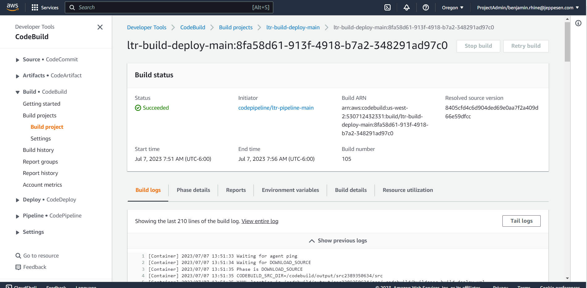
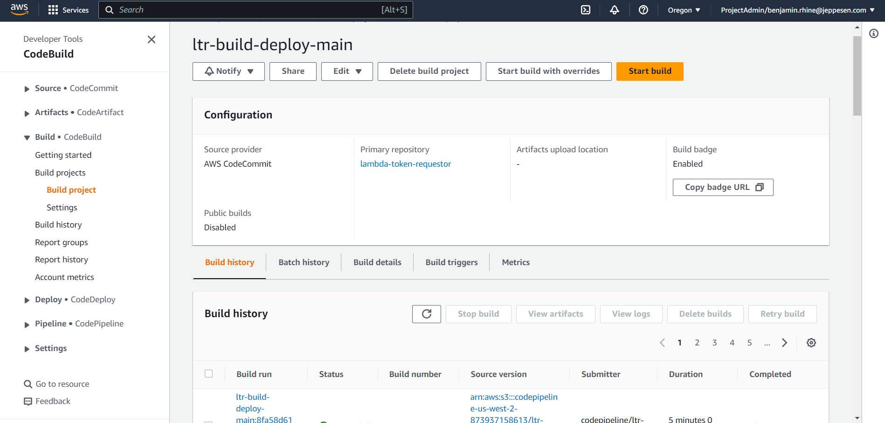
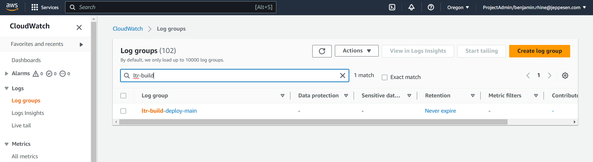

= Logging: CodeBuild - Build Stage

These are logs that are generated as part of the link:build-ci-codebuild.adoc[CI process] (buildspec.yml) or are output
from the link:build-gradle-artifact.adoc[Gradle build process].

[NOTE]
Every CI / CodeBuild job creates its own independent set of logs outside of the application.

== In-build Logs

While all logs are technically CloudWatch logs, build logs are directly visible as part of any CodeBuild job execution.
If you have started a job logs are visible as soon as they become available under the *Build logs* tab.

If you are looking for logs for a specific previously ran build, select the build then under *Build history* select the
desired build and repeat the above by then navigating to *Build logs*.

== CloudWatch Logs

To view the exact same logs but directly in CloudWatch navigate to Log groups and search for the CodeBuild job name.
There is a 1-to-1 relationship between the CodeBuild job name and the Log group name. (ie. the CodeBuild job named ltr-build-deploy-main results in a CloudWatch Log group named ltr-build-deploy-main)

== Not what your looking for?

* link:../logging/logging.adoc[Logging]
* link:../logging/logging-application-stage.adoc[Logging: Application Stage]
* link:../testing/testing-logging-codebuild.adoc[Logging: Test Stage - CodeBuild]

