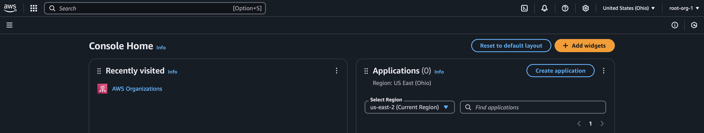
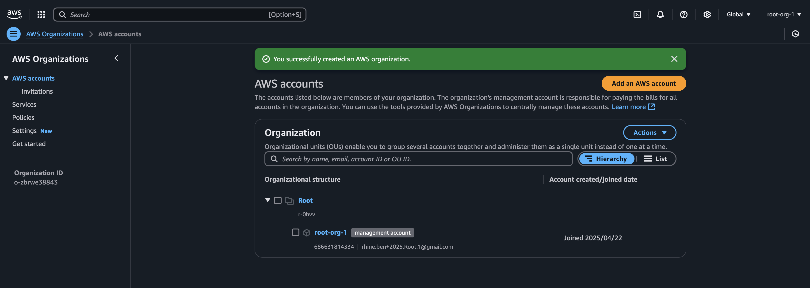
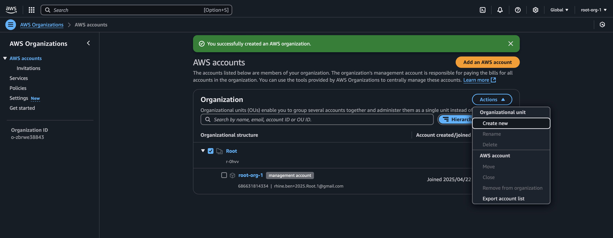
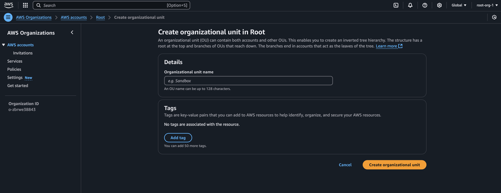
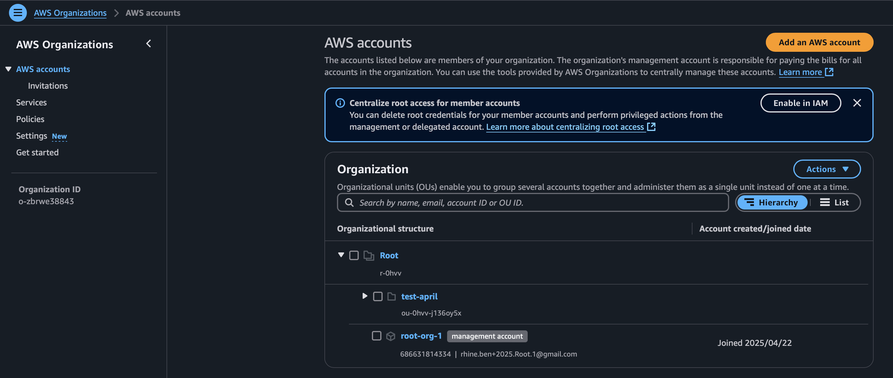
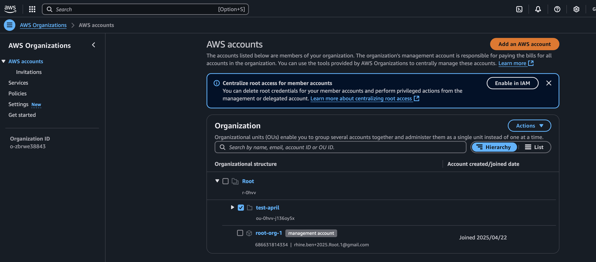
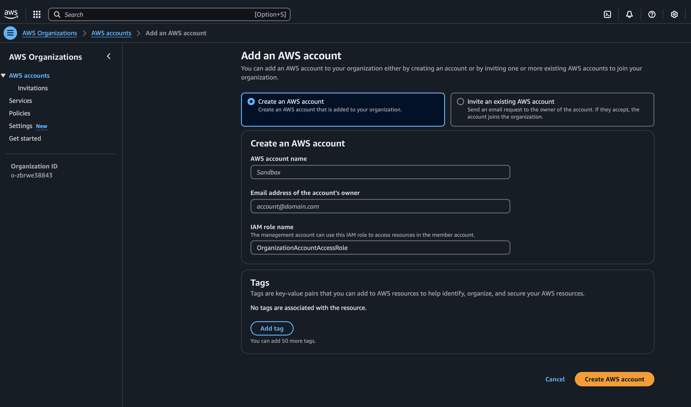
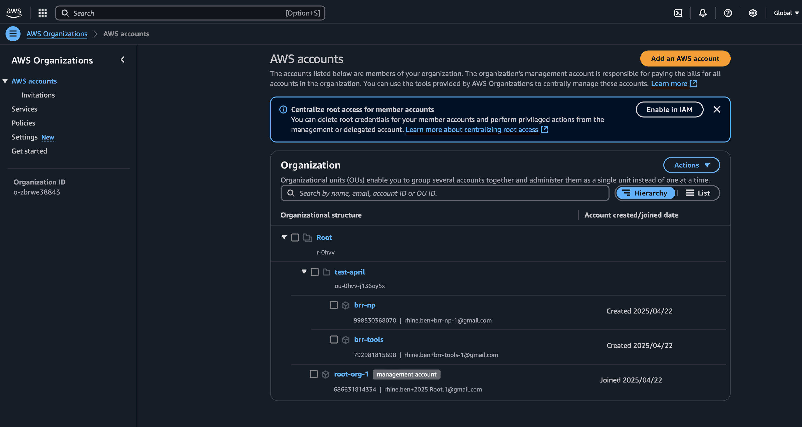

= Setup: Aws accounts from scratch
:toc:

This is a quick overview of how to signup for and setup multiple brand new Aws accounts.

== Privacy.com

To start, make sure you have https://privacy.com[privacy.com] account and have a virtual credit card configured and ready
to go. By using a virtual credit card you can ensure you do not get hit with any massive charges from aws unexpectedly.
Privacy.com allows you to configure individual cards and to set spending limits on them to prevent issues.

[TIP]
And the virtual cards from https://privacy.com[privacy.com] do not get flagged as virtual by Aws.

== Aws Signup

In your browser, navigate to ...

* https://aws.amazon.com

Then follow the standard signup process and provide the generated virtual credit card from privacy.com when requested.

[TIP]
If you are using a gmail address to signup add something to it to be able to differentiate the account. I.e.
THIS.IS.MY.EMAIL+root-org-1@gmail.com as gmail allows you to alias emails but adding `+` anything between the account and
the `@` symbol.

Once the account is created, and you have signed in follow the directions below or these instructions from
https://www.youtube.com/watch?v=bQ2EtLnN6KQ[YouTube].

== Configure your Org

Navigate to the `Aws Organizations` page (search for it if it is not on your home console)

Tell it to create an org (i forgot to take a screenshot here but this is the screen immediately after)

Next, you want to create an organizational unit or OU. Do this by selecting the `root` account then clicking on `Action`
followed by clicking `Create new` ...

Give the OU a name and click create

A new OU now exists ...

[TIP]
You may need to refresh the page before it is visible

== Configure Accounts in your Org

Now with the OU in place, select the org and click `Add an AWS account`

Fill in the new account details ...

[NOTE]
The email must be different from the root account. Suggest the same as when creating the root management account; I.e.
THIS.IS.MY.EMAIL+org-tools-1@gmail.com as gmail allows you to alias emails but adding `+` anything between the account and
the `@` symbol.

[TIP]
Leave the suggested IAM role

I suggest creating 3 accounts at this point ...

* YOUR-ORG-tools
* YOUR-ORG-np
* YOUR-ORG-p

by repeating the steps above

== Moving accounts into your Org

By default, event though the OU was selected when creating the new accounts, the new accounts will be created outside of
the OU and must be moved into it. To move the accounts into the OU, select the account, then the actions menu, then move.
At this point select the OU you created and tell it to move the accounts. The end result should look like the following ...

== Signing in to your new accounts

Copy the emails that were used when creating the accounts from the root management account

To sign in to the new accounts, navigate to ...

* https://aws.amazon.com

[TIP]
Do this in a private window or setup profiles in your browser otherwise you will need to sign out of the root management account.

* enter the email of the new account
* select forgot password
* you will the receive an email to set the password for the newly created account
* set the password
* sign in

== Reference

* https://www.youtube.com/watch?v=bQ2EtLnN6KQ
** this one was really helpful