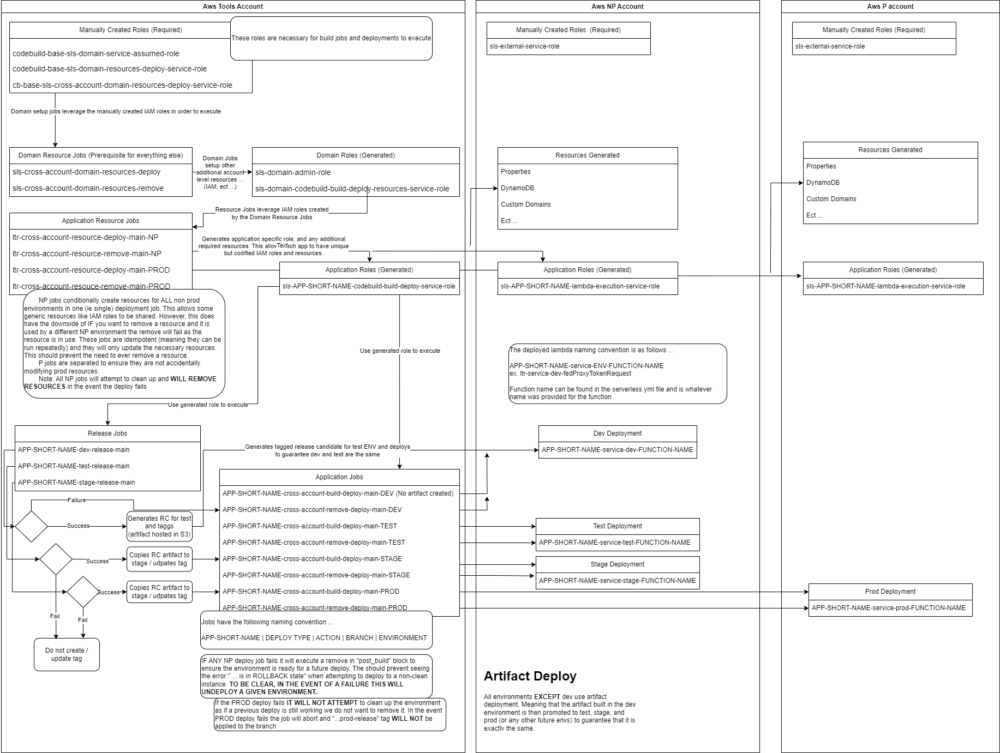

= Deployment

Unless an emergency has been declared deployments are *ONLY* allowed on Tuesdays and Thursdays (optimally Tuesdays). This
is only the case if true continuous deployment has not been implemented.

== Total Process View

== Cross-Account Deployment

[CAUTION]
Any external account MUST have the following role manually created prior to any cross account deployments. The role should be named sls-external-account-role , it will have the following "Trust relationships" ...

[source, json]
----
{
    "Version": "2012-10-17",
    "Statement": [
        {
            "Effect": "Allow",
            "Principal": {
                "AWS": [
                    "arn:aws:iam::XXXXXXX:role/sls-domain-admin-role"
                ]
            },
            "Action": "sts:AssumeRole"
        }
    ]
}
----

and it will have the following inline permissions policy named `sls-external-policy`

[source, json]
----
{
    "Version": "2012-10-17",
    "Statement": [
        {
            "Sid": "Statement1",
            "Effect": "Allow",
            "Action": [
                "acm:DescribeCertificate",
                "acm:DeleteCertificate",
                "acm:ListCertificates",
                "acm:GetCertificate",
                "acm:ListTagsForCertificate",
                "acm:GetAccountConfiguration",
                "acm:RequestCertificate",
                "route53:ListHostedZones",
                "route53:ChangeResourceRecordSets",
                "route53:ListResourceRecordSets",
                "apigateway:GET",
                "apigateway:POST",
                "apigateway:PUT",
                "apigateway:DELETE",
                "iam:*",
                "s3:*",
                "sqs:*",
                "cloudformation:CreateStack",
                "cloudformation:DescribeStacks",
                "cloudformation:DeleteStack",
                "cloudformation:CreateChangeSet",
                "cloudformation:DescribeChangeSet",
                "cloudformation:DeleteChangeSet",
                "cloudformation:ExecuteChangeSet",
                "cloudformation:DescribeStackEvents",
                "cloudformation:ListStacks",
                "cloudformation:ListStackResources",
                "cloudformation:UpdateStack",
                "cloudformation:ValidateTemplate"
            ],
            "Resource": "*"
        }
    ]
}
----

[CAUTION]
Be aware that the trust relationship gets reset if the role is deleted and must then be manually upated

=== Reference
- link:../infrastructure-as-code/comparison/compare-cross-account.adoc[Compare: Cross Account]

== Production Deployments

If you are accessing S3 buckets you need to make sure the bucket keys are disabled. To check ...

* navigate to the bucket
* select Properties
* scroll down to Default Encryption
* make sure "Bucket Key" is disabled

If its not disabled you may see the following error

----
Access Denied (Service: Amazon S3; Status Code: 403; Error Code: AccessDenied; Request ID: xxxxxxxxxxxxx)
----

Additionally, make sure you have granted your `lambdaApplicationServiceRole` permission to see the bucket. This is being
called out due to the fact that Aws bucket names must be globally unique, meaning that the bucket name is different between NP and P accounts, thus the role must be updated to reflect the differing names. If the role does not have permissions this will also result in the same error as above.

== Reference

* https://www.serverless.com/blog/definitive-guide-terraform-serverless/

