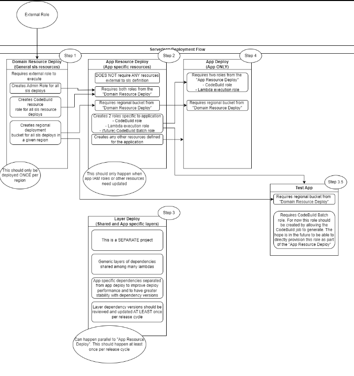

= Build (CI/CD)

The build has several different areas to it and when someone is discussing this it is important to clearly understand at
what point they are talking about.

== link:build-gradle-artifact.adoc[Artifact Build (Gradle)] or link:build-maven-artifact.adoc[Maven]

The act of building an artifact from developed code on a local system. This can most commonly take the form of a jar,
shadowJar, or zip file (in our case).

[CAUTION]
If using lambda layers a shadow jar (shaded jar) is no longer required. This also means the log4j2 issue is no longer relevant.

== link:build-ci-codebuild.adoc[CI Build (Continuous Integration Build)]

Is essentially the same as the artifact build except that it occurs external to the developers system on a common platform.

== link:build-cd-codepipeline.adoc[CD (Continuous Deployment)]

Is the process of what to do with the artifact after it has been built in the CI Build step.

== High Level Deployment Workflow

== Not what you were looking for?

* link:../engineering/development/java/java-maven.adoc[Java: Maven]
* link:../../development/build/build-maven-artifact.adoc[Maven: Build Artifact]
* link:../../development/build/build-maven-troubleshooting.adoc[Maven: Troubleshooting]
* link:../engineering/development/java/java-gradle.adoc[Java: Gradle]
* link:../../development/build/build-gradle-artifact.adoc[Gradle: Build Artifact]
* link:../../development/build/build-gradle-troubleshooting.adoc[Gradle: Troubleshooting]
* link:../../development/build/build-dependencies-updates.adoc[Dependency Updates]
* link:../../development/build/build-logging.adoc[Build Logging]

