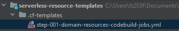

= How To: Create a base CloudFormation Template
:toc:

Creating a base CloudFormation template can be used to support additional CloudFormation or the Serverless Framework.
When creating a base template this should take care of creating all minimally required resources such as required roles
for CodeBuild and CodePipeline as well as creation of any S3 buckets and bucket policies. Lastly, it should be used to
create any required CodeBuild jobs in support of any other infrastructure required. To see examples of this checkout the
links on the right.

*Linked Repos Go Here*

- TODO

[NOTE]
Linked items on the right while highly similar are unique to there top level account designation.

== Step 1

Start by adding .cf-templates folder to the working project. Followed by adding YOUR-NAMED-CLOUDFORMATION-TEMPLATE.yml file.

== Step 2

Determine what resources are minimally required. This determination should be made off the assumption that a given Aws
account is being setup as if it were being started from scratch. Start the CloudFormation file with the following ...

[source, yaml]
----
AWSTemplateFormatVersion: "2010-09-09"

Description: "Creates all CodeBuild jobs for the domain project"

Parameters: # Not Required but allow CloudFormation to be configurable
  ProjectName:
    Description: "Step 001: Create base role and all CodeBuild Jobs for the domain"
    Type: String
    Default: domain-resources

# All resources that are created from this CloudFormation Template
Resources:
----

== Step 3

First, create an S3 bucket that will contain all future deployments and references to help keep S3 clean and organized

.Click here to expand ...
[%collapsible%open]
====
[source, yaml]
----
# All resources that are created from this CloudFormation Template
Resources:
  # --------------------------------------------------------------------------------------------------------------------
  # Create S3 bucket for deployments - This functions as a complete replacement for `domain-with-external-resources-deploy`
  # --------------------------------------------------------------------------------------------------------------------
  DeployBucket:                                                   # Create S3 bucket to contain ALL sls deployments
    Type: AWS::S3::Bucket                                         # Resource type
    DeletionPolicy: Retain                                        # DO NOT DELETE IF CLOUDFORMATION STACK IS REMOVED
    Properties:
      BucketName: !Sub ${S3DeploymentBucket}                      # Set bucket name from configurable parameter
      BucketEncryption:                                           # Configure bucket encryption
        ServerSideEncryptionConfiguration:
          - ServerSideEncryptionByDefault:
              SSEAlgorithm: AES256
      PublicAccessBlockConfiguration:                             # Configure public access - make sure all public access is blocked
        BlockPublicAcls: true
        BlockPublicPolicy: true
        IgnorePublicAcls: true
        RestrictPublicBuckets: true
  DeploymentBucketPolicy:                                         # Resource name
    Type: AWS::S3::BucketPolicy                                   # Resource type
    DeletionPolicy: Retain                                        # DO NOT DELETE IF CLOUDFORMATION STACK IS REMOVED
    DependsOn: DeployBucket                                       # Policy creation is dependent on bucket being previously created
    Properties:
      Bucket: !Sub ${S3DeploymentBucket}                          # Set bucket name from configurable parameter
      PolicyDocument:
        Statement:
          - Action:
              - s3:GetLifecycleConfiguration
              - s3:ListBucket
              - s3:Get*
              - s3:PutObject
              - s3:DeleteObject
            Resource:                                             # Limit permissions to THIS bucket
              - !Sub arn:aws:s3:::${S3DeploymentBucket}
              - !Sub arn:aws:s3:::${S3DeploymentBucket}/*
            Effect: Allow
            Principal:
              AWS:
                - arn:aws:iam::481304949028:role/sls-external-service-role # Note: This role is manually created in a given external account
----
====

== Step 4

Now determine what roles will be required; All CodeBuild jobs will require a role and a "super" role that can be assumed with greater privilege's. Below a base role and a assumed role are created with an additional CodeBuild specific role.

.Click here to expand ...
[%collapsible%open]
====
[source, yaml]
----
# All resources that are created from this CloudFormation Template
Resources:
    ...
  # --------------------------------------------------------------------------------------------------------------------
  # Create ALL base roles in support of CodeBuild and CodePipeline
  # --------------------------------------------------------------------------------------------------------------------
  CloudformationBaseAssumedRole:
    Type: AWS::IAM::Role                                          # Resource type
    Properties:                                                   # Resource properties
      RoleName: cf-base-assumed-service-role
      AssumeRolePolicyDocument:                                   # Role Configuration
        Version: '2012-10-17'
        Statement:
          - Effect: Allow
            Principal:
              AWS:
                - arn:aws:iam::715659461689:root
            Action: sts:AssumeRole
      ManagedPolicyArns:                                          # Managed policies to attach to new role
        - arn:aws:iam::aws:policy/PowerUserAccess                 # If needed update to AdministratorAccess, but should not be needed
        - arn:aws:iam::aws:policy/AdministratorAccess             # Admin is required to delete
      Policies:
        - PolicyName: cf-resource-iam-policy
          PolicyDocument:
            Version: '2012-10-17'
            Statement:
              - Effect: Allow
                Action:
                  - iam:AttachRolePolicy
                  - iam:CreateRole
                  - iam:GetRole
                  - iam:PassRole
                  - iam:DeleteRole
                  - iam:DeleteRolePolicy
                  - iam:DetachRolePolicy
                  - iam:PutRolePolicy
                Resource:
                  - "arn:aws:iam::715659461689:role/*"
  CloudformationBaseServiceRole:
    Type: AWS::IAM::Role                                          # Resource type
    DependsOn: CloudformationBaseAssumedRole                      # REQUIRES!!! Previous role has already been created
    Properties:                                                   # Resource properties
      RoleName: cf-base-service-role
      AssumeRolePolicyDocument:                                   # Role Configuration
        Version: '2012-10-17'
        Statement:
          - Effect: Allow
            Principal:
              Service:
                - codebuild.amazonaws.com
                - cloudformation.amazonaws.com
                - codepipeline.amazonaws.com
            Action: sts:AssumeRole
      Policies:
        - PolicyName: cf-codebuild-resource-policy
          PolicyDocument:
            Version: '2012-10-17'
            Statement:
              - Effect: Allow
                Action:
                  - codebuild:CreateProject
                  - codebuild:UpdateProject
                  - codebuild:DeleteProject
                Resource:
                  - '*'
        - PolicyName: cf-codepipeline-resource-policy
          PolicyDocument:
            Version: '2012-10-17'
            Statement:
              - Effect: Allow
                Action:
                  - codepipeline:GetPipeline
                  - codepipeline:CreatePipeline
                  - codepipeline:UpdatePipeline
                  - codepipeline:DeletePipeline
                  - codepipeline:GetPipelineState
                Resource:
                  - '*'
        - PolicyName: cf-resource-iam-policy
          PolicyDocument:
            Version: '2012-10-17'
            Statement:
              - Effect: Allow
                Action:
                  - iam:AttachRolePolicy
                  - iam:CreateRole
                  - iam:GetRole
                  - iam:PassRole
                  - iam:DeleteRole
                  - iam:DeleteRolePolicy
                  - iam:DetachRolePolicy
                  - iam:PutRolePolicy
                Resource:
                  - '*'
        - PolicyName: cf-assume-role-policy
          PolicyDocument:
            Version: '2012-10-17'
            Statement:
              - Effect: Allow
                Action:
                  - sts:AssumeRole
                Resource:
                  - !Sub ${CloudformationBaseAssumedRole.Arn}
  DomainResourcesCodeBuildServiceRole:                            # Role that is applied to ALL CodeBuild jobs
    Type: AWS::IAM::Role                                          # Resource type
    DependsOn: CloudformationBaseAssumedRole                      # REQUIRES!!! Previous role has already been created
    Properties:                                                   # Resource properties
      Path: /service-role/                                        # If you want a custom resource path
      RoleName: cb-domain-resource-deploy-service-role
      AssumeRolePolicyDocument:                                   # Role Configuration
        Version: '2012-10-17'
        Statement:
          - Effect: Allow
            Principal:
              Service:
                - codebuild.amazonaws.com
            Action: sts:AssumeRole
      Policies:
        - PolicyName: cf-log-policy
          PolicyDocument:
            Version: '2012-10-17'
            Statement:
              - Effect: Allow # note that these rights are given in the default policy and are required if you want logs out of your lambda(s)
                Action:
                  - logs:CreateLogGroup
                  - logs:CreateLogStream
                  - logs:PutLogEvents
                  - logs:PutQueryDefinition
                  - logs:TagResource
                Resource:
                  - 'arn:aws:logs:*:*:*'
        - PolicyName: cf-log-group-build-policy
          PolicyDocument:
            Version: '2012-10-17'
            Statement:
              - Effect: Allow
                Action:
                  - logs:CreateLogGroup
                  - logs:CreateLogStream
                  - logs:PutLogEvents
                  - logs:PutQueryDefinition
                  - logs:TagResource
                Resource:
                  - Fn::Join:
                      - ':'
                      - - 'arn:aws:logs'
                        - Ref: 'AWS::Region'
                        - Ref: 'AWS::AccountId'
                        - log-group:/aws/codebuild/cf-*
                  - Fn::Join:
                      - ':'
                      - - 'arn:aws:logs'
                        - Ref: 'AWS::Region'
                        - Ref: 'AWS::AccountId'
                        - log-group:/aws/codebuild/sls-*
                  - Fn::Join:
                      - ':'
                      - - 'arn:aws:logs'
                        - Ref: 'AWS::Region'
                        - Ref: 'AWS::AccountId'
                        - log-group:/aws/codebuild/step-*
        - PolicyName: cf-s3-resource-policy
          PolicyDocument:
            Version: '2012-10-17'
            Statement:
              - Effect: Allow
                Action:
                  - s3:PutObject
                  - s3:GetObject
                  - s3:GetObjectVersion
                  - s3:GetBucketAcl
                  - s3:GetBucketLocation
                  - s3:PutAccelerateConfiguration
                Resource:
                  - '*'
        - PolicyName: cf-codecommit-resource-repo-policy
          PolicyDocument:
            Version: '2012-10-17'
            Statement:
              - Effect: Allow
                Action:
                  - codecommit:GitPull
                Resource:
                  - '*'
        - PolicyName: cf-codecommit-resource-policy
          PolicyDocument:
            Version: '2012-10-17'
            Statement:
              - Effect: Allow
                Action:
                  - codecommit:GitPull
                Resource:
                  - '*'
        - PolicyName: cf-codebuild-resource-policy
          PolicyDocument:
            Version: '2012-10-17'
            Statement:
              - Effect: Allow
                Action:
                  - codebuild:CreateReportGroup
                  - codebuild:CreateReport
                  - codebuild:UpdateReport
                  - codebuild:BatchPutTestCases
                  - codebuild:BatchPutCodeCoverages
                  - codebuild:StartBuild
                  - codebuild:StopBuild
                  - codebuild:RetryBuild
                Resource:
                  - '*'
        - PolicyName: cf-resource-iam-policy
          PolicyDocument:
            Version: '2012-10-17'
            Statement:
              - Effect: Allow
                Action:
                  - iam:PassRole
                Resource:
                  - '*'
        - PolicyName: cf-ssm-policy
          PolicyDocument:
            Version: '2012-10-17'
            Statement:
              - Effect: Allow # note that these rights are given in the default policy and are required if you want logs out of your lambda(s)
                Action:
                  - ssm:GetParameter
                  - ssm:GetParameters
                Resource:
                  - '*'
        - PolicyName: cf-assume-role-policy
          PolicyDocument:
            Version: '2012-10-17'
            Statement:
              - Effect: Allow
                Action:
                  - sts:AssumeRole
                Resource:
                  - !Sub ${CloudformationBaseAssumedRole.Arn}
----
====

== Step 5

Next, create any required CodeBuild jobs to support creation and deployment of any infrastructure resources required

.Click here to expand ...
[%collapsible%open]
====
[source, yaml]
----
# --------------------------------------------------------------------------------------------------------------------
# Create ALL CodeBuild jobs in support of this library
# --------------------------------------------------------------------------------------------------------------------
cbCaDomainPropertiesLocalDeploy:
  Type: AWS::CodeBuild::Project
  DependsOn: DomainResourcesCodeBuildServiceRole
  Properties:
    Name: !Sub cf-${ProjectName}-properties-deploy
    Description: Deploy properties that are used in the TOOLS account across projects
    BadgeEnabled: !Ref BuildBadge
    Source:
      Type: !Sub ${GitSourceType}
      Location: !Sub ${GitRepoUrl}
      BuildSpec: .codebuild/buildspec-domain-properties-deploy.yml
    SourceVersion: !Ref GitSourceVersion
    Artifacts:
      Type: NO_ARTIFACTS
    Environment:
      Type: !Sub ${EnvType}
      ComputeType: !Sub ${EnvComputeType}
      Image: !Sub ${EnvImage}
    ServiceRole: !Sub ${DomainResourcesCodeBuildServiceRole.Arn}
    LogsConfig:
      CloudWatchLogs:
        Status: !Ref CloudWatchLogs
        GroupName: !Sub cf-${ProjectName}-properties-deploy
      S3Logs:
        Status: !Ref S3Logs
cbCaDomainPropertiesLocalRemove:
  Type: AWS::CodeBuild::Project
  DependsOn: DomainResourcesCodeBuildServiceRole
  Properties:
    Name: !Sub cf-${ProjectName}-properties-remove
    Description: DANGER!!! Remove properties from TOOLS account that are used by multiple projects
    BadgeEnabled: !Ref BuildBadge
    Source:
      Type: !Sub ${GitSourceType}
      Location: !Sub ${GitRepoUrl}
      BuildSpec: .codebuild/buildspec-domain-properties-remove.yml
    SourceVersion: !Ref GitSourceVersion
    Environment:
      Type: !Sub ${EnvType}
      ComputeType: !Sub ${EnvComputeType}
      Image: !Sub ${EnvImage}
    ServiceRole: !Sub ${DomainResourcesCodeBuildServiceRole.Arn}
    Artifacts:
      Type: NO_ARTIFACTS
    LogsConfig:
      CloudWatchLogs:
        Status: !Ref CloudWatchLogs
        GroupName: !Sub cf-${ProjectName}-properties-remove
      S3Logs:
        Status: !Ref S3Logs
----
====

== Step 6

With all required steps added to the CloudFormation template it can now be parameterized. At the top of the file you can add parameters like the following example then reference them as shown in the above samples.

.Click here to expand ...
[%collapsible%open]
====
[source, yaml]
----
Parameters: # Not Required but allow CloudFormation to be configurable
  ProjectName:
    Description: "Step 001: Create base role and all CodeBuild Jobs for the domain"
    Type: String
    Default: domain-resources
  BuildBadge:
    Description: Build badge enabled
    Type: String
    Default: true
  GitSourceType:
    Description: What type of git repository is it
    Type: String
    Default: CODECOMMIT
----
====

== Complete Reference for Application

.Click here to expand ...
[%collapsible]
====
[source, yaml]
----
AWSTemplateFormatVersion: "2010-09-09"

Description: "Creates all CodeBuild jobs for lambda-device-registration"

# README!!!
# Required: Ensure that this file has been uploaded to BRR-Tools CloudFormation - https://us-west-2.console.aws.amazon.com/cloudformation/home?region=us-west-2#/stacks
# and has been given the name 'ldr-codebuild-jobs'. Once this upload is complete you MUST edit the sls-external-service-role
# Trust policy in BRR-NP and BRR-P to look at follows ...
#{
#  "Version": "2012-10-17",
#  "Statement": [
#    {
#      "Effect": "Allow",
#      "Principal": {
#        "AWS": [
#          "some other role",
#          "arn:aws:iam::accountNumber:role/ldr-service-assumed-service-role",
#          "some other role"
#        ]
#      },
#      "Action": "sts:AssumeRole"
#    }
#  ]
#}
# The arn for roles created from this CF template are reset whenever the template is fully removed which will cause any
# of the deployed jobs to error with "Access Denied" errors. It is not intuitively obvious this is the case unless you know.
# Suggested: The below was previously required but this project has now been made 98% self encapsulated. It is expected
# these steps have already been run and the ONLY REQUIRED element from them is that the expected S3 bucket already exists.
# - 'step-001-PROJECT-NAME-codebuild-jobs' cf template has been uploaded from the 'serverless-resource-templates'
# project (Ensures s3 bucket has been created.
# - Additionally, it is expected that step-005 `sls-cross-account-domain-resources-deploy`,
# step-010 `sls-domain-properties-deploy`, and step-015 `sls-domain-general-log-queries-deploy` have been executed to
# ensure all resources have been set up and configured prior to the upload and execution of this cf template.
# If these are not deployed you will possibly be missing properties for alerts and queries for quick debugging.

Parameters:
  AccountName:
    Description: Name of account that is being deployed into
    Type: String
    Default: brr
  ProjectName:
    Description: lambda-device-registration-codebuild-jobs
    Type: String
    Default: ldr-service
  ShortName:
    Description: Short project name
    Type: String
    Default: ldr
  BuildBadge:
    Description: Build badge enabled
    Type: String
    Default: true
  CloudWatchLogs:
    Description: Are CloudWatch logs enabled
    Type: String
    Default: ENABLED
  DeployBucket:
    Description: Bucket that deployment artifacts are contained in
    Type: String
#    Default: sls-cross-account-shared-services-domain-deploy
    Default: brr-us-west-2-cross-account-shared-services-domain-deploy
  EnvType:
    Description: What type of environment is it
    Type: String
    Default: LINUX_CONTAINER
  EnvComputeType:
    Description: What kind / how many resources to assign
    Type: String
    Default: BUILD_GENERAL1_SMALL
  EnvImage:
    Description: What image to use to perform CodeBuild
    Type: String
    Default: aws/codebuild/standard:7.0
  GitSourceType:
    Description: What type of git repository is it
    Type: String
    Default: CODECOMMIT
  GitRepoName:
    Description: Name of git repo
    Type: String
    Default: lambda-device-registration
  GitSourceVersion:
    Description: The branch or commit that should be checked out
    Type: String
    Default: refs/heads/main
  S3Logs:
    Description: Are S3 logs enabled
    Type: String
    Default: DISABLED
  VpcId:
    Description: Id of existing vpc (this will need to be different by region)
    Type: String
    Default: vpc-070c12b02c980e926
  VpcSecurityGroup:
    Description: Security group of existing vpc (this will need to be different by region)
    Type: String
    Default: sg-058f9332b4c3dde26
  VpcSubnet1:
    Description: Private subnet to attach (this will need to be different by region)
    Type: String
    Default: subnet-06d2f9357ec43c923
  VpcSubnet2:
    Description: Private subnet to attach (this will need to be different by region)
    Type: String
    Default: subnet-03e9c360899823f5e
  VpcSubnet3:
    Description: Private subnet to attach (this will need to be different by region)
    Type: String
    Default: subnet-0d9c6f732da128c8e
  S3DeploymentBucket:
    Description: Final part of s3 deployment bucket (brr-AWS-REGIONS-this-value)
    Type: String
    Default: cross-account-shared-services-domain-deploy

Resources:
  # Roles
  ServiceAssumedRole:
    Type: AWS::IAM::Role                                          # Resource type
    Properties:                                                   # Resource properties
      RoleName: !Sub ${ProjectName}-${AWS::Region}-assumed-service-role
      AssumeRolePolicyDocument:                                   # Role Configuration
        Version: '2012-10-17'
        Statement:
          - Effect: Allow
            Principal:
              AWS:
                - !Sub arn:aws:iam::${AWS::AccountId}:root
            Action: sts:AssumeRole
      ManagedPolicyArns:                                          # Managed policies to attach to new role
        - arn:aws:iam::aws:policy/PowerUserAccess                 # If needed update to AdministratorAccess, but should not be needed
        - arn:aws:iam::aws:policy/AdministratorAccess             # Admin is required to delete
  ServiceCodeBuildServiceRole:                                    # The following role is used for ALL CodeBuild jobs required for this library
    Type: AWS::IAM::Role                                          # Resource type
    DependsOn: ServiceAssumedRole
    Properties:                                                   # Resource properties
      Path: /service-role/                                        # If you want a custom resource path
      RoleName: !Sub ${ProjectName}-${AWS::Region}-resource-deploy-service-role
      AssumeRolePolicyDocument:                                   # Role Configuration
        Version: '2012-10-17'
        Statement:
          - Effect: Allow
            Principal:
              Service:
                - codebuild.amazonaws.com
            Action: sts:AssumeRole
      Policies:
        - PolicyName: !Sub ${ProjectName}-log-policy
          PolicyDocument:
            Version: '2012-10-17'
            Statement:
              - Effect: Allow # note that these rights are given in the default policy and are required if you want logs out of your lambda(s)
                Action:
                  - logs:CreateLogGroup
                  - logs:CreateLogStream
                  - logs:PutLogEvents
                  - logs:PutQueryDefinition
                  - logs:TagResource
                Resource:
                  - 'arn:aws:logs:*:*:*'
        - PolicyName: !Sub ${ProjectName}-log-group-build-policy
          PolicyDocument:
            Version: '2012-10-17'
            Statement:
              - Effect: Allow
                Action:
                  - logs:CreateLogGroup
                  - logs:CreateLogStream
                  - logs:PutLogEvents
                  - logs:PutQueryDefinition
                  - logs:TagResource
                Resource:
                  - Fn::Join:
                      - ':'
                      - - 'arn:aws:logs'
                        - Ref: 'AWS::Region'
                        - Ref: 'AWS::AccountId'
                        - log-group:/aws/codebuild/${ShortName}-*
                  - Fn::Join:
                      - ':'
                      - - 'arn:aws:logs'
                        - Ref: 'AWS::Region'
                        - Ref: 'AWS::AccountId'
                        - log-group:/aws/codebuild/${ShortName}-*:*
        - PolicyName: !Sub ${ProjectName}-s3-resource-policy
          PolicyDocument:
            Version: '2012-10-17'
            Statement:
              - Effect: Allow
                Action:
                  - s3:PutObject
                  - s3:GetObject
                  - s3:GetObjectVersion
                  - s3:GetBucketAcl
                  - s3:GetBucketLocation
                  - s3:PutAccelerateConfiguration
                Resource:
                  - '*'
        - PolicyName: !Sub ${ProjectName}-codecommit-resource-repo-policy
          PolicyDocument:
            Version: '2012-10-17'
            Statement:
              - Effect: Allow
                Action:
                  - codecommit:GitPull
                  - codecommit:GitPush
                Resource:
                  - '*'
        - PolicyName: !Sub ${ProjectName}-codecommit-resource-policy
          PolicyDocument:
            Version: '2012-10-17'
            Statement:
              - Effect: Allow
                Action:
                  - codecommit:GitPull
                  - codecommit:GitPush
                Resource:
                  - Fn::Join:
                      - ':'
                      - - 'arn:aws:codecommit'
                        - Ref: 'AWS::Region'
                        - Ref: 'AWS::AccountId'
                        - !Sub ${GitRepoName}
        - PolicyName: !Sub ${ProjectName}-codebuild-resource-policy
          PolicyDocument:
            Version: '2012-10-17'
            Statement:
              - Effect: Allow
                Action:
                  - codebuild:StartBuild
                  - codebuild:StopBuild
                  - codebuild:RetryBuild
                Resource:
                  - Fn::Join:
                      - ':'
                      - - 'arn:aws:codebuild'
                        - Ref: 'AWS::Region'
                        - Ref: 'AWS::AccountId'
                        - !Sub project/${ProjectName}-*
        - PolicyName: !Sub ${ProjectName}-codebuild-reporting-policy
          PolicyDocument:
            Version: '2012-10-17'
            Statement:
              - Effect: Allow
                Action:
                  - codebuild:CreateReportGroup
                  - codebuild:CreateReport
                  - codebuild:UpdateReport
                  - codebuild:BatchPutTestCases
                  - codebuild:BatchPutCodeCoverages
                Resource:
                  - Fn::Join:
                      - ':'
                      - - 'arn:aws:codebuild'
                        - Ref: 'AWS::Region'
                        - Ref: 'AWS::AccountId'
                        - !Sub report-group/${ProjectName}-*
        - PolicyName: !Sub ${ProjectName}-codepipeline-policy
          PolicyDocument:
            Version: '2012-10-17'
            Statement:
              - Effect: Allow
                Action:
                  - codepipeline:GetPipelineExecution
                  - codepipeline:StopPipelineExecution
                  - codepipeline:ListPipelineExecutions
                Resource:
                  - '*'
        - PolicyName: !Sub ${ProjectName}-resource-iam-policy
          PolicyDocument:
            Version: '2012-10-17'
            Statement:
              - Effect: Allow
                Action:
                  - iam:PassRole
                Resource:
                  - '*'
        - PolicyName: !Sub ${ProjectName}-ssm-policy
          PolicyDocument:
            Version: '2012-10-17'
            Statement:
              - Effect: Allow # note that these rights are given in the default policy and are required if you want logs out of your lambda(s)
                Action:
                  - ssm:GetParameter
                  - ssm:GetParameters
                Resource:
                  - '*'
        - PolicyName: !Sub ${ProjectName}-secretsmanager-policy
          PolicyDocument:
            Version: '2012-10-17'
            Statement:
              - Effect: Allow
                Action:
                  - kms:Decrypt
                  - secretsmanager:GetResourcePolicy
                  - secretsmanager:GetSecretValue
                  - secretsmanager:DescribeSecret
                  - secretsmanager:ListSecretVersionIds
                  - secretsmanager:ListSecrets
                Resource:
                  - '*'
        - PolicyName: !Sub ${ProjectName}-ec2-policy
          PolicyDocument:
            Version: '2012-10-17'
            Statement:
              - Effect: Allow # note that these rights are given in the default policy and are required if you want logs out of your lambda(s)
                Action:
                  - ec2:CreateNetworkInterface
                  - ec2:DescribeNetworkInterfaces
                  - ec2:DeleteNetworkInterface
                  # These two permissions are required to add vpc for sonar
                  - ec2:DescribeSecurityGroups
                  - ec2:DescribeSubnets
                  - ec2:DescribeDhcpOptions
                  - ec2:DescribeVpcs
                  - ec2:CreateNetworkInterfacePermission
                  # END - sonar permissions
                Resource:
                  - '*'
        - PolicyName: !Sub ${ProjectName}-assume-role-policy
          PolicyDocument:
            Version: '2012-10-17'
            Statement:
              - Effect: Allow
                Action:
                  - sts:AssumeRole
                Resource:
                  - !Sub ${ServiceAssumedRole.Arn}
  ServiceCodePipelineRole:                                        # The following role is used in support of the pipeline
    Type: AWS::IAM::Role
    DependsOn: ServiceAssumedRole
    Properties:
      Path: /service-role/                                        # If you want a custom resource path
      RoleName: !Sub ${ProjectName}-${AWS::Region}-codepipeline-role
      AssumeRolePolicyDocument:
        Version: 2012-10-17
        Statement:
          - Effect: Allow
            Principal:
              Service:
                - codepipeline.amazonaws.com
            Action:
              - sts:AssumeRole
      Policies:
        - PolicyName: !Sub ${ProjectName}-everything-policy
          PolicyDocument:
            Version: 2012-10-17
            Statement:
              - Effect: Allow
                Action:
                  - codepipeline:GetPipeline
                  - codepipeline:GetPipelineExecution
                  - codepipeline:StopPipelineExecution
                  - codepipeline:ListPipelineExecutions
                  - codecommit:List*
                  - codecommit:Get*
                  - codecommit:GitPull
                  - codecommit:GitPush
                  - codecommit:UploadArchive
                  - codecommit:CancelUploadArchive
                  - codebuild:BatchGetBuilds
                  - codebuild:BatchGetBuildBatches
                  - codebuild:StartBuild
                  - codebuild:StartBuildBatch
                  - iam:PassRole
                  - sns:Publish
                  - ec2:DescribeSecurityGroups
                  - cloudformation:*
                  - codedeploy:*
                  - cloudwatch:*
                  - ecs:*
                  - lambda:InvokeFunction
                  - lambda:ListFunctions
                  - codestar-connections:UseConnection
                  - ecr:DescribeImages
                Resource:
                  - "*"
              - Effect: Allow
                Action:
                  - kms:Decrypt
                Resource: "*"
              - Effect: Allow
                Action:
                  - s3:PutObject
                  - s3:GetBucketPolicy
                  - s3:GetObject
                  - s3:ListBucket
                  - s3:ListAllMyBuckets
                  - s3:GetBucketLocation
                Resource:
                  - !Sub arn:aws:s3:::${AccountName}-${AWS::Region}-${S3DeploymentBucket}
                  - !Sub arn:aws:s3:::${AccountName}-${AWS::Region}-${S3DeploymentBucket}/*
                  - "arn:aws:s3:::sls-cross-account-shared-services-domain-deploy"
                  - "arn:aws:s3:::sls-cross-account-shared-services-domain-deploy/*"
              - Effect: "Allow"
                Action:
                  - sts:AssumeRole
                Resource:
                  - !Sub ${ServiceAssumedRole.Arn}
  ServiceAssumedRoleNameProperty:
    Type: AWS::SSM::Parameter
    Properties:
      Name: !Sub brr.tools.${ShortName}.assumed.external.role.name
      Description: !Sub Role assumed to publish ${ProjectName}
      DataType: text
      Tier: Standard
      Type: String
      Value: !Sub ${ProjectName}-${AWS::Region}-assumed-service-role
      Tags:
        Environment: build
  # Tests
  CbArtifactUnitTestJava21:
    Type: AWS::CodeBuild::Project
    DependsOn: ServiceCodeBuildServiceRole
    Properties:
      Name: !Sub ${ProjectName}-unit-test-java-21
      Description: Run unit tests with Java 21
      BadgeEnabled: !Ref BuildBadge
      Source:
        Type: !Sub ${GitSourceType}
        Location: !Sub https://git-codecommit.${AWS::Region}.amazonaws.com/v1/repos/${GitRepoName}
        BuildSpec: .codebuild/buildspec-unit.yml
      SourceVersion: !Ref GitSourceVersion
      Environment:
        Type: !Sub ${EnvType}
        ComputeType: !Sub ${EnvComputeType}
        Image: !Sub ${EnvImage}
      ServiceRole: !Sub ${ServiceCodeBuildServiceRole.Arn}
      Artifacts:
        Type: NO_ARTIFACTS
      LogsConfig:
        CloudWatchLogs:
          Status: !Ref CloudWatchLogs
          GroupName: !Sub ${ProjectName}-unit-test-java-21
        S3Logs:
          Status: !Ref S3Logs
  CbArtifactUnitTestJava21WithSonar:                                  # Note: This needs vpc configured
    Type: AWS::CodeBuild::Project
    DependsOn: ServiceCodeBuildServiceRole
    Properties:
      Name: !Sub ${ProjectName}-unit-test-java-21-sonar
      Description: Run unit tests followed by sonar
      BadgeEnabled: !Ref BuildBadge
      Source:
        Type: !Sub ${GitSourceType}
        Location: !Sub https://git-codecommit.${AWS::Region}.amazonaws.com/v1/repos/${GitRepoName}
        BuildSpec: .codebuild/buildspec-unit-sonar.yml
      SourceVersion: !Ref GitSourceVersion
      Environment:
        Type: !Sub ${EnvType}
        ComputeType: !Sub ${EnvComputeType}
        Image: !Sub ${EnvImage}
      ServiceRole: !Sub ${ServiceCodeBuildServiceRole.Arn}
      VpcConfig:
        SecurityGroupIds:
          - !Sub ${VpcSecurityGroup}
        Subnets:
          - !Sub ${VpcSubnet1}
          - !Sub ${VpcSubnet2}
          - !Sub ${VpcSubnet3}
        VpcId: !Sub ${VpcId}
      Artifacts:
        Type: NO_ARTIFACTS
      LogsConfig:
        CloudWatchLogs:
          Status: !Ref CloudWatchLogs
          GroupName: !Sub ${ProjectName}-unit-test-java-21-sonar
        S3Logs:
          Status: !Ref S3Logs
  CbArtifactUnitTestJava17:
    Type: AWS::CodeBuild::Project
    DependsOn: ServiceCodeBuildServiceRole
    Properties:
      Name: !Sub ${ProjectName}-unit-test-java-17
      Description: Run unit tests with Java 17
      BadgeEnabled: !Ref BuildBadge
      Source:
        Type: !Sub ${GitSourceType}
        Location: !Sub https://git-codecommit.${AWS::Region}.amazonaws.com/v1/repos/${GitRepoName}
        BuildSpec: .codebuild/buildspec-unit-17.yml
      SourceVersion: !Ref GitSourceVersion
      Environment:
        Type: !Sub ${EnvType}
        ComputeType: !Sub ${EnvComputeType}
        Image: !Sub ${EnvImage}
      ServiceRole: !Sub ${ServiceCodeBuildServiceRole.Arn}
      Artifacts:
        Type: NO_ARTIFACTS
      LogsConfig:
        CloudWatchLogs:
          Status: !Ref CloudWatchLogs
          GroupName: !Sub ${ProjectName}-unit-test-java-17
        S3Logs:
          Status: !Ref S3Logs
  CbArtifactIntTestJava21:
    Type: AWS::CodeBuild::Project
    DependsOn: ServiceCodeBuildServiceRole
    Properties:
      Name: !Sub ${ProjectName}-int-test-java-21
      Description: Runs integration tests
      BadgeEnabled: !Ref BuildBadge
      Source:
        Type: !Sub ${GitSourceType}
        Location: !Sub https://git-codecommit.${AWS::Region}.amazonaws.com/v1/repos/${GitRepoName}
        BuildSpec: .codebuild/buildspec-integration.yml
      SourceVersion: !Ref GitSourceVersion
      Environment:
        Type: !Sub ${EnvType}
        ComputeType: !Sub ${EnvComputeType}
        Image: !Sub ${EnvImage}
      ServiceRole: !Sub ${ServiceCodeBuildServiceRole.Arn}
      Artifacts:
        Type: NO_ARTIFACTS
      LogsConfig:
        CloudWatchLogs:
          Status: !Ref CloudWatchLogs
          GroupName: !Sub ${ProjectName}-int-test-java-21
        S3Logs:
          Status: !Ref S3Logs
  CbArtifactIntTestJava17:
    Type: AWS::CodeBuild::Project
    DependsOn: ServiceCodeBuildServiceRole
    Properties:
      Name: !Sub ${ProjectName}-int-test-java-17
      Description: Runs integration tests
      BadgeEnabled: !Ref BuildBadge
      Source:
        Type: !Sub ${GitSourceType}
        Location: !Sub https://git-codecommit.${AWS::Region}.amazonaws.com/v1/repos/${GitRepoName}
        BuildSpec: .codebuild/buildspec-integration-17.yml
      SourceVersion: !Ref GitSourceVersion
      Environment:
        Type: !Sub ${EnvType}
        ComputeType: !Sub ${EnvComputeType}
        Image: !Sub ${EnvImage}
      ServiceRole: !Sub ${ServiceCodeBuildServiceRole.Arn}
      Artifacts:
        Type: NO_ARTIFACTS
      LogsConfig:
        CloudWatchLogs:
          Status: !Ref CloudWatchLogs
          GroupName: !Sub ${ProjectName}-int-test-java-17
        S3Logs:
          Status: !Ref S3Logs
  CbArtifactSmokeTest:
    Type: AWS::CodeBuild::Project
    DependsOn: ServiceCodeBuildServiceRole
    Properties:
      Name: !Sub ${ProjectName}-smoke-test
      Description: !Sub Performs smoke tests on ${ProjectName}
      BadgeEnabled: !Ref BuildBadge
      Source:
        Type: !Sub ${GitSourceType}
        Location: !Sub https://git-codecommit.${AWS::Region}.amazonaws.com/v1/repos/${GitRepoName}
        BuildSpec: .codebuild/buildspec-smoke-test.yml
      SourceVersion: !Ref GitSourceVersion
      Environment:
        Type: !Sub ${EnvType}
        ComputeType: !Sub ${EnvComputeType}
        Image: !Sub ${EnvImage}
      ServiceRole: !Sub ${ServiceCodeBuildServiceRole.Arn}
      Artifacts:
        Type: NO_ARTIFACTS
      LogsConfig:
        CloudWatchLogs:
          Status: !Ref CloudWatchLogs
          GroupName: !Sub ${ProjectName}-smoke-test
        S3Logs:
          Status: !Ref S3Logs
  # Parallel
  CbArtifactParallelJobs:
    Type: AWS::CodeBuild::Project
    DependsOn: ServiceCodeBuildServiceRole
    Properties:
      Name: !Sub ${ProjectName}-jobs-in-parallel
      Description: Run library tests (and other jobs) in parallel
      BadgeEnabled: !Ref BuildBadge
      BuildBatchConfig:
        ServiceRole: !Sub ${ServiceCodeBuildServiceRole.Arn}
        TimeoutInMins: 60
      Source:
        Type: !Sub ${GitSourceType}
        Location: !Sub https://git-codecommit.${AWS::Region}.amazonaws.com/v1/repos/${GitRepoName}
        BuildSpec: .codebuild/buildspec-parallel-test.yml
      SourceVersion: !Ref GitSourceVersion
      Environment:
        Type: !Sub ${EnvType}
        ComputeType: !Sub ${EnvComputeType}
        Image: !Sub ${EnvImage}
      ServiceRole: !Sub ${ServiceCodeBuildServiceRole.Arn}
      VpcConfig:
        SecurityGroupIds:
          - !Sub ${VpcSecurityGroup}
        Subnets:
          - !Sub ${VpcSubnet1}
          - !Sub ${VpcSubnet2}
          - !Sub ${VpcSubnet3}
        VpcId: !Sub ${VpcId}
      Artifacts:
        Type: NO_ARTIFACTS
      LogsConfig:
        CloudWatchLogs:
          Status: !Ref CloudWatchLogs
          GroupName: !Sub ${ProjectName}-jobs-in-parallel
        S3Logs:
          Status: !Ref S3Logs
  # Coverity
  CbArtifactCoverity:
    Type: AWS::CodeBuild::Project
    DependsOn: ServiceCodeBuildServiceRole
    Properties:
      Name: !Sub ${ProjectName}-coverity
      Description: Runs coverity
      BadgeEnabled: !Ref BuildBadge
      Source:
        Type: !Sub ${GitSourceType}
        Location: !Sub https://git-codecommit.${AWS::Region}.amazonaws.com/v1/repos/${GitRepoName}
        BuildSpec: .codebuild/buildspec-coverity.yml
      SourceVersion: !Ref GitSourceVersion
      Environment:
        Type: !Sub ${EnvType}
        ComputeType: !Sub ${EnvComputeType}
        Image: !Sub ${EnvImage}
      ServiceRole: !Sub ${ServiceCodeBuildServiceRole.Arn}
      VpcConfig:
        SecurityGroupIds:
          - !Sub ${VpcSecurityGroup}
        Subnets:
          - !Sub ${VpcSubnet1}
          - !Sub ${VpcSubnet2}
          - !Sub ${VpcSubnet3}
        VpcId: !Sub ${VpcId}
      Artifacts:
        Type: NO_ARTIFACTS
      LogsConfig:
        CloudWatchLogs:
          Status: !Ref CloudWatchLogs
          GroupName: !Sub ${ProjectName}-coverity
        S3Logs:
          Status: !Ref S3Logs
  # Local Resource Jobs
  CbArtifactResourcesDeploy:
    Type: AWS::CodeBuild::Project
    DependsOn: ServiceCodeBuildServiceRole
    Properties:
      Name: !Sub ${ProjectName}-resources-deploy
      Description: Deploy application specific resources
      BadgeEnabled: !Ref BuildBadge
      Source:
        Type: !Sub ${GitSourceType}
        Location: !Sub https://git-codecommit.${AWS::Region}.amazonaws.com/v1/repos/${GitRepoName}
        BuildSpec: .codebuild/buildspec-resources-deploy.yml
      SourceVersion: !Ref GitSourceVersion
      Artifacts:
        Type: NO_ARTIFACTS
      Environment:
        Type: !Sub ${EnvType}
        ComputeType: !Sub ${EnvComputeType}
        Image: !Sub ${EnvImage}
      ServiceRole: !Sub ${ServiceCodeBuildServiceRole.Arn}
      LogsConfig:
        CloudWatchLogs:
          Status: !Ref CloudWatchLogs
          GroupName: !Sub ${ProjectName}-resources-deploy
        S3Logs:
          Status: !Ref S3Logs
  CbArtifactResourcesRemove:
    Type: AWS::CodeBuild::Project
    DependsOn: ServiceCodeBuildServiceRole
    Properties:
      Name: !Sub ${ProjectName}-resources-remove
      Description: DANGER!!! Remove application specific resources
      BadgeEnabled: !Ref BuildBadge
      Source:
        Type: !Sub ${GitSourceType}
        Location: !Sub https://git-codecommit.${AWS::Region}.amazonaws.com/v1/repos/${GitRepoName}
        BuildSpec: .codebuild/buildspec-resources-remove.yml
      SourceVersion: !Ref GitSourceVersion
      Artifacts:
        Type: NO_ARTIFACTS
      Environment:
        Type: !Sub ${EnvType}
        ComputeType: !Sub ${EnvComputeType}
        Image: !Sub ${EnvImage}
      ServiceRole: !Sub ${ServiceCodeBuildServiceRole.Arn}
      LogsConfig:
        CloudWatchLogs:
          Status: !Ref CloudWatchLogs
          GroupName: !Sub ${ProjectName}-resources-remove
        S3Logs:
          Status: !Ref S3Logs
  # Cross Account Resource Jobs
  CbArtifactCrossAccountResourcesNpDeploy:
    Type: AWS::CodeBuild::Project
    DependsOn: ServiceCodeBuildServiceRole
    Properties:
      Name: !Sub ${ProjectName}-cross-account-resources-NP-deploy
      Description: Deploys required resources for all non-prod environments
      BadgeEnabled: !Ref BuildBadge
      Source:
        Type: !Sub ${GitSourceType}
        Location: !Sub https://git-codecommit.${AWS::Region}.amazonaws.com/v1/repos/${GitRepoName}
        BuildSpec: .codebuild/buildspec-cross-account-resources-deploy.yml
      SourceVersion: !Ref GitSourceVersion
      Artifacts:
        Type: NO_ARTIFACTS
      Environment:
        Type: !Sub ${EnvType}
        ComputeType: !Sub ${EnvComputeType}
        Image: !Sub ${EnvImage}
      ServiceRole: !Sub ${ServiceCodeBuildServiceRole.Arn}
      LogsConfig:
        CloudWatchLogs:
          Status: !Ref CloudWatchLogs
          GroupName: !Sub ${ProjectName}-cross-account-resources-NP-deploy
        S3Logs:
          Status: !Ref S3Logs
  CbArtifactCrossAccountResourcesNpRemove:
    Type: AWS::CodeBuild::Project
    DependsOn: ServiceCodeBuildServiceRole
    Properties:
      Name: !Sub ${ProjectName}-cross-account-resources-NP-remove
      Description: !Sub DANGER!!! Remove all non-prod ${ProjectName} resources
      BadgeEnabled: !Ref BuildBadge
      Source:
        Type: !Sub ${GitSourceType}
        Location: !Sub https://git-codecommit.${AWS::Region}.amazonaws.com/v1/repos/${GitRepoName}
        BuildSpec: .codebuild/buildspec-cross-account-resources-remove.yml
      SourceVersion: !Ref GitSourceVersion
      Artifacts:
        Type: NO_ARTIFACTS
      Environment:
        Type: !Sub ${EnvType}
        ComputeType: !Sub ${EnvComputeType}
        Image: !Sub ${EnvImage}
      ServiceRole: !Sub ${ServiceCodeBuildServiceRole.Arn}
      LogsConfig:
        CloudWatchLogs:
          Status: !Ref CloudWatchLogs
          GroupName: !Sub ${ProjectName}-cross-account-resources-NP-remove
        S3Logs:
          Status: !Ref S3Logs
  CbArtifactCrossAccountResourcesProdDeploy:
    Type: AWS::CodeBuild::Project
    DependsOn: ServiceCodeBuildServiceRole
    Properties:
      Name: !Sub ${ProjectName}-cross-account-resources-PROD-deploy
      Description: Deploys required resources for all prod environments
      BadgeEnabled: !Ref BuildBadge
      Source:
        Type: !Sub ${GitSourceType}
        Location: !Sub https://git-codecommit.${AWS::Region}.amazonaws.com/v1/repos/${GitRepoName}
        BuildSpec: .codebuild/buildspec-cross-account-resources-deploy-prod.yml
      SourceVersion: !Ref GitSourceVersion
      Artifacts:
        Type: NO_ARTIFACTS
      Environment:
        Type: !Sub ${EnvType}
        ComputeType: !Sub ${EnvComputeType}
        Image: !Sub ${EnvImage}
      ServiceRole: !Sub ${ServiceCodeBuildServiceRole.Arn}
      LogsConfig:
        CloudWatchLogs:
          Status: !Ref CloudWatchLogs
          GroupName: !Sub ${ProjectName}-cross-account-resources-PROD-deploy
        S3Logs:
          Status: !Ref S3Logs
  CbArtifactCrossAccountResourcesProdRemove:
    Type: AWS::CodeBuild::Project
    DependsOn: ServiceCodeBuildServiceRole
    Properties:
      Name: !Sub ${ProjectName}-cross-account-resources-PROD-remove
      Description: !Sub DANGER!!! Remove all prod ${ProjectName} resources
      BadgeEnabled: !Ref BuildBadge
      Source:
        Type: !Sub ${GitSourceType}
        Location: !Sub https://git-codecommit.${AWS::Region}.amazonaws.com/v1/repos/${GitRepoName}
        BuildSpec: .codebuild/buildspec-cross-account-resources-remove-prod.yml
      SourceVersion: !Ref GitSourceVersion
      Artifacts:
        Type: NO_ARTIFACTS
      Environment:
        Type: !Sub ${EnvType}
        ComputeType: !Sub ${EnvComputeType}
        Image: !Sub ${EnvImage}
      ServiceRole: !Sub ${ServiceCodeBuildServiceRole.Arn}
      LogsConfig:
        CloudWatchLogs:
          Status: !Ref CloudWatchLogs
          GroupName: !Sub ${ProjectName}-cross-account-resources-PROD-remove
        S3Logs:
          Status: !Ref S3Logs
  # Verification Resource Jobs
  CbArtifactCrossAccountVerificationResourcesDeploy:
    Type: AWS::CodeBuild::Project
    DependsOn: ServiceCodeBuildServiceRole
    Properties:
      Name: !Sub ${ProjectName}-cross-account-verification-resources-deploy
      Description: Deploys required resources for all non-prod environments
      BadgeEnabled: !Ref BuildBadge
      Source:
        Type: !Sub ${GitSourceType}
        Location: !Sub https://git-codecommit.${AWS::Region}.amazonaws.com/v1/repos/${GitRepoName}
        BuildSpec: .codebuild/buildspec-cross-account-verification-resources-deploy.yml
      SourceVersion: !Ref GitSourceVersion
      Artifacts:
        Type: NO_ARTIFACTS
      Environment:
        Type: !Sub ${EnvType}
        ComputeType: !Sub ${EnvComputeType}
        Image: !Sub ${EnvImage}
      ServiceRole: !Sub ${ServiceCodeBuildServiceRole.Arn}
      LogsConfig:
        CloudWatchLogs:
          Status: !Ref CloudWatchLogs
          GroupName: !Sub ${ProjectName}-cross-account-verification-resources-deploy
        S3Logs:
          Status: !Ref S3Logs
  CbArtifactCrossAccountVerificationResourcesRemove:
    Type: AWS::CodeBuild::Project
    DependsOn: ServiceCodeBuildServiceRole
    Properties:
      Name: !Sub ${ProjectName}-cross-account-verification-resources-remove
      Description: !Sub DANGER!!! Remove all non-prod ${ProjectName} resources
      BadgeEnabled: !Ref BuildBadge
      Source:
        Type: !Sub ${GitSourceType}
        Location: !Sub https://git-codecommit.${AWS::Region}.amazonaws.com/v1/repos/${GitRepoName}
        BuildSpec: .codebuild/buildspec-cross-account-verification-resources-remove.yml
      SourceVersion: !Ref GitSourceVersion
      Artifacts:
        Type: NO_ARTIFACTS
      Environment:
        Type: !Sub ${EnvType}
        ComputeType: !Sub ${EnvComputeType}
        Image: !Sub ${EnvImage}
      ServiceRole: !Sub ${ServiceCodeBuildServiceRole.Arn}
      LogsConfig:
        CloudWatchLogs:
          Status: !Ref CloudWatchLogs
          GroupName: !Sub ${ProjectName}-cross-account-verification-resources-remove
        S3Logs:
          Status: !Ref S3Logs
  # Cross Account Deploy Jobs
  CbArtifactCrossAccountDevDeploy:
    Type: AWS::CodeBuild::Project
    DependsOn: ServiceCodeBuildServiceRole
    Properties:
      Name: !Sub ${ProjectName}-cross-account-build-deploy-DEV
      Description: Deploys required resources for all dev environments
      BadgeEnabled: !Ref BuildBadge
      Source:
        Type: !Sub ${GitSourceType}
        Location: !Sub https://git-codecommit.${AWS::Region}.amazonaws.com/v1/repos/${GitRepoName}
        BuildSpec: .codebuild/buildspec-cross-account-build-deploy-with-layers-dev.yml
      SourceVersion: !Ref GitSourceVersion
      Artifacts:
        Type: S3
        Location: !Ref DeployBucket
        Name: artifacts
      Environment:
        Type: !Sub ${EnvType}
        ComputeType: !Sub ${EnvComputeType}
        Image: !Sub ${EnvImage}
      ServiceRole: !Sub ${ServiceCodeBuildServiceRole.Arn}
      LogsConfig:
        CloudWatchLogs:
          Status: !Ref CloudWatchLogs
          GroupName: !Sub ${ProjectName}-cross-account-build-deploy-DEV
        S3Logs:
          Status: !Ref S3Logs
  CbArtifactCrossAccountTestDeploy:
    Type: AWS::CodeBuild::Project
    DependsOn: ServiceCodeBuildServiceRole
    Properties:
      Name: !Sub ${ProjectName}-cross-account-build-deploy-TEST
      Description: Deploys required resources for all test environments
      BadgeEnabled: !Ref BuildBadge
      Source:
        Type: !Sub ${GitSourceType}
        Location: !Sub https://git-codecommit.${AWS::Region}.amazonaws.com/v1/repos/${GitRepoName}
        BuildSpec: .codebuild/buildspec-cross-account-build-deploy-with-layers-test.yml
      SourceVersion: !Ref GitSourceVersion
      Artifacts:
        Type: NO_ARTIFACTS
      Environment:
        Type: !Sub ${EnvType}
        ComputeType: !Sub ${EnvComputeType}
        Image: !Sub ${EnvImage}
        EnvironmentVariables:
          - Name: STAGE_NAME
            Type: PLAINTEXT
            Value: test
      ServiceRole: !Sub ${ServiceCodeBuildServiceRole.Arn}
      LogsConfig:
        CloudWatchLogs:
          Status: !Ref CloudWatchLogs
          GroupName: !Sub ${ProjectName}-cross-account-build-deploy-TEST
        S3Logs:
          Status: !Ref S3Logs
  CbArtifactCrossAccountStageDeploy:
    Type: AWS::CodeBuild::Project
    DependsOn: ServiceCodeBuildServiceRole
    Properties:
      Name: !Sub ${ProjectName}-cross-account-build-deploy-STAGE
      Description: Deploys required resources for all stage environments
      BadgeEnabled: !Ref BuildBadge
      Source:
        Type: !Sub ${GitSourceType}
        Location: !Sub https://git-codecommit.${AWS::Region}.amazonaws.com/v1/repos/${GitRepoName}
        BuildSpec: .codebuild/buildspec-cross-account-build-deploy-with-layers-stage.yml
      SourceVersion: !Ref GitSourceVersion
      Artifacts:
        Type: NO_ARTIFACTS
      Environment:
        Type: !Sub ${EnvType}
        ComputeType: !Sub ${EnvComputeType}
        Image: !Sub ${EnvImage}
        EnvironmentVariables:
          - Name: STAGE_NAME
            Type: PLAINTEXT
            Value: stage
      ServiceRole: !Sub ${ServiceCodeBuildServiceRole.Arn}
      LogsConfig:
        CloudWatchLogs:
          Status: !Ref CloudWatchLogs
          GroupName: !Sub ${ProjectName}-cross-account-build-deploy-STAGE
        S3Logs:
          Status: !Ref S3Logs
  CbArtifactCrossAccountProdDeploy:
    Type: AWS::CodeBuild::Project
    DependsOn: ServiceCodeBuildServiceRole
    Properties:
      Name: !Sub ${ProjectName}-cross-account-build-deploy-PROD
      Description: Deploys required resources for all prod environments
      BadgeEnabled: !Ref BuildBadge
      Source:
        Type: !Sub ${GitSourceType}
        Location: !Sub https://git-codecommit.${AWS::Region}.amazonaws.com/v1/repos/${GitRepoName}
        BuildSpec: .codebuild/buildspec-cross-account-build-deploy-with-layers-prod.yml
      SourceVersion: !Ref GitSourceVersion
      Artifacts:
        Type: NO_ARTIFACTS
      Environment:
        Type: !Sub ${EnvType}
        ComputeType: !Sub ${EnvComputeType}
        Image: !Sub ${EnvImage}
        EnvironmentVariables:
          - Name: STAGE_NAME
            Type: PLAINTEXT
            Value: prod
      ServiceRole: !Sub ${ServiceCodeBuildServiceRole.Arn}
      LogsConfig:
        CloudWatchLogs:
          Status: !Ref CloudWatchLogs
          GroupName: !Sub ${ProjectName}-cross-account-build-deploy-PROD
        S3Logs:
          Status: !Ref S3Logs
  # Cross Account Remove Jobs
  CbArtifactCrossAccountDevRemove:
    Type: AWS::CodeBuild::Project
    DependsOn: ServiceCodeBuildServiceRole
    Properties:
      Name: !Sub ${ProjectName}-cross-account-remove-deploy-DEV
      Description: !Sub DANGER!!! Remove all dev ${ProjectName} resources
      BadgeEnabled: !Ref BuildBadge
      Source:
        Type: !Sub ${GitSourceType}
        Location: !Sub https://git-codecommit.${AWS::Region}.amazonaws.com/v1/repos/${GitRepoName}
        BuildSpec: .codebuild/buildspec-cross-account-remove-deploy.yml
      SourceVersion: !Ref GitSourceVersion
      Artifacts:
        Type: NO_ARTIFACTS
      Environment:
        Type: !Sub ${EnvType}
        ComputeType: !Sub ${EnvComputeType}
        Image: !Sub ${EnvImage}
      ServiceRole: !Sub ${ServiceCodeBuildServiceRole.Arn}
      LogsConfig:
        CloudWatchLogs:
          Status: !Ref CloudWatchLogs
          GroupName: !Sub ${ProjectName}-cross-account-remove-deploy-DEV
        S3Logs:
          Status: !Ref S3Logs
  CbArtifactCrossAccountTestRemove:
    Type: AWS::CodeBuild::Project
    DependsOn: ServiceCodeBuildServiceRole
    Properties:
      Name: !Sub ${ProjectName}-cross-account-remove-deploy-TEST
      Description: !Sub DANGER!!! Remove all test ${ProjectName} resources
      BadgeEnabled: !Ref BuildBadge
      Source:
        Type: !Sub ${GitSourceType}
        Location: !Sub https://git-codecommit.${AWS::Region}.amazonaws.com/v1/repos/${GitRepoName}
        BuildSpec: .codebuild/buildspec-cross-account-remove-deploy.yml
      SourceVersion: !Ref GitSourceVersion
      Artifacts:
        Type: NO_ARTIFACTS
      Environment:
        Type: !Sub ${EnvType}
        ComputeType: !Sub ${EnvComputeType}
        Image: !Sub ${EnvImage}
        EnvironmentVariables:
          - Name: STAGE_NAME
            Type: PLAINTEXT
            Value: test
      ServiceRole: !Sub ${ServiceCodeBuildServiceRole.Arn}
      LogsConfig:
        CloudWatchLogs:
          Status: !Ref CloudWatchLogs
          GroupName: !Sub ${ProjectName}-cross-account-remove-deploy-TEST
        S3Logs:
          Status: !Ref S3Logs
  CbArtifactCrossAccountStageRemove:
    Type: AWS::CodeBuild::Project
    DependsOn: ServiceCodeBuildServiceRole
    Properties:
      Name: !Sub ${ProjectName}-cross-account-remove-deploy-STAGE
      Description: !Sub DANGER!!! Remove all stage ${ProjectName} resources
      BadgeEnabled: !Ref BuildBadge
      Source:
        Type: !Sub ${GitSourceType}
        Location: !Sub https://git-codecommit.${AWS::Region}.amazonaws.com/v1/repos/${GitRepoName}
        BuildSpec: .codebuild/buildspec-cross-account-remove-deploy.yml
      SourceVersion: !Ref GitSourceVersion
      Artifacts:
        Type: NO_ARTIFACTS
      Environment:
        Type: !Sub ${EnvType}
        ComputeType: !Sub ${EnvComputeType}
        Image: !Sub ${EnvImage}
        EnvironmentVariables:
          - Name: STAGE_NAME
            Type: PLAINTEXT
            Value: stage
      ServiceRole: !Sub ${ServiceCodeBuildServiceRole.Arn}
      LogsConfig:
        CloudWatchLogs:
          Status: !Ref CloudWatchLogs
          GroupName: !Sub ${ProjectName}-cross-account-remove-deploy-STAGE
        S3Logs:
          Status: !Ref S3Logs
  CbArtifactCrossAccountProdRemove:
    Type: AWS::CodeBuild::Project
    DependsOn: ServiceCodeBuildServiceRole
    Properties:
      Name: !Sub ${ProjectName}-cross-account-remove-deploy-PROD
      Description: !Sub DANGER!!! Remove all prod ${ProjectName} resources
      BadgeEnabled: !Ref BuildBadge
      Source:
        Type: !Sub ${GitSourceType}
        Location: !Sub https://git-codecommit.${AWS::Region}.amazonaws.com/v1/repos/${GitRepoName}
        BuildSpec: .codebuild/buildspec-cross-account-remove-deploy-prod.yml
      SourceVersion: !Ref GitSourceVersion
      Artifacts:
        Type: NO_ARTIFACTS
      Environment:
        Type: !Sub ${EnvType}
        ComputeType: !Sub ${EnvComputeType}
        Image: !Sub ${EnvImage}
        EnvironmentVariables:
          - Name: STAGE_NAME
            Type: PLAINTEXT
            Value: prod
      ServiceRole: !Sub ${ServiceCodeBuildServiceRole.Arn}
      LogsConfig:
        CloudWatchLogs:
          Status: !Ref CloudWatchLogs
          GroupName: !Sub ${ProjectName}-cross-account-remove-deploy-PROD
        S3Logs:
          Status: !Ref S3Logs
  # Release Jobs
  CbArtifactDevRelease:
    Type: AWS::CodeBuild::Project
    DependsOn: ServiceCodeBuildServiceRole
    Properties:
      Name: !Sub ${ProjectName}-release-DEV
      Description: Build and deploy artifact to dev AND create an artifact to promotion from dev to test-ready
      BadgeEnabled: !Ref BuildBadge
      Source:
        Type: !Sub ${GitSourceType}
        Location: !Sub https://git-codecommit.${AWS::Region}.amazonaws.com/v1/repos/${GitRepoName}
        BuildSpec: .codebuild/buildspec-cross-account-build-deploy-with-layers-dev-release.yml
      SourceVersion: !Ref GitSourceVersion
      Artifacts:
        Type: S3
        Name: !Sub ${ShortName}-dev-release-main
        Path: !Sub artifacts/${ShortName}-service/dev
        Location: !Ref DeployBucket
        Packaging: NONE
        EncryptionDisabled: true
      Environment:
        Type: !Sub ${EnvType}
        ComputeType: !Sub ${EnvComputeType}
        Image: !Sub ${EnvImage}
      ServiceRole: !Sub ${ServiceCodeBuildServiceRole.Arn}
      LogsConfig:
        CloudWatchLogs:
          Status: !Ref CloudWatchLogs
          GroupName: !Sub ${ProjectName}-release-DEV
        S3Logs:
          Status: !Ref S3Logs
  CbArtifactTestRelease:
    Type: AWS::CodeBuild::Project
    DependsOn: ServiceCodeBuildServiceRole
    Properties:
      Name: !Sub ${ProjectName}-release-TEST
      Description: Promote artifact from test-ready to stage-ready
      BadgeEnabled: !Ref BuildBadge
      Source:
        Type: !Sub ${GitSourceType}
        Location: !Sub https://git-codecommit.${AWS::Region}.amazonaws.com/v1/repos/${GitRepoName}
        BuildSpec: .codebuild/buildspec-cross-account-build-deploy-with-layers-test-release.yml
      SourceVersion: !Ref GitSourceVersion
      Artifacts:
        Type: NO_ARTIFACTS
      Environment:
        Type: !Sub ${EnvType}
        ComputeType: !Sub ${EnvComputeType}
        Image: !Sub ${EnvImage}
      ServiceRole: !Sub ${ServiceCodeBuildServiceRole.Arn}
      LogsConfig:
        CloudWatchLogs:
          Status: !Ref CloudWatchLogs
          GroupName: !Sub ${ProjectName}-release-TEST
        S3Logs:
          Status: !Ref S3Logs
  CbArtifactStageRelease:
    Type: AWS::CodeBuild::Project
    DependsOn: ServiceCodeBuildServiceRole
    Properties:
      Name: !Sub ${ProjectName}-release-STAGE
      Description: Promote artifact from stage-ready to prod-ready
      BadgeEnabled: !Ref BuildBadge
      Source:
        Type: !Sub ${GitSourceType}
        Location: !Sub https://git-codecommit.${AWS::Region}.amazonaws.com/v1/repos/${GitRepoName}
        BuildSpec: .codebuild/buildspec-cross-account-build-deploy-with-layers-stage-release.yml
      SourceVersion: !Ref GitSourceVersion
      Artifacts:
        Type: NO_ARTIFACTS
      Environment:
        Type: !Sub ${EnvType}
        ComputeType: !Sub ${EnvComputeType}
        Image: !Sub ${EnvImage}
      ServiceRole: !Sub ${ServiceCodeBuildServiceRole.Arn}
      LogsConfig:
        CloudWatchLogs:
          Status: !Ref CloudWatchLogs
          GroupName: !Sub ${ProjectName}-release-STAGE
        S3Logs:
          Status: !Ref S3Logs
  # Verification Jobs
  CbArtifactCrossAccountVerificationDeploy:
    Type: AWS::CodeBuild::Project
    DependsOn: ServiceCodeBuildServiceRole
    Properties:
      Name: !Sub ${ProjectName}-cross-account-build-verification-deploy
      Description: Deploys required resources for all stage environments
      BadgeEnabled: !Ref BuildBadge
      Source:
        Type: !Sub ${GitSourceType}
        Location: !Sub https://git-codecommit.${AWS::Region}.amazonaws.com/v1/repos/${GitRepoName}
        BuildSpec: .codebuild/buildspec-cross-account-build-deploy-verification-dev.yml
      SourceVersion: !Ref GitSourceVersion
      Artifacts:
        Type: NO_ARTIFACTS
      Environment:
        Type: !Sub ${EnvType}
        ComputeType: !Sub ${EnvComputeType}
        Image: !Sub ${EnvImage}
      ServiceRole: !Sub ${ServiceCodeBuildServiceRole.Arn}
      LogsConfig:
        CloudWatchLogs:
          Status: !Ref CloudWatchLogs
          GroupName: !Sub ${ProjectName}-cross-account-build-verification-deploy
        S3Logs:
          Status: !Ref S3Logs
  CbArtifactCrossAccountVerificationRemove:
    Type: AWS::CodeBuild::Project
    DependsOn: ServiceCodeBuildServiceRole
    Properties:
      Name: !Sub ${ProjectName}-cross-account-verification-remove-deploy
      Description: !Sub DANGER!!! Remove all stage ${ProjectName} resources
      BadgeEnabled: !Ref BuildBadge
      Source:
        Type: !Sub ${GitSourceType}
        Location: !Sub https://git-codecommit.${AWS::Region}.amazonaws.com/v1/repos/${GitRepoName}
        BuildSpec: .codebuild/buildspec-cross-account-remove-deploy-verification.yml
      SourceVersion: !Ref GitSourceVersion
      Artifacts:
        Type: NO_ARTIFACTS
      Environment:
        Type: !Sub ${EnvType}
        ComputeType: !Sub ${EnvComputeType}
        Image: !Sub ${EnvImage}
      ServiceRole: !Sub ${ServiceCodeBuildServiceRole.Arn}
      LogsConfig:
        CloudWatchLogs:
          Status: !Ref CloudWatchLogs
          GroupName: !Sub ${ProjectName}-cross-account-verification-remove-deploy
        S3Logs:
          Status: !Ref S3Logs
  # Synchronization
  CbDisasterRecoverySyncRepository:
    Type: AWS::CodeBuild::Project
    DependsOn: ServiceCodeBuildServiceRole
    Properties:
      Name: !Sub ${ProjectName}-disaster-recovery-sync
      Description: Syncs CodeCommit repository to alternate region
      BadgeEnabled: !Ref BuildBadge
      Source:
        Type: !Sub ${GitSourceType}
        Location: !Sub https://git-codecommit.${AWS::Region}.amazonaws.com/v1/repos/${GitRepoName}
        BuildSpec: .codebuild/buildspec-replicate.yml
      SourceVersion: !Ref GitSourceVersion
      Environment:
        Type: !Sub ${EnvType}
        ComputeType: !Sub ${EnvComputeType}
        Image: !Sub ${EnvImage}
      ServiceRole: !Sub ${ServiceCodeBuildServiceRole.Arn}
      Artifacts:
        Type: NO_ARTIFACTS
      LogsConfig:
        CloudWatchLogs:
          Status: !Ref CloudWatchLogs
          GroupName: !Sub ${ProjectName}-disaster-recovery-sync
        S3Logs:
          Status: !Ref S3Logs
  # Pipelines
  CodePipeline:                                                         # Configure DEFAULT pipeline for library
    Type: AWS::CodePipeline::Pipeline                                   # CF type
    DependsOn:                                                          # This CF REQUIRES that the role and jobs have been created previously
      - ServiceCodePipelineRole
      - CbArtifactParallelJobs
      - CbArtifactCrossAccountDevDeploy
      - CbArtifactSmokeTest
      - CbArtifactCrossAccountVerificationDeploy
      - CbArtifactCrossAccountVerificationRemove
    Properties:
      Name: !Sub ${ProjectName}-pipeline                                # Pipeline name that will be visible in Aws CloudPipeline
      RoleArn: !Sub ${ServiceCodePipelineRole.Arn}                      # Assign role with required permissions
      Stages:
        - Name: code-commit-checkout                                    # Stage name
          Actions:  # Be aware if multiple actions are declared they DO NOT RUN in parallel, to execute in parallel the jobs must be configured that way.
            - Name: Source                                              # Action name
              Namespace: SourceVariables
              ActionTypeId:
                Category: Source
                Owner: AWS
                Version: "1"
                Provider: CodeCommit
              Configuration:
                RepositoryName: !Sub ${GitRepoName}                     # Repository that will be checked out
                OutputArtifactFormat: CODE_ZIP
                PollForSourceChanges: false
                BranchName: main
              OutputArtifacts:
                - Name: SourceArtifact
        - Name: parallel-test-build-deploy                              # Stage name
          Actions:  # Be aware if multiple actions are declared they DO NOT RUN in parallel, to execute in parallel the jobs must be configured that way.
            - Name: test-build-deploy                                   # Action name
              ActionTypeId:
                Category: Build
                Owner: AWS
                Version: "1"
                Provider: CodeBuild
              Configuration:
                ProjectName: !Ref CbArtifactParallelJobs                # CodeBuild job name
                BatchEnabled: true                                      # Set to true if CodeBuild job is batch
              RunOrder: 1
              InputArtifacts:                                           # Where will this action get its input
                - Name: SourceArtifact                                  # The name of the OutputArtifact from the first action
        - Name: smoke-test                                              # Stage name
          Actions:
            - Name: smoke-test                                          # Action name
              ActionTypeId:
                Category: Build
                Owner: AWS
                Version: "1"
                Provider: CodeBuild
              Configuration:
                ProjectName: !Ref CbArtifactSmokeTest       # CodeBuild job name
              RunOrder: 1
              InputArtifacts:                                           # Where will this action get its input
                - Name: SourceArtifact                                  # The name of the OutputArtifact from the first action
        - Name: cleanup                                                 # Stage name
          Actions:
            - Name: RemoveVerificationDeploy                            # Action name
              ActionTypeId:
                Category: Build
                Owner: AWS
                Version: "1"
                Provider: CodeBuild
              Configuration:
                ProjectName: !Ref CbArtifactCrossAccountVerificationRemove # CodeBuild job name
              RunOrder: 1
              InputArtifacts: # Where will this action get its input
                - Name: SourceArtifact                                  # The name of the OutputArtifact from the first action
      ArtifactStore:
        Type: S3
        Location: !Ref DeployBucket                                     # Where will job runs be stored
  CodeReplicationPipeline:                                              # Configure REPLICATION pipeline for library
    Type: AWS::CodePipeline::Pipeline                                   # CF type
    DependsOn:                                                          # This CF REQUIRES that the role and jobs have been created previously
      - ServiceCodePipelineRole
      - CbDisasterRecoverySyncRepository
    Properties:
      Name: !Sub ${ProjectName}-replication-pipeline                    # Pipeline name that will be visible in Aws CloudPipeline
      RoleArn: !Sub ${ServiceCodePipelineRole.Arn}                      # Assign role with required permissions
      Stages:
        - Name: code-commit-checkout                                    # Stage name
          Actions: # Be aware if multiple actions are declared they DO NOT RUN in parallel, to execute in parallel the jobs must be configured that way.
            - Name: Source                                              # Action name
              Namespace: SourceVariables
              ActionTypeId:
                Category: Source
                Owner: AWS
                Version: "1"
                Provider: CodeCommit
              Configuration:
                RepositoryName: !Sub ${GitRepoName}                     # Repository that will be checked out
                OutputArtifactFormat: CODE_ZIP
                PollForSourceChanges: false
                BranchName: main
              OutputArtifacts:
                - Name: SourceArtifact
        - Name: replicate-to-alternate-region                           # Stage name
          Actions:
            - Name: replicate                                           # Action name
              ActionTypeId:
                Category: Build
                Owner: AWS
                Version: "1"
                Provider: CodeBuild
              Configuration:
                ProjectName: !Ref CbDisasterRecoverySyncRepository      # CodeBuild job name
              RunOrder: 1
              InputArtifacts:                                           # Where will this action get its input
                - Name: SourceArtifact                                  # The name of the OutputArtifact from the first action
      ArtifactStore:
        Type: S3
        Location: !Ref DeployBucket                                     # Where will job runs be stored
  CodePipelineEventRuleRole:                                            # This role is REQUIRED for the event rule to execute
    Type: AWS::IAM::Role
    Properties:
      AssumeRolePolicyDocument:
        Version: 2012-10-17
        Statement:
          - Effect: Allow
            Principal:
              Service:
                - events.amazonaws.com
            Action: sts:AssumeRole
      Path: /
      Policies:
        - PolicyName: !Sub ${ProjectName}-pipeline-execution
          PolicyDocument:
            Version: 2012-10-17
            Statement:
              - Effect: Allow
                Action: codepipeline:StartPipelineExecution
                Resource:
                  - !Join [ '', [ 'arn:aws:codepipeline:', !Ref 'AWS::Region', ':', !Ref 'AWS::AccountId', ':', !Ref CodePipeline ] ]
                  - !Join [ '', [ 'arn:aws:codepipeline:', !Ref 'AWS::Region', ':', !Ref 'AWS::AccountId', ':', !Ref CodeReplicationPipeline ] ]
  CodePipelineEventRule:
    Type: AWS::Events::Rule
    DependsOn:
      - CodePipeline
      - CodeReplicationPipeline
      - CodePipelineEventRuleRole
    Properties:
      Description: !Sub This rule will trigger the ${ProjectName}-pipeline on each push into main
      EventBusName: default
      EventPattern:
        source:
          - aws.codecommit
        detail-type:
          - CodeCommit Repository State Change
        resources:
          - !Join [ '', [ 'arn:aws:codecommit:', !Ref 'AWS::Region', ':', !Ref 'AWS::AccountId', ':', !Ref GitRepoName ] ]
        detail:
          event:
            - referenceCreated
            - referenceUpdated
          referenceType:
            - branch
          referenceName:
            - main
      Name: !Sub ${ProjectName}-pipeline-rule
      State: ENABLED
      Targets:
        - Id: !Sub codepipeline-${ProjectName}-pipeline
          Arn: !Join [ '', [ 'arn:aws:codepipeline:', !Ref 'AWS::Region', ':', !Ref 'AWS::AccountId', ':', !Ref CodePipeline ] ]
          RoleArn: !GetAtt CodePipelineEventRuleRole.Arn
        - Id: !Sub codepipeline-${ProjectName}-replication-pipeline
          Arn: !Join [ '', [ 'arn:aws:codepipeline:', !Ref 'AWS::Region', ':', !Ref 'AWS::AccountId', ':', !Ref CodeReplicationPipeline ] ]
          RoleArn: !GetAtt CodePipelineEventRuleRole.Arn
----
====

== Complete Reference for Library

.Click here to expand ...
[%collapsible]
====
[source, shell]
----
AWSTemplateFormatVersion: "2010-09-09"

Description: "Creates all CodeBuild jobs for tripkit-connector"

Parameters:
  AccountName:
    Description: Name of account that is being deployed into
    Type: String
    Default: brr
  ProjectName:
    Description: tripkit-connector-codebuild-jobs
    Type: String
    Default: tripkit-connector
  ShortName:
    Description: Short project name
    Type: String
    Default: tku
  BuildBadge:
    Description: Build badge enabled
    Type: String
    Default: true
  CloudWatchLogs:
    Description: Are CloudWatch logs enabled
    Type: String
    Default: ENABLED
  DeployBucket:
    Description: Bucket that deployment artifacts are contained in
    Type: String
#    Default: sls-cross-account-shared-services-domain-deploy
    Default: brr-us-west-2-cross-account-shared-services-domain-deploy
  EnvType:
    Description: What type of environment is it
    Type: String
    Default: LINUX_CONTAINER
  EnvComputeType:
    Description: What kind / how many resources to assign
    Type: String
    Default: BUILD_GENERAL1_SMALL
  EnvImage:
    Description: What image to use to perform CodeBuild
    Type: String
    Default: aws/codebuild/standard:7.0
  GitSourceType:
    Description: What type of git repository is it
    Type: String
    Default: CODECOMMIT
  GitRepoName:
    Description: Name of git repo
    Type: String
    Default: tripkit-connector
  GitSourceVersion:
    Description: The branch or commit that should be checked out
    Type: String
    Default: refs/heads/main
  S3Logs:
    Description: Are S3 logs enabled
    Type: String
    Default: DISABLED
  VpcId:
    Description: Id of existing vpc (this will need to be different by region)
    Type: String
    Default: vpc-070c12b02c980e926
  VpcSecurityGroup:
    Description: Security group of existing vpc (this will need to be different by region)
    Type: String
    Default: sg-058f9332b4c3dde26
  VpcSubnet1:
    Description: Private subnet to attach (this will need to be different by region)
    Type: String
    Default: subnet-06d2f9357ec43c923
  VpcSubnet2:
    Description: Private subnet to attach (this will need to be different by region)
    Type: String
    Default: subnet-03e9c360899823f5e
  VpcSubnet3:
    Description: Private subnet to attach (this will need to be different by region)
    Type: String
    Default: subnet-0d9c6f732da128c8e
  S3DeploymentBucket:
    Description: Final part of s3 deployment bucket (brr-AWS-REGIONS-this-value)
    Type: String
    Default: cross-account-shared-services-domain-deploy

Resources:
  # Roles
  ServiceAssumedRole:
    Type: AWS::IAM::Role                                          # Resource type
    Properties:                                                   # Resource properties
      RoleName: !Sub ${ProjectName}-${AWS::Region}-assumed-service-role
      AssumeRolePolicyDocument:                                   # Role Configuration
        Version: '2012-10-17'
        Statement:
          - Effect: Allow
            Principal:
              AWS:
                - !Sub arn:aws:iam::${AWS::AccountId}:root
            Action: sts:AssumeRole
      ManagedPolicyArns:                                          # Managed policies to attach to new role
        - arn:aws:iam::aws:policy/PowerUserAccess                 # If needed update to AdministratorAccess, but should not be needed
        - arn:aws:iam::aws:policy/AdministratorAccess             # Admin is required to delete
  ServiceCodeBuildServiceRole:                                    # The following role is used for ALL CodeBuild jobs required for this library
    Type: AWS::IAM::Role                                          # Resource type
    DependsOn: ServiceAssumedRole
    Properties:                                                   # Resource properties
      Path: /service-role/                                        # If you want a custom resource path
      RoleName: !Sub ${ProjectName}-${AWS::Region}-resource-deploy-service-role
      AssumeRolePolicyDocument:                                   # Role Configuration
        Version: '2012-10-17'
        Statement:
          - Effect: Allow
            Principal:
              Service:
                - codebuild.amazonaws.com
            Action: sts:AssumeRole
      Policies:
        - PolicyName: !Sub ${ProjectName}-log-policy
          PolicyDocument:
            Version: '2012-10-17'
            Statement:
              - Effect: Allow # note that these rights are given in the default policy and are required if you want logs out of your lambda(s)
                Action:
                  - logs:CreateLogGroup
                  - logs:CreateLogStream
                  - logs:PutLogEvents
                  - logs:PutQueryDefinition
                  - logs:TagResource
                Resource:
                  - 'arn:aws:logs:*:*:*'
        - PolicyName: !Sub ${ProjectName}-log-group-build-policy
          PolicyDocument:
            Version: '2012-10-17'
            Statement:
              - Effect: Allow
                Action:
                  - logs:CreateLogGroup
                  - logs:CreateLogStream
                  - logs:PutLogEvents
                  - logs:PutQueryDefinition
                  - logs:TagResource
                Resource:
                  - Fn::Join:
                      - ':'
                      - - 'arn:aws:logs'
                        - Ref: 'AWS::Region'
                        - Ref: 'AWS::AccountId'
                        - log-group:/aws/codebuild/${ShortName}-*
                  - Fn::Join:
                      - ':'
                      - - 'arn:aws:logs'
                        - Ref: 'AWS::Region'
                        - Ref: 'AWS::AccountId'
                        - log-group:/aws/codebuild/${ShortName}-*:*
        - PolicyName: !Sub ${ProjectName}-s3-resource-policy
          PolicyDocument:
            Version: '2012-10-17'
            Statement:
              - Effect: Allow
                Action:
                  - s3:PutObject
                  - s3:GetObject
                  - s3:GetObjectVersion
                  - s3:GetBucketAcl
                  - s3:GetBucketLocation
                  - s3:PutAccelerateConfiguration
                Resource:
                  - '*'
        - PolicyName: !Sub ${ProjectName}-codecommit-resource-repo-policy
          PolicyDocument:
            Version: '2012-10-17'
            Statement:
              - Effect: Allow
                Action:
                  - codecommit:GitPull
                  - codecommit:GitPush
                Resource:
                  - '*'
        - PolicyName: !Sub ${ProjectName}-codecommit-resource-policy
          PolicyDocument:
            Version: '2012-10-17'
            Statement:
              - Effect: Allow
                Action:
                  - codecommit:GitPull
                  - codecommit:GitPush
                Resource:
                  - Fn::Join:
                      - ':'
                      - - 'arn:aws:codecommit'
                        - Ref: 'AWS::Region'
                        - Ref: 'AWS::AccountId'
                        - !Sub ${GitRepoName}
        - PolicyName: !Sub ${ProjectName}-codebuild-resource-policy
          PolicyDocument:
            Version: '2012-10-17'
            Statement:
              - Effect: Allow
                Action:
                  - codebuild:StartBuild
                  - codebuild:StopBuild
                  - codebuild:RetryBuild
                Resource:
                  - Fn::Join:
                      - ':'
                      - - 'arn:aws:codebuild'
                        - Ref: 'AWS::Region'
                        - Ref: 'AWS::AccountId'
                        - !Sub project/${ProjectName}-*
        - PolicyName: !Sub ${ProjectName}-codebuild-reporting-policy
          PolicyDocument:
            Version: '2012-10-17'
            Statement:
              - Effect: Allow
                Action:
                  - codebuild:CreateReportGroup
                  - codebuild:CreateReport
                  - codebuild:UpdateReport
                  - codebuild:BatchPutTestCases
                  - codebuild:BatchPutCodeCoverages
                Resource:
                  - Fn::Join:
                      - ':'
                      - - 'arn:aws:codebuild'
                        - Ref: 'AWS::Region'
                        - Ref: 'AWS::AccountId'
                        - !Sub report-group/${ProjectName}-*
        - PolicyName: !Sub ${ProjectName}-codepipeline-policy
          PolicyDocument:
            Version: '2012-10-17'
            Statement:
              - Effect: Allow
                Action:
                  - codepipeline:GetPipelineExecution
                  - codepipeline:StopPipelineExecution
                  - codepipeline:ListPipelineExecutions
                Resource:
                  - '*'
        - PolicyName: !Sub ${ProjectName}-resource-iam-policy
          PolicyDocument:
            Version: '2012-10-17'
            Statement:
              - Effect: Allow
                Action:
                  - iam:PassRole
                Resource:
                  - '*'
        - PolicyName: !Sub ${ProjectName}-ssm-policy
          PolicyDocument:
            Version: '2012-10-17'
            Statement:
              - Effect: Allow # note that these rights are given in the default policy and are required if you want logs out of your lambda(s)
                Action:
                  - ssm:GetParameter
                  - ssm:GetParameters
                Resource:
                  - '*'
        - PolicyName: !Sub ${ProjectName}-secretsmanager-policy
          PolicyDocument:
            Version: '2012-10-17'
            Statement:
              - Effect: Allow
                Action:
                  - kms:Decrypt
                  - secretsmanager:GetResourcePolicy
                  - secretsmanager:GetSecretValue
                  - secretsmanager:DescribeSecret
                  - secretsmanager:ListSecretVersionIds
                  - secretsmanager:ListSecrets
                Resource:
                  - '*'
        - PolicyName: !Sub ${ProjectName}-ec2-policy
          PolicyDocument:
            Version: '2012-10-17'
            Statement:
              - Effect: Allow # note that these rights are given in the default policy and are required if you want logs out of your lambda(s)
                Action:
                  - ec2:CreateNetworkInterface
                  - ec2:DescribeNetworkInterfaces
                  - ec2:DeleteNetworkInterface
                  # These two permissions are required to add vpc for sonar
                  - ec2:DescribeSecurityGroups
                  - ec2:DescribeSubnets
                  - ec2:DescribeDhcpOptions
                  - ec2:DescribeVpcs
                  - ec2:CreateNetworkInterfacePermission
                  # END - sonar permissions
                Resource:
                  - '*'
        - PolicyName: !Sub ${ProjectName}-assume-role-policy
          PolicyDocument:
            Version: '2012-10-17'
            Statement:
              - Effect: Allow
                Action:
                  - sts:AssumeRole
                Resource:
                  - !Sub ${ServiceAssumedRole.Arn}
  ServiceCodePipelineRole:                                        # The following role is used in support of the pipeline
    Type: AWS::IAM::Role
    DependsOn: ServiceAssumedRole
    Properties:
      Path: /service-role/                                        # If you want a custom resource path
      RoleName: !Sub ${ProjectName}-${AWS::Region}-codepipeline-role
      AssumeRolePolicyDocument:
        Version: 2012-10-17
        Statement:
          - Effect: Allow
            Principal:
              Service:
                - codepipeline.amazonaws.com
            Action:
              - sts:AssumeRole
      Policies:
        - PolicyName: !Sub ${ProjectName}-everything-policy
          PolicyDocument:
            Version: 2012-10-17
            Statement:
              - Effect: Allow
                Action:
                  - codepipeline:GetPipeline
                  - codepipeline:GetPipelineExecution
                  - codepipeline:StopPipelineExecution
                  - codepipeline:ListPipelineExecutions
                  - codecommit:List*
                  - codecommit:Get*
                  - codecommit:GitPull
                  - codecommit:GitPush
                  - codecommit:UploadArchive
                  - codecommit:CancelUploadArchive
                  - codebuild:BatchGetBuilds
                  - codebuild:BatchGetBuildBatches
                  - codebuild:StartBuild
                  - codebuild:StartBuildBatch
                  - iam:PassRole
                  - sns:Publish
                  - ec2:DescribeSecurityGroups
                  - cloudformation:*
                  - codedeploy:*
                  - cloudwatch:*
                  - ecs:*
                  - lambda:InvokeFunction
                  - lambda:ListFunctions
                  - codestar-connections:UseConnection
                  - ecr:DescribeImages
                Resource:
                  - "*"
              - Effect: Allow
                Action:
                  - kms:Decrypt
                Resource: "*"
              - Effect: Allow
                Action:
                  - s3:PutObject
                  - s3:GetBucketPolicy
                  - s3:GetObject
                  - s3:ListBucket
                  - s3:ListAllMyBuckets
                  - s3:GetBucketLocation
                Resource:
                  - !Sub arn:aws:s3:::${AccountName}-${AWS::Region}-${S3DeploymentBucket}
                  - !Sub arn:aws:s3:::${AccountName}-${AWS::Region}-${S3DeploymentBucket}/*
                  - "arn:aws:s3:::sls-cross-account-shared-services-domain-deploy"
                  - "arn:aws:s3:::sls-cross-account-shared-services-domain-deploy/*"
              - Effect: "Allow"
                Action:
                  - sts:AssumeRole
                Resource:
                  - !Sub ${ServiceAssumedRole.Arn}
  ServiceAssumedRoleNameProperty:
    Type: AWS::SSM::Parameter
    Properties:
      Name: !Sub brr.tools.${ShortName}.assumed.external.role.name
      Description: !Sub Role assumed to publish ${ProjectName}
      DataType: text
      Tier: Standard
      Type: String
      Value: !Sub ${ProjectName}-${AWS::Region}-assumed-service-role
      Tags:
        Environment: build
  # Tests
  CbArtifactUnitTestJava21:
    Type: AWS::CodeBuild::Project
    DependsOn: ServiceCodeBuildServiceRole
    Properties:
      Name: !Sub ${ProjectName}-unit-test-java-21
      Description: Run unit tests with Java 21
      BadgeEnabled: !Ref BuildBadge
      Source:
        Type: !Sub ${GitSourceType}
        Location: !Sub https://git-codecommit.${AWS::Region}.amazonaws.com/v1/repos/${GitRepoName}
        BuildSpec: .codebuild/buildspec-unit.yml
      SourceVersion: !Ref GitSourceVersion
      Environment:
        Type: !Sub ${EnvType}
        ComputeType: !Sub ${EnvComputeType}
        Image: !Sub ${EnvImage}
      ServiceRole: !Sub ${ServiceCodeBuildServiceRole.Arn}
      Artifacts:
        Type: NO_ARTIFACTS
      LogsConfig:
        CloudWatchLogs:
          Status: !Ref CloudWatchLogs
          GroupName: !Sub ${ProjectName}-unit-test-java-21
        S3Logs:
          Status: !Ref S3Logs
  CbArtifactUnitTestJava21WithSonar:                                  # Note: This needs vpc configured
    Type: AWS::CodeBuild::Project
    DependsOn: ServiceCodeBuildServiceRole
    Properties:
      Name: !Sub ${ProjectName}-unit-test-java-21-sonar
      Description: Run unit tests followed by sonar
      BadgeEnabled: !Ref BuildBadge
      Source:
        Type: !Sub ${GitSourceType}
        Location: !Sub https://git-codecommit.${AWS::Region}.amazonaws.com/v1/repos/${GitRepoName}
        BuildSpec: .codebuild/buildspec-unit-sonar.yml
      SourceVersion: !Ref GitSourceVersion
      Environment:
        Type: !Sub ${EnvType}
        ComputeType: !Sub ${EnvComputeType}
        Image: !Sub ${EnvImage}
      ServiceRole: !Sub ${ServiceCodeBuildServiceRole.Arn}
      VpcConfig:
        SecurityGroupIds:
          - !Sub ${VpcSecurityGroup}
        Subnets:
          - !Sub ${VpcSubnet1}
          - !Sub ${VpcSubnet2}
          - !Sub ${VpcSubnet3}
        VpcId: !Sub ${VpcId}
      Artifacts:
        Type: NO_ARTIFACTS
      LogsConfig:
        CloudWatchLogs:
          Status: !Ref CloudWatchLogs
          GroupName: !Sub ${ProjectName}-unit-test-java-21-sonar
        S3Logs:
          Status: !Ref S3Logs
  CbArtifactUnitTestJava17:
    Type: AWS::CodeBuild::Project
    DependsOn: ServiceCodeBuildServiceRole
    Properties:
      Name: !Sub ${ProjectName}-unit-test-java-17
      Description: Run unit tests with Java 17
      BadgeEnabled: !Ref BuildBadge
      Source:
        Type: !Sub ${GitSourceType}
        Location: !Sub https://git-codecommit.${AWS::Region}.amazonaws.com/v1/repos/${GitRepoName}
        BuildSpec: .codebuild/buildspec-unit-17.yml
      SourceVersion: !Ref GitSourceVersion
      Environment:
        Type: !Sub ${EnvType}
        ComputeType: !Sub ${EnvComputeType}
        Image: !Sub ${EnvImage}
      ServiceRole: !Sub ${ServiceCodeBuildServiceRole.Arn}
      Artifacts:
        Type: NO_ARTIFACTS
      LogsConfig:
        CloudWatchLogs:
          Status: !Ref CloudWatchLogs
          GroupName: !Sub ${ProjectName}-unit-test-java-17
        S3Logs:
          Status: !Ref S3Logs
  CbArtifactIntTestJava21:
    Type: AWS::CodeBuild::Project
    DependsOn: ServiceCodeBuildServiceRole
    Properties:
      Name: !Sub ${ProjectName}-int-test-java-21
      Description: Runs integration tests
      BadgeEnabled: !Ref BuildBadge
      Source:
        Type: !Sub ${GitSourceType}
        Location: !Sub https://git-codecommit.${AWS::Region}.amazonaws.com/v1/repos/${GitRepoName}
        BuildSpec: .codebuild/buildspec-integration.yml
      SourceVersion: !Ref GitSourceVersion
      Environment:
        Type: !Sub ${EnvType}
        ComputeType: !Sub ${EnvComputeType}
        Image: !Sub ${EnvImage}
      ServiceRole: !Sub ${ServiceCodeBuildServiceRole.Arn}
      Artifacts:
        Type: NO_ARTIFACTS
      LogsConfig:
        CloudWatchLogs:
          Status: !Ref CloudWatchLogs
          GroupName: !Sub ${ProjectName}-int-test-java-21
        S3Logs:
          Status: !Ref S3Logs
  CbArtifactIntTestJava17:
    Type: AWS::CodeBuild::Project
    DependsOn: ServiceCodeBuildServiceRole
    Properties:
      Name: !Sub ${ProjectName}-int-test-java-17
      Description: Runs integration tests
      BadgeEnabled: !Ref BuildBadge
      Source:
        Type: !Sub ${GitSourceType}
        Location: !Sub https://git-codecommit.${AWS::Region}.amazonaws.com/v1/repos/${GitRepoName}
        BuildSpec: .codebuild/buildspec-integration-17.yml
      SourceVersion: !Ref GitSourceVersion
      Environment:
        Type: !Sub ${EnvType}
        ComputeType: !Sub ${EnvComputeType}
        Image: !Sub ${EnvImage}
      ServiceRole: !Sub ${ServiceCodeBuildServiceRole.Arn}
      Artifacts:
        Type: NO_ARTIFACTS
      LogsConfig:
        CloudWatchLogs:
          Status: !Ref CloudWatchLogs
          GroupName: !Sub ${ProjectName}-int-test-java-17
        S3Logs:
          Status: !Ref S3Logs
  # Parallel
  CbArtifactParallelJobs:
    Type: AWS::CodeBuild::Project
    DependsOn: ServiceCodeBuildServiceRole
    Properties:
      Name: !Sub ${ProjectName}-jobs-in-parallel
      Description: Run library tests (and other jobs) in parallel
      BadgeEnabled: !Ref BuildBadge
      BuildBatchConfig:
        ServiceRole: !Sub ${ServiceCodeBuildServiceRole.Arn}
        TimeoutInMins: 60
      Source:
        Type: !Sub ${GitSourceType}
        Location: !Sub https://git-codecommit.${AWS::Region}.amazonaws.com/v1/repos/${GitRepoName}
        BuildSpec: .codebuild/buildspec-parallel-jobs.yml
      SourceVersion: !Ref GitSourceVersion
      Environment:
        Type: !Sub ${EnvType}
        ComputeType: !Sub ${EnvComputeType}
        Image: !Sub ${EnvImage}
      ServiceRole: !Sub ${ServiceCodeBuildServiceRole.Arn}
      VpcConfig:
        SecurityGroupIds:
          - !Sub ${VpcSecurityGroup}
        Subnets:
          - !Sub ${VpcSubnet1}
          - !Sub ${VpcSubnet2}
          - !Sub ${VpcSubnet3}
        VpcId: !Sub ${VpcId}
      Artifacts:
        Type: NO_ARTIFACTS
      LogsConfig:
        CloudWatchLogs:
          Status: !Ref CloudWatchLogs
          GroupName: !Sub ${ProjectName}-jobs-in-parallel
        S3Logs:
          Status: !Ref S3Logs
  # Publish Artifact
  CbPublishArtifactJava21:
    Type: AWS::CodeBuild::Project
    DependsOn: ServiceCodeBuildServiceRole
    Properties:
      Name: !Sub ${ProjectName}-publish
      Description: Runs integration tests
      BadgeEnabled: !Ref BuildBadge
      Source:
        Type: !Sub ${GitSourceType}
        Location: !Sub https://git-codecommit.${AWS::Region}.amazonaws.com/v1/repos/${GitRepoName}
        BuildSpec: .codebuild/buildspec-publish.yml
      SourceVersion: !Ref GitSourceVersion
      Environment:
        Type: !Sub ${EnvType}
        ComputeType: !Sub ${EnvComputeType}
        Image: !Sub ${EnvImage}
      ServiceRole: !Sub ${ServiceCodeBuildServiceRole.Arn}
      Artifacts:
        Type: NO_ARTIFACTS
      LogsConfig:
        CloudWatchLogs:
          Status: !Ref CloudWatchLogs
          GroupName: !Sub ${ProjectName}-publish
        S3Logs:
          Status: !Ref S3Logs
  # Synchronization
  CbDisasterRecoverySyncRepository:
    Type: AWS::CodeBuild::Project
    DependsOn: ServiceCodeBuildServiceRole
    Properties:
      Name: !Sub ${ProjectName}-disaster-recovery-sync
      Description: Syncs CodeCommit repository to alternate region
      BadgeEnabled: !Ref BuildBadge
      Source:
        Type: !Sub ${GitSourceType}
        Location: !Sub https://git-codecommit.${AWS::Region}.amazonaws.com/v1/repos/${GitRepoName}
        BuildSpec: .codebuild/buildspec-replicate.yml
      SourceVersion: !Ref GitSourceVersion
      Environment:
        Type: !Sub ${EnvType}
        ComputeType: !Sub ${EnvComputeType}
        Image: !Sub ${EnvImage}
      ServiceRole: !Sub ${ServiceCodeBuildServiceRole.Arn}
      Artifacts:
        Type: NO_ARTIFACTS
      LogsConfig:
        CloudWatchLogs:
          Status: !Ref CloudWatchLogs
          GroupName: !Sub ${ProjectName}-disaster-recovery-sync
        S3Logs:
          Status: !Ref S3Logs
    # Pipelines
  CodePipeline:                                                         # Configure DEFAULT pipeline for library
    Type: AWS::CodePipeline::Pipeline                                   # CF type
    DependsOn:                                                          # This CF REQUIRES that the role and jobs have been created previously
      - ServiceCodePipelineRole
      - CbArtifactParallelJobs
    Properties:
      Name: !Sub ${ProjectName}-pipeline                                # Pipeline name that will be visible in Aws CloudPipeline
      RoleArn: !Sub ${ServiceCodePipelineRole.Arn}                      # Assign role with required permissions
      Stages:
        - Name: code-commit-checkout                                    # Stage name
          Actions:  # Be aware if multiple actions are declared they DO NOT RUN in parallel, to execute in parallel the jobs must be configured that way.
            - Name: Source                                              # Action name
              Namespace: SourceVariables
              ActionTypeId:
                Category: Source
                Owner: AWS
                Version: "1"
                Provider: CodeCommit
              Configuration:
                RepositoryName: !Sub ${GitRepoName}                     # Repository that will be checked out
                OutputArtifactFormat: CODE_ZIP
                PollForSourceChanges: false
                BranchName: main
              OutputArtifacts:
                - Name: SourceArtifact
        - Name: parallel-test-build-deploy                              # Stage name
          Actions:  # Be aware if multiple actions are declared they DO NOT RUN in parallel, to execute in parallel the jobs must be configured that way.
            - Name: test-build-deploy                                   # Action name
              ActionTypeId:
                Category: Build
                Owner: AWS
                Version: "1"
                Provider: CodeBuild
              Configuration:
                ProjectName: !Ref CbArtifactParallelJobs                # CodeBuild job name
                BatchEnabled: true                                      # Set to true if CodeBuild job is batch
              RunOrder: 1
              InputArtifacts:                                           # Where will this action get its input
                - Name: SourceArtifact                                  # The name of the OutputArtifact from the first action
      ArtifactStore:
        Type: S3
        Location: !Ref DeployBucket                                     # Where will job runs be stored
  CodePipelineJava8:                                                    # Configure Java 8 pipeline for library
    Type: AWS::CodePipeline::Pipeline                                   # CF type
    DependsOn:                                                          # This CF REQUIRES that the role and jobs have been created previously
      - ServiceCodePipelineRole
      - CbArtifactParallelJobs
    Properties:
      Name: !Sub ${ProjectName}-pipeline-java-8                         # Pipeline name that will be visible in Aws CloudPipeline
      RoleArn: !Sub ${ServiceCodePipelineRole.Arn}                      # Assign role with required permissions
      Stages:
        - Name: code-commit-checkout                                    # Stage name
          Actions: # Be aware if multiple actions are declared they DO NOT RUN in parallel, to execute in parallel the jobs must be configured that way.
            - Name: Source                                              # Action name
              Namespace: SourceVariables
              ActionTypeId:
                Category: Source
                Owner: AWS
                Version: "1"
                Provider: CodeCommit
              Configuration:
                RepositoryName: !Sub ${GitRepoName}                     # Repository that will be checked out
                OutputArtifactFormat: CODE_ZIP
                PollForSourceChanges: false
                BranchName: java-8
              OutputArtifacts:
                - Name: SourceArtifact
        - Name: parallel-test-build-deploy                              # Stage name
          Actions: # Be aware if multiple actions are declared they DO NOT RUN in parallel, to execute in parallel the jobs must be configured that way.
            - Name: test-build-deploy                                   # Action name
              ActionTypeId:
                Category: Build
                Owner: AWS
                Version: "1"
                Provider: CodeBuild
              Configuration:
                ProjectName: !Ref CbArtifactParallelJobs                # CodeBuild job name
                BatchEnabled: true                                      # Set to true if CodeBuild job is batch
              RunOrder: 1
              InputArtifacts: # Where will this action get its input
                - Name: SourceArtifact                                  # The name of the OutputArtifact from the first action
      ArtifactStore:
        Type: S3
        Location: !Ref DeployBucket                                     # Where will job runs be stored
  CodeReplicationPipeline:                                              # Configure REPLICATION pipeline for library
    Type: AWS::CodePipeline::Pipeline                                   # CF type
    DependsOn:                                                          # This CF REQUIRES that the role and jobs have been created previously
      - ServiceCodePipelineRole
      - CbDisasterRecoverySyncRepository
    Properties:
      Name: !Sub ${ProjectName}-replication-pipeline                    # Pipeline name that will be visible in Aws CloudPipeline
      RoleArn: !Sub ${ServiceCodePipelineRole.Arn}                      # Assign role with required permissions
      Stages:
        - Name: code-commit-checkout                                    # Stage name
          Actions: # Be aware if multiple actions are declared they DO NOT RUN in parallel, to execute in parallel the jobs must be configured that way.
            - Name: Source                                              # Action name
              Namespace: SourceVariables
              ActionTypeId:
                Category: Source
                Owner: AWS
                Version: "1"
                Provider: CodeCommit
              Configuration:
                RepositoryName: !Sub ${GitRepoName}                     # Repository that will be checked out
                OutputArtifactFormat: CODE_ZIP
                PollForSourceChanges: false
                BranchName: main
              OutputArtifacts:
                - Name: SourceArtifact
        - Name: replicate-to-alternate-region                           # Stage name
          Actions:
            - Name: replicate                                           # Action name
              ActionTypeId:
                Category: Build
                Owner: AWS
                Version: "1"
                Provider: CodeBuild
              Configuration:
                ProjectName: !Ref CbDisasterRecoverySyncRepository      # CodeBuild job name
              RunOrder: 1
              InputArtifacts:                                           # Where will this action get its input
                - Name: SourceArtifact                                  # The name of the OutputArtifact from the first action
      ArtifactStore:
        Type: S3
        Location: !Ref DeployBucket                                     # Where will job runs be stored
  CodePipelineEventRuleRole:                                            # This role is REQUIRED for the event rule to execute
    Type: AWS::IAM::Role
    Properties:
      AssumeRolePolicyDocument:
        Version: 2012-10-17
        Statement:
          - Effect: Allow
            Principal:
              Service:
                - events.amazonaws.com
            Action: sts:AssumeRole
      Path: /
      Policies:
        - PolicyName: !Sub ${ProjectName}-pipeline-execution
          PolicyDocument:
            Version: 2012-10-17
            Statement:
              - Effect: Allow
                Action: codepipeline:StartPipelineExecution
                Resource:
                  - !Join [ '', [ 'arn:aws:codepipeline:', !Ref 'AWS::Region', ':', !Ref 'AWS::AccountId', ':', !Ref CodePipeline ] ]
                  - !Join [ '', [ 'arn:aws:codepipeline:', !Ref 'AWS::Region', ':', !Ref 'AWS::AccountId', ':', !Ref CodePipelineJava8 ] ]
                  - !Join [ '', [ 'arn:aws:codepipeline:', !Ref 'AWS::Region', ':', !Ref 'AWS::AccountId', ':', !Ref CodeReplicationPipeline ] ]
  CodePipelineEventRule:
    Type: AWS::Events::Rule
    DependsOn:
      - CodePipeline
      - CodeReplicationPipeline
      - CodePipelineEventRuleRole
    Properties:
      Description: !Sub This rule will trigger the ${ProjectName}-pipeline on each push into main
      EventBusName: default
      EventPattern:
        source:
          - aws.codecommit
        detail-type:
          - CodeCommit Repository State Change
        resources:
          - !Join [ '', [ 'arn:aws:codecommit:', !Ref 'AWS::Region', ':', !Ref 'AWS::AccountId', ':', !Ref GitRepoName ] ]
        detail:
          event:
            - referenceCreated
            - referenceUpdated
          referenceType:
            - branch
          referenceName:
            - main
      Name: !Sub ${ProjectName}-pipeline-rule
      State: ENABLED
      Targets:
        - Id: !Sub codepipeline-${ProjectName}-pipeline
          Arn: !Join [ '', [ 'arn:aws:codepipeline:', !Ref 'AWS::Region', ':', !Ref 'AWS::AccountId', ':', !Ref CodePipeline ] ]
          RoleArn: !GetAtt CodePipelineEventRuleRole.Arn
        - Id: !Sub codepipeline-${ProjectName}-replication-pipeline
          Arn: !Join [ '', [ 'arn:aws:codepipeline:', !Ref 'AWS::Region', ':', !Ref 'AWS::AccountId', ':', !Ref CodeReplicationPipeline ] ]
          RoleArn: !GetAtt CodePipelineEventRuleRole.Arn
  CodePipelineEventRuleJava8:
    Type: AWS::Events::Rule
    DependsOn:
      - CodePipeline
      - CodeReplicationPipeline
      - CodePipelineEventRuleRole
    Properties:
      Description: !Sub This rule will trigger the ${ProjectName}-pipeline on each push into main
      EventBusName: default
      EventPattern:
        source:
          - aws.codecommit
        detail-type:
          - CodeCommit Repository State Change
        resources:
          - !Join [ '', [ 'arn:aws:codecommit:', !Ref 'AWS::Region', ':', !Ref 'AWS::AccountId', ':', !Ref GitRepoName ] ]
        detail:
          event:
            - referenceCreated
            - referenceUpdated
          referenceType:
            - branch
          referenceName:
            - java-8
      Name: !Sub ${ProjectName}-pipeline-rule-java-8
      State: ENABLED
      Targets:
        - Id: !Sub codepipeline-${ProjectName}-pipeline-java-8
          Arn: !Join [ '', [ 'arn:aws:codepipeline:', !Ref 'AWS::Region', ':', !Ref 'AWS::AccountId', ':', !Ref CodePipelineJava8 ] ]
          RoleArn: !GetAtt CodePipelineEventRuleRole.Arn
        - Id: !Sub codepipeline-${ProjectName}-replication-pipeline
          Arn: !Join [ '', [ 'arn:aws:codepipeline:', !Ref 'AWS::Region', ':', !Ref 'AWS::AccountId', ':', !Ref CodeReplicationPipeline ] ]
          RoleArn: !GetAtt CodePipelineEventRuleRole.Arn

----
====

== Reference

- https://docs.aws.amazon.com/AWSCloudFormation/latest/UserGuide/aws-resource-codebuild-project.html#aws-resource-codebuild-project-properties
- https://docs.aws.amazon.com/codebuild/latest/userguide/build-env-ref-available.html
- https://docs.aws.amazon.com/codebuild/latest/userguide/create-project-cloud-formation.html
- https://dev.to/tiamatt/aws-project-module-2-automate-the-build-of-a-static-website-on-aws-s3-via-codebuild-and-cloudformation-nc2

