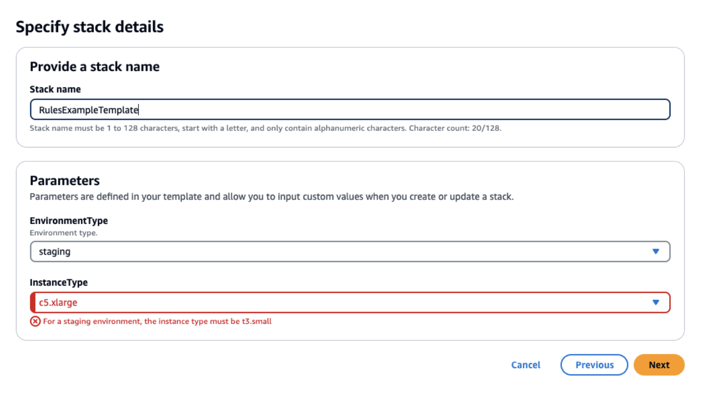

= Comparison: Variables
// Not sure how placement will affect publishing to Confluence
:toc: left

All three IaC frameworks support variable input (it would be kind of silly if they didn't) but how each one achieves this
is different.

== CloudFormation

When working with CloudFormation all parameters (ie variables) should be provided at the top of the `YOUR-TEMPLATE.yml`
file in the following format.

[source, yaml]
----
Parameters:
  ParameterLogicalID:
    Description: Information about the parameter
    Type: DataType
    Default: value
    AllowedValues:
      - value1
      - value2
  ParameterLogicalID2:
    ...
----
.Real Example
[source, yaml]
----
Parameters:
  AccountName:
    Description: Name of account that is being deployed into
    Type: String
    Default: YOUR-ACCOUNT
----
These values can then be referenced later on in the deployment yaml in the following manner ...

[source, yaml]
----
Resources:
  DeployBucket:
    Type: AWS::S3::Bucket
    DeletionPolicy: Retain
    Properties:
      BucketName: !Sub ${AccountName}-${AWS::Region}-bucket
----

[NOTE]
The key component in the above is the `!Sub` which is informing that those values should be substituted.

When the template is uploaded in the Aws Console it will then use the values that are present to populate the template at
runtime. If the parameters require selection or input you will see a screen similar to the following ...

=== System Properties

It is possible to use Aws System Properties to populate variables

[source, yaml]
----
Resources:
  MyLaunchTemplate:
    Type: AWS::EC2::LaunchTemplate
    Properties:
      LaunchTemplateName: !Sub ${AWS::StackName}-launch-template
      LaunchTemplateData:
        ImageId: '{{resolve:ssm:golden-ami:2}}'
        InstanceType: t2.micro
----

* https://docs.aws.amazon.com/AWSCloudFormation/latest/UserGuide/parameters-section-structure.html[CloudFormation User Guide: Parameter Syntax]
* https://docs.aws.amazon.com/AWSCloudFormation/latest/UserGuide/stackinstances-override.html[CloudFormation User Guide: Override parameters at runtime]
* https://spacelift.io/blog/aws-cloudformation-templates[SpaceLift: CF Template]
* https://docs.aws.amazon.com/AWSCloudFormation/latest/UserGuide/dynamic-references-ssm.html[CloudFormation: SSM]

== Serverless Framework

Similar to CloudFormation when writing up a Serverless Framework file all parameters (ie variables) should be provided at
the top of `serverless.yml` or `YOUR-CUSTOM-SERVERLESS-DEPLOYMENT.yml` file in the following format.

[NOTE]
All Serverless Framework parameters/variables must be under the `custom:` yaml key.

[source, yaml]
----
custom:
  serverlessPrefix: sls
  repoName: serverless-resource-templates
  repoAccount: YOUR-ACCOUNT
  bucketName: sls-cross-account-shared-services-domain-deploy
  stage: ${opt:stage, self:provider.stage}
----
These values can then be referenced later on in the deployment yaml in the following manner ...

[source, yaml]
----
provider:
  ...
  deploymentBucket:
    name: ${self:custom.bucketName}
    serverSideEncryption: AES256
  ...
----

Like CloudFormation any parameter/variable values can be overridden at runtime from the CLI.

=== System Properties

It is possible to use Aws System Properties to populate variables

.serverless.yml
[source, yaml]
----
service: ${ssm:/path/to/service/id}-service
provider:
  name: aws
functions:
  hello:
    name: ${ssm:/path/to/service/myParam}-hello
    handler: handler.hello
----

[CAUTION]
All documentation present here on serverless is written from a v3 perspective. Many things changed in v4 (like no longer
being free) that drove the interest in learning Terraform. V4 Serverless now supports several additional ways in which
variables can be supplied at deployment time.

* https://www.serverless.com/framework/docs/guides/variables[Serverless: Variables]
* https://www.serverless.com/framework/docs/guides/variables/aws/ssm[Serverless: SSM]

== Terraform

While not more difficult per-say, how Terraform does variables is significantly different. Terraform uses a `variables.tf`
file which can be further controlled/overridden by using a `.tfvars` file. So while variables could be declared within
the `main.tf`, it is considered best practice to place all variables within their own file `variables.tf`.

.variables.tf - variable declaration
[source, shell]
----
variable "environment_tag" {
  description = "Name of environment"
  type        = string
  default     = "tools"
}
----

.main.tf - variable usage
[source, shell]
----
module "module_name" {
  source      = "../modules/module_name"
  prop_1      = ""
  prop_2      = var.environment_tag
}
----

Variable declarations can be overridden at runtime by placing a `.tfvars` on the classpath or specifically passing in a
`.tfvars` file. This can be used to inject sensitive values into a project.

[NOTE]
For more information on how Terraform variables work please see link:../terraform/tf-variables.adoc[Terraform: Variables]

=== System Properties

It is possible to use Aws System Properties to populate variables

.data.tf
[source, shell]
----
data "aws_ssm_parameter" "my_parameter" {
  name = "/my/path/to/my_parameter"
}
----

.variables.tf
[source, shell]
----
variable "environment_tag" {
  description = "Name of environment"
  type        = string
  default     = data.aws_ssm_parameter.my_parameter.value
}
----

[CAUTION]
I *think* this can be done this way but I have not personally tested. You can absolutely use the data declaration within
the Terraform code but using values within variables sometimes gets weird as Terraform needs to see the default value as
static (ie does not change).

* https://developer.hashicorp.com/terraform/language/values/variables[Terraform: Variables]
* https://spacelift.io/blog/how-to-use-terraform-variables[SpaceLift: TF Variables]

// Renders correctly in IDE
ifndef::deploy[]
include::../../../../_includes/ops-iac-comparison-nwywlf.adoc[]
endif::[]
// Renders correctly in AsciiDoc Deployment
ifdef::deploy[]
include::{includedir}/ops-iac-comparison-nwywlf.adoc[]
endif::[]
