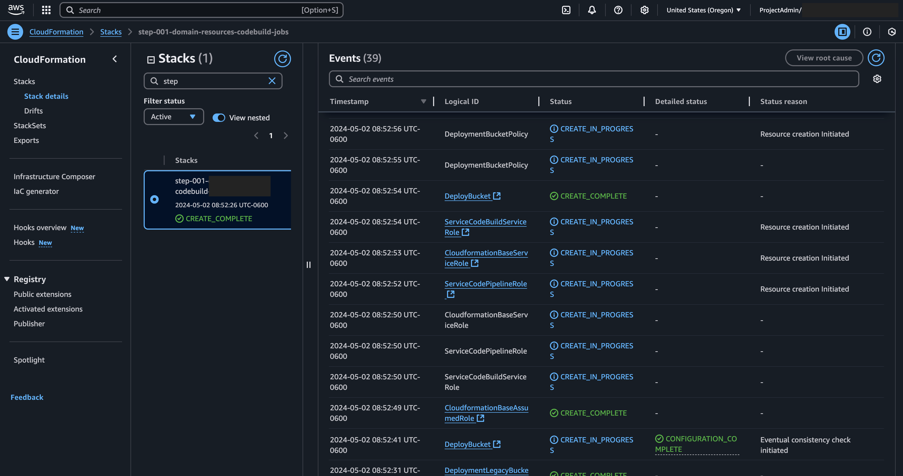
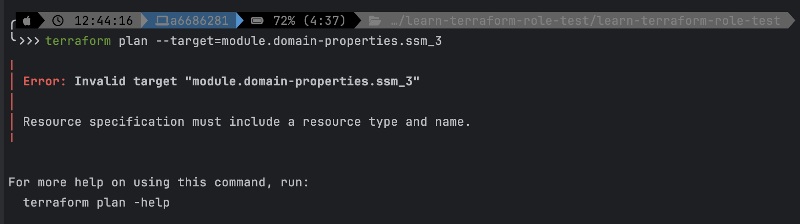

= Comparison of IaC
// Not sure how placement will affect publishing to Confluence
:toc: left

This is intended to function as a 1 to 1 comparison of how the various IaC frameworks function and to make it easy to visualize
how each individual task translates to each framework.

There are three major IaC frameworks and they are as follows ...

* https://www.terraform.io[Terraform]
** Platform *agnostic*
** Proprietary language
** Medium/Hard to learn
*** New syntax and paradigm
** Fast
*** Much faster than CloudFormation
** _Does not_ use CloudFormation behind the scenes
** Supports state imports, meaning you can import an existing resource in AWS and TF can manage it directly.
*** CFn/CDK can target existing resources but can not take ownership of them
** Better multi-region support
** Better diffs
** Faster support for new Aws API's (Faster than Amazon updates CloudFormation)
** Can be unit tested - there are multiple tools available
* https://aws.amazon.com/cloudformation/[CloudFormation (Includes Aws SAM and CDK)]
** Platform _specific_
** YML or JSON based
** Medium to learn (easier if you already know Serverless Framework (sls) as all sls resources are pure CloudFormation)
** It can be really slow
** Painful to write in
*** I've even seen https://www.reddit.com/r/aws/comments/150ehx9/why_use_terraform_over_cloudformation/[Reddit] posts of Aws engineers saying they rarely write anything in CFn directly.
** *Supposedly* can be unit tested
*** I've not really seen much to support this other than the statement it can be done.
*** See https://aws.amazon.com/blogs/devops/aws-cloudformation-linter-v1/[cfn-lint] or https://docs.aws.amazon.com/cfn-guard/latest/ug/testing-rules.html#:~:text=You%20can%20use%20the%20AWS,file%20with%20the%20test%20command[CloudFormation Guard]
* https://www.serverless.com[Serverless Framework]
** Platform *agnostic*-_ish_
** YML based
** Easy-ish to learn
** Slow
*** Uses CloudFormation behind the scenes and is thus hampered by the issues of CFn
** Costs money
** To my knowledge can not be unit tested

Each of these frameworks has their pros and cons but there is a definitive winner.

== So when should you learn each of these frameworks?

If you had asked me in 2022, or 2023 I would have said to start with the Serverless Framework. In my opinion it is by far
the easiest one to learn and uses yaml syntax which most developers will know reducing the learning curve of the framework.
With the release of Serverless v4 they have decided to take the framework paid which looses a lot of the value. It's still
a great framework and I understand why as v4 offers some large improvements but when your two main competitors are free and
are the preferred vendors in the market it's hard for me to see how this makes sense. If it were still free and you have
never written any IaC code this would be the one I would tell you to start with. If you can find v3 tutorials this is a
great place to start.

While it poses a bit more of a challenge I would now suggest starting with learning CloudFormation over serverless as it
is the IaC language of the largest cloud provider. CloudFormation is a great place to start if you already know
Serverless Framework or if your just getting started as almost half of the serverless framework is pure CloudFormation
anyway and CloudFormation can also be written in yaml again easing the learning curve of what you need to know to get started.

If you don't want to just scale the mountain I would suggest learning Terraform last as it has its own custom syntax and
there is no half learning it through learning another framework. If you are already very familiar with cloud environments
then starting here is not impossible, but I found learning Serverless and CloudFormation first extremely helpful in understanding
how the IaC languages map to cloud constructs.

== Logging differences

While these frameworks all support logging in some form or another how they work is significantly different.

=== CloudFormation

It is not actually clear to me if or how logging works on _pure_ CloudFormation. While there is some form of logging that
I will discuss next, it is not logging in the same way as Serverless or Terraform. When executing a CloudFormation template
 from the Aws Console some updates are visible under "Stacks" and it is essentially a bullet list of actions that have been
executed and there status. That status may be some form of in-progress, created, or failed (Aws custom verbiage applies).
If a step has failed it will give some reason but it is not logging in a traditional application sense..

things

==== Aws SAM

I have not worked with SAM yet so it is unknown what this would look like.

=== Serverless Framework

Serverless will generate CloudWatch and logs and store then in S3 during deployment. This is one of the reasons that
serverless requires you to specify a deployment bucket in its scripts.

[source, shell]
----
TODO
----

=== Terraform

Terraform by default will log out to the console. If you wish it to log to a given log service it can be configured. For
more detail on Terraform logging see link:../terraform/tf.adoc#_logging[Terraform Logging].

.Click here to expand ...
[%collapsible]
====
[source, shell]
----
╰ terraform apply                                                                                                                                                                        21.0.4+7-LTS 
data.aws_caller_identity.current: Reading...
data.aws_region.current: Reading...
data.aws_region.current: Read complete after 0s [id=us-east-2]
data.aws_caller_identity.current: Read complete after 0s [id=accountNumber]

Terraform used the selected providers to generate the following execution plan. Resource actions are indicated with the following symbols:
  + create
 <= read (data resources)

Terraform will perform the following actions:

  # module.codebuild.aws_codebuild_project.codebuild_job will be created
  + resource "aws_codebuild_project" "codebuild_job" {
      + arn                  = (known after apply)
      + badge_enabled        = true
      + badge_url            = (known after apply)
      + build_timeout        = 5
      + description          = "Syncs CodeCommit repository to alternate region"
      + encryption_key       = (known after apply)
      + id                   = (known after apply)
      + name                 = "domain-resources-disaster-recovery-sync"
      + project_visibility   = "PRIVATE"
      + public_project_alias = (known after apply)
      + queued_timeout       = 480
      + service_role         = (known after apply)
      + source_version       = "refs/heads/main"
      + tags                 = {
          + "Environment" = "tools"
        }
      + tags_all             = {
          + "Environment" = "tools"
        }

      + artifacts {
          + encryption_disabled    = false
          + override_artifact_name = false
          + type                   = "NO_ARTIFACTS"
        }

      + environment {
          + compute_type                = "BUILD_GENERAL1_SMALL"
          + image                       = "aws/codebuild/standard:7.0"
          + image_pull_credentials_type = "CODEBUILD"
          + privileged_mode             = false
          + type                        = "LINUX_CONTAINER"
        }

      + logs_config {
          + cloudwatch_logs {
              + group_name = "domain-resources-disaster-recovery-sync"
              + status     = "ENABLED"
            }
          + s3_logs {
              + encryption_disabled = false
              + status              = "DISABLED"
            }
        }

      + source {
          + buildspec       = ".codebuild/buildspec-replicate.yml"
          + git_clone_depth = 0
          + location        = "https://git-codecommit.us-east-2.amazonaws.com/v1/repos/serverless-resource-templates"
          + type            = "CODECOMMIT"

          + git_submodules_config {
              + fetch_submodules = false
            }
        }
    }

  # module.codepipeline.aws_codepipeline.codepipeline will be created
  + resource "aws_codepipeline" "codepipeline" {
      + arn            = (known after apply)
      + execution_mode = "SUPERSEDED"
      + id             = (known after apply)
      + name           = "domain-resources-replication-pipeline"
      + pipeline_type  = "V1"
      + role_arn       = (known after apply)
      + tags_all       = (known after apply)

      + artifact_store {
          + location = "tf-us-east-2-cross-account-shared-services"
          + type     = "S3"
            # (1 unchanged attribute hidden)
        }

      + stage {
          + name = "code-commit-checkout"

          + action {
              + category         = "Source"
              + configuration    = {
                  + "BranchName"           = "main"
                  + "OutputArtifactFormat" = "CODE_ZIP"
                  + "PollForSourceChanges" = "false"
                  + "RepositoryName"       = "serverless-resource-templates"
                }
              + name             = "Source"
              + namespace        = "SourceVariables"
              + output_artifacts = [
                  + "SourceArtifact",
                ]
              + owner            = "AWS"
              + provider         = "CodeCommit"
              + region           = (known after apply)
              + run_order        = (known after apply)
              + version          = "1"
            }
        }
      + stage {
          + name = "replicate-to-alternate-region"

          + action {
              + category        = "Build"
              + configuration   = {
                  + "ProjectName" = "domain-resources-disaster-recovery-sync"
                }
              + input_artifacts = [
                  + "SourceArtifact",
                ]
              + name            = "replicate"
              + owner           = "AWS"
              + provider        = "CodeBuild"
              + region          = (known after apply)
              + run_order       = (known after apply)
              + version         = "1"
            }
        }
    }

  # module.event_rule.aws_cloudwatch_event_rule.codepipeline_trigger will be created
  + resource "aws_cloudwatch_event_rule" "codepipeline_trigger" {
      + arn            = (known after apply)
      + description    = "This rule will trigger the domain-resources-pipeline on each push into main"
      + event_bus_name = "default"
      + event_pattern  = jsonencode(
            {
              + detail      = {
                  + event         = [
                      + "referenceCreated",
                      + "referenceUpdated",
                    ]
                  + referenceName = [
                      + "main",
                    ]
                  + referenceType = [
                      + "branch",
                    ]
                }
              + detail-type = [
                  + "CodeCommit Repository State Change",
                ]
              + resources   = [
                  + "arn:aws:codecommit:us-east-2:accountNumber:serverless-resource-templates",
                ]
              + source      = [
                  + "aws.codecommit",
                ]
            }
        )
      + id             = (known after apply)
      + name           = "domain-resources-pipeline-rule"
      + name_prefix    = (known after apply)
      + state          = "ENABLED"
      + tags_all       = (known after apply)
    }

  # module.event_rule.aws_cloudwatch_event_target.codepipeline will be created
  + resource "aws_cloudwatch_event_target" "codepipeline" {
      + arn            = (known after apply)
      + event_bus_name = "default"
      + id             = (known after apply)
      + role_arn       = (known after apply)
      + rule           = "domain-resources-pipeline-rule"
      + target_id      = "codepipeline-domain-resources-replication-pipeline"
    }

  # module.iam_policies.data.aws_iam_policy_document.tf_assume_role_policy will be read during apply
  # (config refers to values not yet known)
 <= data "aws_iam_policy_document" "tf_assume_role_policy" {
      + id   = (known after apply)
      + json = (known after apply)

      + statement {
          + actions   = [
              + "sts:AssumeRole",
            ]
          + effect    = "Allow"
          + resources = [
              + (known after apply),
            ]
        }
    }

  # module.iam_policies.data.aws_iam_policy_document.tf_codebuild_resource_policy will be read during apply
  # (depends on a resource or a module with changes pending)
 <= data "aws_iam_policy_document" "tf_codebuild_resource_policy" {
      + id   = (known after apply)
      + json = (known after apply)

      + statement {
          + actions   = [
              + "codebuild:BatchPutCodeCoverages",
              + "codebuild:BatchPutTestCases",
              + "codebuild:CreateReport",
              + "codebuild:CreateReportGroup",
              + "codebuild:RetryBuild",
              + "codebuild:StartBuild",
              + "codebuild:StopBuild",
              + "codebuild:UpdateReport",
            ]
          + effect    = "Allow"
          + resources = [
              + "*",
            ]
        }
    }

  # module.iam_policies.data.aws_iam_policy_document.tf_codebuild_resource_simple_policy will be read during apply
  # (depends on a resource or a module with changes pending)
 <= data "aws_iam_policy_document" "tf_codebuild_resource_simple_policy" {
      + id   = (known after apply)
      + json = (known after apply)

      + statement {
          + actions   = [
              + "codebuild:CreateProject",
              + "codebuild:DeleteProject",
              + "codebuild:UpdateProject",
            ]
          + effect    = "Allow"
          + resources = [
              + "*",
            ]
        }
    }

  # module.iam_policies.data.aws_iam_policy_document.tf_codecommit_resource_repo_policy will be read during apply
  # (depends on a resource or a module with changes pending)
 <= data "aws_iam_policy_document" "tf_codecommit_resource_repo_policy" {
      + id   = (known after apply)
      + json = (known after apply)

      + statement {
          + actions   = [
              + "codecommit:GitPull",
              + "codecommit:GitPush",
            ]
          + effect    = "Allow"
          + resources = [
              + "*",
            ]
        }
    }

  # module.iam_policies.data.aws_iam_policy_document.tf_codepipeline_resource_policy will be read during apply
  # (depends on a resource or a module with changes pending)
 <= data "aws_iam_policy_document" "tf_codepipeline_resource_policy" {
      + id   = (known after apply)
      + json = (known after apply)

      + statement {
          + actions   = [
              + "codepipeline:CreatePipeline",
              + "codepipeline:DeletePipeline",
              + "codepipeline:GetPipeline",
              + "codepipeline:GetPipelineState",
              + "codepipeline:UpdatePipeline",
            ]
          + effect    = "Allow"
          + resources = [
              + "*",
            ]
        }
    }

  # module.iam_policies.data.aws_iam_policy_document.tf_domain_resources_codepipeline_policy will be read during apply
  # (depends on a resource or a module with changes pending)
 <= data "aws_iam_policy_document" "tf_domain_resources_codepipeline_policy" {
      + id   = (known after apply)
      + json = (known after apply)

      + statement {
          + actions   = [
              + "codepipeline:GetPipelineExecution",
              + "codepipeline:ListPipelineExecutions",
              + "codepipeline:StopPipelineExecution",
            ]
          + effect    = "Allow"
          + resources = [
              + "*",
            ]
        }
    }

  # module.iam_policies.data.aws_iam_policy_document.tf_domain_resources_everything_policy will be read during apply
  # (depends on a resource or a module with changes pending)
 <= data "aws_iam_policy_document" "tf_domain_resources_everything_policy" {
      + id   = (known after apply)
      + json = (known after apply)

      + statement {
          + actions   = [
              + "cloudformation:*",
              + "cloudwatch:*",
              + "codebuild:BatchGetBuildBatches",
              + "codebuild:BatchGetBuilds",
              + "codebuild:StartBuild",
              + "codebuild:StartBuildBatch",
              + "codecommit:CancelUploadArchive",
              + "codecommit:Get*",
              + "codecommit:GitPull",
              + "codecommit:GitPush",
              + "codecommit:List*",
              + "codecommit:UploadArchive",
              + "codedeploy:*",
              + "codepipeline:GetPipeline",
              + "codepipeline:GetPipelineExecution",
              + "codepipeline:ListPipelineExecutions",
              + "codepipeline:StopPipelineExecution",
              + "codestar-connections:UseConnection",
              + "ec2:DescribeSecurityGroups",
              + "ecr:DescribeImages",
              + "ecs:*",
              + "iam:PassRole",
              + "kms:Decrypt",
              + "lambda:InvokeFunction",
              + "lambda:ListFunctions",
              + "sns:Publish",
            ]
          + effect    = "Allow"
          + resources = [
              + "*",
            ]
        }
    }

  # module.iam_policies.data.aws_iam_policy_document.tf_domain_resources_pipeline_execution_policy will be read during apply
  # (depends on a resource or a module with changes pending)
 <= data "aws_iam_policy_document" "tf_domain_resources_pipeline_execution_policy" {
      + id   = (known after apply)
      + json = (known after apply)

      + statement {
          + actions   = [
              + "codepipeline:StartPipelineExecution",
            ]
          + effect    = "Allow"
          + resources = [
              + "arn:aws:codepipeline:us-east-2:accountNumber:domain-resources-replication-pipeline",
            ]
        }
    }

  # module.iam_policies.data.aws_iam_policy_document.tf_domain_resources_s3_resource_policy will be read during apply
  # (depends on a resource or a module with changes pending)
 <= data "aws_iam_policy_document" "tf_domain_resources_s3_resource_policy" {
      + id   = (known after apply)
      + json = (known after apply)

      + statement {
          + actions   = [
              + "s3:GetBucketLocation",
              + "s3:GetBucketPolicy",
              + "s3:GetObject",
              + "s3:ListAllMyBuckets",
              + "s3:ListBucket",
              + "s3:PutObject",
            ]
          + effect    = "Allow"
          + resources = [
              + "arn:aws:s3:::tf-us-east-2-cross-account-shared-services",
              + "arn:aws:s3:::tf-us-east-2-cross-account-shared-services/*",
            ]
        }
    }

  # module.iam_policies.data.aws_iam_policy_document.tf_log_group_build_policy will be read during apply
  # (depends on a resource or a module with changes pending)
 <= data "aws_iam_policy_document" "tf_log_group_build_policy" {
      + id   = (known after apply)
      + json = (known after apply)

      + statement {
          + actions   = [
              + "logs:CreateLogGroup",
              + "logs:CreateLogStream",
              + "logs:PutLogEvents",
              + "logs:PutQueryDefinition",
              + "logs:TagResource",
            ]
          + effect    = "Allow"
          + resources = [
              + "arn:aws:logs:us-east-2:accountNumber:log-group:/aws/codebuild/sls-*",
              + "arn:aws:logs:us-east-2:accountNumber:log-group:/aws/codebuild/step-*",
              + "arn:aws:logs:us-east-2:accountNumber:log-group:/aws/codebuild/tf-*",
            ]
        }
    }

  # module.iam_policies.data.aws_iam_policy_document.tf_log_policy will be read during apply
  # (depends on a resource or a module with changes pending)
 <= data "aws_iam_policy_document" "tf_log_policy" {
      + id   = (known after apply)
      + json = (known after apply)

      + statement {
          + actions   = [
              + "logs:CreateLogGroup",
              + "logs:CreateLogStream",
              + "logs:PutLogEvents",
              + "logs:PutQueryDefinition",
              + "logs:TagResource",
            ]
          + effect    = "Allow"
          + resources = [
              + "arn:aws:logs:*:*:*",
            ]
        }
    }

  # module.iam_policies.data.aws_iam_policy_document.tf_resource_iam_pass_through_policy will be read during apply
  # (depends on a resource or a module with changes pending)
 <= data "aws_iam_policy_document" "tf_resource_iam_pass_through_policy" {
      + id   = (known after apply)
      + json = (known after apply)

      + statement {
          + actions   = [
              + "iam:PassRole",
            ]
          + effect    = "Allow"
          + resources = [
              + "*",
            ]
        }
    }

  # module.iam_policies.data.aws_iam_policy_document.tf_resource_iam_policy will be read during apply
  # (depends on a resource or a module with changes pending)
 <= data "aws_iam_policy_document" "tf_resource_iam_policy" {
      + id   = (known after apply)
      + json = (known after apply)

      + statement {
          + actions   = [
              + "iam:AttachRolePolicy",
              + "iam:CreateRole",
              + "iam:DeleteRole",
              + "iam:DeleteRolePolicy",
              + "iam:DetachRolePolicy",
              + "iam:GetRole",
              + "iam:PassRole",
              + "iam:PutRolePolicy",
            ]
          + effect    = "Allow"
          + resources = [
              + "arn:aws:iam::accountNumber:role/*",
            ]
        }
    }

  # module.iam_policies.data.aws_iam_policy_document.tf_resource_iam_policy_all will be read during apply
  # (depends on a resource or a module with changes pending)
 <= data "aws_iam_policy_document" "tf_resource_iam_policy_all" {
      + id   = (known after apply)
      + json = (known after apply)

      + statement {
          + actions   = [
              + "iam:AttachRolePolicy",
              + "iam:CreateRole",
              + "iam:DeleteRole",
              + "iam:DeleteRolePolicy",
              + "iam:DetachRolePolicy",
              + "iam:GetRole",
              + "iam:PassRole",
              + "iam:PutRolePolicy",
            ]
          + effect    = "Allow"
          + resources = [
              + "*",
            ]
        }
    }

  # module.iam_policies.data.aws_iam_policy_document.tf_s3_resource_policy will be read during apply
  # (depends on a resource or a module with changes pending)
 <= data "aws_iam_policy_document" "tf_s3_resource_policy" {
      + id   = (known after apply)
      + json = (known after apply)

      + statement {
          + actions   = [
              + "s3:GetBucketAcl",
              + "s3:GetBucketLocation",
              + "s3:GetObject",
              + "s3:GetObjectVersion",
              + "s3:PutAccelerateConfiguration",
              + "s3:PutObject",
            ]
          + effect    = "Allow"
          + resources = [
              + "*",
            ]
        }
    }

  # module.iam_policies.data.aws_iam_policy_document.tf_ssm_get_policy will be read during apply
  # (depends on a resource or a module with changes pending)
 <= data "aws_iam_policy_document" "tf_ssm_get_policy" {
      + id   = (known after apply)
      + json = (known after apply)

      + statement {
          + actions   = [
              + "ssm:GetParameter",
              + "ssm:GetParameters",
            ]
          + effect    = "Allow"
          + resources = [
              + "*",
            ]
        }
    }

  # module.iam_policies.data.aws_iam_policy_document.tf_ssm_policy will be read during apply
  # (depends on a resource or a module with changes pending)
 <= data "aws_iam_policy_document" "tf_ssm_policy" {
      + id   = (known after apply)
      + json = (known after apply)

      + statement {
          + actions   = [
              + "ssm:DeleteParameter",
              + "ssm:PutParameter",
            ]
          + effect    = "Allow"
          + resources = [
              + "arn:aws:ssm:us-east-2:accountNumber:parameter/brr.*",
            ]
        }
    }

  # module.iam_policies.aws_iam_policy.tf_assume_role_policy will be created
  + resource "aws_iam_policy" "tf_assume_role_policy" {
      + arn         = (known after apply)
      + description = "Custom assume policy for base role"
      + id          = (known after apply)
      + name        = "tf_assume_role_policy"
      + name_prefix = (known after apply)
      + path        = "/"
      + policy      = (known after apply)
      + policy_id   = (known after apply)
      + tags_all    = (known after apply)
    }

  # module.iam_policies.aws_iam_policy.tf_codebuild_resource_policy will be created
  + resource "aws_iam_policy" "tf_codebuild_resource_policy" {
      + arn         = (known after apply)
      + description = "Custom assume policy for base role"
      + id          = (known after apply)
      + name        = "tf_codebuild_resource_policy"
      + name_prefix = (known after apply)
      + path        = "/"
      + policy      = (known after apply)
      + policy_id   = (known after apply)
      + tags_all    = (known after apply)
    }

  # module.iam_policies.aws_iam_policy.tf_codebuild_resource_simple_policy will be created
  + resource "aws_iam_policy" "tf_codebuild_resource_simple_policy" {
      + arn         = (known after apply)
      + description = "Custom CodeBuild policy for base role"
      + id          = (known after apply)
      + name        = "tf_codebuild_resource_simple_policy"
      + name_prefix = (known after apply)
      + path        = "/"
      + policy      = (known after apply)
      + policy_id   = (known after apply)
      + tags_all    = (known after apply)
    }

  # module.iam_policies.aws_iam_policy.tf_codecommit_resource_repo_policy will be created
  + resource "aws_iam_policy" "tf_codecommit_resource_repo_policy" {
      + arn         = (known after apply)
      + description = "Custom SSM policy for base role"
      + id          = (known after apply)
      + name        = "tf_codecommit_resource_repo_policy"
      + name_prefix = (known after apply)
      + path        = "/"
      + policy      = (known after apply)
      + policy_id   = (known after apply)
      + tags_all    = (known after apply)
    }

  # module.iam_policies.aws_iam_policy.tf_codepipeline_resource_policy will be created
  + resource "aws_iam_policy" "tf_codepipeline_resource_policy" {
      + arn         = (known after apply)
      + description = "Custom CodePipeline policy for base role"
      + id          = (known after apply)
      + name        = "tf_codepipeline_resource_policy"
      + name_prefix = (known after apply)
      + path        = "/"
      + policy      = (known after apply)
      + policy_id   = (known after apply)
      + tags_all    = (known after apply)
    }

  # module.iam_policies.aws_iam_policy.tf_domain_resources_codepipeline_policy will be created
  + resource "aws_iam_policy" "tf_domain_resources_codepipeline_policy" {
      + arn         = (known after apply)
      + description = "Custom IAM policy for base role"
      + id          = (known after apply)
      + name        = "tf_domain_resources_codepipeline_policy"
      + name_prefix = (known after apply)
      + path        = "/"
      + policy      = (known after apply)
      + policy_id   = (known after apply)
      + tags_all    = (known after apply)
    }

  # module.iam_policies.aws_iam_policy.tf_domain_resources_everything_policy will be created
  + resource "aws_iam_policy" "tf_domain_resources_everything_policy" {
      + arn         = (known after apply)
      + description = "Custom SSM policy for base role"
      + id          = (known after apply)
      + name        = "tf_domain_resources_everything_policy"
      + name_prefix = (known after apply)
      + path        = "/"
      + policy      = (known after apply)
      + policy_id   = (known after apply)
      + tags_all    = (known after apply)
    }

  # module.iam_policies.aws_iam_policy.tf_domain_resources_pipeline_execution_policy will be created
  + resource "aws_iam_policy" "tf_domain_resources_pipeline_execution_policy" {
      + arn         = (known after apply)
      + description = "Custom assume policy for base role"
      + id          = (known after apply)
      + name        = "tf_domain_resources_pipeline_execution_policy"
      + name_prefix = (known after apply)
      + path        = "/"
      + policy      = (known after apply)
      + policy_id   = (known after apply)
      + tags_all    = (known after apply)
    }

  # module.iam_policies.aws_iam_policy.tf_domain_resources_s3_resource_policy will be created
  + resource "aws_iam_policy" "tf_domain_resources_s3_resource_policy" {
      + arn         = (known after apply)
      + description = "Custom assume policy for base role"
      + id          = (known after apply)
      + name        = "tf_domain_resources_s3_resource_policy"
      + name_prefix = (known after apply)
      + path        = "/"
      + policy      = (known after apply)
      + policy_id   = (known after apply)
      + tags_all    = (known after apply)
    }

  # module.iam_policies.aws_iam_policy.tf_log_group_build_policy will be created
  + resource "aws_iam_policy" "tf_log_group_build_policy" {
      + arn         = (known after apply)
      + description = "Custom CodeBuild policy for base role"
      + id          = (known after apply)
      + name        = "tf_log_group_build_policy"
      + name_prefix = (known after apply)
      + path        = "/"
      + policy      = (known after apply)
      + policy_id   = (known after apply)
      + tags_all    = (known after apply)
    }

  # module.iam_policies.aws_iam_policy.tf_log_policy will be created
  + resource "aws_iam_policy" "tf_log_policy" {
      + arn         = (known after apply)
      + description = "Custom IAM policy for base role"
      + id          = (known after apply)
      + name        = "tf_log_policy"
      + name_prefix = (known after apply)
      + path        = "/"
      + policy      = (known after apply)
      + policy_id   = (known after apply)
      + tags_all    = (known after apply)
    }

  # module.iam_policies.aws_iam_policy.tf_resource_iam_pass_through_policy will be created
  + resource "aws_iam_policy" "tf_resource_iam_pass_through_policy" {
      + arn         = (known after apply)
      + description = "Custom CodeBuild policy for base role"
      + id          = (known after apply)
      + name        = "tf_resource_iam_pass_through_policy"
      + name_prefix = (known after apply)
      + path        = "/"
      + policy      = (known after apply)
      + policy_id   = (known after apply)
      + tags_all    = (known after apply)
    }

  # module.iam_policies.aws_iam_policy.tf_resource_iam_policy will be created
  + resource "aws_iam_policy" "tf_resource_iam_policy" {
      + arn         = (known after apply)
      + description = "Custom IAM policy for base role"
      + id          = (known after apply)
      + name        = "tf_resource_iam_policy"
      + name_prefix = (known after apply)
      + path        = "/"
      + policy      = (known after apply)
      + policy_id   = (known after apply)
      + tags_all    = (known after apply)
    }

  # module.iam_policies.aws_iam_policy.tf_resource_iam_policy_all will be created
  + resource "aws_iam_policy" "tf_resource_iam_policy_all" {
      + arn         = (known after apply)
      + description = "Custom IAM policy for base role"
      + id          = (known after apply)
      + name        = "tf_resource_iam_policy_all"
      + name_prefix = (known after apply)
      + path        = "/"
      + policy      = (known after apply)
      + policy_id   = (known after apply)
      + tags_all    = (known after apply)
    }

  # module.iam_policies.aws_iam_policy.tf_s3_resource_policy will be created
  + resource "aws_iam_policy" "tf_s3_resource_policy" {
      + arn         = (known after apply)
      + description = "Custom CodePipeline policy for base role"
      + id          = (known after apply)
      + name        = "tf_s3_resource_policy"
      + name_prefix = (known after apply)
      + path        = "/"
      + policy      = (known after apply)
      + policy_id   = (known after apply)
      + tags_all    = (known after apply)
    }

  # module.iam_policies.aws_iam_policy.tf_ssm_get_policy will be created
  + resource "aws_iam_policy" "tf_ssm_get_policy" {
      + arn         = (known after apply)
      + description = "Custom CodePipeline policy for base role"
      + id          = (known after apply)
      + name        = "tf_ssm_get_policy"
      + name_prefix = (known after apply)
      + path        = "/"
      + policy      = (known after apply)
      + policy_id   = (known after apply)
      + tags_all    = (known after apply)
    }

  # module.iam_policies.aws_iam_policy.tf_ssm_policy will be created
  + resource "aws_iam_policy" "tf_ssm_policy" {
      + arn         = (known after apply)
      + description = "Custom SSM policy for base role"
      + id          = (known after apply)
      + name        = "tf_ssm_policy"
      + name_prefix = (known after apply)
      + path        = "/"
      + policy      = (known after apply)
      + policy_id   = (known after apply)
      + tags_all    = (known after apply)
    }

  # module.iam_policy_attachments.aws_iam_role_policy_attachment.base_assumed_service_role_1 will be created
  + resource "aws_iam_role_policy_attachment" "base_assumed_service_role_1" {
      + id         = (known after apply)
      + policy_arn = "arn:aws:iam::aws:policy/PowerUserAccess"
      + role       = "tf-base-us-east-2-assumed-service-role"
    }

  # module.iam_policy_attachments.aws_iam_role_policy_attachment.base_assumed_service_role_2 will be created
  + resource "aws_iam_role_policy_attachment" "base_assumed_service_role_2" {
      + id         = (known after apply)
      + policy_arn = (known after apply)
      + role       = "tf-base-us-east-2-assumed-service-role"
    }

  # module.iam_policy_attachments.aws_iam_role_policy_attachment.base_service_role_1 will be created
  + resource "aws_iam_role_policy_attachment" "base_service_role_1" {
      + id         = (known after apply)
      + policy_arn = (known after apply)
      + role       = "tf-base-us-east-2-service-role"
    }

  # module.iam_policy_attachments.aws_iam_role_policy_attachment.base_service_role_2 will be created
  + resource "aws_iam_role_policy_attachment" "base_service_role_2" {
      + id         = (known after apply)
      + policy_arn = (known after apply)
      + role       = "tf-base-us-east-2-service-role"
    }

  # module.iam_policy_attachments.aws_iam_role_policy_attachment.base_service_role_3 will be created
  + resource "aws_iam_role_policy_attachment" "base_service_role_3" {
      + id         = (known after apply)
      + policy_arn = (known after apply)
      + role       = "tf-base-us-east-2-service-role"
    }

  # module.iam_policy_attachments.aws_iam_role_policy_attachment.base_service_role_4 will be created
  + resource "aws_iam_role_policy_attachment" "base_service_role_4" {
      + id         = (known after apply)
      + policy_arn = (known after apply)
      + role       = "tf-base-us-east-2-service-role"
    }

  # module.iam_policy_attachments.aws_iam_role_policy_attachment.base_service_role_5 will be created
  + resource "aws_iam_role_policy_attachment" "base_service_role_5" {
      + id         = (known after apply)
      + policy_arn = (known after apply)
      + role       = "tf-base-us-east-2-service-role"
    }

  # module.iam_policy_attachments.aws_iam_role_policy_attachment.codebuild_service_role_1 will be created
  + resource "aws_iam_role_policy_attachment" "codebuild_service_role_1" {
      + id         = (known after apply)
      + policy_arn = (known after apply)
      + role       = "tf-domain-resources-us-east-2-resource-deploy-service-role"
    }

  # module.iam_policy_attachments.aws_iam_role_policy_attachment.codebuild_service_role_2 will be created
  + resource "aws_iam_role_policy_attachment" "codebuild_service_role_2" {
      + id         = (known after apply)
      + policy_arn = (known after apply)
      + role       = "tf-domain-resources-us-east-2-resource-deploy-service-role"
    }

  # module.iam_policy_attachments.aws_iam_role_policy_attachment.codebuild_service_role_3 will be created
  + resource "aws_iam_role_policy_attachment" "codebuild_service_role_3" {
      + id         = (known after apply)
      + policy_arn = (known after apply)
      + role       = "tf-domain-resources-us-east-2-resource-deploy-service-role"
    }

  # module.iam_policy_attachments.aws_iam_role_policy_attachment.codebuild_service_role_4 will be created
  + resource "aws_iam_role_policy_attachment" "codebuild_service_role_4" {
      + id         = (known after apply)
      + policy_arn = (known after apply)
      + role       = "tf-domain-resources-us-east-2-resource-deploy-service-role"
    }

  # module.iam_policy_attachments.aws_iam_role_policy_attachment.codebuild_service_role_5 will be created
  + resource "aws_iam_role_policy_attachment" "codebuild_service_role_5" {
      + id         = (known after apply)
      + policy_arn = (known after apply)
      + role       = "tf-domain-resources-us-east-2-resource-deploy-service-role"
    }

  # module.iam_policy_attachments.aws_iam_role_policy_attachment.codebuild_service_role_6 will be created
  + resource "aws_iam_role_policy_attachment" "codebuild_service_role_6" {
      + id         = (known after apply)
      + policy_arn = (known after apply)
      + role       = "tf-domain-resources-us-east-2-resource-deploy-service-role"
    }

  # module.iam_policy_attachments.aws_iam_role_policy_attachment.codebuild_service_role_7 will be created
  + resource "aws_iam_role_policy_attachment" "codebuild_service_role_7" {
      + id         = (known after apply)
      + policy_arn = (known after apply)
      + role       = "tf-domain-resources-us-east-2-resource-deploy-service-role"
    }

  # module.iam_policy_attachments.aws_iam_role_policy_attachment.codebuild_service_role_8 will be created
  + resource "aws_iam_role_policy_attachment" "codebuild_service_role_8" {
      + id         = (known after apply)
      + policy_arn = (known after apply)
      + role       = "tf-domain-resources-us-east-2-resource-deploy-service-role"
    }

  # module.iam_policy_attachments.aws_iam_role_policy_attachment.codebuild_service_role_9 will be created
  + resource "aws_iam_role_policy_attachment" "codebuild_service_role_9" {
      + id         = (known after apply)
      + policy_arn = (known after apply)
      + role       = "tf-domain-resources-us-east-2-resource-deploy-service-role"
    }

  # module.iam_policy_attachments.aws_iam_role_policy_attachment.codepipeline_event_rule_role_1 will be created
  + resource "aws_iam_role_policy_attachment" "codepipeline_event_rule_role_1" {
      + id         = (known after apply)
      + policy_arn = (known after apply)
      + role       = "tf-codepipeline-us-east-2-event-rule-role"
    }

  # module.iam_policy_attachments.aws_iam_role_policy_attachment.codepipeline_service_role_1 will be created
  + resource "aws_iam_role_policy_attachment" "codepipeline_service_role_1" {
      + id         = (known after apply)
      + policy_arn = (known after apply)
      + role       = "domain-resources-us-east-2-codepipeline-role"
    }

  # module.iam_policy_attachments.aws_iam_role_policy_attachment.codepipeline_service_role_2 will be created
  + resource "aws_iam_role_policy_attachment" "codepipeline_service_role_2" {
      + id         = (known after apply)
      + policy_arn = (known after apply)
      + role       = "domain-resources-us-east-2-codepipeline-role"
    }

  # module.iam_policy_attachments.aws_iam_role_policy_attachment.codepipeline_service_role_3 will be created
  + resource "aws_iam_role_policy_attachment" "codepipeline_service_role_3" {
      + id         = (known after apply)
      + policy_arn = (known after apply)
      + role       = "domain-resources-us-east-2-codepipeline-role"
    }

  # module.iam_roles.aws_iam_role.base_assumed_service_role will be created
  + resource "aws_iam_role" "base_assumed_service_role" {
      + arn                   = (known after apply)
      + assume_role_policy    = jsonencode(
            {
              + Statement = [
                  + {
                      + Action    = "sts:AssumeRole"
                      + Effect    = "Allow"
                      + Principal = {
                          + AWS = "arn:aws:iam::accountNumber:root"
                        }
                    },
                ]
              + Version   = "2012-10-17"
            }
        )
      + create_date           = (known after apply)
      + description           = "This is the base role that will be assumed"
      + force_detach_policies = false
      + id                    = (known after apply)
      + managed_policy_arns   = (known after apply)
      + max_session_duration  = 3600
      + name                  = "tf-base-us-east-2-assumed-service-role"
      + name_prefix           = (known after apply)
      + path                  = "/"
      + tags_all              = (known after apply)
      + unique_id             = (known after apply)

      + inline_policy (known after apply)
    }

  # module.iam_roles.aws_iam_role.base_service_role will be created
  + resource "aws_iam_role" "base_service_role" {
      + arn                   = (known after apply)
      + assume_role_policy    = jsonencode(
            {
              + Statement = [
                  + {
                      + Action    = "sts:AssumeRole"
                      + Effect    = "Allow"
                      + Principal = {
                          + Service = [
                              + "codepipeline.amazonaws.com",
                              + "codebuild.amazonaws.com",
                              + "cloudformation.amazonaws.com",
                            ]
                        }
                    },
                ]
              + Version   = "2012-10-17"
            }
        )
      + create_date           = (known after apply)
      + description           = "This is the base role that will be used to deploy resources"
      + force_detach_policies = false
      + id                    = (known after apply)
      + managed_policy_arns   = (known after apply)
      + max_session_duration  = 3600
      + name                  = "tf-base-us-east-2-service-role"
      + name_prefix           = (known after apply)
      + path                  = "/"
      + tags_all              = (known after apply)
      + unique_id             = (known after apply)

      + inline_policy (known after apply)
    }

  # module.iam_roles.aws_iam_role.codebuild_service_role will be created
  + resource "aws_iam_role" "codebuild_service_role" {
      + arn                   = (known after apply)
      + assume_role_policy    = jsonencode(
            {
              + Statement = [
                  + {
                      + Action    = "sts:AssumeRole"
                      + Effect    = "Allow"
                      + Principal = {
                          + Service = [
                              + "codebuild.amazonaws.com",
                            ]
                        }
                    },
                ]
              + Version   = "2012-10-17"
            }
        )
      + create_date           = (known after apply)
      + description           = "This is the base role that will be assumed"
      + force_detach_policies = false
      + id                    = (known after apply)
      + managed_policy_arns   = (known after apply)
      + max_session_duration  = 3600
      + name                  = "tf-domain-resources-us-east-2-resource-deploy-service-role"
      + name_prefix           = (known after apply)
      + path                  = "/service-role/"
      + tags_all              = (known after apply)
      + unique_id             = (known after apply)

      + inline_policy (known after apply)
    }

  # module.iam_roles.aws_iam_role.codepipeline_event_rule_role will be created
  + resource "aws_iam_role" "codepipeline_event_rule_role" {
      + arn                   = (known after apply)
      + assume_role_policy    = jsonencode(
            {
              + Statement = [
                  + {
                      + Action    = "sts:AssumeRole"
                      + Effect    = "Allow"
                      + Principal = {
                          + Service = [
                              + "events.amazonaws.com",
                            ]
                        }
                    },
                ]
              + Version   = "2012-10-17"
            }
        )
      + create_date           = (known after apply)
      + description           = "This role allows for the CodePipeline to execute"
      + force_detach_policies = false
      + id                    = (known after apply)
      + managed_policy_arns   = (known after apply)
      + max_session_duration  = 3600
      + name                  = "tf-codepipeline-us-east-2-event-rule-role"
      + name_prefix           = (known after apply)
      + path                  = "/"
      + tags_all              = (known after apply)
      + unique_id             = (known after apply)

      + inline_policy (known after apply)
    }

  # module.iam_roles.aws_iam_role.codepipeline_service_role will be created
  + resource "aws_iam_role" "codepipeline_service_role" {
      + arn                   = (known after apply)
      + assume_role_policy    = jsonencode(
            {
              + Statement = [
                  + {
                      + Action    = "sts:AssumeRole"
                      + Effect    = "Allow"
                      + Principal = {
                          + Service = [
                              + "codepipeline.amazonaws.com",
                            ]
                        }
                    },
                ]
              + Version   = "2012-10-17"
            }
        )
      + create_date           = (known after apply)
      + description           = "This is the base role that will be assumed"
      + force_detach_policies = false
      + id                    = (known after apply)
      + managed_policy_arns   = (known after apply)
      + max_session_duration  = 3600
      + name                  = "domain-resources-us-east-2-codepipeline-role"
      + name_prefix           = (known after apply)
      + path                  = "/service-role/"
      + tags_all              = (known after apply)
      + unique_id             = (known after apply)

      + inline_policy (known after apply)
    }

  # module.s3.aws_s3_bucket.create_bucket will be created
  + resource "aws_s3_bucket" "create_bucket" {
      + acceleration_status         = (known after apply)
      + acl                         = (known after apply)
      + arn                         = (known after apply)
      + bucket                      = "tf-us-east-2-cross-account-shared-services"
      + bucket_domain_name          = (known after apply)
      + bucket_prefix               = (known after apply)
      + bucket_regional_domain_name = (known after apply)
      + force_destroy               = false
      + hosted_zone_id              = (known after apply)
      + id                          = (known after apply)
      + object_lock_enabled         = (known after apply)
      + policy                      = (known after apply)
      + region                      = (known after apply)
      + request_payer               = (known after apply)
      + tags                        = {
          + "Environment" = "tools"
          + "Name"        = null
        }
      + tags_all                    = (known after apply)
      + website_domain              = (known after apply)
      + website_endpoint            = (known after apply)

      + cors_rule (known after apply)

      + grant (known after apply)

      + lifecycle_rule (known after apply)

      + logging (known after apply)

      + object_lock_configuration (known after apply)

      + replication_configuration (known after apply)

      + server_side_encryption_configuration (known after apply)

      + versioning (known after apply)

      + website (known after apply)
    }

  # module.s3.aws_s3_bucket_public_access_block.create_bucket_public_access will be created
  + resource "aws_s3_bucket_public_access_block" "create_bucket_public_access" {
      + block_public_acls       = true
      + block_public_policy     = true
      + bucket                  = (known after apply)
      + id                      = (known after apply)
      + ignore_public_acls      = true
      + restrict_public_buckets = true
    }

  # module.s3.aws_s3_bucket_server_side_encryption_configuration.create_bucket_encryption_configuration will be created
  + resource "aws_s3_bucket_server_side_encryption_configuration" "create_bucket_encryption_configuration" {
      + bucket = (known after apply)
      + id     = (known after apply)

      + rule {
          + apply_server_side_encryption_by_default {
              + sse_algorithm     = "AES256"
                # (1 unchanged attribute hidden)
            }
        }
    }

  # module.s3_policies.data.aws_iam_policy_document.bucket_policy will be read during apply
  # (config refers to values not yet known)
 <= data "aws_iam_policy_document" "bucket_policy" {
      + id   = (known after apply)
      + json = (known after apply)

      + statement {
          + actions   = [
              + "s3:DeleteObject",
              + "s3:Get*",
              + "s3:GetLifecycleConfiguration",
              + "s3:ListBucket",
              + "s3:PutObject",
            ]
          + resources = [
              + (known after apply),
              + (known after apply),
            ]

          + principals {
              + identifiers = [
                  + "arn:aws:iam::npAccountNum:role/sls-external-service-role",
                  + "arn:aws:iam::pAccountNum:role/sls-external-service-role",
                ]
              + type        = "AWS"
            }
        }
    }

  # module.s3_policies.aws_s3_bucket_policy.bucket_policy will be created
  + resource "aws_s3_bucket_policy" "bucket_policy" {
      + bucket = (known after apply)
      + id     = (known after apply)
      + policy = (known after apply)
    }

  # module.ssm_1.aws_ssm_parameter.create_system_manager_property will be created
  + resource "aws_ssm_parameter" "create_system_manager_property" {
      + arn            = (known after apply)
      + data_type      = "text"
      + description    = "Deployment bucket created by domain-resources"
      + id             = (known after apply)
      + insecure_value = (known after apply)
      + key_id         = (known after apply)
      + name           = "tf.brr.tools.build.s3.bucket.name"
      + tags           = {
          + "environment" = "tools"
        }
      + tags_all       = {
          + "environment" = "tools"
        }
      + tier           = (known after apply)
      + type           = "String"
      + value          = (sensitive value)
      + version        = (known after apply)
    }

  # module.ssm_2.aws_ssm_parameter.create_system_manager_property will be created
  + resource "aws_ssm_parameter" "create_system_manager_property" {
      + arn            = (known after apply)
      + data_type      = "text"
      + description    = "Deployment bucket created by deprecated sls-domain-resources-deploy"
      + id             = (known after apply)
      + insecure_value = (known after apply)
      + key_id         = (known after apply)
      + name           = "tf.brr.tools.build.s3.legacy.bucket.name"
      + tags           = {
          + "environment" = "tools"
        }
      + tags_all       = {
          + "environment" = "tools"
        }
      + tier           = (known after apply)
      + type           = "String"
      + value          = (sensitive value)
      + version        = (known after apply)
    }

Plan: 52 to add, 0 to change, 0 to destroy.

Changes to Outputs:
  + assumed_service_role_policy_attachment_1          = "arn:aws:iam::aws:policy/PowerUserAccess"
  + assumed_service_role_policy_attachment_2          = (known after apply)
  + aws_codebuild_project_arn                         = (known after apply)
  + aws_codebuild_project_name                        = "domain-resources-disaster-recovery-sync"
  + aws_codepipeline_project_arn                      = (known after apply)
  + aws_codepipeline_project_name                     = "domain-resources-replication-pipeline"
  + aws_s3_bucket_arn                                 = (known after apply)
  + aws_s3_bucket_name                                = "tf-us-east-2-cross-account-shared-services"
  + aws_s3_bucket_policy                              = (known after apply)
  + aws_ssm_property_1_arn                            = (known after apply)
  + aws_ssm_property_2_arn                            = (known after apply)
  + base_service_role_policy_attachment_1             = (known after apply)
  + base_service_role_policy_attachment_2             = (known after apply)
  + base_service_role_policy_attachment_3             = (known after apply)
  + base_service_role_policy_attachment_4             = (known after apply)
  + base_service_role_policy_attachment_5             = (known after apply)
  + codebuild_service_role_policy_attachment_1        = (known after apply)
  + codebuild_service_role_policy_attachment_2        = (known after apply)
  + codebuild_service_role_policy_attachment_3        = (known after apply)
  + codebuild_service_role_policy_attachment_4        = (known after apply)
  + codebuild_service_role_policy_attachment_5        = (known after apply)
  + codebuild_service_role_policy_attachment_6        = (known after apply)
  + codebuild_service_role_policy_attachment_7        = (known after apply)
  + codebuild_service_role_policy_attachment_8        = (known after apply)
  + codebuild_service_role_policy_attachment_9        = (known after apply)
  + codepipeline_event_rule_role_policy_attachment_1  = (known after apply)
  + codepipeline_service_role_policy_attachment_1     = (known after apply)
  + codepipeline_service_role_policy_attachment_2     = (known after apply)
  + codepipeline_service_role_policy_attachment_3     = (known after apply)
  + create_base_assumed_service_role_arn              = (known after apply)
  + create_base_assumed_service_role_name             = "tf-base-us-east-2-assumed-service-role"
  + create_base_service_role_arn                      = (known after apply)
  + create_base_service_role_name                     = "tf-base-us-east-2-service-role"
  + create_codebuild_service_role_arn                 = (known after apply)
  + create_codebuild_service_role_name                = "tf-domain-resources-us-east-2-resource-deploy-service-role"
  + create_codepipeline_service_role_arn              = (known after apply)
  + create_codepipeline_service_role_name             = "domain-resources-us-east-2-codepipeline-role"
  + event_rule_arn                                    = (known after apply)
  + event_rule_name                                   = "domain-resources-pipeline-rule"
  + event_target_arn                                  = (known after apply)
  + event_target_target_id                            = "codepipeline-domain-resources-replication-pipeline"
  + tf_assume_role_policy_arn                         = (known after apply)
  + tf_codebuild_resource_policy_arn                  = (known after apply)
  + tf_codebuild_resource_simple_policy_arn           = (known after apply)
  + tf_codecommit_resource_repo_policy_arn            = (known after apply)
  + tf_codepipeline_resource_policy_arn               = (known after apply)
  + tf_domain_resources_codepipeline_policy_arn       = (known after apply)
  + tf_domain_resources_everything_policy_arn         = (known after apply)
  + tf_domain_resources_pipeline_execution_policy_arn = (known after apply)
  + tf_domain_resources_s3_resource_policy_arn        = (known after apply)
  + tf_log_group_build_policy_arn                     = (known after apply)
  + tf_log_policy_arn                                 = (known after apply)
  + tf_resource_iam_pass_through_policy_arn           = (known after apply)
  + tf_resource_iam_policy_all_arn                    = (known after apply)
  + tf_resource_iam_policy_arn                        = (known after apply)
  + tf_s3_resource_policy_arn                         = (known after apply)
  + tf_ssm_get_policy_arn                             = (known after apply)
  + tf_ssm_policy_arn                                 = (known after apply)

Do you want to perform these actions?
  Terraform will perform the actions described above.
  Only 'yes' will be accepted to approve.

  Enter a value: yes

module.iam_roles.aws_iam_role.codepipeline_event_rule_role: Creating...
module.iam_roles.aws_iam_role.base_assumed_service_role: Creating...
module.ssm_2.aws_ssm_parameter.create_system_manager_property: Creating...
module.s3.aws_s3_bucket.create_bucket: Creating...
module.ssm_2.aws_ssm_parameter.create_system_manager_property: Creation complete after 0s [id=tf.brr.tools.build.s3.legacy.bucket.name]
module.iam_roles.aws_iam_role.base_assumed_service_role: Creation complete after 0s [id=tf-base-us-east-2-assumed-service-role]
module.iam_roles.aws_iam_role.codepipeline_event_rule_role: Creation complete after 0s [id=tf-codepipeline-us-east-2-event-rule-role]
module.iam_roles.aws_iam_role.base_service_role: Creating...
module.iam_roles.aws_iam_role.codebuild_service_role: Creating...
module.iam_roles.aws_iam_role.codepipeline_service_role: Creating...
module.iam_roles.aws_iam_role.codepipeline_service_role: Creation complete after 1s [id=domain-resources-us-east-2-codepipeline-role]
module.iam_roles.aws_iam_role.base_service_role: Creation complete after 1s [id=tf-base-us-east-2-service-role]
module.iam_roles.aws_iam_role.codebuild_service_role: Creation complete after 1s [id=tf-domain-resources-us-east-2-resource-deploy-service-role]
module.codebuild.aws_codebuild_project.codebuild_job: Creating...
module.s3.aws_s3_bucket.create_bucket: Creation complete after 2s [id=tf-us-east-2-cross-account-shared-services]
module.s3.aws_s3_bucket_public_access_block.create_bucket_public_access: Creating...
module.s3.aws_s3_bucket_server_side_encryption_configuration.create_bucket_encryption_configuration: Creating...
module.ssm_1.aws_ssm_parameter.create_system_manager_property: Creating...
module.s3.aws_s3_bucket_public_access_block.create_bucket_public_access: Creation complete after 0s [id=tf-us-east-2-cross-account-shared-services]
module.ssm_1.aws_ssm_parameter.create_system_manager_property: Creation complete after 0s [id=tf.brr.tools.build.s3.bucket.name]
module.s3.aws_s3_bucket_server_side_encryption_configuration.create_bucket_encryption_configuration: Creation complete after 0s [id=tf-us-east-2-cross-account-shared-services]
module.s3_policies.data.aws_iam_policy_document.bucket_policy: Reading...
module.s3_policies.data.aws_iam_policy_document.bucket_policy: Read complete after 0s [id=4152983504]
module.s3_policies.aws_s3_bucket_policy.bucket_policy: Creating...
module.s3_policies.aws_s3_bucket_policy.bucket_policy: Creation complete after 1s [id=tf-us-east-2-cross-account-shared-services]
module.codebuild.aws_codebuild_project.codebuild_job: Still creating... [10s elapsed]
module.codebuild.aws_codebuild_project.codebuild_job: Creation complete after 11s [id=arn:aws:codebuild:us-east-2:accountNumber:project/domain-resources-disaster-recovery-sync]
module.codepipeline.aws_codepipeline.codepipeline: Creating...
module.codepipeline.aws_codepipeline.codepipeline: Creation complete after 1s [id=domain-resources-replication-pipeline]
module.iam_policies.data.aws_iam_policy_document.tf_domain_resources_codepipeline_policy: Reading...
module.iam_policies.data.aws_iam_policy_document.tf_ssm_get_policy: Reading...
module.iam_policies.data.aws_iam_policy_document.tf_resource_iam_pass_through_policy: Reading...
module.iam_policies.data.aws_iam_policy_document.tf_domain_resources_everything_policy: Reading...
module.iam_policies.data.aws_iam_policy_document.tf_log_policy: Reading...
module.iam_policies.data.aws_iam_policy_document.tf_codebuild_resource_simple_policy: Reading...
module.iam_policies.data.aws_iam_policy_document.tf_resource_iam_policy_all: Reading...
module.iam_policies.data.aws_iam_policy_document.tf_codecommit_resource_repo_policy: Reading...
module.iam_policies.data.aws_iam_policy_document.tf_s3_resource_policy: Reading...
module.iam_policies.data.aws_iam_policy_document.tf_domain_resources_codepipeline_policy: Read complete after 0s [id=4079084174]
module.iam_policies.data.aws_iam_policy_document.tf_ssm_get_policy: Read complete after 0s [id=2402476764]
module.iam_policies.data.aws_iam_policy_document.tf_resource_iam_pass_through_policy: Read complete after 0s [id=4184222603]
module.iam_policies.data.aws_iam_policy_document.tf_codecommit_resource_repo_policy: Read complete after 0s [id=3398378062]
module.iam_policies.data.aws_iam_policy_document.tf_codebuild_resource_simple_policy: Read complete after 0s [id=2706335154]
module.iam_policies.data.aws_iam_policy_document.tf_codepipeline_resource_policy: Reading...
module.iam_policies.data.aws_iam_policy_document.tf_domain_resources_everything_policy: Read complete after 0s [id=3813749526]
module.iam_policies.data.aws_iam_policy_document.tf_s3_resource_policy: Read complete after 0s [id=458689358]
module.iam_policies.data.aws_iam_policy_document.tf_resource_iam_policy_all: Read complete after 0s [id=3679848099]
module.iam_policies.data.aws_iam_policy_document.tf_log_policy: Read complete after 0s [id=991573585]
module.iam_policies.data.aws_iam_policy_document.tf_codepipeline_resource_policy: Read complete after 0s [id=1451302802]
module.iam_policies.data.aws_iam_policy_document.tf_codebuild_resource_policy: Reading...
module.iam_policies.data.aws_iam_policy_document.tf_codebuild_resource_policy: Read complete after 0s [id=979237418]
module.event_rule.aws_cloudwatch_event_rule.codepipeline_trigger: Creating...
module.iam_policies.data.aws_iam_policy_document.tf_assume_role_policy: Reading...
module.iam_policies.data.aws_iam_policy_document.tf_domain_resources_s3_resource_policy: Reading...
module.iam_policies.data.aws_iam_policy_document.tf_assume_role_policy: Read complete after 0s [id=449229291]
module.iam_policies.aws_iam_policy.tf_domain_resources_codepipeline_policy: Creating...
module.iam_policies.data.aws_iam_policy_document.tf_domain_resources_s3_resource_policy: Read complete after 0s [id=1300008204]
module.iam_policies.data.aws_iam_policy_document.tf_resource_iam_policy: Reading...
module.iam_policies.data.aws_iam_policy_document.tf_resource_iam_policy: Read complete after 0s [id=2156867116]
module.iam_policies.data.aws_iam_policy_document.tf_ssm_policy: Reading...
module.iam_policies.data.aws_iam_policy_document.tf_ssm_policy: Read complete after 0s [id=1627354339]
module.iam_policies.data.aws_iam_policy_document.tf_log_group_build_policy: Reading...
module.iam_policies.aws_iam_policy.tf_resource_iam_pass_through_policy: Creating...
module.iam_policies.data.aws_iam_policy_document.tf_log_group_build_policy: Read complete after 0s [id=503332719]
module.iam_policies.data.aws_iam_policy_document.tf_domain_resources_pipeline_execution_policy: Reading...
module.iam_policies.data.aws_iam_policy_document.tf_domain_resources_pipeline_execution_policy: Read complete after 0s [id=2614779219]
module.iam_policies.aws_iam_policy.tf_s3_resource_policy: Creating...
module.iam_policies.aws_iam_policy.tf_ssm_get_policy: Creating...
module.iam_policies.aws_iam_policy.tf_codebuild_resource_simple_policy: Creating...
module.iam_policies.aws_iam_policy.tf_resource_iam_policy_all: Creating...
module.iam_policies.aws_iam_policy.tf_codepipeline_resource_policy: Creating...
module.iam_policies.aws_iam_policy.tf_domain_resources_everything_policy: Creating...
module.iam_policies.aws_iam_policy.tf_log_policy: Creating...
module.iam_policies.aws_iam_policy.tf_domain_resources_codepipeline_policy: Creation complete after 1s [id=arn:aws:iam::accountNumber:policy/tf_domain_resources_codepipeline_policy]
module.iam_policies.aws_iam_policy.tf_codecommit_resource_repo_policy: Creating...
module.iam_policies.aws_iam_policy.tf_resource_iam_pass_through_policy: Creation complete after 1s [id=arn:aws:iam::accountNumber:policy/tf_resource_iam_pass_through_policy]
module.iam_policies.aws_iam_policy.tf_codebuild_resource_policy: Creating...
module.iam_policies.aws_iam_policy.tf_s3_resource_policy: Creation complete after 1s [id=arn:aws:iam::accountNumber:policy/tf_s3_resource_policy]
module.iam_policies.aws_iam_policy.tf_assume_role_policy: Creating...
module.iam_policies.aws_iam_policy.tf_resource_iam_policy_all: Creation complete after 1s [id=arn:aws:iam::accountNumber:policy/tf_resource_iam_policy_all]
module.iam_policies.aws_iam_policy.tf_domain_resources_pipeline_execution_policy: Creating...
module.iam_policies.aws_iam_policy.tf_codepipeline_resource_policy: Creation complete after 1s [id=arn:aws:iam::accountNumber:policy/tf_codepipeline_resource_policy]
module.iam_policies.aws_iam_policy.tf_domain_resources_everything_policy: Creation complete after 1s [id=arn:aws:iam::accountNumber:policy/tf_domain_resources_everything_policy]
module.iam_policies.aws_iam_policy.tf_ssm_policy: Creating...
module.iam_policies.aws_iam_policy.tf_domain_resources_s3_resource_policy: Creating...
module.iam_policies.aws_iam_policy.tf_codebuild_resource_simple_policy: Creation complete after 1s [id=arn:aws:iam::accountNumber:policy/tf_codebuild_resource_simple_policy]
module.iam_policies.aws_iam_policy.tf_log_policy: Creation complete after 1s [id=arn:aws:iam::accountNumber:policy/tf_log_policy]
module.iam_policies.aws_iam_policy.tf_ssm_get_policy: Creation complete after 1s [id=arn:aws:iam::accountNumber:policy/tf_ssm_get_policy]
module.iam_policies.aws_iam_policy.tf_resource_iam_policy: Creating...
module.iam_policies.aws_iam_policy.tf_log_group_build_policy: Creating...
module.event_rule.aws_cloudwatch_event_rule.codepipeline_trigger: Creation complete after 1s [id=domain-resources-pipeline-rule]
module.event_rule.aws_cloudwatch_event_target.codepipeline: Creating...
module.iam_policies.aws_iam_policy.tf_codebuild_resource_policy: Creation complete after 0s [id=arn:aws:iam::accountNumber:policy/tf_codebuild_resource_policy]
module.iam_policies.aws_iam_policy.tf_codecommit_resource_repo_policy: Creation complete after 0s [id=arn:aws:iam::accountNumber:policy/tf_codecommit_resource_repo_policy]
module.iam_policies.aws_iam_policy.tf_domain_resources_pipeline_execution_policy: Creation complete after 0s [id=arn:aws:iam::accountNumber:policy/tf_domain_resources_pipeline_execution_policy]
module.iam_policies.aws_iam_policy.tf_assume_role_policy: Creation complete after 0s [id=arn:aws:iam::accountNumber:policy/tf_assume_role_policy]
module.iam_policies.aws_iam_policy.tf_resource_iam_policy: Creation complete after 0s [id=arn:aws:iam::accountNumber:policy/tf_resource_iam_policy]
module.iam_policies.aws_iam_policy.tf_domain_resources_s3_resource_policy: Creation complete after 0s [id=arn:aws:iam::accountNumber:policy/tf_domain_resources_s3_resource_policy]
module.iam_policies.aws_iam_policy.tf_log_group_build_policy: Creation complete after 0s [id=arn:aws:iam::accountNumber:policy/tf_log_group_build_policy]
module.iam_policies.aws_iam_policy.tf_ssm_policy: Creation complete after 0s [id=arn:aws:iam::accountNumber:policy/tf_ssm_policy]
module.iam_policy_attachments.aws_iam_role_policy_attachment.base_service_role_3: Creating...
module.iam_policy_attachments.aws_iam_role_policy_attachment.base_service_role_2: Creating...
module.iam_policy_attachments.aws_iam_role_policy_attachment.codebuild_service_role_5: Creating...
module.iam_policy_attachments.aws_iam_role_policy_attachment.codebuild_service_role_3: Creating...
module.iam_policy_attachments.aws_iam_role_policy_attachment.base_assumed_service_role_1: Creating...
module.iam_policy_attachments.aws_iam_role_policy_attachment.codepipeline_event_rule_role_1: Creating...
module.iam_policy_attachments.aws_iam_role_policy_attachment.base_service_role_5: Creating...
module.iam_policy_attachments.aws_iam_role_policy_attachment.codebuild_service_role_1: Creating...
module.iam_policy_attachments.aws_iam_role_policy_attachment.base_service_role_1: Creating...
module.event_rule.aws_cloudwatch_event_target.codepipeline: Creation complete after 1s [id=domain-resources-pipeline-rule-codepipeline-domain-resources-replication-pipeline]
module.iam_policy_attachments.aws_iam_role_policy_attachment.codebuild_service_role_9: Creating...
module.iam_policy_attachments.aws_iam_role_policy_attachment.codebuild_service_role_1: Creation complete after 1s [id=tf-domain-resources-us-east-2-resource-deploy-service-role-20250305203342551000000006]
module.iam_policy_attachments.aws_iam_role_policy_attachment.base_service_role_5: Creation complete after 1s [id=tf-base-us-east-2-service-role-20250305203342559400000008]
module.iam_policy_attachments.aws_iam_role_policy_attachment.codebuild_service_role_3: Creation complete after 1s [id=tf-domain-resources-us-east-2-resource-deploy-service-role-20250305203342549700000004]
module.iam_policy_attachments.aws_iam_role_policy_attachment.codepipeline_event_rule_role_1: Creation complete after 1s [id=tf-codepipeline-us-east-2-event-rule-role-20250305203342542800000001]
module.iam_policy_attachments.aws_iam_role_policy_attachment.base_service_role_2: Creation complete after 1s [id=tf-base-us-east-2-service-role-20250305203342550400000005]
module.iam_policy_attachments.aws_iam_role_policy_attachment.codebuild_service_role_7: Creating...
module.iam_policy_attachments.aws_iam_role_policy_attachment.codebuild_service_role_6: Creating...
module.iam_policy_attachments.aws_iam_role_policy_attachment.codebuild_service_role_2: Creating...
module.iam_policy_attachments.aws_iam_role_policy_attachment.base_service_role_1: Creation complete after 1s [id=tf-base-us-east-2-service-role-20250305203342561000000009]
module.iam_policy_attachments.aws_iam_role_policy_attachment.base_service_role_3: Creation complete after 1s [id=tf-base-us-east-2-service-role-20250305203342542800000002]
module.iam_policy_attachments.aws_iam_role_policy_attachment.codebuild_service_role_4: Creating...
module.iam_policy_attachments.aws_iam_role_policy_attachment.codepipeline_service_role_3: Creating...
module.iam_policy_attachments.aws_iam_role_policy_attachment.base_assumed_service_role_1: Creation complete after 1s [id=tf-base-us-east-2-assumed-service-role-20250305203342549600000003]
module.iam_policy_attachments.aws_iam_role_policy_attachment.codebuild_service_role_5: Creation complete after 1s [id=tf-domain-resources-us-east-2-resource-deploy-service-role-20250305203342554800000007]
module.iam_policy_attachments.aws_iam_role_policy_attachment.base_assumed_service_role_2: Creating...
module.iam_policy_attachments.aws_iam_role_policy_attachment.codepipeline_service_role_1: Creating...
module.iam_policy_attachments.aws_iam_role_policy_attachment.codepipeline_service_role_2: Creating...
module.iam_policy_attachments.aws_iam_role_policy_attachment.base_service_role_4: Creating...
module.iam_policy_attachments.aws_iam_role_policy_attachment.codebuild_service_role_9: Creation complete after 0s [id=tf-domain-resources-us-east-2-resource-deploy-service-role-2025030520334269030000000a]
module.iam_policy_attachments.aws_iam_role_policy_attachment.codebuild_service_role_8: Creating...
module.iam_policy_attachments.aws_iam_role_policy_attachment.codebuild_service_role_7: Creation complete after 0s [id=tf-domain-resources-us-east-2-resource-deploy-service-role-2025030520334281680000000b]
module.iam_policy_attachments.aws_iam_role_policy_attachment.codepipeline_service_role_3: Creation complete after 0s [id=domain-resources-us-east-2-codepipeline-role-2025030520334282810000000d]
module.iam_policy_attachments.aws_iam_role_policy_attachment.codepipeline_service_role_1: Creation complete after 0s [id=domain-resources-us-east-2-codepipeline-role-2025030520334282550000000c]
module.iam_policy_attachments.aws_iam_role_policy_attachment.codebuild_service_role_6: Creation complete after 0s [id=tf-domain-resources-us-east-2-resource-deploy-service-role-2025030520334283420000000e]
module.iam_policy_attachments.aws_iam_role_policy_attachment.base_assumed_service_role_2: Creation complete after 0s [id=tf-base-us-east-2-assumed-service-role-20250305203342840800000010]
module.iam_policy_attachments.aws_iam_role_policy_attachment.codebuild_service_role_4: Creation complete after 0s [id=tf-domain-resources-us-east-2-resource-deploy-service-role-2025030520334283770000000f]
module.iam_policy_attachments.aws_iam_role_policy_attachment.codebuild_service_role_2: Creation complete after 0s [id=tf-domain-resources-us-east-2-resource-deploy-service-role-20250305203342848100000011]
module.iam_policy_attachments.aws_iam_role_policy_attachment.base_service_role_4: Creation complete after 0s [id=tf-base-us-east-2-service-role-20250305203342959400000012]
module.iam_policy_attachments.aws_iam_role_policy_attachment.codepipeline_service_role_2: Creation complete after 0s [id=domain-resources-us-east-2-codepipeline-role-20250305203342960900000013]
module.iam_policy_attachments.aws_iam_role_policy_attachment.codebuild_service_role_8: Creation complete after 0s [id=tf-domain-resources-us-east-2-resource-deploy-service-role-20250305203342984600000014]

Apply complete! Resources: 52 added, 0 changed, 0 destroyed.

Outputs:

assumed_service_role_policy_attachment_1 = "arn:aws:iam::aws:policy/PowerUserAccess"
assumed_service_role_policy_attachment_2 = "arn:aws:iam::accountNumber:policy/tf_resource_iam_policy"
aws_codebuild_project_arn = "arn:aws:codebuild:us-east-2:accountNumber:project/domain-resources-disaster-recovery-sync"
aws_codebuild_project_name = "domain-resources-disaster-recovery-sync"
aws_codepipeline_project_arn = "arn:aws:codepipeline:us-east-2:accountNumber:domain-resources-replication-pipeline"
aws_codepipeline_project_name = "domain-resources-replication-pipeline"
aws_s3_bucket_arn = "arn:aws:s3:::tf-us-east-2-cross-account-shared-services"
aws_s3_bucket_name = "tf-us-east-2-cross-account-shared-services"
aws_s3_bucket_policy = "tf-us-east-2-cross-account-shared-services"
aws_ssm_property_1_arn = "arn:aws:ssm:us-east-2:accountNumber:parameter/tf.brr.tools.build.s3.bucket.name"
aws_ssm_property_2_arn = "arn:aws:ssm:us-east-2:accountNumber:parameter/tf.brr.tools.build.s3.legacy.bucket.name"
base_service_role_policy_attachment_1 = "arn:aws:iam::accountNumber:policy/tf_resource_iam_policy_all"
base_service_role_policy_attachment_2 = "arn:aws:iam::accountNumber:policy/tf_codebuild_resource_simple_policy"
base_service_role_policy_attachment_3 = "arn:aws:iam::accountNumber:policy/tf_codepipeline_resource_policy"
base_service_role_policy_attachment_4 = "arn:aws:iam::accountNumber:policy/tf_ssm_policy"
base_service_role_policy_attachment_5 = "arn:aws:iam::accountNumber:policy/tf_assume_role_policy"
codebuild_service_role_policy_attachment_1 = "arn:aws:iam::accountNumber:policy/tf_log_policy"
codebuild_service_role_policy_attachment_2 = "arn:aws:iam::accountNumber:policy/tf_log_group_build_policy"
codebuild_service_role_policy_attachment_3 = "arn:aws:iam::accountNumber:policy/tf_s3_resource_policy"
codebuild_service_role_policy_attachment_4 = "arn:aws:iam::accountNumber:policy/tf_codecommit_resource_repo_policy"
codebuild_service_role_policy_attachment_5 = "arn:aws:iam::accountNumber:policy/tf_codebuild_resource_policy"
codebuild_service_role_policy_attachment_6 = "arn:aws:iam::accountNumber:policy/tf_domain_resources_codepipeline_policy"
codebuild_service_role_policy_attachment_7 = "arn:aws:iam::accountNumber:policy/tf_resource_iam_pass_through_policy"
codebuild_service_role_policy_attachment_8 = "arn:aws:iam::accountNumber:policy/tf_ssm_get_policy"
codebuild_service_role_policy_attachment_9 = "arn:aws:iam::accountNumber:policy/tf_assume_role_policy"
codepipeline_event_rule_role_policy_attachment_1 = "arn:aws:iam::accountNumber:policy/tf_domain_resources_pipeline_execution_policy"
codepipeline_service_role_policy_attachment_1 = "arn:aws:iam::accountNumber:policy/tf_domain_resources_everything_policy"
codepipeline_service_role_policy_attachment_2 = "arn:aws:iam::accountNumber:policy/tf_domain_resources_s3_resource_policy"
codepipeline_service_role_policy_attachment_3 = "arn:aws:iam::accountNumber:policy/tf_assume_role_policy"
create_base_assumed_service_role_arn = "arn:aws:iam::accountNumber:role/tf-base-us-east-2-assumed-service-role"
create_base_assumed_service_role_name = "tf-base-us-east-2-assumed-service-role"
create_base_service_role_arn = "arn:aws:iam::accountNumber:role/tf-base-us-east-2-service-role"
create_base_service_role_name = "tf-base-us-east-2-service-role"
create_codebuild_service_role_arn = "arn:aws:iam::accountNumber:role/service-role/tf-domain-resources-us-east-2-resource-deploy-service-role"
create_codebuild_service_role_name = "tf-domain-resources-us-east-2-resource-deploy-service-role"
create_codepipeline_service_role_arn = "arn:aws:iam::accountNumber:role/service-role/domain-resources-us-east-2-codepipeline-role"
create_codepipeline_service_role_name = "domain-resources-us-east-2-codepipeline-role"
event_rule_arn = "arn:aws:events:us-east-2:accountNumber:rule/domain-resources-pipeline-rule"
event_rule_name = "domain-resources-pipeline-rule"
event_target_arn = "arn:aws:codepipeline:us-east-2:accountNumber:domain-resources-replication-pipeline"
event_target_target_id = "codepipeline-domain-resources-replication-pipeline"
tf_assume_role_policy_arn = "arn:aws:iam::accountNumber:policy/tf_assume_role_policy"
tf_codebuild_resource_policy_arn = "arn:aws:iam::accountNumber:policy/tf_codebuild_resource_policy"
tf_codebuild_resource_simple_policy_arn = "arn:aws:iam::accountNumber:policy/tf_codebuild_resource_simple_policy"
tf_codecommit_resource_repo_policy_arn = "arn:aws:iam::accountNumber:policy/tf_codecommit_resource_repo_policy"
tf_codepipeline_resource_policy_arn = "arn:aws:iam::accountNumber:policy/tf_codepipeline_resource_policy"
tf_domain_resources_codepipeline_policy_arn = "arn:aws:iam::accountNumber:policy/tf_domain_resources_codepipeline_policy"
tf_domain_resources_everything_policy_arn = "arn:aws:iam::accountNumber:policy/tf_domain_resources_everything_policy"
tf_domain_resources_pipeline_execution_policy_arn = "arn:aws:iam::accountNumber:policy/tf_domain_resources_pipeline_execution_policy"
tf_domain_resources_s3_resource_policy_arn = "arn:aws:iam::accountNumber:policy/tf_domain_resources_s3_resource_policy"
tf_log_group_build_policy_arn = "arn:aws:iam::accountNumber:policy/tf_log_group_build_policy"
tf_log_policy_arn = "arn:aws:iam::accountNumber:policy/tf_log_policy"
tf_resource_iam_pass_through_policy_arn = "arn:aws:iam::accountNumber:policy/tf_resource_iam_pass_through_policy"
tf_resource_iam_policy_all_arn = "arn:aws:iam::accountNumber:policy/tf_resource_iam_policy_all"
tf_resource_iam_policy_arn = "arn:aws:iam::accountNumber:policy/tf_resource_iam_policy"
tf_s3_resource_policy_arn = "arn:aws:iam::accountNumber:policy/tf_s3_resource_policy"
tf_ssm_get_policy_arn = "arn:aws:iam::accountNumber:policy/tf_ssm_get_policy"
tf_ssm_policy_arn = "arn:aws:iam::accountNumber:policy/tf_ssm_policy"
----
====

== Custom Targets

As we work with various infrastructure we may want or need to execute resource operations independently at given times or
for specific environments.

=== CloudFormation

CloudFormation does not really have a concept of executing a custom target as it essentially works by navigating to
CloudFormation within the Aws Console and uploading your template. At the point the template has been uploaded it will
execute whatever has been defined within it. It is possible to execute singular or smaller resource updates if you write
multiple CloudFormation templates but this increases maintenance overhead.

==== Aws SAM

I believe this works more like serverless and is a commandline tool used to execute CloudFormation templates similar to
how serverless runs its files. Meaning that SAM _may_ have a way in which to set a specific CloudFormation template
to execute.

[WARNING]
I have not personally worked with Aws SAM at this point so I am unsure.

=== Serverless Framework

Serverless Framework allows for custom target execution using the following command ...

[source, shell]
----
serverless deploy --config YOUR-CONFIG-FILE.yml --verbose
----

or

[source, shell]
----
sls deploy --config YOUR-CONFIG-FILE.yml --verbose
----

[TIP]
Add `--verbose` to view additional logging at runtime.

Allowing for custom targets to be executed in this fashion allows for a single repo to be able to execute multiple
independent infrastructure configurations. An example of this is a base repository exists that contains configuration for
base IAM roles, IAM policies, CodeBuild jobs, CodePipelines, and custom Slack bots (all written in yaml).

This can be quite useful for keeping individual repositories to a minimum which also may also minimize how hard it is to
grant team members access. *However*, this could be viewed as a security risk that multiple infrastructure items are
available from a single repository.

=== Terraform

Terraform allows for custom target execution _within the confines of a configured project_. What does this mean in
comparison to how Serverless Framework operates? Serverless allows for entirely independent configurations to be executed
by passing in a different config file while Terraform allows for independent execution of resources already defined within
the scope of the Terraform project.

The preceding statement is not super clear so to state a different way... within a terraform root module, if a module or
resource is declared within the `main.tf` it can be targeted independently.

[source, terraform]
----
module "one" {
    ...
}

module "two" {
    ...
}

resource "aws_iam_role" "my_role" {
    ...
}
----

Meaning either of the above could be executed independently like follows

[source, shell]
----
terraform plan --target=module.one
----

or

[source, shell]
----
terraform plan --target=module.two
----

as opposed to executing them together in a standard terraform run ...

[source, shell]
----
terraform plan OR apply
----

However, if we have a "third" module that is self-contained within the project but it is not instantiated in the projects
root module `main.tf` then we *CAN NOT* execute the following ...

[source, shell]
----
terraform plan --target=module.three
----

This will result in an error similar to the following ...

[WARNING]
When Googling for if it is possible to pass Terraform an independent module target I ran across a number of articles and
AI summaries that imply this is possible. In testing, I found this to not work and that any module *_HAD_* to be instantiated
within the root module `main.tf` in order to execute it as a target.

This is much finer grain control than either CloudFormation or Serverless provides and can be useful if work needs to be
performed on a single module or resource. However, this functions fairly differently from CloudFormation or Serverless.

In order to achieve similar functional flow projects should be structured in the following manner ...

* MY-TERRAFORM-CONTAINER-PROJECT
** modules
** deploy-base-iam-roles
** deploy-slackbot
** deploy-cloudwatch-queries
** ect ...
** terraform.tf

So instead of passing in a config file to the `serverless deploy ...` comand you will change directories within the
container project and execute the `terraform validate`, `terraform plan` and `terraform apply` commands. This allows for
keeping the one off's in a single repo but maintains the ability to execute them independently.

== Reference

- https://www.reddit.com/r/aws/comments/150ehx9/why_use_terraform_over_cloudformation/

// Renders correctly in IDE
ifndef::deploy[]
include::../../../../_includes/ops-iac-comparison-nwywlf.adoc[]
endif::[]
// Renders correctly in AsciiDoc Deployment
ifdef::deploy[]
include::{includedir}/ops-iac-comparison-nwywlf.adoc[]
endif::[]

