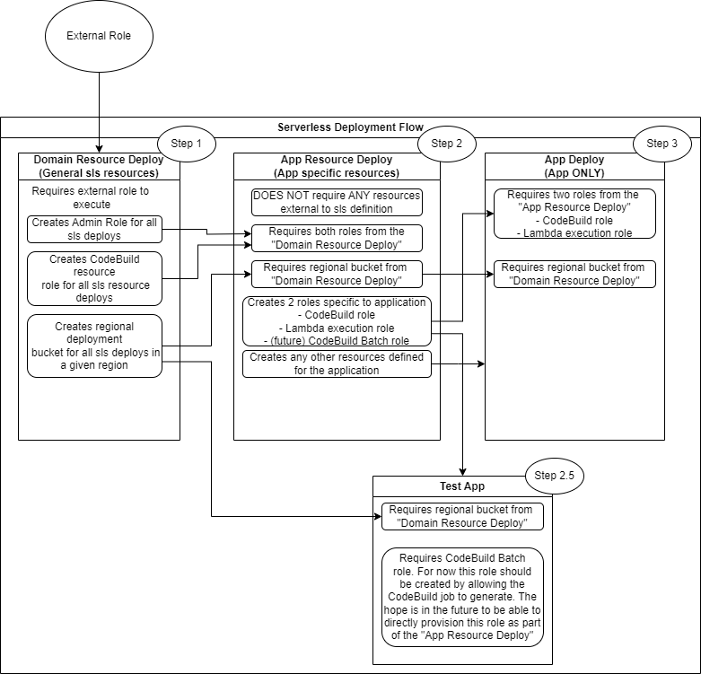

= Serverless Framework
:toc:

https://www.serverless.com[Serverless] is a framework for simplifying deployments. It has the goal of being abstract so that it can be used with
multiple cloud providers and is intended to be simpler than CloudFormation, SAM or Terraform.

== Why Serverless?

As in the quick description, Serverless attempts to be the simplest most flexible way to execute deployments. It is
platform agnostic and much simpler than its counterpart of Terraform.

== Process Flow

Serverless works in conjunction with the CI / CD system (in our current case AWS CodeBuild / CodePipeline) to assemble
the infrastructure needs of the application at deploy time.

* CI (CodeBuild) - Individual steps of the build process that can be triggered manually
These steps are used to execute tests, build, deployment, and removal of artifacts
* CD (CodeBuild / CodePipeline) - chaining together of the individual steps to make a completely automated build and deploy

[NOTE]
By default serverless works from a single `serverless.yml` file to execute all this, many times this is not sufficient due to resource needs.

== Deployment Flow

. The Serverless deployment flow has 3 distinct primary phases.
Deploy domain (global) resources for all Serverless (sls) deployments.
.. includes IAM roles
.. includes S3 bucket(s)
. Deploy app resources (infrastructure requirements that are specific to the application itself)
.. includes additional IAM roles
.. may include db tables
.. other resources ect ...
. Deploy the app itself
.. This is just the application artifact and related components

[NOTE]
For more details on Step 2.5 particularly the service role creation please see Batch Role Issue

.Deployment Flow

link:../images-original/ServerlessDeployFlow.drawio[ServerlessDeployFlow.drawio]

== Per Environment Values

In order to configure unique values on a per-environment basis please review link:sls-profiles-properties-env-vars.adoc[here].

== How to reference ARN

* https://www.serverless.com/framework/docs/providers/aws/guide/iam
* https://stackoverflow.com/questions/59096970/how-to-reference-a-resource-arn-in-a-cloudformation-policy-document-yaml

=== Best Practices

To have the most flexible deploy as possible it is highly suggested to have at least two serverless.yml  as part of the project.

* `serverless.yml`  - handles actually application config and deployment.
This allows all the application changes to be quickly deployed independently of any resource needs. It ensures that normal deploys do not have the opportunity to mess with IAM roles or database tables
* `serverless-resources.yml`  - handles all resource creation (IAM, DB Tables, ect ...)
Ensures that resources can be updated fully independent of the application
Makes sure there is no chance that a standard deploy can mess with IAM or database

== References

* https://piotrnowicki.com/aws/serverless/2019/05/30/aws-dynamodb-table-per-deployment/
* https://www.serverless.com/blog/serverless-framework-compose-multi-service-deployments
* https://repost.aws/knowledge-center/cloudformation-attach-managed-policy
* https://stackoverflow.com/questions/41214544/how-to-attach-a-managed-policy-to-a-lambda-function-in-serverless-framework
* https://serverlessfirst.com/create-iam-deployer-roles-serverless-app/
* https://www.serverless.com/blog/stages-and-environments

