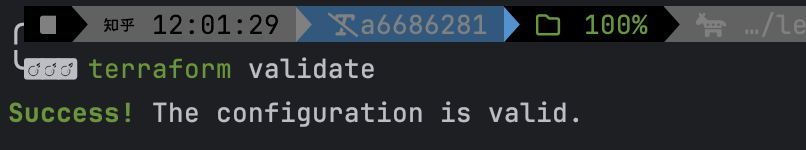
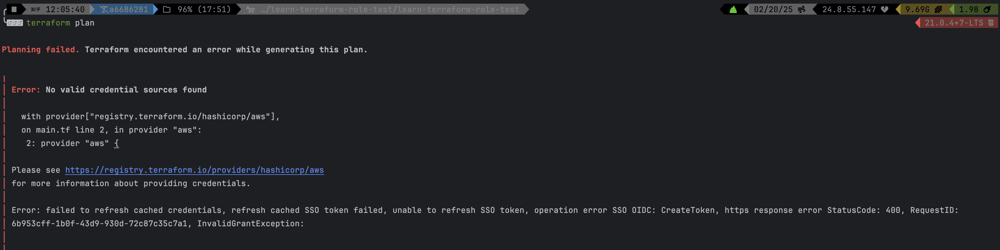
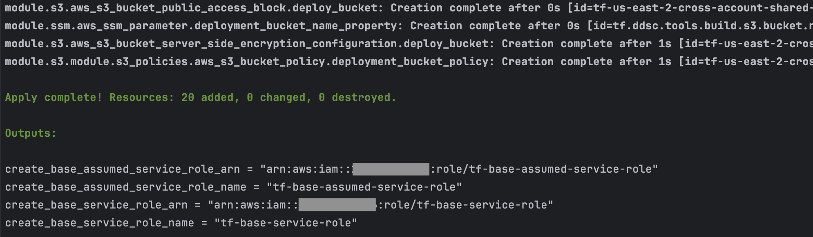
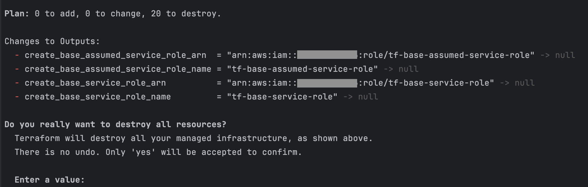

= Terraform
// Not sure how placement will affect publishing to Confluence
:toc: left

The swiss army knife of IaC https://www.terraform.io[Terraform] is by far the most flexible of the IaC languages,
but it also has a much steeper learning curve.

== Get Started

To get started using Terraform start by ensuring it is installed on your local system by following the directions
provided link:../../../../engineering/onboarding/howto-install-terraform.adoc[here].

[#_add_terraform_to_your_project]
== Add Terraform to your project

=== Summary

This is intended to provide short and concise summary of how to add Terraform to your project quickly.

To add Terraform to your project (or stated differently the base terraform configuration), start by creating the
following files in the top level project directory.Adding these files is effectively creating the *Root Module* for the
project.

* `terraform.tf`
* `main.tf`
* `data.tf`
* `variables.tf`
* `outputs.tf`

=== terraform.tf

The `terraform.tf` file is used to tell your project where the infrastructure will be deployed. While the following block
can be included directly in the `main.tf` if desired, for better structuring and cleanliness of code it is better practice
to separate it out into its own file for maintainability.

[NOTE]
https://developer.hashicorp.com/terraform/language/providers/requirements[Official Documentation on Required Providers]

.Click here to expand ...
[%collapsible%open]
====
[source, terraform]
----
# Copyright (c) HashiCorp, Inc.
# SPDX-License-Identifier: MPL-2.0

terraform {

  /* Uncomment this block to use Terraform Cloud for this tutorial
  cloud {
      organization = "organization-name"
      workspaces {
        name = "learn-terraform-variables"
      }
  }
  */
  required_providers {
    aws = {
      source  = "hashicorp/aws"
      version = "~> 5.42.0"
    }
  }
  required_version = "~> 1.2"
}
----
====

=== main.tf

The `main.tf` is exactly what it sounds like; the primary terraform file which is used to execute the terraform code for
a given project. This is also where configuration will be provided for the `required_providers` that were set up in `terraform.tf`
(For further details on provider configuration see the official documentation link in the note).

This is also the location to declare modules for increased functionality (see link:tf-module.adoc[Terraform Modules]).

[NOTE]
https://developer.hashicorp.com/terraform/language/providers/configuration[Official Documentation on Provider Configuration]

.Click here to expand ...
[%collapsible%open]
====
[source, terraform]
----
# Configure provider that is specified in terraform.tf
provider "aws" {
  region = var.aws_region
#   profile = "sandbox"
}

# Import additional functionality by importing modules
module "s3" {
  source = "./modules/s3"
}

# Import additional functionality by importing modules (this module takes a variable)
module "ssm" {
  source = "./modules/ssm"
  deployment_bucket = module.s3.aws_s3_bucket_name # In order to use a value from a previous module the value must be exported in outputs.tf
}
----
====

=== data.tf

.Click here to expand ...
[%collapsible%open]
====
[source, terraform]
----
If terraform resources of type data are required they will be placed here.
----
====

=== variables.tf

This is where to define any variables/parameters that need to be passed in to the project terraform. If the values are
not declared in this file they will not be available to any of the project terraform files.

The following variable is used in the `main.tf` provider block to set the selected providers region.

.Click here to expand ...
[%collapsible%open]
====
[source, terraform]
----
# Variable declarations
variable "aws_region" {
  description = "AWS region"
  type        = string
  default     = "us-east-2"
}
----
====

=== outputs.tf

Similar to how the `variables.tf` file works if feedback (or info about terraform created resources) is required then any
such values must be declared as part of the `outputs.tf`.

.Click here to expand ...
[%collapsible%open]
====
[source, terraform]
----
# To view module outputs they must be re-declared here
output "create_base_assumed_service_role_name" {
  description = "Base role to be assumed name"
  value       = module.base-roles.create_base_assumed_service_role_name
}

output "create_base_assumed_service_role_arn" {
  description = "Base role to be assumed ARN"
  value       = module.base-roles.create_base_assumed_service_role_arn
}

output "create_base_service_role_name" {
  description = "Base service role name"
  value       = module.base-roles.create_base_service_role_name
}

output "create_base_service_role_arn" {
  description = "Base service role ARN"
  value       = module.base-roles.create_base_service_role_arn
}
----
====

== Execution

To initialize a new project with Terraform execute the following command ...

[source, shell]
----
terraform init
----

[TIP]
This will need to be re-run this every time a module is added to the terraform scripts.

Once the project Terraform is initialized all `.tf` scripts should be validated using the following command ...

[source, shell]
----
terraform validate
----

If everything validates successfully you should see the following ...

Pending validation success the next step is to run

[source, shell]
----
terraform plan
----

Terraform plan is a non-destructive local test run (also known as a dry run) that essentially is generating a change-log for the proposed infrastructure
changes. This allows a developer to perform a visual verification of what to expect when the actual execution runs.

*Terraform Plan Result Example*

.Click here to expand ...
[%collapsible]
====
[source, shell]
----
module.base-roles.module.iam_policies.data.aws_iam_policy_document.tf-codebuild-resource-policy: Reading...
module.base-roles.module.iam_policies.data.aws_iam_policy_document.tf-codepipeline-resource-policy: Reading...
data.aws_caller_identity.current: Reading...
module.s3.module.s3_policies.data.aws_caller_identity.current: Reading...
module.base-roles.module.iam_policies.data.aws_caller_identity.current: Reading...
module.base-roles.module.iam_policies.data.aws_iam_policy_document.tf-log-policy: Reading...
module.s3.module.s3_policies.data.aws_region.current: Reading...
module.base-roles.module.iam_policies.data.aws_region.current: Reading...
module.s3.module.s3_policies.data.aws_region.current: Read complete after 0s [id=us-east-2]
module.base-roles.module.iam_policies.data.aws_region.current: Read complete after 0s [id=us-east-2]
module.base-roles.module.iam_policies.data.aws_iam_policy_document.tf-codebuild-resource-policy: Read complete after 0s [id=2706335154]
module.base-roles.module.iam_policies.data.aws_iam_policy_document.tf-codepipeline-resource-policy: Read complete after 0s [id=1451302802]
module.base-roles.module.iam_policies.data.aws_iam_policy_document.tf-log-policy: Read complete after 0s [id=2724258762]
module.s3.data.aws_caller_identity.current: Reading...
module.s3.data.aws_region.current: Reading...
module.s3.data.aws_region.current: Read complete after 0s [id=us-east-2]
module.s3.module.s3_policies.data.aws_caller_identity.current: Read complete after 0s [id=2174XXX67576]
data.aws_caller_identity.current: Read complete after 0s [id=2174XXX67576]
module.base-roles.module.iam_policies.data.aws_caller_identity.current: Read complete after 0s [id=2174XXX67576]
module.base-roles.module.iam_policies.data.aws_iam_policy_document.tf-ssm-policy: Reading...
module.base-roles.module.iam_policies.data.aws_iam_policy_document.tf-resource-iam-policy: Reading...
module.base-roles.module.iam_policies.data.aws_iam_policy_document.tf-resource-iam-policy: Read complete after 0s [id=2156867116]
module.base-roles.module.iam_policies.data.aws_iam_policy_document.tf-ssm-policy: Read complete after 0s [id=1627354339]
module.s3.data.aws_caller_identity.current: Read complete after 0s [id=2174XXX67576]

Terraform used the selected providers to generate the following execution plan. Resource actions are indicated with the following symbols:
  + create
 <= read (data resources)

Terraform will perform the following actions:

  # module.base-roles.aws_iam_role.create_base_assumed_service_role will be created
  + resource "aws_iam_role" "create_base_assumed_service_role" {
      + arn                   = (known after apply)
      + assume_role_policy    = jsonencode(
            {
              + Statement = [
                  + {
                      + Action    = "sts:AssumeRole"
                      + Effect    = "Allow"
                      + Principal = {
                          + AWS = "arn:aws:iam::2174XXX67576:root"
                        }
                    },
                ]
              + Version   = "2012-10-17"
            }
        )
      + create_date           = (known after apply)
      + description           = "This is the base role that will be assumed"
      + force_detach_policies = false
      + id                    = (known after apply)
      + managed_policy_arns   = (known after apply)
      + max_session_duration  = 3600
      + name                  = "tf-base-assumed-service-role"
      + name_prefix           = (known after apply)
      + path                  = "/"
      + tags_all              = (known after apply)
      + unique_id             = (known after apply)

      + inline_policy (known after apply)
    }

  # module.base-roles.aws_iam_role.create_base_service_role will be created
  + resource "aws_iam_role" "create_base_service_role" {
      + arn                   = (known after apply)
      + assume_role_policy    = jsonencode(
            {
              + Statement = [
                  + {
                      + Action    = "sts:AssumeRole"
                      + Effect    = "Allow"
                      + Principal = {
                          + Service = [
                              + "codepipeline.amazonaws.com",
                              + "codebuild.amazonaws.com",
                              + "cloudformation.amazonaws.com",
                            ]
                        }
                    },
                ]
              + Version   = "2012-10-17"
            }
        )
      + create_date           = (known after apply)
      + description           = "This is the base role that will be used to deploy resources"
      + force_detach_policies = false
      + id                    = (known after apply)
      + managed_policy_arns   = (known after apply)
      + max_session_duration  = 3600
      + name                  = "tf-base-service-role"
      + name_prefix           = (known after apply)
      + path                  = "/"
      + tags_all              = (known after apply)
      + unique_id             = (known after apply)

      + inline_policy (known after apply)
    }

  # module.base-roles.aws_iam_role_policy_attachment.attach-policy will be created
  + resource "aws_iam_role_policy_attachment" "attach-policy" {
      + id         = (known after apply)
      + policy_arn = (known after apply)
      + role       = "tf-base-assumed-service-role"
    }

  # module.base-roles.aws_iam_role_policy_attachment.attach_managed_policy will be created
  + resource "aws_iam_role_policy_attachment" "attach_managed_policy" {
      + id         = (known after apply)
      + policy_arn = "arn:aws:iam::aws:policy/PowerUserAccess"
      + role       = "tf-base-assumed-service-role"
    }

  # module.base-roles.aws_iam_role_policy_attachment.attach_tf_assume_role_policy will be created
  + resource "aws_iam_role_policy_attachment" "attach_tf_assume_role_policy" {
      + id         = (known after apply)
      + policy_arn = (known after apply)
      + role       = "tf-base-service-role"
    }

  # module.base-roles.aws_iam_role_policy_attachment.attach_tf_codebuild_resource_policy will be created
  + resource "aws_iam_role_policy_attachment" "attach_tf_codebuild_resource_policy" {
      + id         = (known after apply)
      + policy_arn = (known after apply)
      + role       = "tf-base-service-role"
    }

  # module.base-roles.aws_iam_role_policy_attachment.attach_tf_codepipeline_resource_policy will be created
  + resource "aws_iam_role_policy_attachment" "attach_tf_codepipeline_resource_policy" {
      + id         = (known after apply)
      + policy_arn = (known after apply)
      + role       = "tf-base-service-role"
    }

  # module.base-roles.aws_iam_role_policy_attachment.attach_tf_resource_iam_policy will be created
  + resource "aws_iam_role_policy_attachment" "attach_tf_resource_iam_policy" {
      + id         = (known after apply)
      + policy_arn = (known after apply)
      + role       = "tf-base-service-role"
    }

  # module.base-roles.aws_iam_role_policy_attachment.attach_tf_ssm_policy will be created
  + resource "aws_iam_role_policy_attachment" "attach_tf_ssm_policy" {
      + id         = (known after apply)
      + policy_arn = (known after apply)
      + role       = "tf-base-service-role"
    }

  # module.s3.aws_s3_bucket.deploy_bucket will be created
  + resource "aws_s3_bucket" "deploy_bucket" {
      + acceleration_status         = (known after apply)
      + acl                         = (known after apply)
      + arn                         = (known after apply)
      + bucket                      = "tf-us-east-2-cross-account-shared-services"
      + bucket_domain_name          = (known after apply)
      + bucket_prefix               = (known after apply)
      + bucket_regional_domain_name = (known after apply)
      + force_destroy               = false
      + hosted_zone_id              = (known after apply)
      + id                          = (known after apply)
      + object_lock_enabled         = (known after apply)
      + policy                      = (known after apply)
      + region                      = (known after apply)
      + request_payer               = (known after apply)
      + tags                        = {
          + "Environment" = "Tools"
          + "Name"        = "Test bucket"
        }
      + tags_all                    = {
          + "Environment" = "Tools"
          + "Name"        = "Test bucket"
        }
      + website_domain              = (known after apply)
      + website_endpoint            = (known after apply)

      + cors_rule (known after apply)

      + grant (known after apply)

      + lifecycle_rule (known after apply)

      + logging (known after apply)

      + object_lock_configuration (known after apply)

      + replication_configuration (known after apply)

      + server_side_encryption_configuration (known after apply)

      + versioning (known after apply)

      + website (known after apply)
    }

  # module.s3.aws_s3_bucket_public_access_block.deploy_bucket will be created
  + resource "aws_s3_bucket_public_access_block" "deploy_bucket" {
      + block_public_acls       = true
      + block_public_policy     = true
      + bucket                  = (known after apply)
      + id                      = (known after apply)
      + ignore_public_acls      = true
      + restrict_public_buckets = true
    }

  # module.s3.aws_s3_bucket_server_side_encryption_configuration.deploy_bucket will be created
  + resource "aws_s3_bucket_server_side_encryption_configuration" "deploy_bucket" {
      + bucket = (known after apply)
      + id     = (known after apply)

      + rule {
          + apply_server_side_encryption_by_default {
              + sse_algorithm     = "AES256"
                # (1 unchanged attribute hidden)
            }
        }
    }

  # module.ssm.aws_ssm_parameter.deployment_bucket_name_property will be created
  + resource "aws_ssm_parameter" "deployment_bucket_name_property" {
      + arn            = (known after apply)
      + data_type      = "text"
      + description    = "Deployment bucket created by insert_project_name"
      + id             = (known after apply)
      + insecure_value = (known after apply)
      + key_id         = (known after apply)
      + name           = "tf.brr.tools.build.s3.bucket.name"
      + tags           = {
          + "environment" = "tools"
        }
      + tags_all       = {
          + "environment" = "tools"
        }
      + tier           = (known after apply)
      + type           = "String"
      + value          = (sensitive value)
      + version        = (known after apply)
    }

  # module.ssm.aws_ssm_parameter.deployment_legacy_bucket_name_property will be created
  + resource "aws_ssm_parameter" "deployment_legacy_bucket_name_property" {
      + arn            = (known after apply)
      + data_type      = "text"
      + description    = "Deployment bucket created by deprecated sls-domain-resources-deploy"
      + id             = (known after apply)
      + insecure_value = (known after apply)
      + key_id         = (known after apply)
      + name           = "tf.brr.tools.build.s3.legacy.bucket.name"
      + tags           = {
          + "environment" = "tools"
        }
      + tags_all       = {
          + "environment" = "tools"
        }
      + tier           = (known after apply)
      + type           = "String"
      + value          = (sensitive value)
      + version        = (known after apply)
    }

  # module.base-roles.module.iam_policies.data.aws_iam_policy_document.tf-assume-role-policy will be read during apply
  # (config refers to values not yet known)
 <= data "aws_iam_policy_document" "tf-assume-role-policy" {
      + id   = (known after apply)
      + json = (known after apply)

      + statement {
          + actions   = [
              + "sts:AssumeRole",
            ]
          + effect    = "Allow"
          + resources = [
              + (known after apply),
            ]
        }
    }

  # module.base-roles.module.iam_policies.aws_iam_policy.tf_assume_role_policy will be created
  + resource "aws_iam_policy" "tf_assume_role_policy" {
      + arn         = (known after apply)
      + description = "Custom assume policy for base role"
      + id          = (known after apply)
      + name        = "tf-assume-role-policy"
      + name_prefix = (known after apply)
      + path        = "/"
      + policy      = (known after apply)
      + policy_id   = (known after apply)
      + tags_all    = (known after apply)
    }

  # module.base-roles.module.iam_policies.aws_iam_policy.tf_codebuild_resource_policy will be created
  + resource "aws_iam_policy" "tf_codebuild_resource_policy" {
      + arn         = (known after apply)
      + description = "Custom CodeBuild policy for base role"
      + id          = (known after apply)
      + name        = "tf-codebuild-resource-policy"
      + name_prefix = (known after apply)
      + path        = "/"
      + policy      = jsonencode(
            {
              + Statement = [
                  + {
                      + Action   = [
                          + "codebuild:UpdateProject",
                          + "codebuild:DeleteProject",
                          + "codebuild:CreateProject",
                        ]
                      + Effect   = "Allow"
                      + Resource = "*"
                    },
                ]
              + Version   = "2012-10-17"
            }
        )
      + policy_id   = (known after apply)
      + tags_all    = (known after apply)
    }

  # module.base-roles.module.iam_policies.aws_iam_policy.tf_codepipeline_resource_policy will be created
  + resource "aws_iam_policy" "tf_codepipeline_resource_policy" {
      + arn         = (known after apply)
      + description = "Custom CodePipeline policy for base role"
      + id          = (known after apply)
      + name        = "tf-codepipeline-resource-policy"
      + name_prefix = (known after apply)
      + path        = "/"
      + policy      = jsonencode(
            {
              + Statement = [
                  + {
                      + Action   = [
                          + "codepipeline:UpdatePipeline",
                          + "codepipeline:GetPipelineState",
                          + "codepipeline:GetPipeline",
                          + "codepipeline:DeletePipeline",
                          + "codepipeline:CreatePipeline",
                        ]
                      + Effect   = "Allow"
                      + Resource = "*"
                    },
                ]
              + Version   = "2012-10-17"
            }
        )
      + policy_id   = (known after apply)
      + tags_all    = (known after apply)
    }

  # module.base-roles.module.iam_policies.aws_iam_policy.tf_resource_iam_policy will be created
  + resource "aws_iam_policy" "tf_resource_iam_policy" {
      + arn         = (known after apply)
      + description = "Custom IAM policy for base role"
      + id          = (known after apply)
      + name        = "tf-resource-iam-policy"
      + name_prefix = (known after apply)
      + path        = "/"
      + policy      = jsonencode(
            {
              + Statement = [
                  + {
                      + Action   = [
                          + "iam:PutRolePolicy",
                          + "iam:PassRole",
                          + "iam:GetRole",
                          + "iam:DetachRolePolicy",
                          + "iam:DeleteRolePolicy",
                          + "iam:DeleteRole",
                          + "iam:CreateRole",
                          + "iam:AttachRolePolicy",
                        ]
                      + Effect   = "Allow"
                      + Resource = "arn:aws:iam::2174XXX67576:role/*"
                    },
                ]
              + Version   = "2012-10-17"
            }
        )
      + policy_id   = (known after apply)
      + tags_all    = (known after apply)
    }

  # module.base-roles.module.iam_policies.aws_iam_policy.tf_ssm_policy will be created
  + resource "aws_iam_policy" "tf_ssm_policy" {
      + arn         = (known after apply)
      + description = "Custom SSM policy for base role"
      + id          = (known after apply)
      + name        = "tf-ssm-policy"
      + name_prefix = (known after apply)
      + path        = "/"
      + policy      = jsonencode(
            {
              + Statement = [
                  + {
                      + Action   = [
                          + "ssm:PutParameter",
                          + "ssm:DeleteParameter",
                        ]
                      + Effect   = "Allow"
                      + Resource = "arn:aws:ssm:us-east-2:2174XXX67576:parameter/brr.*"
                    },
                ]
              + Version   = "2012-10-17"
            }
        )
      + policy_id   = (known after apply)
      + tags_all    = (known after apply)
    }

  # module.s3.module.s3_policies.data.aws_iam_policy_document.deployment_bucket_policy will be read during apply
  # (config refers to values not yet known)
 <= data "aws_iam_policy_document" "deployment_bucket_policy" {
      + id   = (known after apply)
      + json = (known after apply)

      + statement {
          + actions   = [
              + "s3:DeleteObject",
              + "s3:Get*",
              + "s3:GetLifecycleConfiguration",
              + "s3:ListBucket",
              + "s3:PutObject",
            ]
          + resources = [
              + (known after apply),
              + (known after apply),
            ]

          + principals {
              + identifiers = [
                  + "arn:aws:iam::XXXXXXXXXX:role/sls-external-service-role",
                  + "arn:aws:iam::XXXXXXXXXX:role/sls-external-service-role",
                ]
              + type        = "AWS"
            }
        }
    }

  # module.s3.module.s3_policies.aws_s3_bucket_policy.deployment_bucket_policy will be created
  + resource "aws_s3_bucket_policy" "deployment_bucket_policy" {
      + bucket = (known after apply)
      + id     = (known after apply)
      + policy = (known after apply)
    }

Plan: 20 to add, 0 to change, 0 to destroy.

Changes to Outputs:
  + create_base_assumed_service_role_arn  = (known after apply)
  + create_base_assumed_service_role_name = "tf-base-assumed-service-role"
  + create_base_service_role_arn          = (known after apply)
  + create_base_service_role_name         = "tf-base-service-role"

────────────────────────────────────────────────────────────────────────────────────────────────────────────────────────────────────────────────────────────────────────────────────────────────────────────

Note: You didn't use the -out option to save this plan, so Terraform can't guarantee to take exactly these actions if you run "terraform apply" now.
----
====

Additionally, you could also run the following variation ...

[source, shell]
----
terraform plan -out=your-plan.tfplan
----

[TIP]
You can view your plan by running `terraform show your-plan.tfplan

This will save the exact planned steps to be executed at a later date. This can be useful to guarantee there is no difference
between the `plan` and `apply` commands. To execute a saved tfplan run the following ...

[source, shell]
----
terraform apply your-plan.tfplan
----

[WARNING]
If you are not logged into your cloud provider `terraform plan` will have an error! 

Finally, if the terraform scripts have passed validation and plan inspection it is now time to actually deploy the project
infrastructure to the provider that was specified in the `main.tf` file. To deploy the project infrastructure execute ...

[source, shell]
----
terraform apply
----

This essentially creates the exact same output as `terraform plan` but with an added confirmation block that accepts a yes or no value.

*Terraform Apply Result Example*

.Click here to expand ...
[%collapsible]
====
[source, shell]
----
╰ terraform apply                                                                                                                                                                        21.0.4+7-LTS 
module.base-roles.module.iam_policies.data.aws_iam_policy_document.tf-log-policy: Reading...
module.base-roles.module.iam_policies.data.aws_caller_identity.current: Reading...
module.s3.data.aws_region.current: Reading...
module.s3.data.aws_caller_identity.current: Reading...
module.base-roles.module.iam_policies.data.aws_iam_policy_document.tf-codebuild-resource-policy: Reading...
module.base-roles.module.iam_policies.data.aws_region.current: Reading...
module.s3.module.s3_policies.data.aws_region.current: Reading...
module.base-roles.module.iam_policies.data.aws_iam_policy_document.tf-codepipeline-resource-policy: Reading...
module.s3.data.aws_region.current: Read complete after 0s [id=us-east-2]
module.s3.module.s3_policies.data.aws_region.current: Read complete after 0s [id=us-east-2]
module.base-roles.module.iam_policies.data.aws_iam_policy_document.tf-codebuild-resource-policy: Read complete after 0s [id=2706335154]
module.base-roles.module.iam_policies.data.aws_iam_policy_document.tf-log-policy: Read complete after 0s [id=2724258762]
module.base-roles.module.iam_policies.data.aws_region.current: Read complete after 0s [id=us-east-2]
module.base-roles.module.iam_policies.data.aws_iam_policy_document.tf-codepipeline-resource-policy: Read complete after 0s [id=1451302802]
module.s3.module.s3_policies.data.aws_caller_identity.current: Reading...
data.aws_caller_identity.current: Reading...
module.s3.data.aws_caller_identity.current: Read complete after 0s [id=accountNumber]
module.base-roles.module.iam_policies.data.aws_caller_identity.current: Read complete after 0s [id=accountNumber]
module.base-roles.module.iam_policies.data.aws_iam_policy_document.tf-resource-iam-policy: Reading...
module.base-roles.module.iam_policies.data.aws_iam_policy_document.tf-ssm-policy: Reading...
module.base-roles.module.iam_policies.data.aws_iam_policy_document.tf-ssm-policy: Read complete after 0s [id=1627354339]
module.base-roles.module.iam_policies.data.aws_iam_policy_document.tf-resource-iam-policy: Read complete after 0s [id=2156867116]
data.aws_caller_identity.current: Read complete after 0s [id=accountNumber]
module.s3.module.s3_policies.data.aws_caller_identity.current: Read complete after 0s [id=accountNumber]

Terraform used the selected providers to generate the following execution plan. Resource actions are indicated with the following symbols:
  + create
 <= read (data resources)

Terraform will perform the following actions:

  # module.base-roles.aws_iam_role.create_base_assumed_service_role will be created
  + resource "aws_iam_role" "create_base_assumed_service_role" {
      + arn                   = (known after apply)
      + assume_role_policy    = jsonencode(
            {
              + Statement = [
                  + {
                      + Action    = "sts:AssumeRole"
                      + Effect    = "Allow"
                      + Principal = {
                          + AWS = "arn:aws:iam::accountNumber:root"
                        }
                    },
                ]
              + Version   = "2012-10-17"
            }
        )
      + create_date           = (known after apply)
      + description           = "This is the base role that will be assumed"
      + force_detach_policies = false
      + id                    = (known after apply)
      + managed_policy_arns   = (known after apply)
      + max_session_duration  = 3600
      + name                  = "tf-base-assumed-service-role"
      + name_prefix           = (known after apply)
      + path                  = "/"
      + tags_all              = (known after apply)
      + unique_id             = (known after apply)

      + inline_policy (known after apply)
    }

  # module.base-roles.aws_iam_role.create_base_service_role will be created
  + resource "aws_iam_role" "create_base_service_role" {
      + arn                   = (known after apply)
      + assume_role_policy    = jsonencode(
            {
              + Statement = [
                  + {
                      + Action    = "sts:AssumeRole"
                      + Effect    = "Allow"
                      + Principal = {
                          + Service = [
                              + "codepipeline.amazonaws.com",
                              + "codebuild.amazonaws.com",
                              + "cloudformation.amazonaws.com",
                            ]
                        }
                    },
                ]
              + Version   = "2012-10-17"
            }
        )
      + create_date           = (known after apply)
      + description           = "This is the base role that will be used to deploy resources"
      + force_detach_policies = false
      + id                    = (known after apply)
      + managed_policy_arns   = (known after apply)
      + max_session_duration  = 3600
      + name                  = "tf-base-service-role"
      + name_prefix           = (known after apply)
      + path                  = "/"
      + tags_all              = (known after apply)
      + unique_id             = (known after apply)

      + inline_policy (known after apply)
    }

  # module.base-roles.aws_iam_role_policy_attachment.attach-policy will be created
  + resource "aws_iam_role_policy_attachment" "attach-policy" {
      + id         = (known after apply)
      + policy_arn = (known after apply)
      + role       = "tf-base-assumed-service-role"
    }

  # module.base-roles.aws_iam_role_policy_attachment.attach_managed_policy will be created
  + resource "aws_iam_role_policy_attachment" "attach_managed_policy" {
      + id         = (known after apply)
      + policy_arn = "arn:aws:iam::aws:policy/PowerUserAccess"
      + role       = "tf-base-assumed-service-role"
    }

  # module.base-roles.aws_iam_role_policy_attachment.attach_tf_assume_role_policy will be created
  + resource "aws_iam_role_policy_attachment" "attach_tf_assume_role_policy" {
      + id         = (known after apply)
      + policy_arn = (known after apply)
      + role       = "tf-base-service-role"
    }

  # module.base-roles.aws_iam_role_policy_attachment.attach_tf_codebuild_resource_policy will be created
  + resource "aws_iam_role_policy_attachment" "attach_tf_codebuild_resource_policy" {
      + id         = (known after apply)
      + policy_arn = (known after apply)
      + role       = "tf-base-service-role"
    }

  # module.base-roles.aws_iam_role_policy_attachment.attach_tf_codepipeline_resource_policy will be created
  + resource "aws_iam_role_policy_attachment" "attach_tf_codepipeline_resource_policy" {
      + id         = (known after apply)
      + policy_arn = (known after apply)
      + role       = "tf-base-service-role"
    }

  # module.base-roles.aws_iam_role_policy_attachment.attach_tf_resource_iam_policy will be created
  + resource "aws_iam_role_policy_attachment" "attach_tf_resource_iam_policy" {
      + id         = (known after apply)
      + policy_arn = (known after apply)
      + role       = "tf-base-service-role"
    }

  # module.base-roles.aws_iam_role_policy_attachment.attach_tf_ssm_policy will be created
  + resource "aws_iam_role_policy_attachment" "attach_tf_ssm_policy" {
      + id         = (known after apply)
      + policy_arn = (known after apply)
      + role       = "tf-base-service-role"
    }

  # module.s3.aws_s3_bucket.deploy_bucket will be created
  + resource "aws_s3_bucket" "deploy_bucket" {
      + acceleration_status         = (known after apply)
      + acl                         = (known after apply)
      + arn                         = (known after apply)
      + bucket                      = "tf-us-east-2-cross-account-shared-services"
      + bucket_domain_name          = (known after apply)
      + bucket_prefix               = (known after apply)
      + bucket_regional_domain_name = (known after apply)
      + force_destroy               = false
      + hosted_zone_id              = (known after apply)
      + id                          = (known after apply)
      + object_lock_enabled         = (known after apply)
      + policy                      = (known after apply)
      + region                      = (known after apply)
      + request_payer               = (known after apply)
      + tags                        = {
          + "Environment" = "Tools"
          + "Name"        = "Test bucket"
        }
      + tags_all                    = {
          + "Environment" = "Tools"
          + "Name"        = "Test bucket"
        }
      + website_domain              = (known after apply)
      + website_endpoint            = (known after apply)

      + cors_rule (known after apply)

      + grant (known after apply)

      + lifecycle_rule (known after apply)

      + logging (known after apply)

      + object_lock_configuration (known after apply)

      + replication_configuration (known after apply)

      + server_side_encryption_configuration (known after apply)

      + versioning (known after apply)

      + website (known after apply)
    }

  # module.s3.aws_s3_bucket_public_access_block.deploy_bucket will be created
  + resource "aws_s3_bucket_public_access_block" "deploy_bucket" {
      + block_public_acls       = true
      + block_public_policy     = true
      + bucket                  = (known after apply)
      + id                      = (known after apply)
      + ignore_public_acls      = true
      + restrict_public_buckets = true
    }

  # module.s3.aws_s3_bucket_server_side_encryption_configuration.deploy_bucket will be created
  + resource "aws_s3_bucket_server_side_encryption_configuration" "deploy_bucket" {
      + bucket = (known after apply)
      + id     = (known after apply)

      + rule {
          + apply_server_side_encryption_by_default {
              + sse_algorithm     = "AES256"
                # (1 unchanged attribute hidden)
            }
        }
    }

  # module.ssm.aws_ssm_parameter.deployment_bucket_name_property will be created
  + resource "aws_ssm_parameter" "deployment_bucket_name_property" {
      + arn            = (known after apply)
      + data_type      = "text"
      + description    = "Deployment bucket created by insert_project_name"
      + id             = (known after apply)
      + insecure_value = (known after apply)
      + key_id         = (known after apply)
      + name           = "tf.brr.tools.build.s3.bucket.name"
      + tags           = {
          + "environment" = "tools"
        }
      + tags_all       = {
          + "environment" = "tools"
        }
      + tier           = (known after apply)
      + type           = "String"
      + value          = (sensitive value)
      + version        = (known after apply)
    }

  # module.ssm.aws_ssm_parameter.deployment_legacy_bucket_name_property will be created
  + resource "aws_ssm_parameter" "deployment_legacy_bucket_name_property" {
      + arn            = (known after apply)
      + data_type      = "text"
      + description    = "Deployment bucket created by deprecated sls-domain-resources-deploy"
      + id             = (known after apply)
      + insecure_value = (known after apply)
      + key_id         = (known after apply)
      + name           = "tf.brr.tools.build.s3.legacy.bucket.name"
      + tags           = {
          + "environment" = "tools"
        }
      + tags_all       = {
          + "environment" = "tools"
        }
      + tier           = (known after apply)
      + type           = "String"
      + value          = (sensitive value)
      + version        = (known after apply)
    }

  # module.base-roles.module.iam_policies.data.aws_iam_policy_document.tf-assume-role-policy will be read during apply
  # (config refers to values not yet known)
 <= data "aws_iam_policy_document" "tf-assume-role-policy" {
      + id   = (known after apply)
      + json = (known after apply)

      + statement {
          + actions   = [
              + "sts:AssumeRole",
            ]
          + effect    = "Allow"
          + resources = [
              + (known after apply),
            ]
        }
    }

  # module.base-roles.module.iam_policies.aws_iam_policy.tf_assume_role_policy will be created
  + resource "aws_iam_policy" "tf_assume_role_policy" {
      + arn         = (known after apply)
      + description = "Custom assume policy for base role"
      + id          = (known after apply)
      + name        = "tf-assume-role-policy"
      + name_prefix = (known after apply)
      + path        = "/"
      + policy      = (known after apply)
      + policy_id   = (known after apply)
      + tags_all    = (known after apply)
    }

  # module.base-roles.module.iam_policies.aws_iam_policy.tf_codebuild_resource_policy will be created
  + resource "aws_iam_policy" "tf_codebuild_resource_policy" {
      + arn         = (known after apply)
      + description = "Custom CodeBuild policy for base role"
      + id          = (known after apply)
      + name        = "tf-codebuild-resource-policy"
      + name_prefix = (known after apply)
      + path        = "/"
      + policy      = jsonencode(
            {
              + Statement = [
                  + {
                      + Action   = [
                          + "codebuild:UpdateProject",
                          + "codebuild:DeleteProject",
                          + "codebuild:CreateProject",
                        ]
                      + Effect   = "Allow"
                      + Resource = "*"
                    },
                ]
              + Version   = "2012-10-17"
            }
        )
      + policy_id   = (known after apply)
      + tags_all    = (known after apply)
    }

  # module.base-roles.module.iam_policies.aws_iam_policy.tf_codepipeline_resource_policy will be created
  + resource "aws_iam_policy" "tf_codepipeline_resource_policy" {
      + arn         = (known after apply)
      + description = "Custom CodePipeline policy for base role"
      + id          = (known after apply)
      + name        = "tf-codepipeline-resource-policy"
      + name_prefix = (known after apply)
      + path        = "/"
      + policy      = jsonencode(
            {
              + Statement = [
                  + {
                      + Action   = [
                          + "codepipeline:UpdatePipeline",
                          + "codepipeline:GetPipelineState",
                          + "codepipeline:GetPipeline",
                          + "codepipeline:DeletePipeline",
                          + "codepipeline:CreatePipeline",
                        ]
                      + Effect   = "Allow"
                      + Resource = "*"
                    },
                ]
              + Version   = "2012-10-17"
            }
        )
      + policy_id   = (known after apply)
      + tags_all    = (known after apply)
    }

  # module.base-roles.module.iam_policies.aws_iam_policy.tf_resource_iam_policy will be created
  + resource "aws_iam_policy" "tf_resource_iam_policy" {
      + arn         = (known after apply)
      + description = "Custom IAM policy for base role"
      + id          = (known after apply)
      + name        = "tf-resource-iam-policy"
      + name_prefix = (known after apply)
      + path        = "/"
      + policy      = jsonencode(
            {
              + Statement = [
                  + {
                      + Action   = [
                          + "iam:PutRolePolicy",
                          + "iam:PassRole",
                          + "iam:GetRole",
                          + "iam:DetachRolePolicy",
                          + "iam:DeleteRolePolicy",
                          + "iam:DeleteRole",
                          + "iam:CreateRole",
                          + "iam:AttachRolePolicy",
                        ]
                      + Effect   = "Allow"
                      + Resource = "arn:aws:iam::accountNumber:role/*"
                    },
                ]
              + Version   = "2012-10-17"
            }
        )
      + policy_id   = (known after apply)
      + tags_all    = (known after apply)
    }

  # module.base-roles.module.iam_policies.aws_iam_policy.tf_ssm_policy will be created
  + resource "aws_iam_policy" "tf_ssm_policy" {
      + arn         = (known after apply)
      + description = "Custom SSM policy for base role"
      + id          = (known after apply)
      + name        = "tf-ssm-policy"
      + name_prefix = (known after apply)
      + path        = "/"
      + policy      = jsonencode(
            {
              + Statement = [
                  + {
                      + Action   = [
                          + "ssm:PutParameter",
                          + "ssm:DeleteParameter",
                        ]
                      + Effect   = "Allow"
                      + Resource = "arn:aws:ssm:us-east-2:accountNumber:parameter/brr.*"
                    },
                ]
              + Version   = "2012-10-17"
            }
        )
      + policy_id   = (known after apply)
      + tags_all    = (known after apply)
    }

  # module.s3.module.s3_policies.data.aws_iam_policy_document.deployment_bucket_policy will be read during apply
  # (config refers to values not yet known)
 <= data "aws_iam_policy_document" "deployment_bucket_policy" {
      + id   = (known after apply)
      + json = (known after apply)

      + statement {
          + actions   = [
              + "s3:DeleteObject",
              + "s3:Get*",
              + "s3:GetLifecycleConfiguration",
              + "s3:ListBucket",
              + "s3:PutObject",
            ]
          + resources = [
              + (known after apply),
              + (known after apply),
            ]

          + principals {
              + identifiers = [
                  + "arn:aws:iam::XXXXXXXXXX:role/sls-external-service-role",
                  + "arn:aws:iam::XXXXXXXXXX:role/sls-external-service-role",
                ]
              + type        = "AWS"
            }
        }
    }

  # module.s3.module.s3_policies.aws_s3_bucket_policy.deployment_bucket_policy will be created
  + resource "aws_s3_bucket_policy" "deployment_bucket_policy" {
      + bucket = (known after apply)
      + id     = (known after apply)
      + policy = (known after apply)
    }

Plan: 20 to add, 0 to change, 0 to destroy.

Changes to Outputs:
  + create_base_assumed_service_role_arn  = (known after apply)
  + create_base_assumed_service_role_name = "tf-base-assumed-service-role"
  + create_base_service_role_arn          = (known after apply)
  + create_base_service_role_name         = "tf-base-service-role"

Do you want to perform these actions?
  Terraform will perform the actions described above.
  Only 'yes' will be accepted to approve.

  Enter a value: 
----
====

A successful `terraform apply` will have results similar to the following ...

[TIP]
You will only have *Outputs* if you have defined values in the `outputs.tf` file.

Lastly, in the event you want to remove all resources that were created as part of the terraform scripts you can run the following ...

[source, shell]
----
terraform destroy
----

This is essentially `terraform apply` in reverse and creates essentially the same output with a confirmation block

== Additional Tooling

At the end of the day Terraform is still code which means we should be testing it like any other code we write
to prevent errors and bugs. And while
we do have `terraform validate` which helps ensure valid terraform has been written we can do better. In order
to help facilitate this there are a number of additional suggested tools

* https://www.checkov.io[Chechov]
** For details on how to run Chechov tests against Terraform see link:tf-chechov.adoc[here].
* https://terraform-compliance.com[Terraform Compliance]
** For details on how to run Terraform Compliance see link:tf-compliance.adoc[here].

== Logging

While terraform generates log output while running (printed to standard error stream `stderr`) un-like Serverless Framework it does not natively attempt to save that
output after running. Terraform can be configured to output to CloudWatch and the log level can be controlled using the
`TF_LOG` env var with standard log levels `TRACE`, `DEBUG`, `INFO`, `WARN` and `ERROR`.

== Reference

* https://medium.com/contino-engineering/terraform-infrastructure-as-code-testing-best-practice-unit-tests-bdd-end-to-end-scenario-c30d5a6921d
* https://www.terraform-best-practices.com/key-concepts

== Files

// link:../documents/Testing-Terraform-IoC-Unit-tests-BDD-end-to-end scenario-testing-review.pdf[Terraform Testing PDF]