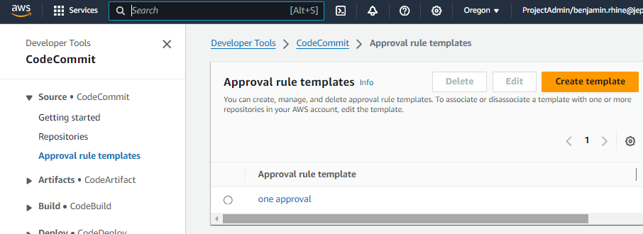
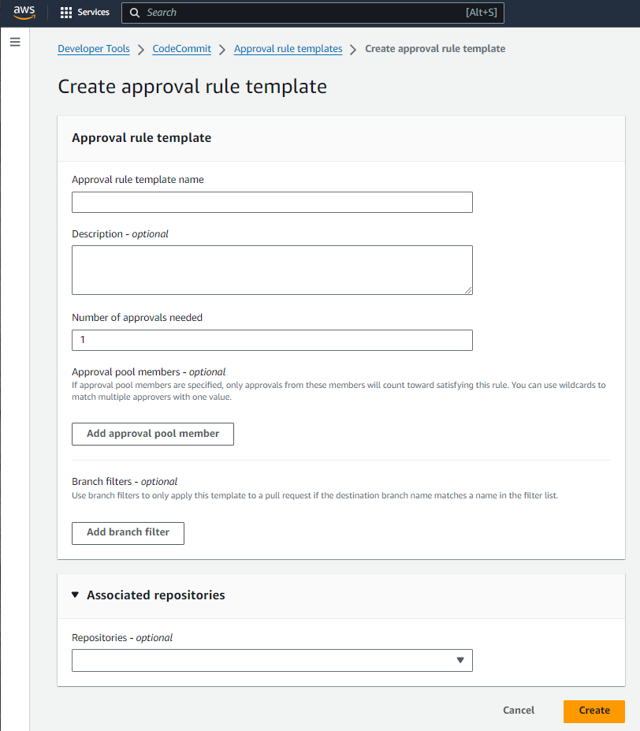
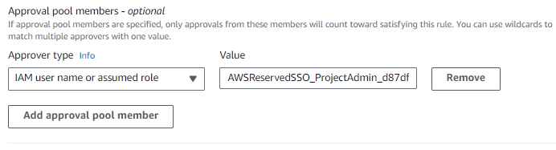
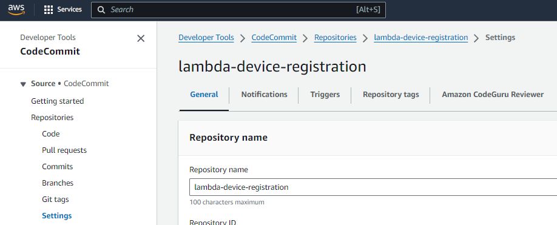
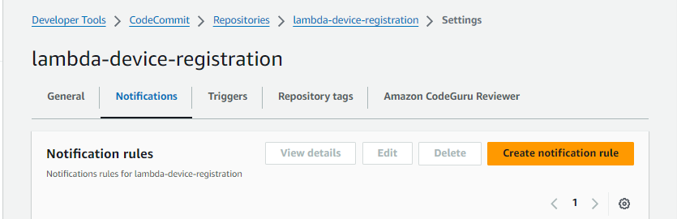
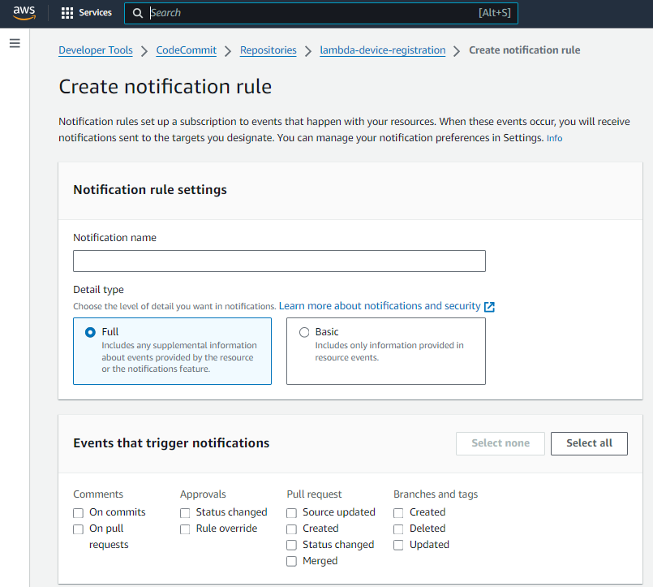
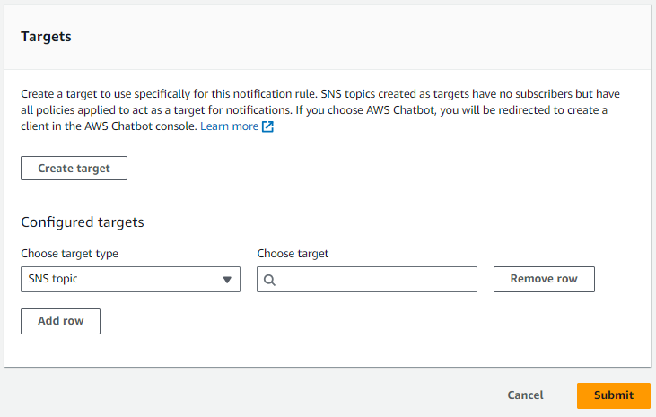

= CodeCommit
// Not sure how placement will affect publishing to Confluence
ifndef::confluence[]
:toc: left
endif::[]
// Renders correctly in AsciiDoc Deployment
ifdef::confluence[]
:toc:
endif::[]

This page is to capture all details related to CodeCommit.

[WARNING]
As of July 2024 CodeCommit has been end of life'ed. While it will still work for existing accounts it is no longer possible
to setup new CodeCommit repositories. In short, do not use CodeCommit moving forward.

== Approval rules template

Using an approval rule template allows you to better control what flows in and out of your version control. While
configuring an approval rule template is not actually hard it is somewhat confusing when coming from other more well
known systems.

=== Creating from console

* Navigate to the CodeCommit
* Select Approval rule templates

* Create template
* Provide a name and description
* The desired number of approvals required
* _We will come back to "Add approval pool members"_
* Select the repositories you want the rule to apply to

* _"Add approval pool members"_
* Since we use federated access we want to supply the role that is provided to our SSO accounts ...
In this case that would look like the following ... `AWSReservedSSO_ProjectAdmin_d87dfsoid903de17/*`
* Make sure the /* is added otherwise the matching will not work correctly

=== Creating with CloudFormation / Serverless

See link:../../../engineering/ops/infrastructure-as-code/examples/aws-cf-sls-codecommit-approval-rules-template.adoc[Create Approval Rules Template with CloudFormation or Serverless Framework]

=== Creating with Terraform

TODO

== Notification Rules

[NOTE]
Pre-requisite: This requires the Aws Slackbot is installed - see link:../../../engineering/how-to/aws-configure-chatbot.adoc[How To: Configure Aws Chatbot]

Notification rules are useful for when you want to send push notifications on events that occur within or on your CodeCommit repositories.

=== Creating from console

* Navigate to the CodeCommit
* Select a repository
* Select settings

* Select notifications
* Create notification rule

* Provide a name
* Leave on full
* Select the events to alert on
* Select either a SNS topic or Chatbot to event to

While the above is simple and easy enough for a one off it is recommended such alerting be done programmatically and
version controlled. See the following section...

=== Creating with CloudFormation / Serverless

See link:../../../engineering/ops/infrastructure-as-code/examples/aws-cf-sls-codecommit-notification-rules.adoc[Create Notification Rules with CloudFormation or Serverless Framework]

=== Creating with Terraform

TODO

== CodeBuild Deployment Jobs

* TODO 1
* TODO 2

The preceding jobs only need to be executed once per repo unless additional events or repositories have been added and an
update is required. These events are idempotent so they can be deployed overtop of pre-existing deployments.

== Reference

* https://dev.to/aws-builders/explore-the-approval-rule-and-notification-rule-in-codecommit-repo-3n9
* https://www.google.com/search?q=how+to+setup+codecommit+rules&rlz=1C1GCEU_enUS1059US1059&oq=how+to+setup+codecommit+rules&gs_lcrp=EgZjaHJvbWUyBggAEEUYOTIHCAEQIRigAdIBCDU4NTBqMGo3qAIAsAIA&sourceid=chrome&ie=UTF-8
* https://codestax.medium.com/aws-codecommit-pull-request-creation-and-approval-b7b6766d8da0
* https://fig.io/manual/aws/codecommit/create-approval-rule-template
* https://docs.aws.amazon.com/codecommit/latest/userguide/how-to-create-pull-request-approval-rule.html
* https://docs.aws.amazon.com/codecommit/latest/userguide/how-to-create-template.html

=== Commit Rules

* https://docs.aws.amazon.com/codecommit/latest/userguide/approval-rule-templates.html
* https://aws.amazon.com/blogs/devops/refining-access-to-branches-in-aws-codecommit/
* https://www.google.com/search?q=+codecommit+access+restrictions+medium&sca_esv=5bdde8b43c3acd18&rlz=1C1GCEU_enUS1059US1059&sxsrf=ACQVn0_3qamAu9Z2lCRqdsVRNxFovINPUw%3A1708971166216&ei=ntTcZanlDLjF0PEPieC2qAM&ved=0ahUKEwiprKzazcmEAxW4IjQIHQmwDTUQ4dUDCBA&uact=5&oq=+codecommit+access+restrictions+medium&gs_lp=Egxnd3Mtd2l6LXNlcnAiJiBjb2RlY29tbWl0IGFjY2VzcyByZXN0cmljdGlvbnMgbWVkaXVtMgoQIRgKGKABGMMEMgoQIRgKGKABGMMESMApUABYsyhwAHgAkAEAmAHtAaABlh6qAQYwLjE5LjK4AQPIAQD4AQGYAgigAtALwgIGEAAYBxgewgILEAAYgAQYigUYhgPCAgYQABgFGB7CAggQABgIGAcYHsICCBAhGKABGMMEmAMAkgcFMC43LjE&sclient=gws-wiz-serp
* https://sarvar04.medium.com/regulate-amazon-codecommit-branches-branching-permissions-8c1f1e0771ba
* https://www.google.com/search?q=set+org.apache.logging.log4j.Logger+set+level&rlz=1C1GCEU_enUS1059US1059&oq=set+org.apache.logging.log4j.Logger+set+level&gs_lcrp=EgZjaHJvbWUyBggAEEUYOTIICAEQABgWGB4yDQgCEAAYhgMYgAQYigUyDQgDEAAYhgMYgAQYigXSAQg3NTA0ajBqN6gCALACAA&sourceid=chrome&ie=UTF-8
* https://stackoverflow.com/questions/70769775/add-sso-administratoraccess-user-to-codecommit-approval-rule-templates
* https://docs.aws.amazon.com/codecommit/latest/userguide/how-to-create-pull-request-approval-rule.html
* https://docs.aws.amazon.com/codecommit/latest/userguide/how-to-create-template.html
* https://dev.to/aws-builders/explore-the-approval-rule-and-notification-rule-in-codecommit-repo-3n9
* https://stackoverflow.com/questions/63511383/unrecognized-resource-types
* https://repost.aws/questions/QUt8FojiVbTsKtCzEtEMlUrA/template-format-error-unrecognized-resource-types-aws-ses-template-bug-or-expected-behaviour
* https://gargeebhatnagar.medium.com/explore-the-approval-rule-and-notification-rule-in-codecommit-repo-f1b4a15ea7df
