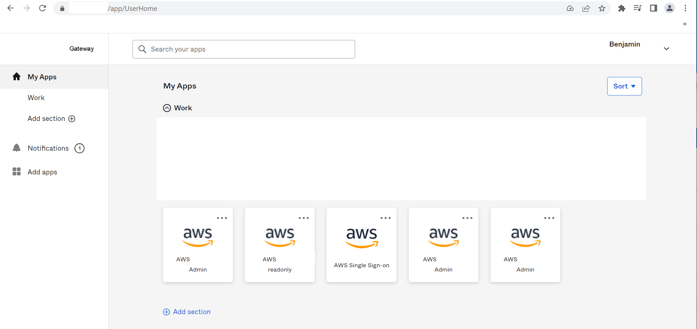
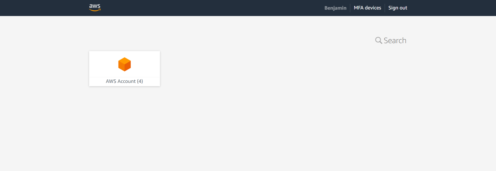
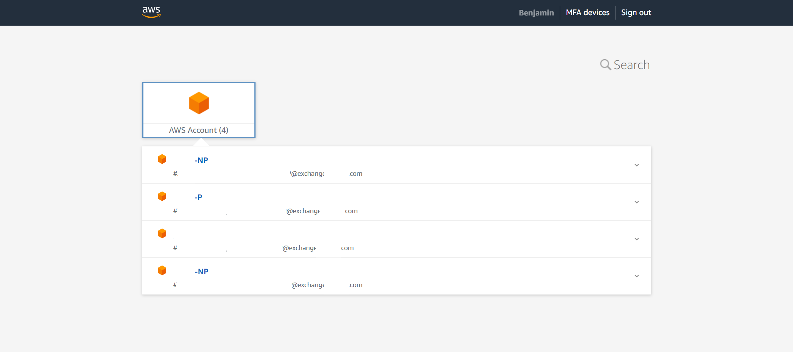
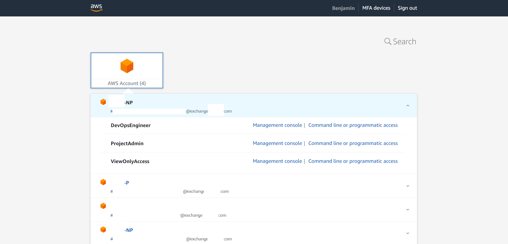
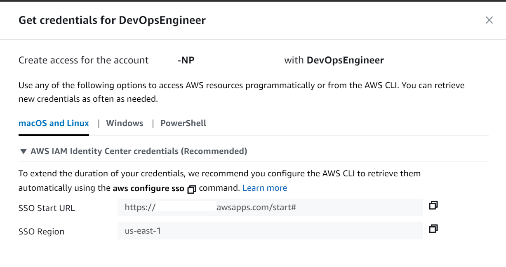
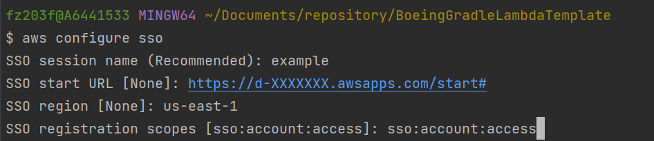
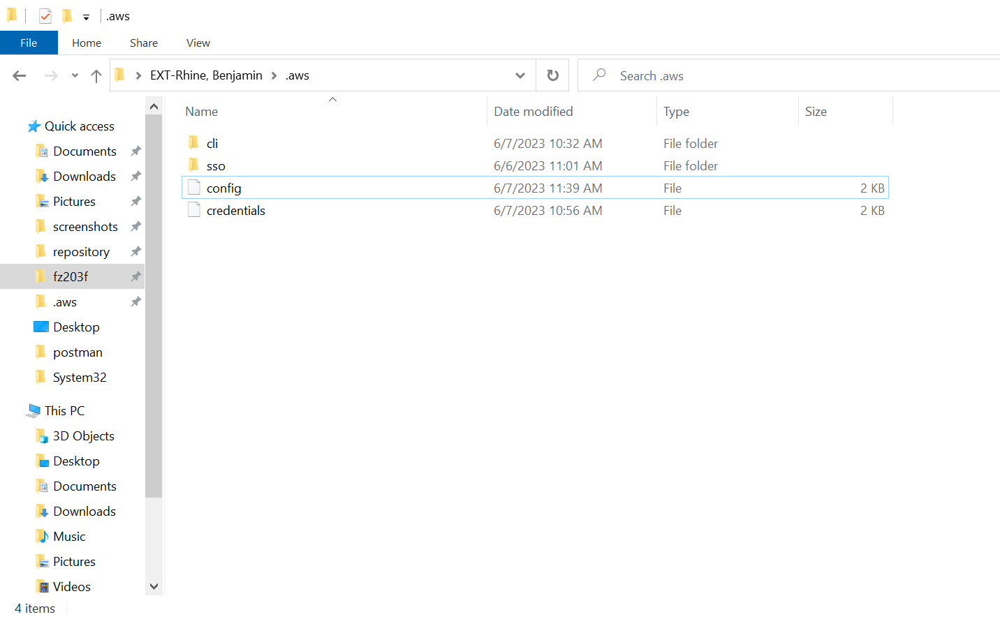

= Setup: CLI
// Not sure how placement will affect publishing to Confluence
ifndef::confluence[]
:toc: left
endif::[]
// Renders correctly in AsciiDoc Deployment
ifdef::confluence[]
:toc:
endif::[]

This page is to describe how to install the AWS Cli and configuration process.
See https://docs.aws.amazon.com/cli/latest/userguide/getting-started-install.html[here] for Aws reference documentation.

== Install

This assumes all other setup steps from the onboarding process have been completed at this point. If you are unsure if
you have completed all those steps please review link:../../../engineering/onboarding-start-here.adoc[Start Here: Onboarding].

=== MacOS

----
brew install awscli
----

=== Linux
* Follow directions https://docs.aws.amazon.com/cli/latest/userguide/getting-started-install.html[here]

=== Windows
* Visit Aws documentation https://docs.aws.amazon.com/cli/latest/userguide/getting-started-install.html[here] and download the AWSCLIV2.msi
* Double click downloaded AWSCLIV2.msi to install, follow the instructions

[CAUTION]
It is very important to install the v2 version

== Configuration / SSO Setup

* Once the AWS Cli has been installed it needs to be configured in order to successfully connect to the account. This configuration should be the same regardless of which OS you are attempting to set this up on.

* First see what AWS Accounts you have access to through Okta

* Next Open Single Sign-On to verify you are configured correctly

* Expand the Aws Accounts

* Expand the specific Aws Account you need access to and select a role

* Click on Command line or programmatic access

* Once that loads you will see something similar to as follows

* Copy the SSO Start URL
* Open the terminal
* Execute - aws configure sso
* Enter a session name
* Paste the copied SSO Start URL
* Set the region - this will auto suggest several regions
* Set the scopes to the suggested scopes
* See the following example

=== Example Configuration

Below is a larger example configuration for multiple aws accounts. This file can be found in your user home at ".aws/config" (windows specific "C:\Users\YOUR-USER\.aws\config")

.Click here to expand ...
[%collapsible%open]
====
[source, bash]
----
# Set the default region and output format in a single location
[default]
region = us-west-2
output = json
# Set the default sso url, region, and scopes in a single location - note: region may be different
[sso-session default]
sso_start_url = https://XXXXXXXXXX.awsapps.com/start#
sso_region = us-east-1
sso_registration_scopes = sso:account:access
########## Non-Prod ##########
[profile np-r1]
sso_session = default
sso_account_id = XXXXXXXXXX
sso_role_name = Role1
[profile np-r2]
sso_session = default
sso_account_id = XXXXXXXXXX
sso_role_name = Role2
########## Prod ##########
[profile p-r1]
sso_session = default
sso_account_id = XXXXXXXXXX
sso_role_name = Role1
[profile p-r2]
sso_session = default
sso_account_id = XXXXXXXXXX
sso_role_name = Role2
----
====

== How to use Aws CLI

For some example usages of the Aws CLI please see link:../../../../engineering/cloud/infrastructure/aws/aws-cli.adoc[CLI: Usage]

== Legacy Credentialing

Previous Aws CLI credentialing relied on an additional credentials file located at user home `.aws/cerdentials`.
When using the more modern SSO approach described above that puts the credentials under an SSO folder (see example).

Some services have not yet been updated to fully work with the updated Aws CLI SSO model and require the legacy "credentials"
file to be in place. In order to keep everything happy it is possible to create the legacy credentials file for the services
that require it by doing the following ...

[NOTE]
This assumes you have fully completed the link:../../../engineering/onboarding-start-here.adoc[Start Here: Onboarding / Setup].

* Install - `npm install -g aws-sso-creds-helper`
** This will install the aws-sso-creds-helper

=== Modified Login Process

This makes the full SSO login process look like the following ...

[source, shell]
----
aws sso login --profile YOUR-CONFIGURED-PROFILE-NAME
ssocreds -p YOUR-CONFIGURED-PROFILE-NAME
----

This will copy the credentials generated by the sso login and copy them to the legacy "credentials"
file. This will be required every time you re-login to make the credentials available to the non-updated tools.

== Not what you were looking for?

* link:../../../engineering/onboarding/configure-aws-cli-quick-start.adoc[Aws CLI Quickstart]
* link:tooling-aws-cli.adoc[How To: Aws CLI Usage]
