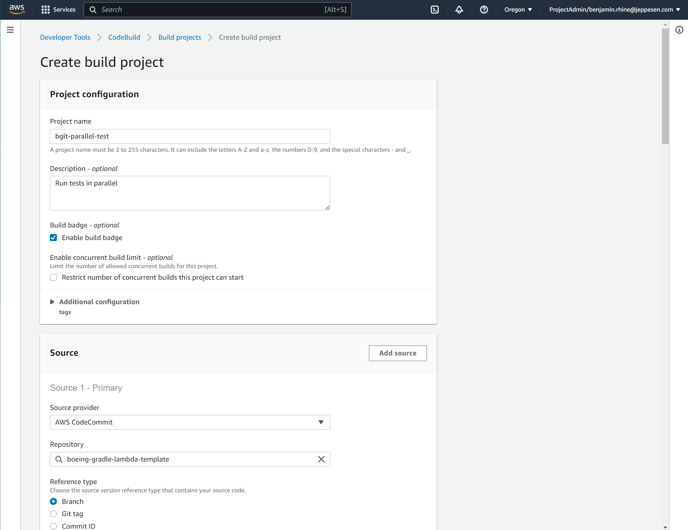
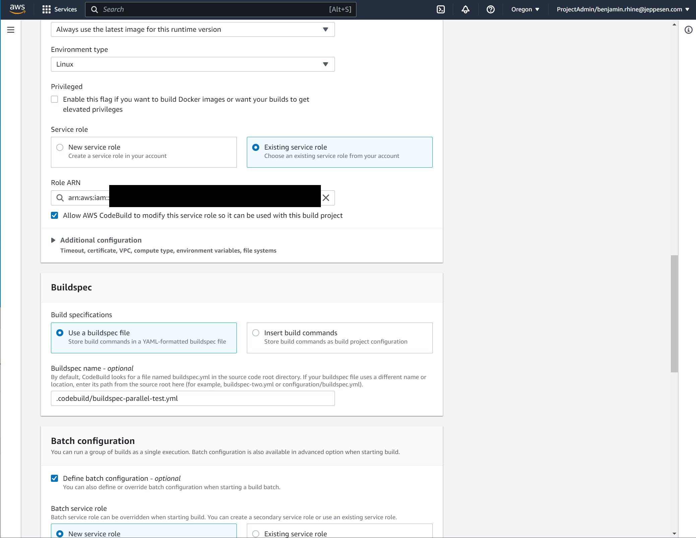
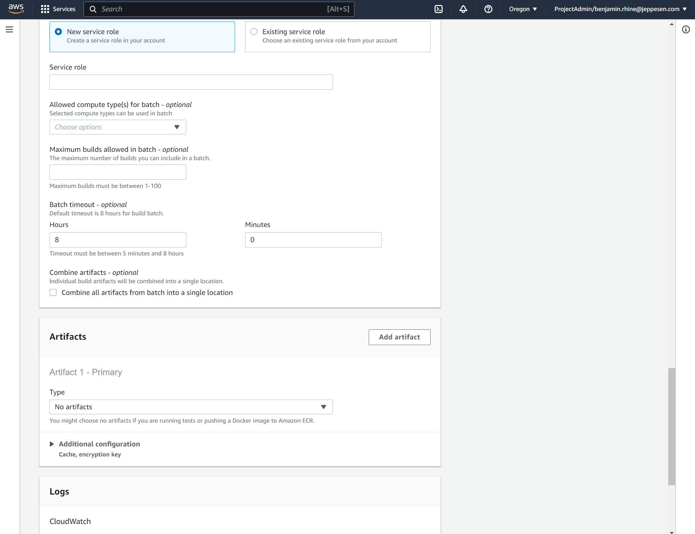
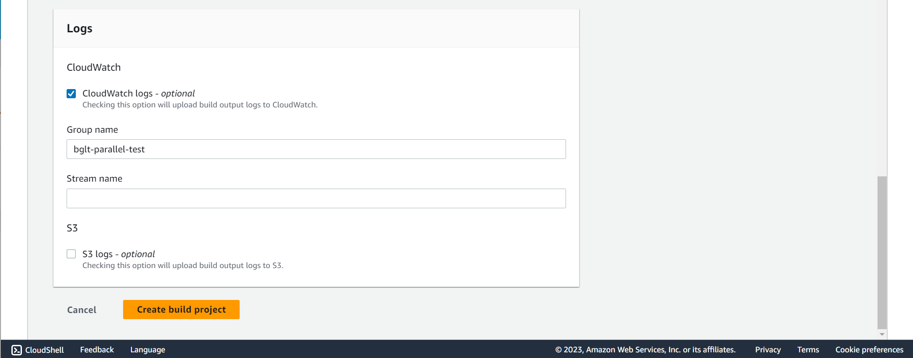
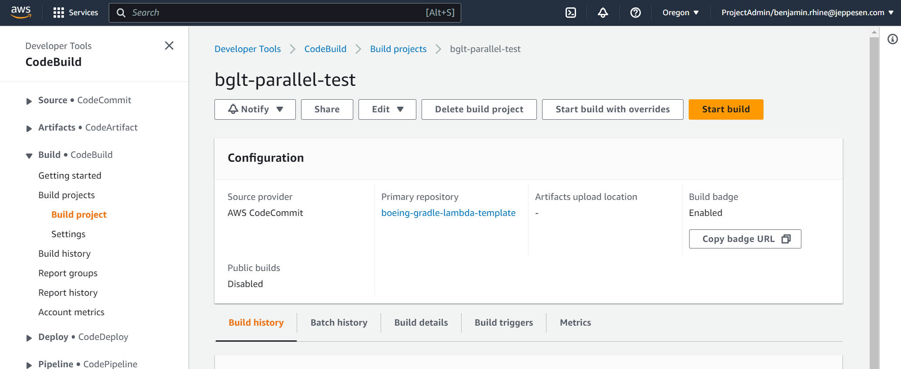
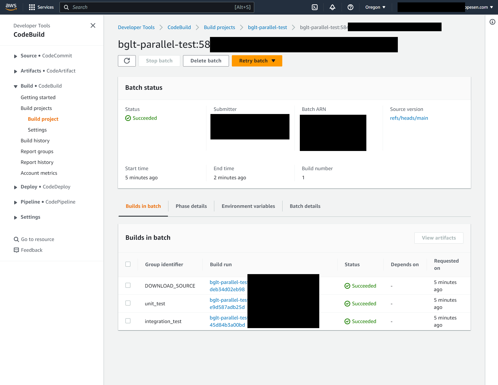
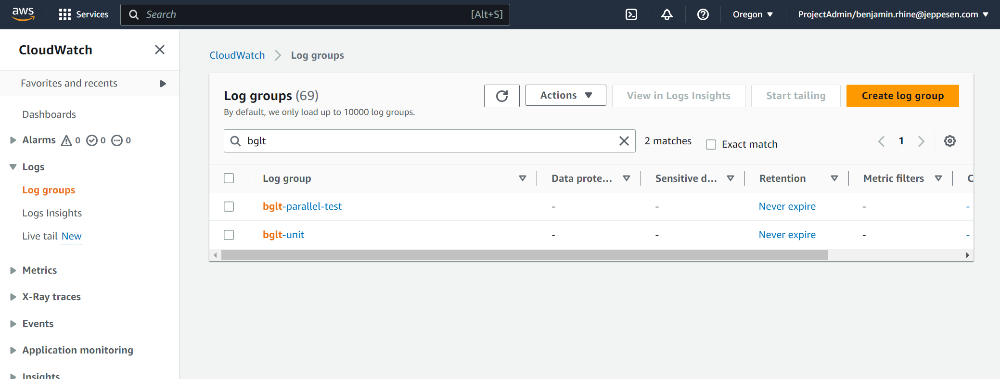

= (Batch) Multiple Builds
// Not sure how placement will affect publishing to Confluence
ifndef::confluence[]
:toc: left
endif::[]
// Renders correctly in AsciiDoc Deployment
ifdef::confluence[]
:toc:

include::{includedir}/version-control-warning.adoc[]
endif::[]

This page is intended to describe how to fully configure parallel code tasks using AWS CodeBuild

== buildspec.yml

To have CI/CD fully configured on a project it is expected that there will be multiple `buildspec.yml`
files, especially if attempting to configure steps that run in parallel. For this reason is is highly suggested to add a
`.codebuild` folder to the project to contain all `buildspec.yml` files (don't worry they are still easy to reference.
To start configure single build `buildspec.yml` for both unit and integration testing.

=== Unit

.Click here to expand ... | buildspec-unit.yml
[%collapsible]
====
[source, yaml]
----
version: 0.2                                                # Specify aws build system version
run-as: root                                                # Specify what user to run the build as

env:                                                        # Environment specific settings
  shell: /bin/bash                                          # Specify what shell to use when executing
  git-credential-helper: yes                                # Specify to remember git credentials (this may not be necessary)

phases:
  #  install:
  # Currently both java 17 and  node come installed in the image
  #    runtime-versions:
  #      java: corretto17
  pre_build:
    commands:
      - echo this is pre-build
      - java --version
  build:
    commands:
      - ./gradlew test
  post_build:
    commands:
      - echo this is post-build
----
====

=== Integration

.Click here to expand ... | buildspec-integration.yml
[%collapsible]
====
[source, yaml]
----
version: 0.2                                                # Specify aws build system version
run-as: root                                                # Specify what user to run the build as

env:                                                        # Environment specific settings
  shell: /bin/bash                                          # Specify what shell to use when executing
  git-credential-helper: yes                                # Specify to remember git credentials (this may not be necessary)

phases:
  #  install:
  # Currently both java 17 and  node come installed in the image
  #    runtime-versions:
  #      java: corretto17
  pre_build:
    commands:
      - echo this is pre-build
      - java --version
  build:
    commands:
      - echo this is where integration tests should run
  post_build:
    commands:
      - echo this is post-build
----
====

=== Parallel Execution

Now tie the two single builds together in a "batch" build

.Click here to expand ... | buildspec-parallel-test.yml
[%collapsible]
====
[source, yaml]
----
version: 0.2                                                # Specify aws build system version
run-as: root                                                # Specify what user to run the build as

env:                                                        # Environment specific settings
  shell: /bin/bash                                          # Specify what shell to use when executing
  git-credential-helper: yes                                # Specify to remember git credentials (this may not be necessary)

batch:          # Configuring the 'batch' block is the only way to achieve parallel execution using the aws build system
  fast-fail: true                                           # Fail as soon as one part of the build fails
  build-list:                                               # A list of all the builds to execute in parallel
    - identifier: unit_test                                 # Identifiers may only contain underscores, NO DASHES!!!
      env:                                                  # Environment variables available to the sub-build?
        variables:
          BUILD_ID: unit-test
      buildspec: .codebuild/buildspec-unit.yml              # Specify sub build instructions
      ignore-failure: false                                 # Stop execution if something fails
    - identifier: integration_test                          # Identifiers may only contain underscores, NO DASHES!!!
      env:                                                  # Environment variables available to the sub-build?
        variables:
          BUILD_ID: integration-test
      buildspec: .codebuild/buildspec-integration.yml       # Specify sub build instructions
      ignore-failure:
----
====

== CodeBuild Configuration

Now, to make everything function as intended. Configure a (Batch) multiple builds do the following

* Navigate to AWS CodeBuild - Build Projects
* click "Create Build Project"
image:images/aws-codebuild-setup-multiple-1.png[]
* Fill in the project name
* Select "Build Badge" if you want
* Fill in "Repository" with the desired repo
* Leave "Reference Type" as "Branch"

* Select the desired branch (ie "main")
* Select OS
* Select Runtime
* Select most recent image

* Allow to create new service role
* Use buildspec
* If `buildspec.yml` is any where other than the root directory of the repository or is named anything other than buildspec.yml specify the "Buildspec name"
* Select "Define batch configuration"
* Allow it to create a new service role

=== Batch Service Role

* Define the service role name
** Suggest the following format sls-appShortName-codebuild-batch-service-role

=== Batch Service Role Issue

[CAUTION]
It would be preferred if this role could be created as part of the "Application Resource Deploy" but for some reason I have not yet been able to get IAM correct for this. Even attempting to copy a generated version of this role fails to run correctly for some reason.

[NOTE]
This should be earmarked for a future build improvement.

* Give CloudWatch a group name so logs for the given build are easy to find.
* Click "Create build project"

* Start / Run Build after configuring

* The result of a successful parallel build, to see the details of the separate steps you need to click into the build then view the "Builds in batch" tab to see the different "steps" that were executed

* How the named log group will show up in CloudWatch after the project has been created and ran

// Renders correctly in IDE
ifndef::deploy[]
include::../../../_includes/tooling-cloud-aws-nwywlf.adoc[]
endif::[]
// Renders correctly in AsciiDoc Deployment
ifdef::deploy[]
include::{includedir}/tooling-cloud-aws-nwywlf.adoc[]
endif::[]

