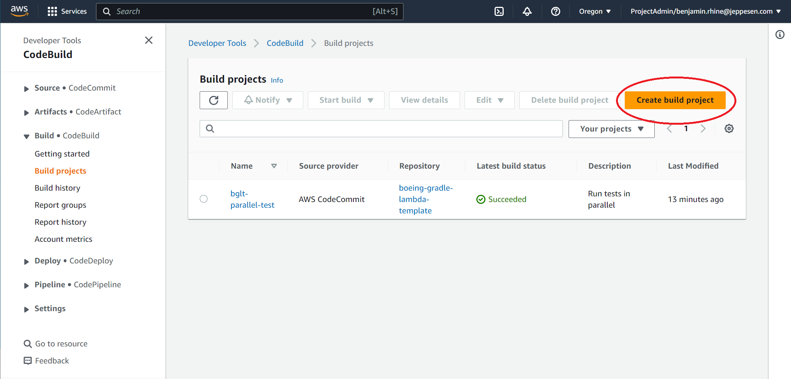
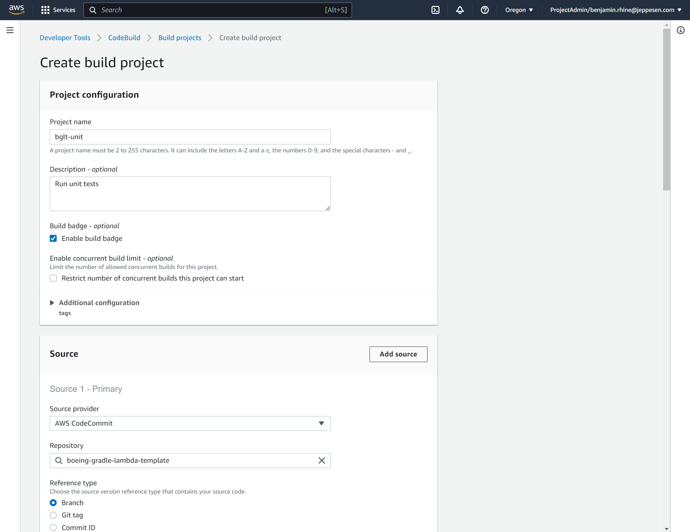
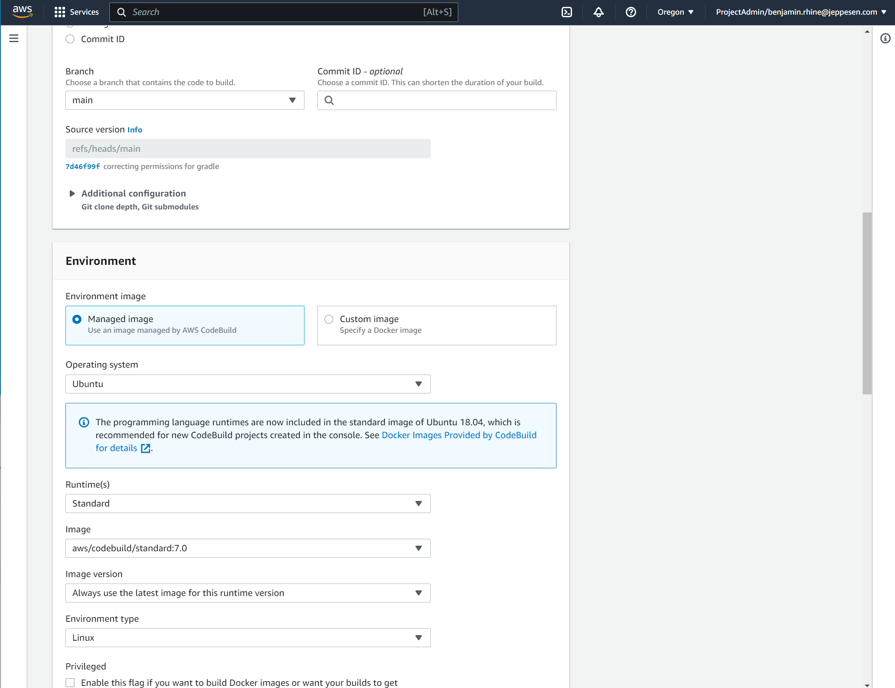
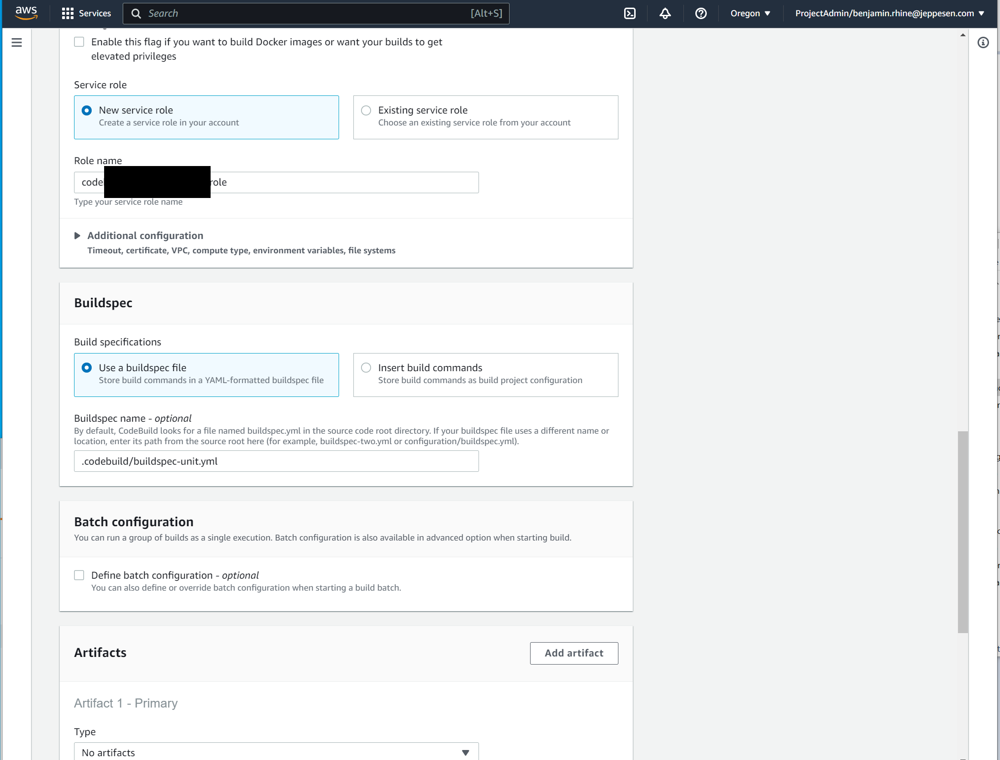
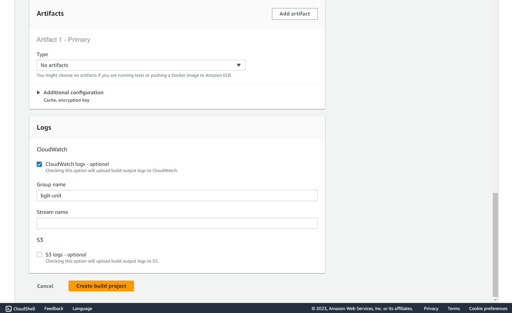
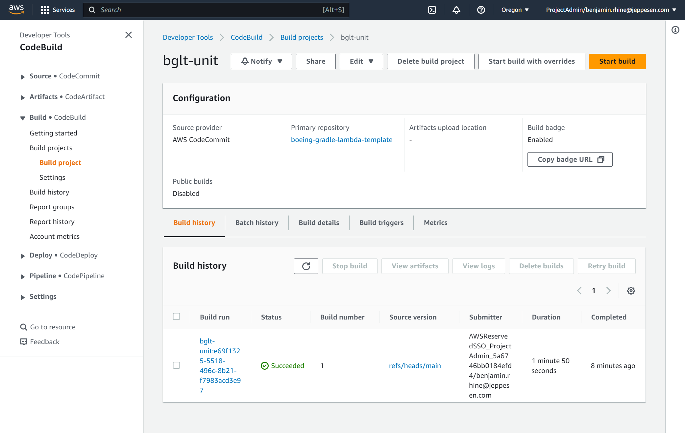

= (Standard) Single Build
// Not sure how placement will affect publishing to Confluence
ifndef::confluence[]
:toc: left
endif::[]
// Renders correctly in AsciiDoc Deployment
ifdef::confluence[]
:toc:
endif::[]

This page is intended to describe how to fully configure single code tasks using AWS CodeBuild

== buildspec.yml

To have CI/CD fully configured on a project it is expected that there will be multiple `buildspec.yml` files. For this
reason is is highly suggested to add a `.codebuild`  folder to the project to contain all `buildspec.yml` files (don't
worry they are still easy to reference. To start configure single build `buildspec.yml` for both unit and integration
testing create the following.

=== Unit

.Click here to expand ... | buildspec-unit.yml
[%collapsible]
====
[source, yaml]
----
version: 0.2                                                # Specify aws build system version
run-as: root                                                # Specify what user to run the build as

env:                                                        # Environment specific settings
  shell: /bin/bash                                          # Specify what shell to use when executing
  git-credential-helper: yes                                # Specify to remember git credentials (this may not be necessary)

phases:
  #  install:
  # Currently both java 17 and  node come installed in the image
  #    runtime-versions:
  #      java: corretto17
  pre_build:
    commands:
      - echo this is pre-build
      - java --version
  build:
    commands:
      - ./gradlew test
  post_build:
    commands:
      - echo this is post-build
----
====

=== Integration

.Click here to expand ... | buildspec-integration.yml
[%collapsible]
====
[source, yaml]
----
version: 0.2                                                # Specify aws build system version
run-as: root                                                # Specify what user to run the build as

env:                                                        # Environment specific settings
  shell: /bin/bash                                          # Specify what shell to use when executing
  git-credential-helper: yes                                # Specify to remember git credentials (this may not be necessary)

phases:
  #  install:
  # Currently both java 17 and  node come installed in the image
  #    runtime-versions:
  #      java: corretto17
  pre_build:
    commands:
      - echo this is pre-build
      - java --version
  build:
    commands:
      - echo this is where integration tests should run
  post_build:
    commands:
      - echo this is post-build
----
====

== CodeBuild Configuration

Now, to make everything function as intended. Configure a (Standard) single build do the following.

* Navigate to AWS CodeBuild - Build Projects
* click "Create Build Project"

* Fill in the project name
* Select "Build Badge" if you want
* Fill in "Repository" with the desired repo
* Leave "Reference Type" as "Branch"

* Select the desired branch (ie "main")
* Select OS
* Select Runtime
* Select most recent image

* Allow to create new service role
* Use buildspec
* If `buildspec.yml` is any where other than the root directory of the repository or is named anything other than buildspec.yml specify the "Buildspec name"

* Give CloudWatch a group name so logs for the given build are easy to find.
* Click "Create build project"

* Start / Run Build after configuring

* How the named log group will show up in CloudWatch after the project has been created and ran

// Renders correctly in IDE
ifndef::deploy[]
include::../../../_includes/tooling-cloud-aws-nwywlf.adoc[]
endif::[]
// Renders correctly in AsciiDoc Deployment
ifdef::deploy[]
include::{includedir}/tooling-cloud-aws-nwywlf.adoc[]
endif::[]

