= Setup: CodePipeline
// Not sure how placement will affect publishing to Confluence
ifndef::confluence[]
:toc: left
endif::[]
// Renders correctly in AsciiDoc Deployment
ifdef::confluence[]
:toc:
endif::[]

== Manual pipeline configuration

* Navigate to CodePipeline
* Click "Create pipeline"
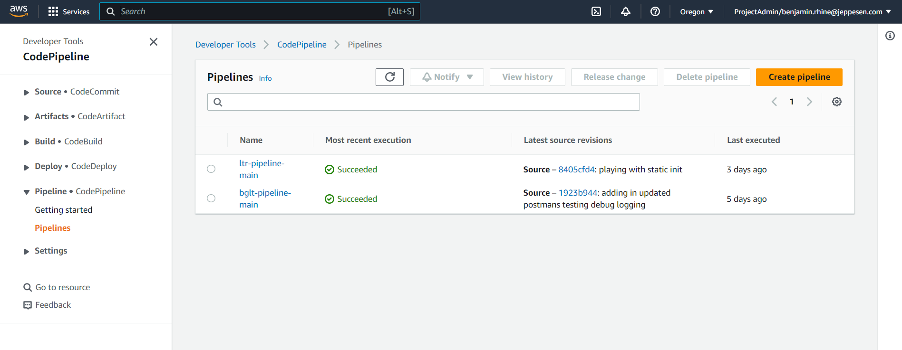
* Provide a pipeline name
** suggest <APP-SHORT-NAME>-pipeline-<BRANCH-NAME>
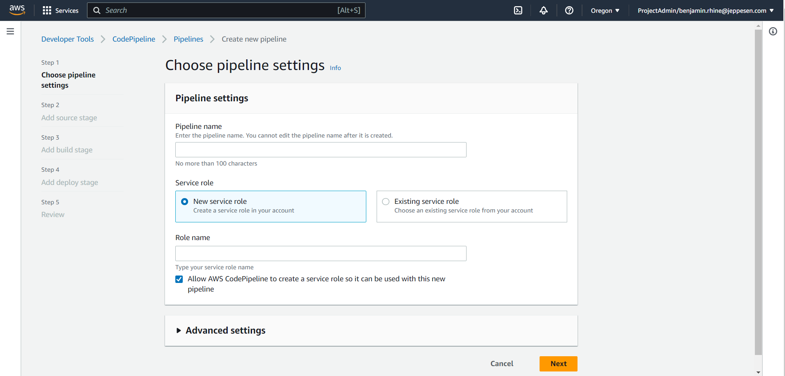
* Choose "Existing service role"
* search for the short application name (in the example case "short") this should have been created by the serverless-resource.yml  deploy and should be the same role that was used to configure other CodeBuild steps.
* Click "next"
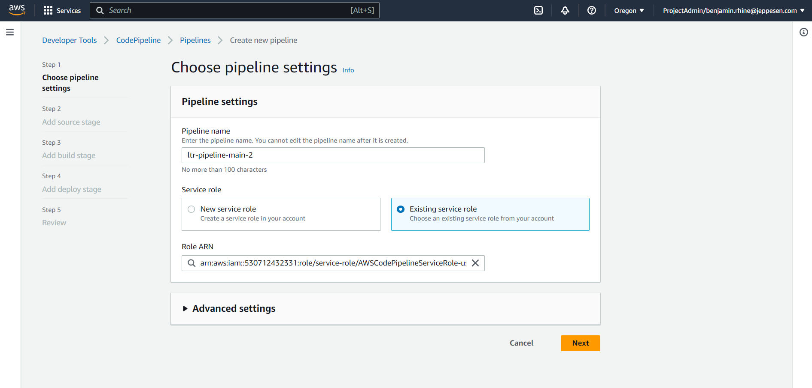
* Select "AWS CodeCommit" for source provider
* Select the project
* Select the branch
* Click "next"
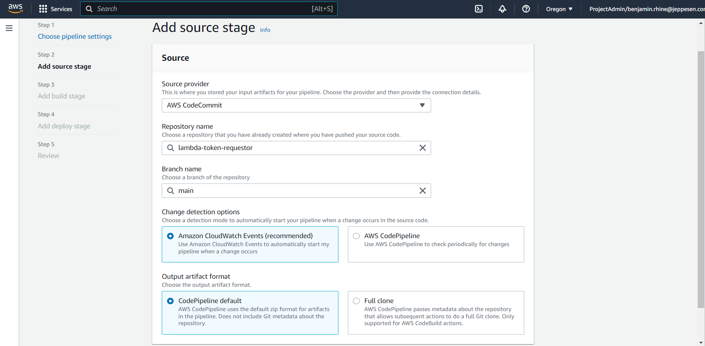
* Select "AWS CodeBuild"
* Select previously configured "build and deploy" CodeBuild step under Project Name
* Click "next"
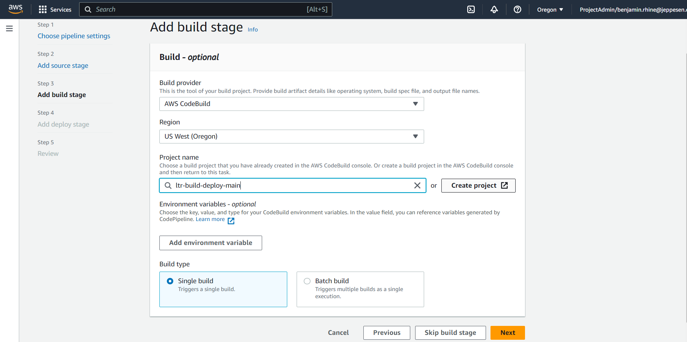
* "Skip deploy stage" (if using serverless framework like we currently are)
* Say yes to skip
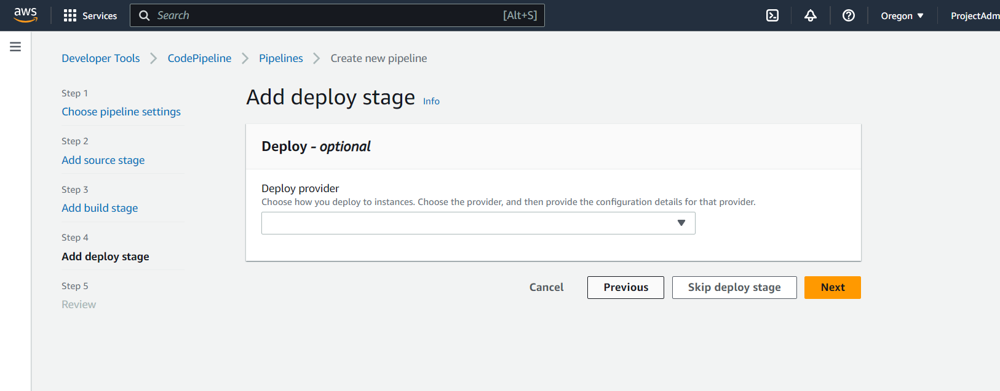
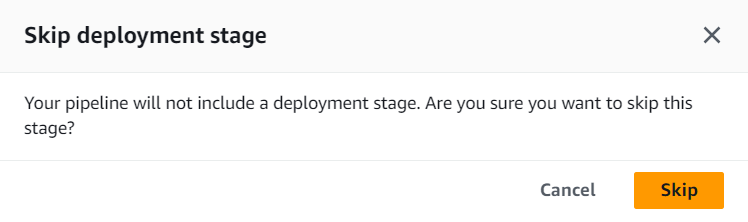
* Review and create
* Hooray!! The pipeline has been created, unfortunately the process is not complete yet as you are unable to add all required steps during the initial wizard configuration.
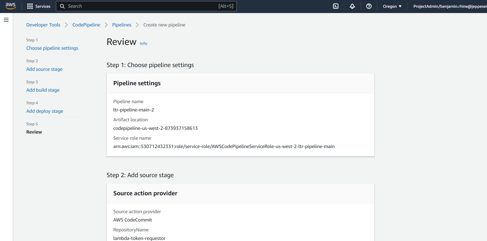
* From the pipeline page select "edit"
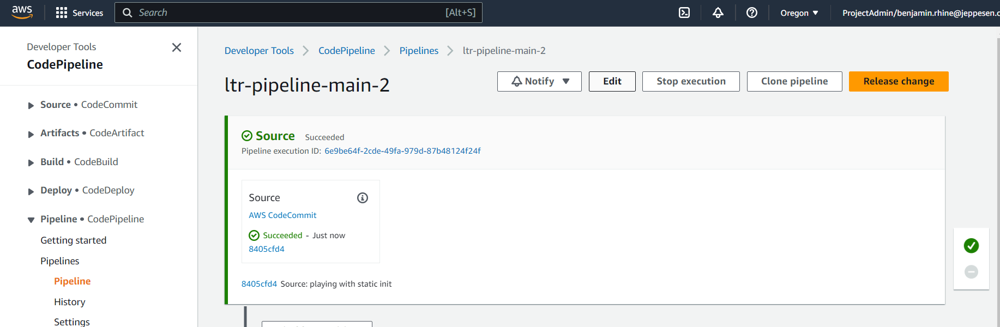
* Add stage
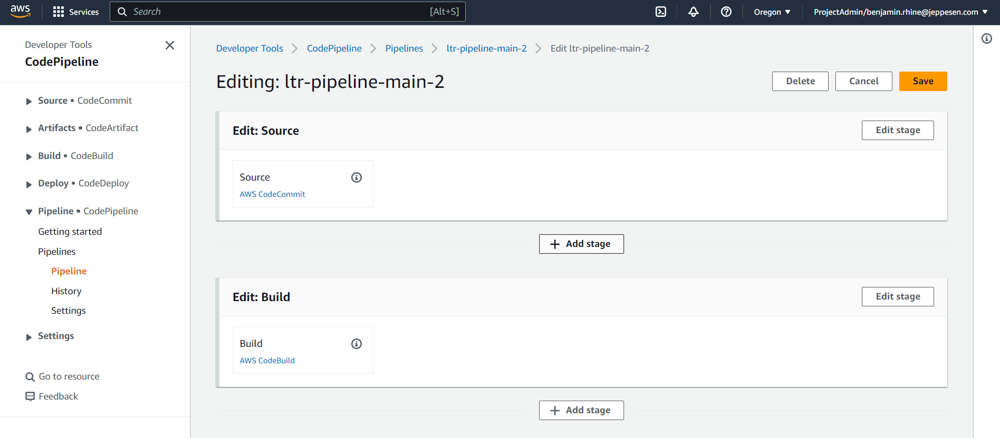
* Add a test stage
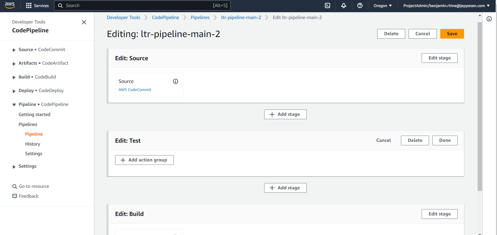
* Give it a name
* Select provider CodeBuild
* Select input artifact SourceArtifact
* Select previously configured CodeBuild step parallel-test
* Select batch build if the previously configured project is a batch build
* Select single build if the previously configured project is a single build
* Click "done"
* Click "done" again
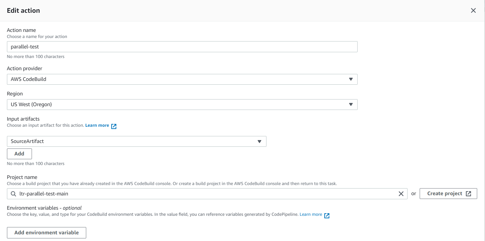

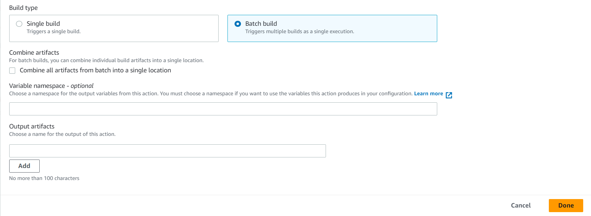

* result
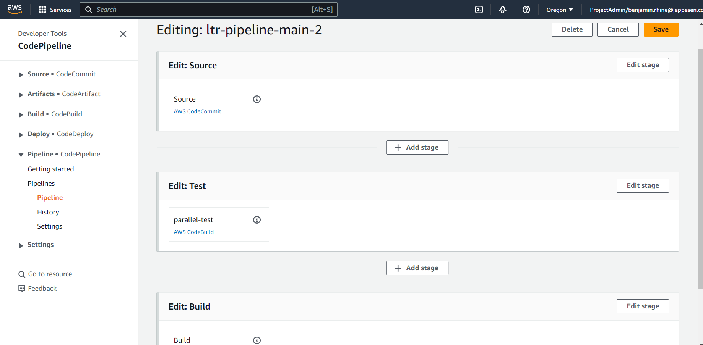
At this point you have configured an automated pipeline, continue adding steps as required or necessary.

== Pipelines under IaC control
It is also possible to configure CodePipelines using IaC to make setup a breeze. Please see the following for how to use
your flavor of IaC to configure your CodePipelines.

* link:../../../engineering/ops/infrastructure-as-code/aws/aws-cf-create-codepipeline.adoc[CloudFormation: (AWS) Create CodePipeline]
* link:../../../engineering/ops/infrastructure-as-code/serverless/sls-aws-create-codepipeline.adoc[Serverless: (AWS) Create CodePipeline]
* link:../../../engineering/ops/infrastructure-as-code/terraform/tf-aws-create-codepipeline.adoc[Terraform: (AWS) Create CodePipeline]
* link:../../../engineering/ops/infrastructure-as-code/comparison/compare-codepipeline.adoc[Compare: CodePipeline]

== Reference

* https://docs.aws.amazon.com/codepipeline/latest/userguide/tutorials-simple-codecommit.html
* https://aws.amazon.com/blogs/devops/complete-ci-cd-with-aws-codecommit-aws-codebuild-aws-codedeploy-and-aws-codepipeline/
* https://aws.amazon.com/blogs/apn/deploying-code-faster-with-serverless-framework-and-aws-service-catalog/
* https://www.google.com/search?q=code+commit+pipeline+medium+java+serverless&rlz=1C1GCEU_enUS1059US1059&ei=XVN2ZNCOOKj0kPIPuJqXyAc&ved=0ahUKEwiQsc-M6J3_AhUoOkQIHTjNBXkQ4dUDCBA&uact=5&oq=code+commit+pipeline+medium+java+serverless&gs_lcp=Cgxnd3Mtd2l6LXNlcnAQAzIHCCEQoAEQCjIHCCEQoAEQCjIHCCEQoAEQCjIHCCEQoAEQCjoKCAAQRxDWBBCwAzoFCCEQqwJKBAhBGABQkhRYuy9g3jVoAXABeACAAdIBiAHXD5IBBTAuNS41mAEAoAEBwAEByAEG&sclient=gws-wiz-serp
* https://osusarak.medium.com/ci-cd-with-aws-codepipeline-d8d0538a52f2
* https://codedexterous.medium.com/set-up-a-ci-cd-pipeline-on-aws-for-java-project-46d1246b56bd
* https://medium.com/nerd-for-tech/continuous-deployment-of-aws-lambda-with-java-runtime-7b6d6188607
* https://liakh-aliaksandr.medium.com/building-ci-cd-pipeline-for-lambda-function-on-aws-using-aws-codepipeline-905eb7bdfdbd
* https://www.google.com/search?q=code+commit+pipeline&rlz=1C1GCEU_enUS1059US1059&oq=code+commit+pipeline&aqs=chrome..69i57j0i22i30j0i390i650l5.3725j0j7&sourceid=chrome&ie=UTF-8
