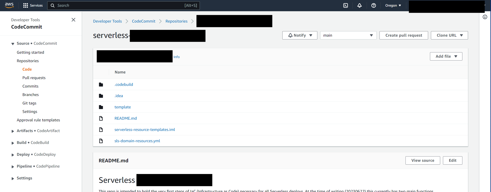
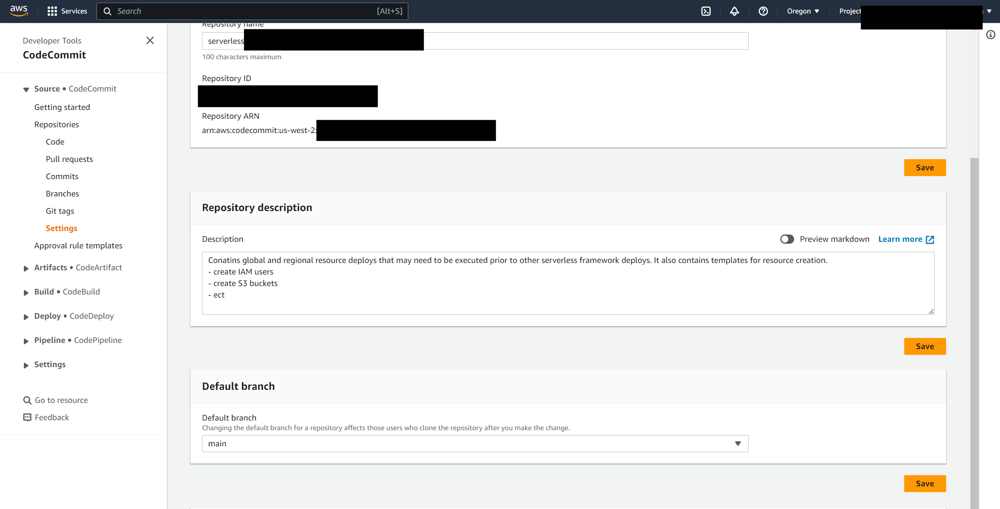
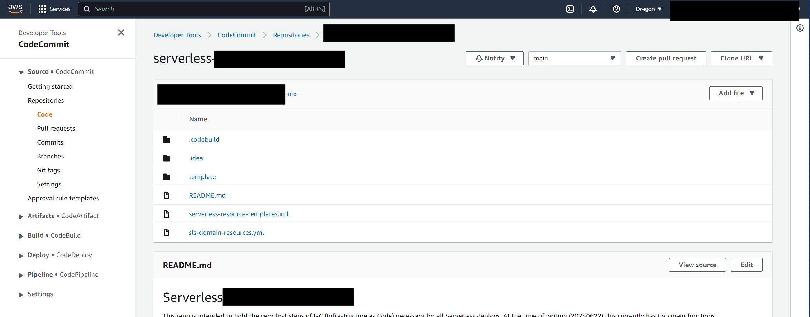

= Git: Main vs Master
// Creates the table of contents - this value could be removed and passed in as an attribute from the build task BUT
// having the :toc: value in the adoc files is required for publishToConfluence to work correctly
// Not sure how placement will affect publishing to Confluence
ifndef::confluence[]
:toc: left
endif::[]
// Renders correctly in AsciiDoc Deployment
ifdef::confluence[]
:toc:
endif::[]

:keywords: engineering, tooling, git, trunk, based, development

// Renders correctly in IDE for testing purposes
// ifndef::confluence[]
// include::../_includes/version-control-warning.adoc[]
// endif::[]
// Renders correctly in AsciiDoc Deployment
ifdef::confluence[]
include::{includedir}/version-control-warning.adoc[]
endif::[]

// Renders correctly in IDE
ifndef::deploy[]
include::../../_includes/generic-information.adoc[]
endif::[]
// Renders correctly in AsciiDoc Deployment
ifdef::deploy[]
include::{includedir}/generic-information.adoc[]
endif::[]

In trying to build a more inclusive environment for all, it is now recommended to use the `main` branch naming convention
over the `master` branch convention. Most open git repositories now use `main` by default. In AWS case they are still
using `master`. In order to update the primary branch from `master` to `main` execute the following ...

* `git branch -m master main`
* run `git status`  to check you are on the correct branch
* `git push -u origin main`
* `git push origin --delete master`

Chances are you will receive the following error as you need to manually change the default branch

[source, shell]
----
To https://github.com/gittower/git-crashcourse.git
! [remote rejected]   master (refusing to delete the current branch: refs/heads/master)
error: failed to push some refs to 'https://example@github.com/gittower/git-crashcourse.git'
----

If you received the above do the following ...

* navigate to your repository
* go to settings
* set the "Default branch" to main and save
* navigate to the repo main and you will now see the branch is set to main

Now re-run `git push origin --delete master` and you should be all set

== If using CodeCommit (deprecated)

Chances are you will receive the following error as you need to manually change the default branch

[source, shell]
----
To https://github.com/gittower/git-crashcourse.git
! [remote rejected]   master (refusing to delete the current branch: refs/heads/master)
error: failed to push some refs to 'https://example@github.com/gittower/git-crashcourse.git'
----

If you received the above do the following ...

* navigate to your repository

* go to settings

* set the "Default branch" to main and save

* navigate to the repo main, and you will now see the branch is set to main

Now re-run `git push origin --delete master` and you should be all set

// Renders correctly in IDE
ifndef::deploy[]
include::../../_includes/eng-level-tooling-not-what-you-were-looking-for.adoc[]
endif::[]
// Renders correctly in AsciiDoc Deployment
ifdef::deploy[]
include::{includedir}/eng-level-tooling-not-what-you-were-looking-for.adoc[]
endif::[]

