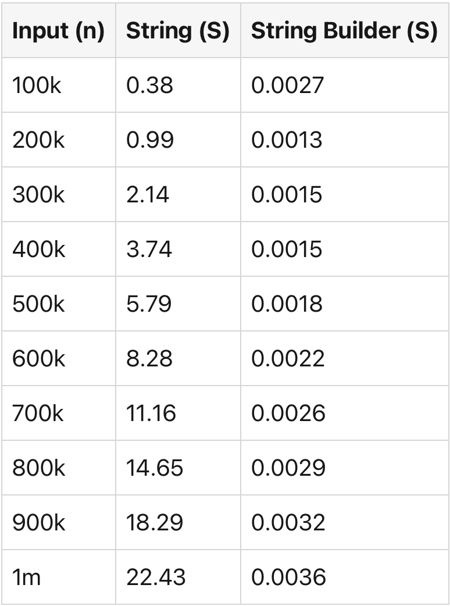
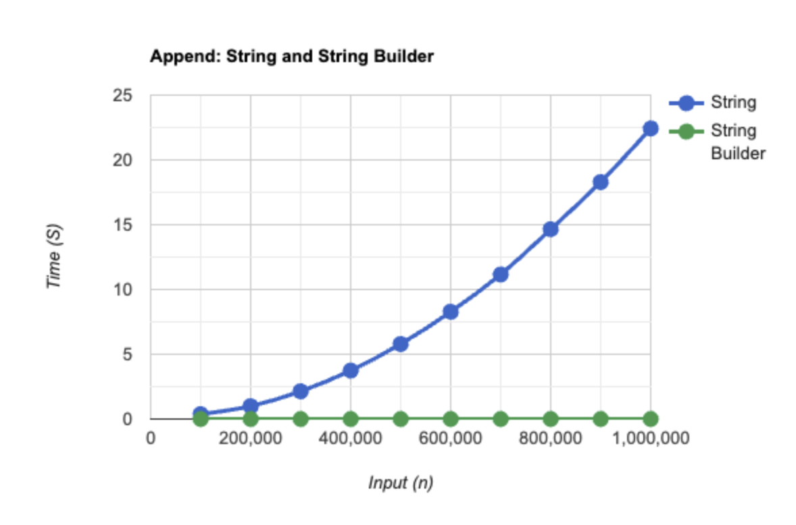

= Java: Faster Strings
// Creates the table of contents - this value could be removed and passed in as an attribute from the build task BUT
// having the :toc: value in the adoc files is required for publishToConfluence to work correctly
// Not sure how placement will affect publishing to Confluence
:toc: left

:keywords: engineering, tooling, java

// Renders correctly in IDE for testing purposes
// ifndef::confluence[]
// include::../_includes/version-control-warning.adoc[]
// endif::[]
// Renders correctly in AsciiDoc Deployment
ifdef::confluence[]
include::{includedir}/version-control-warning.adoc[]
endif::[]

// Renders correctly in IDE
ifndef::deploy[]
include::../../_includes/generic-information.adoc[]
endif::[]
// Renders correctly in AsciiDoc Deployment
ifdef::deploy[]
include::{includedir}/generic-information.adoc[]
endif::[]

This page is to discuss performance benchmarking of String and StringBuilder classes in Java and discuss how to modify
strings efficiently.

Strings in Java are immutable; modifying the String creates a new String object in the heap memory with the latest content,
and the original String is never changed.

== Immutability

[source, java]
----
String str = "You cannot modify ";
str = str + "me";
----

When we append the value "me" to the *str* variable, a new String object gets created with the new value `You cannot modify
me` and gets assigned to *str*. The original string `You cannot modify` does not change.

== Performance

Frequently modifying strings such as using the `+` operator has significant performance issues, every time the `+` append
is used, a new String object gets created and reassigned.

To modify the strings efficiently, we should consider the StringBuilder, which changes the string and does not create
any extra object in the heap memory.

== String Modification

Use the StringBuilder class to modify the string; this does not create a new String object but changes the existing one.

[source, java]
----
StringBuilder str = new StringBuilder("You can modify.");
str.append("me");
----

== Performance Benchmarking

Consider the `concatenation` operation performance benchmark with the String and StringBuilder; consider the following.

* Consider 10 data points
** inputSample = [100k, 200k, 300k, 400k, 500k, 600k, 700k, 800k, 900k, 1m].
** Start with an empty string and concatenate the string "a" n time, where n = inputSample[i] i.e n = 700k.
** We want to know how long it takes to concatenate a string "a" n time for the `inputSample` using String and StringBuilder.

=== String Class

[source, java]
----
public class StringBenchmark {
    public static void main(String[] args) {
        String appendCharacter = "a";

        int inputSample[] = new int[]{
                100000, 200000, 300000, 400000,
                500000, 600000, 700000, 800000,
                900000, 1000000};

        for (int n : inputSample) {
            double startTime = System.nanoTime();
            testStringAppend(n, "", appendCharacter);
            double endTime = System.nanoTime();
            double duration = (endTime - startTime) / 1000000000;
            String seconds = String.format("%.2f", duration);
            System.out.println("n = " + n + ": seconds: " + seconds);
        }
    }

    static void testStringAppend(int n, String str, String appendCharacter) {
        for (int i = 1; i <= n; i++) {
            str += appendCharacter;
        }
    }
}
----

=== String Class Results

[source, shell]
----
n = 100000: seconds: 0.38
n = 200000: seconds: 0.99
n = 300000: seconds: 2.14
n = 400000: seconds: 3.74
n = 500000: seconds: 5.79
n = 600000: seconds: 8.28
n = 700000: seconds: 11.16
n = 800000: seconds: 14.65
n = 900000: seconds: 18.29
n = 1000000: seconds: 22.43
----

=== String Builder Class

[source, java]
----
public class StringBuilderBenchmark {
    public static void main(String[] args) {
        String appendCharacter = "a";

        int inputSample[] = new int[]{
                100000, 200000, 300000, 400000,
                500000, 600000, 700000, 800000,
                900000, 1000000};

        for(int n: inputSample){
            double startTime = System.nanoTime();
            testStringAppend(n, new StringBuilder(""), appendCharacter);
            double endTime = System.nanoTime();
            double duration = (endTime - startTime)/1000000000;
            String seconds = String.format("%.7f", duration);
            System.out.println("n = "+n+": seconds: "+seconds);
        }
    }
    static void testStringAppend(int n, StringBuilder str, String appendCharacter){
        for(int i = 1; i <= n; i++){
            str.append(appendCharacter);
        }
    }
}
----

[source, shell]
----
n = 100000: seconds: 0.0027
n = 200000: seconds: 0.0013
n = 300000: seconds: 0.0015
n = 400000: seconds: 0.0015
n = 500000: seconds: 0.0018
n = 600000: seconds: 0.0022
n = 700000: seconds: 0.0026
n = 800000: seconds: 0.0029
n = 900000: seconds: 0.0032
n = 1000000: seconds: 0.0036
----

== Execution Time: Append

== Conclusion

* StringBuilder executes significantly faster than the String class when performing the concatenation or modification operations.
* Modifying a String creates a new String in the heap memory. To change the content of the String, we should consider the StringBuilder class.
* Any attempt to modify the String class creates a new object in the heap memory, which has significant performance drawbacks.
* StringBuilder is ideal for modifying string content; it does so without creating any extra objects in the memory.

// Renders correctly in IDE
ifndef::deploy[]
include::../../_includes/eng-level-tooling-not-what-you-were-looking-for.adoc[]
endif::[]
// Renders correctly in AsciiDoc Deployment
ifdef::deploy[]
include::{includedir}/ng-level-tooling-not-what-you-were-looking-for.adoc[]
endif::[]

== Reference

* https://dev.to/this-is-learning/performance-benchmarking-string-and-string-builder-3bid