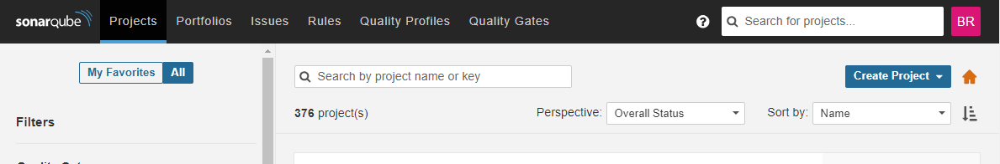
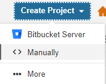
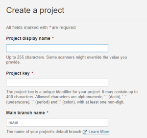

= Sonar
// Creates the table of contents - this value could be removed and passed in as an attribute from the build task BUT
// having the :toc: value in the adoc files is required for publishToConfluence to work correctly
// Not sure how placement will affect publishing to Confluence
:toc: left

:keywords: engineering, tooling, sonar

// Renders correctly in IDE for testing purposes
// ifndef::confluence[]
// include::../_includes/version-control-warning.adoc[]
// endif::[]
// Renders correctly in AsciiDoc Deployment
ifdef::confluence[]
include::{includedir}/version-control-warning.adoc[]
endif::[]

// Renders correctly in IDE
ifndef::deploy[]
include::../../_includes/generic-information.adoc[]
endif::[]
// Renders correctly in AsciiDoc Deployment
ifdef::deploy[]
include::{includedir}/generic-information.adoc[]
endif::[]

Sonar is a static type checking tool that helps identify bugs and other code issues.

[NOTE]
If you do not have sonar access speak to your manager and get a Service Now request submitted for access. Specifically
state that the email needs to go to your work email.

== Configure: Project in sonar

* Login to sonar and click "Create Project"

* For Aws projects select "Manually"

* Provide the following details
** Display name is how it will display in sonar
** Project Key should match the repo name
** The branch to run on

* Configure the sonar token

== Configure: Gradle project for sonar

Configuring a Gradle project for sonar is quite simple

* Add the following Gradle plugin

----
plugins {
    ...
    id "org.sonarqube"
    ...
}
----

* Project name should be assigned "rootProject.name"
* Project Key should match the repository name
* The exclusionList should contain the directories and the files we want to exclude
** Note: src and test exclusions are different keys

[CAUTION]
We exclude all tests from sonar as they are not relevant for this analysis.

[source, groovy]
----
/** --------------------------------------------------------------------------------------------------------------------
 * List of directories and / or files to exclude from COVERAGE metrics. To be explicit, items included in this list will
 * be excluded from Sonar coverage metrics BUT will still be analyzed. To state a different way this is not excluding
 * items in the list from being checked against Sonar standards, it is just excluding them from test coverage metrics.
 * IE. We dont want it saying that our tests need tests.
 * 

 * For a list of available properties that can be configured see the following documentation ...
 * - https://docs.sonarqube.org/latest/analysis/analysis-parameters/
 * Additional Documentation
 * - https://docs.sonarqube.org/latest/analysis/scan/sonarscanner-for-gradle/
 * - https://docs.sonarqube.org/latest/user-guide/quality-gates/
 * - https://docs.sonarqube.org/latest/project-administration/narrowing-the-focus/
 * ./gradlew sonarqube \
 -Dsonar.projectKey=lambda- \
 -Dsonar.host.url=https://SONAR-URL \
 -Dsonar.login=SONAR-TOKEN
 * ------------------------------------------------------------------------------------------------------------------ */
final exclusionList = [
        "src/api/**",
        "src/integration/**",
        "src/test*",
        "src/test/**"
]
sonar {
    properties {
        // Make sure the project name is set correctly for sonar
        property "sonar.projectName", rootProject.name
        property "sonar.projectKey", "lambda-test"
        property "sonar.organization", "Ben Rhine"
        // How to connect to sonar
        property "sonar.host.url", "https://SONAR-URL"
        property "sonar.login", "TOKEN-CREATED-FROM-SONAR-SETUP"
        // Sonar config
        property "sonar.java.coveragePlugin", "jacoco""${rootProject.projectDir}/build/reports/jacoco/unitTestReports"
        property 'sonar.coverage.jacoco.xmlReportPaths', "$projectDir/build/reports/jacoco/unitTestReports/unitTestReports.xml"
        property 'sonar.jacoco.reportPaths', "$projectDir/build/jacoco/*.exec"
        // Exclude classes in the list from coverage metrics
        property "sonar.exclusions", exclusionList
        property "sonar.test.exclusions", exclusionList
        // Quality gate is disabled by default so as not to cause issues with normal builds
        // and is only enabled (through the pipeline) for pull requests.
        property "sonar.qualitygate.wait", false
    }
}
----

== Configure: Maven project for sonar TODO

TODO

// Renders correctly in IDE
ifndef::deploy[]
include::../../_includes/eng-level-tooling-not-what-you-were-looking-for.adoc[]
endif::[]
// Renders correctly in AsciiDoc Deployment
ifdef::deploy[]
include::{includedir}/eng-level-tooling-not-what-you-were-looking-for.adoc[]
endif::[]

