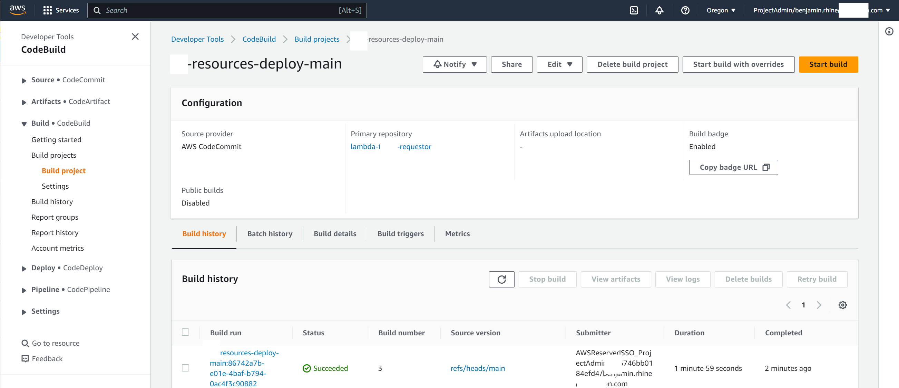
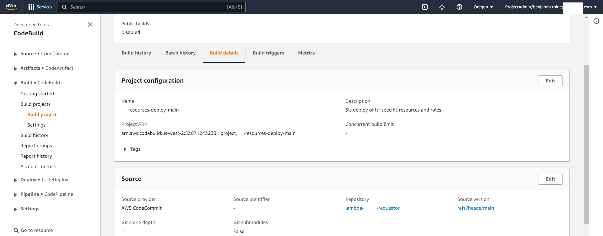
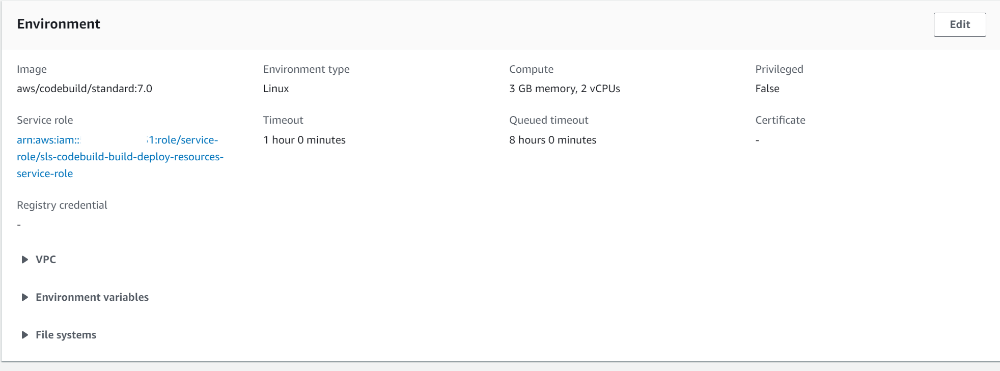
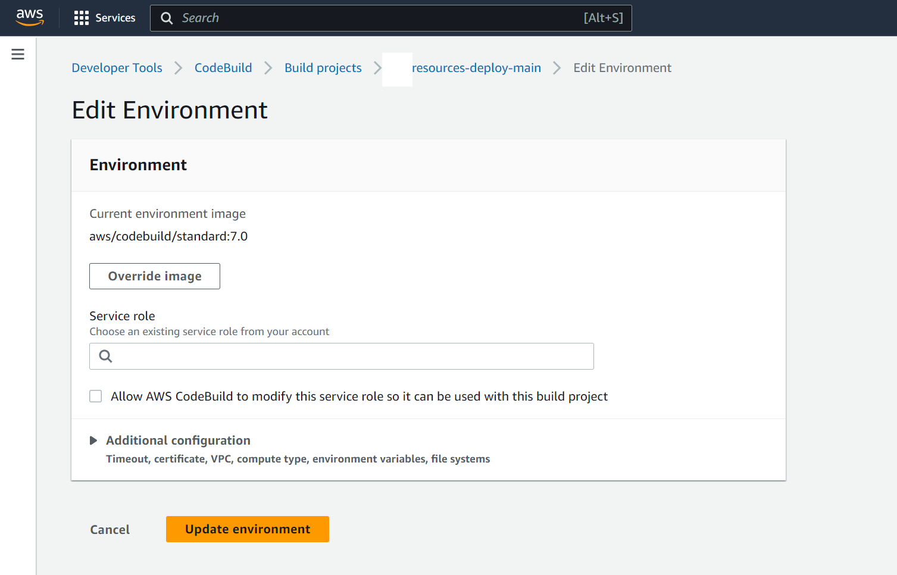

= How To: Aws CodeBuild after recreating resources
// Not sure how placement will affect publishing to Confluence
ifndef::confluence[]
:toc: left
endif::[]
// Renders correctly in AsciiDoc Deployment
ifdef::confluence[]
:toc:

include::{includedir}/version-control-warning.adoc[]
endif::[]

The intent of this page is fully describe how to repair CodeBuild jobs after resources have been destroyed and recreated.

== Role name change

If a role name changed between resource deployments it should be obvious that some updates will be necessary.

* navigate to the CodeBuild job that needs update

* select "Build details"

* scroll down to "Environment"
* "Edit"

* clear the service role and search for the refreshed role with the updated name
* (Important!!) uncheck the allow aws ... checkbox
* "Update environment"

The CodeBuild action should now once again function as intended

// Renders correctly in IDE
ifndef::deploy[]
include::../../../_includes/training-how-to-nwywlf.adoc[]
endif::[]
// Renders correctly in AsciiDoc Deployment
ifdef::deploy[]
include::{includedir}/training-how-to-nwywlf.adoc[]
endif::[]

