= How To: Configure Aws Chatbot
ifndef::confluence[]
:toc: left
endif::[]
// Renders correctly in AsciiDoc Deployment
ifdef::confluence[]
:toc:

include::{includedir}/version-control-warning.adoc[]
endif::[]

Setting up the Aws Chatbot is the first step to significantly improving the alerting for all Aws based projects. This
allows significantly more transparency of when and where things are occurring within the application stack and improves
accessibility of insights to the whole team.

[WARNING]
Only 1 chatbot can be configured per channel - if you try to do more than one bot per channel there will be errors and
it will not let you.

== Manual Configuration

To start first the Aws chatbot must be added to slack

- https://us-east-2.console.aws.amazon.com/chatbot/home?region=us-east-2#/home
- Select Slack
- Click Configure client

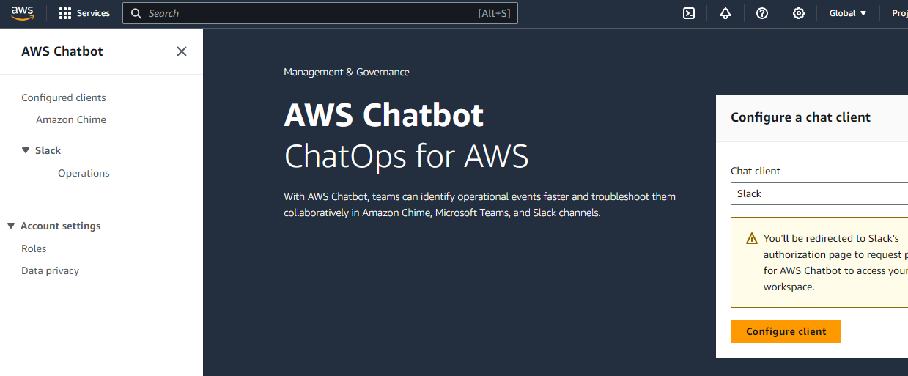

- That will then bring you to the access page
- Select allow

[NOTE]
If you do not have access to install the application you will then have to wait and or request approval of the app

- Once you have approval install the app into your workspace

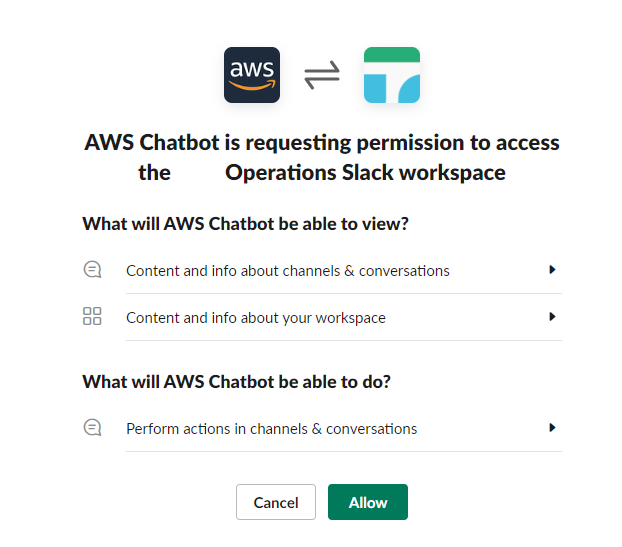

- Once installed with a configured workspace you should see something similar to the image on the right.
- To configure a new slack channel click "Configure new channel"

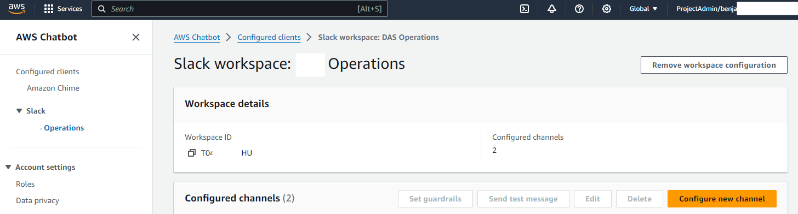

- Provide a "Configuration name" - I recommend this name matches the slack channel name
- Select weather you are joining a public or private channel
- Provide your channel name

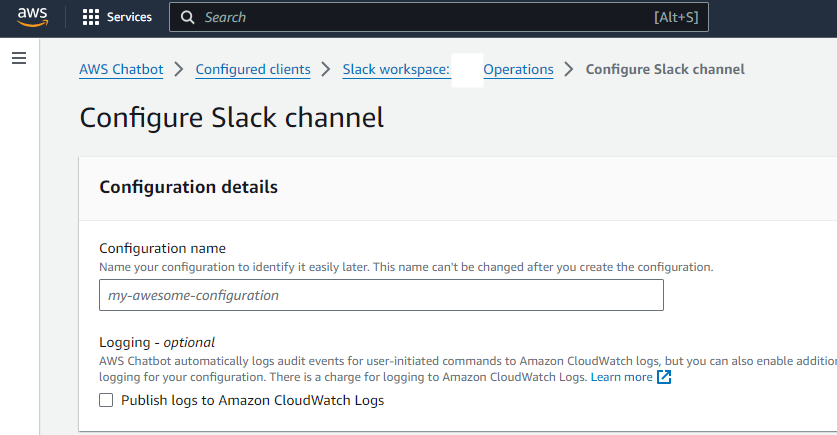
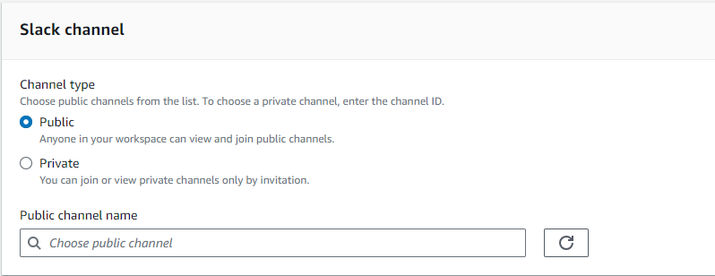

- leave channel role selected
- provide a role name - I suggest the channel name plus chat bot. So if the channel name is test-alerts  then the role
name should be test-alerts-chatbot

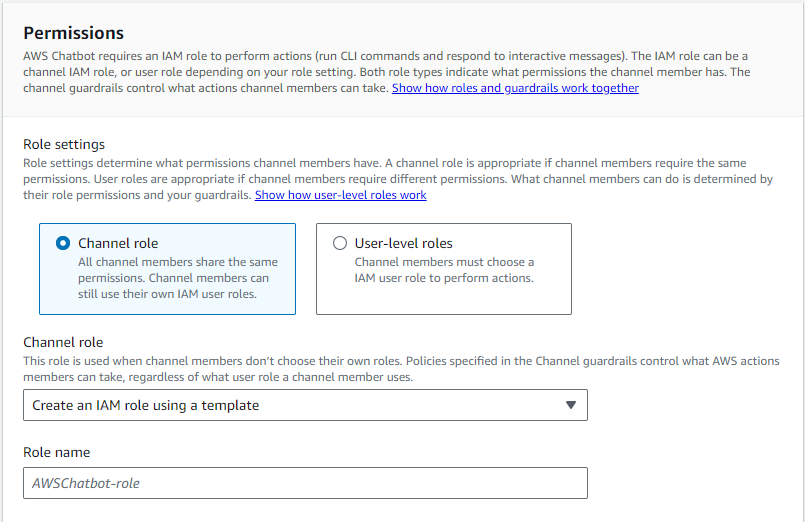

- leave policy templates as they are

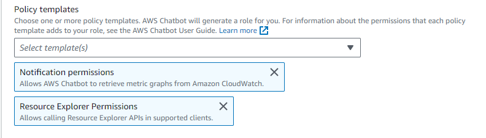

- remove the "ReadOnlyAccess" policy

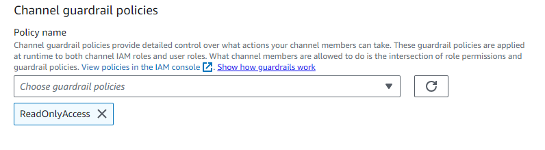

- apply the "CloudWatchLogsReadOnlyAccess" policy instead

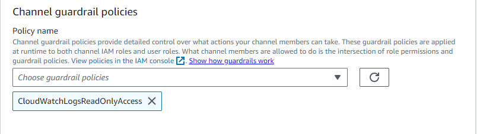

- select your region
- select the topic you want to receive notifications from
- click "Configure"

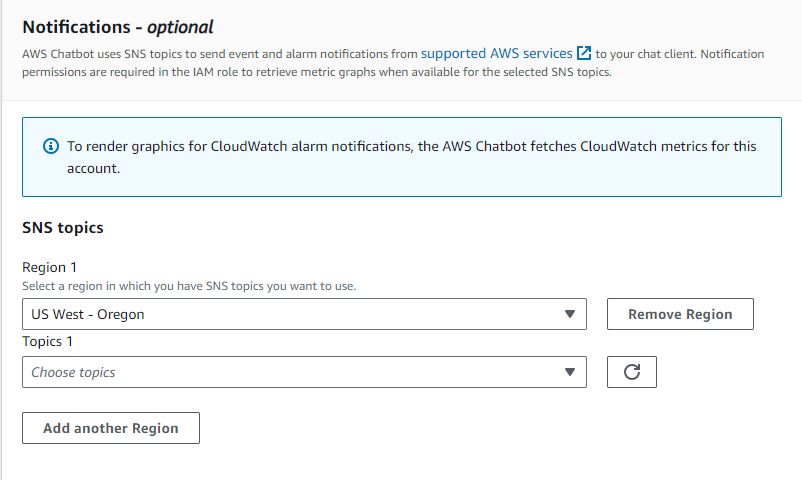

- Once the above is complete navigate to the new role that was created from the previous configuration

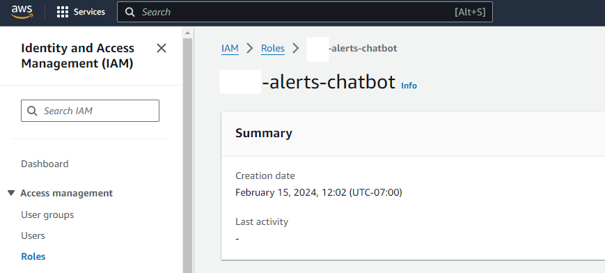

- please note that 2 policies were automatically applied - these 2 policies are the results of selections made under
"Policy templates" in the previous config.

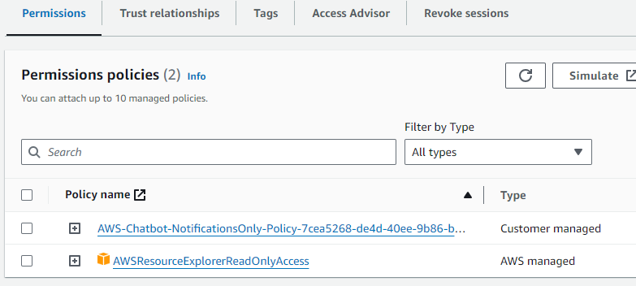

- we must now add one additional policy as the guardrail policy was not automatically applied
- Select "Add permission" → "Attach policies"
- Then search and add "CloudWatchLogsReadOnlyAccess" policy

[NOTE]
This additional permission is required to allow log queries from the aws chatbot

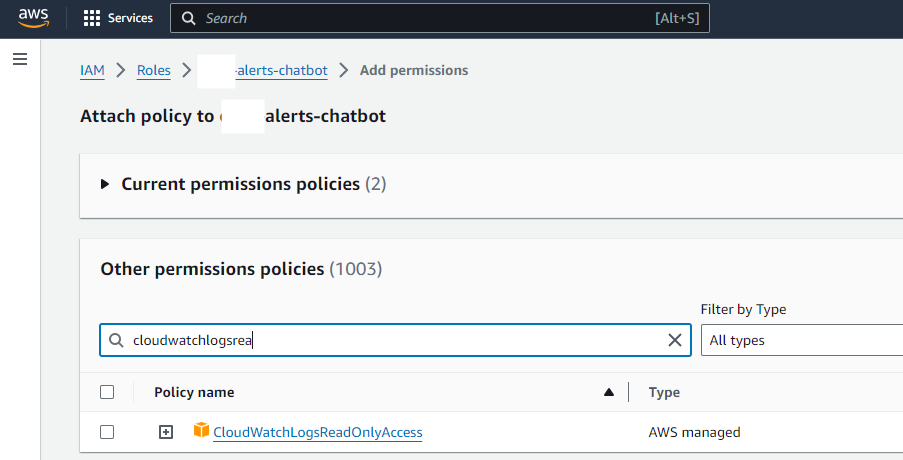

- final result

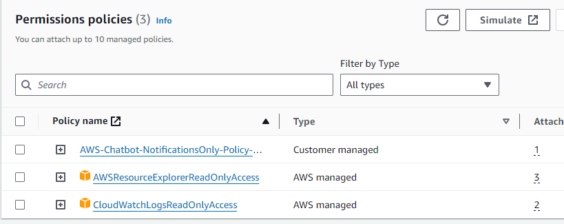

- Send a test message

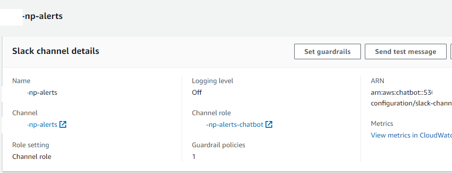

- Verify the result

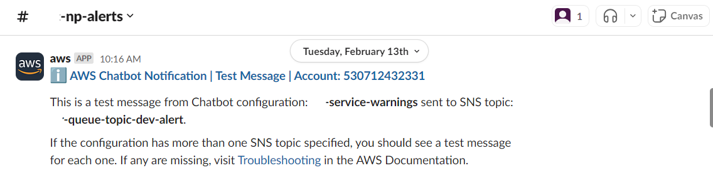

== IoC Configuration

=== Code Located at

- TODO

=== Deployed with Job

- TODO

=== Removed with Job

- TODO

Next lets take a look at how to do the same thing but put it under version control and make it repeatable as part of the build.

[NOTE]
Please note that you must already have the Aws Slackbot workspace configured
https://docs.aws.amazon.com/chatbot/latest/adminguide/slack-setup.html#cfn-slack
AWS::Chatbot::SlackChannelConfiguration - AWS CloudFormation

- Under resources create a new role and a `SlackChannelConfiguration`

[source, yaml]
----
resources:                                              # Specify all resources below
  Resources:                                            # Resource list
...
    # Aws Slackbot configuration
    XXXXToolsChatbotRole:
      Type: AWS::IAM::Role                              # Resource type
      Properties:                                       # Resource properties
        Path: /service-role/                            # If you want a custom resource path
        RoleName: ${self:custom.repoAcct}-chatbot-role
        AssumeRolePolicyDocument:                       # Role Configuration
          Version: '2012-10-17'
          Statement:
            - Effect: Allow
              Principal:
                Service:
                  - chatbot.amazonaws.com
              Action: sts:AssumeRole
        ManagedPolicyArns:                              # Managed policies to attach to new role
          - arn:aws:iam::aws:policy/AWSResourceExplorerReadOnlyAccess
          - arn:aws:iam::aws:policy/CloudWatchLogsReadOnlyAccess
        Policies:
          - PolicyName: ${self:custom.repoAcct}-chatbot-notification-only-policy
            PolicyDocument:
              Version: '2012-10-17'
              Statement:
                - Effect: Allow # note that these rights are given in the default policy and are required if you want logs out of your lambda(s)
                  Action:
                    - "cloudwatch:Describe*"
                    - "cloudwatch:Get*"
                    - "cloudwatch:List*"
                  Resource:
                    - "*"
    slackbotXXXXTools:
      Type: AWS::Chatbot::SlackChannelConfiguration
      Properties:
        ConfigurationName: brr-tools
        GuardrailPolicies:
          - arn:aws:iam::aws:policy/ReadOnlyAccess
        IamRoleArn: !Sub arn:aws:iam::${AWS::AccountId}:role/service-role/${self:custom.repoAcct}-chatbot-role
        SlackChannelId: YOUR-ID
        SlackWorkspaceId: YOUR-WORKSPACE
----

== Reference

- https://docs.aws.amazon.com/chatbot/latest/adminguide/custom-notifs.html
- https://medium.com/pixelpoint/how-to-send-aws-cloudwatch-alarms-to-slack-502bcf106047
- https://antonputra.com/amazon/send-aws-cloudwatch-alarms-to-slack/#create-sns-topic
- https://dev.to/bhatiagirish/integrate-slack-channel-and-cloudwatch-alarms-using-aws-chatbot-5d55
- https://docs.aws.amazon.com/chatbot/latest/adminguide/slack-setup.html#cfn-slack
- https://docs.aws.amazon.com/AWSCloudFormation/latest/UserGuide/aws-resource-sns-subscription.html#aws-resource-sns-subscription--examples
- https://stackoverflow.com/questions/49341187/confirming-aws-sns-topic-subscription-for-slack-webhook

// Renders correctly in IDE
ifndef::deploy[]
include::../../../_includes/training-how-to-nwywlf.adoc[]
endif::[]
// Renders correctly in AsciiDoc Deployment
ifdef::deploy[]
include::{includedir}/training-how-to-nwywlf.adoc[]
endif::[]

