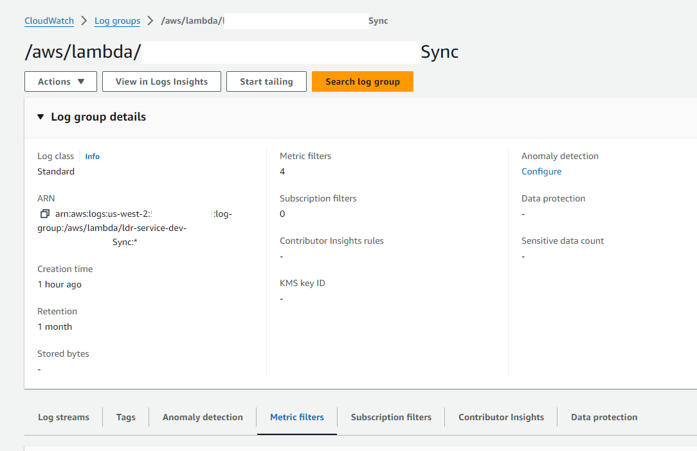
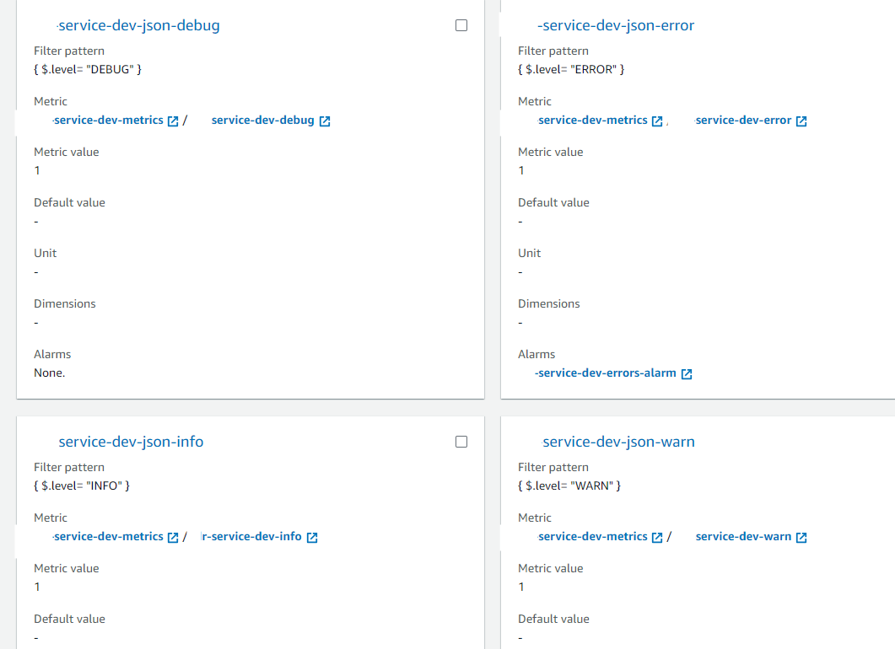

= How To: Configure Metric Filters
ifndef::confluence[]
:toc: left
endif::[]
// Renders correctly in AsciiDoc Deployment
ifdef::confluence[]
:toc:
endif::[]

Metric Filters are essentially queries that can be pre-defined to run against Aws CloudWatch. Creating Metric Filters
is a prerequisite to being able to configure various alert strategies within Aws.

In order to create a Metric Filter using the Serverless Framework the filter will need to be created under the resource
anchor tag in the `serverless.yml` what this means is the code to create this is pure CloudFormation syntax.

[CAUTION]
*Important!!!* When creating Metric filters it must be possible to reference the log group. Stated a different way the log
group must already exist. This IS an issue if you allow the default behavior of the serverless framework which is that it will automatically create the log group upon deployment. To remedy this issue in the resource deploy you must create the log group prior to creating the metric filter. See below

[source, yaml]
----
  # Manually create log groups----------------------------------------------------------------------------------------
    # This normally would occur automatically when the lambda is deployed BUT it has been setup here in order to support
    # creating metric filters.
    devLogGroup:
      Type: AWS::Logs::LogGroup
      Condition: CreateQueueNpResources                           # Conditionally create
      Properties:
        LogGroupName: "/aws/lambda/service-dev-functionName"
        RetentionInDays: 30
    devJsonErrorsMetricFilter:
      Type: AWS::Logs::MetricFilter
      Condition: CreateQueueNpResources                           # Conditionally create
      Properties:
        FilterName: "service-dev-json-error"
        LogGroupName:
          Ref: devLogGroup					# Reference the created log group
        FilterPattern: "{ $.level= \"ERROR\" }"
        MetricTransformations:
          - MetricValue: "1"
            MetricNamespace: "service-dev-metrics"
            MetricName: "service-dev-error"
----

[WARNING]
*Secondary Note: Important!!!* In addition to the above you must tell serverless to not auto create the log group on the application deployment or the deployment will fail!

To disable serverless from automatically creating the log group is very easy, just add the following option to your primary deployment `serverless.yml` ...

[source, yaml]
----
functions:
  deviceRegistrationSync:
    ...
    disableLogs: true
	...
----

== Verification

* Navigate to the log group and select "Metric Filters"

* See that the filters were created and the alarms are attached

== References

- https://docs.aws.amazon.com/AmazonCloudWatch/latest/logs/FilterAndPatternSyntax.html#matching-terms-json-log-events
- https://stackoverflow.com/questions/75051494/resource-handler-returned-message-invalid-request-provided-awslogsmetricf
- https://docs.aws.amazon.com/AmazonCloudWatch/latest/monitoring/Statistics-definitions.html
- https://dev.to/bhatiagirish/integrate-slack-channel-and-cloudwatch-alarms-using-aws-chatbot-5d55

