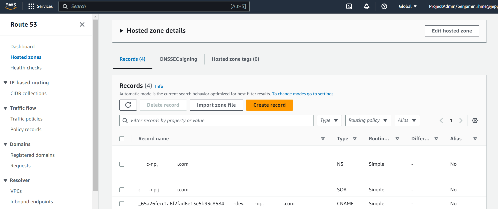
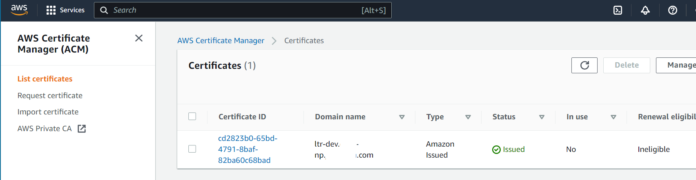
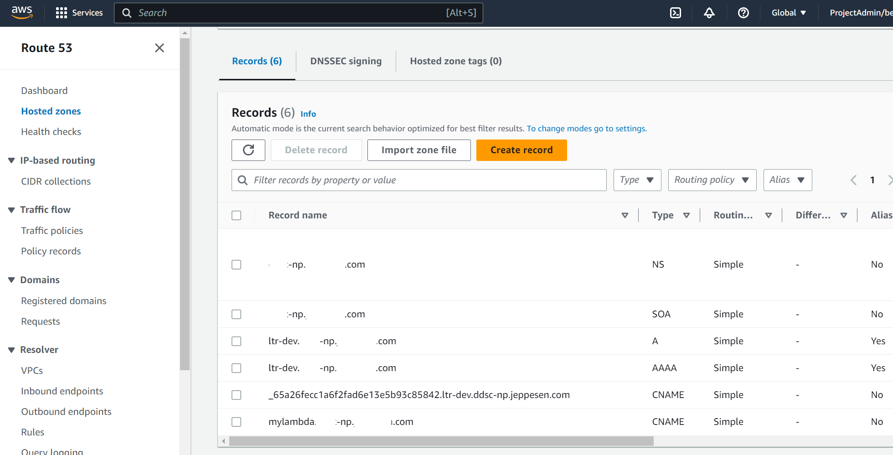

= How To: Create a custom domain
// Not sure how placement will affect publishing to Confluence
ifndef::confluence[]
:toc: left
endif::[]
// Renders correctly in AsciiDoc Deployment
ifdef::confluence[]
:toc:
endif::[]

This page is intended to describe how to apply a custom domain to your project using the Serverless Framework.

This how to leverage two serverless plugins

* https://www.npmjs.com/package/serverless-domain-manager[serverless-domain-manager]
* https://www.npmjs.com/package/serverless-certificate-creator[serverless-certificate-creator]

[CAUTION]
This page assumes you already have "Hosted Zone" available to you in Route 53. If you need to create a hosted zone please add a section on how to this page.

== Configuration

* In order to manually create a custom domain and its required components the following is required
* Install the plugins to your development system
* `npm install serverless-certificate-creator`
* `npm install serverless-domain-manager`
* Update the plugins section of the `serverless.yml`

[source, yaml]
----
plugins:                                                # Specify any additional plugins for serverless - be aware that these can increase cold start time
  - serverless-certificate-creator
  - serverless-domain-manager
----

* Add sections for certificate creation and domain creation

[source, yaml]
----
custom:
    ...
   domains:                                              # For each deployment stage
    dev:                                                # dev stage
      domainName: ${self:custom.appShortName}-${self:provider.stage}.api.something.com
      certificateName: ${self:custom.appShortName}-${self:provider.stage}.api.something.com
    ...
    prod: # token-req.brr-np.company.com
      domainName: ${self:custom.appShortName}.api.something.com
      certificateName: ${self:custom.appShortName}.api.something.com
  customCertificate:                                    # Create cert required to link custom domain with generated url
    hostedZoneNames: "api.something.com."            # Route 53 Hosted Zone name, don't forget the dot on the end!
    # Here we get our certificate name inside custom.domain.STAGE.certificateName
    # STAGE will be automatically filled with the value from "provider > stage"
    certificateName: ${self:custom.domains.${self:provider.stage}.certificateName}
    region: ${self:provider.region}                     # Must set region for cert to be created in
  customDomain: # Get value from "domains" section using stage that is being deployed to create url in Rout 53
    domainName: ${self:custom.domains.${self:provider.stage}.domainName}
    endpointType: REGIONAL                              # Must be set or will fail to find cert
    apiType: http                                       # Must be set otherwise defaults to REST
    certificateName: ${self:custom.domains.${self:provider.stage}.certificateName}
    # Enable plugin to create an A Alias and AAAA Alias records in Route53
    # mapping the domainName to the generated distribution domain name.
    createRoute53Record: true
    # Enable plugin to autorun create_domain/delete_domain as part of sls deploy/remove
    autoDomain: true
----

== Manual Creation

If you are running this locally it is important to note that you MUST create the certificate prior to deployment our you will get the following error ...

[source, yaml]
----
$ sls deploy --verbose
Running "serverless" from node_modules

Deploying ltr-service to stage dev (us-west-2)

Packaging
V2 - 'ltr-dev.api.something.com' does not exist.
Creating domain name before deploy.
V2 - 'ltr-dev.api.something.com' does not exist.
Searching for a certificate with the 'ltr-dev.api.something.com' domain

× Stack ltr-service-dev failed to deploy (2s)
Environment: win32, node 20.2.0, framework 3.35.2 (local) 3.32.2v (global), plugin 7.0.3, SDK 4.4.0
Credentials: Local, "default" profile
Docs:        docs.serverless.com
Support:     forum.serverless.com
Bugs:        github.com/serverless/serverless/issues

Error:
Error: Unable to create domain 'ltr-dev.api.something.com':
Could not find an in-date certificate for 'ltr-dev.api.something.com'.
    at ServerlessCustomDomain.<anonymous> (C:\Users\fz203f\Documents\repository\lambda-token-requestor\node_modules\serverless-domain-manager\dist\src\i
ndex.js:256:23)
    at Generator.throw (<anonymous>)
    at rejected (C:\Users\fz203f\Documents\repository\lambda-token-requestor\node_modules\serverless-domain-manager\dist\src\index.js:6:65)
    at process.processTicksAndRejections (node:internal/process/task_queues:95:5)
----

* `sls create-cert --verbose`
* After the cert has been created check your hosted zone for 1 new record

* Then check Certificate Manager (ACM) to verify that the certificate has been created

* No go ahead and deploy the application
* `sls deploy --verbose`

[CAUTION]
Be aware that no manual interaction with  is required as it will be auto triggered by the deploy

* Once deployment is complete check that the hosted zone has been updated with two additional records (A and AAAA) that
point to the domain you configured in the `serverless.yml` file.

If for some reason you need to fully manually create the domain you can run the following ...

* `sls create_domain --verbose`

as that will trigger the domain manager plugin to create the necessary dns records.

=== Removing certificates and domains

To remove a cert run

* `sls remove-cert --verbose`
To remove a domain run

* `sls delete_domain --verbose`
* or just undeploy the app
* `sls remove --verbose`

== Automatic Creation

Now, having described the manual process by which we can add a custom domain to our serverless project we will not cover
how to fully automate the process. Be aware that the configuration will be split between the `serverless-resources.yml`
and the `serverless.yml`

== serverless-resources.yml

* Add the plugin to the file

[source, yaml]
----
plugins:                                                # Specify any additional plugins for serverless - be aware that these can increase cold start time
  - serverless-certificate-creator
----

* Add the configuration

[source, yaml]
----
custom:
    ...
   domains: # For each deployment stage
    dev: # dev stage
      domainName: ${self:custom.appShortName}-${self:provider.stage}.api.something.com
      certificateName: ${self:custom.appShortName}-${self:provider.stage}.api.something.com
    test: # test stage
      domainName: ${self:custom.appShortName}-${self:provider.stage}.api.something.com
      certificateName: ${self:custom.appShortName}-${self:provider.stage}.api.something.com
    rgrs: # regression (rgrs) stage
      domainName: ${self:custom.appShortName}-${self:provider.stage}.api.something.com
      certificateName: ${self:custom.appShortName}-${self:provider.stage}.api.something.com
    uat: # uat stage
      domainName: ${self:custom.appShortName}-${self:provider.stage}.api.something.com
      certificateName: ${self:custom.appShortName}-${self:provider.stage}.api.something.com
    stage: # stage stage
      domainName: ${self:custom.appShortName}-${self:provider.stage}.api.something.com
      certificateName: ${self:custom.appShortName}-${self:provider.stage}.api.something.com
    prod: # token-req.api.something.com
      domainName: ${self:custom.appShortName}.api.something.com
      certificateName: ${self:custom.appShortName}.api.something.com
  customCertificate: # Create cert required to link custom domain with generated url
    hostedZoneNames: "api.something.com."            # Route 53 Hosted Zone name, don't forget the dot on the end!
    # Here we get our certificate name inside custom.domain.STAGE.certificateName
    # STAGE will be automatically filled with the value from "provider > stage"
    certificateName: ${self:custom.domains.${self:provider.stage}.certificateName}
    region: ${self:provider.region}                     # Must set region for cert to be created in
----

* Having added the necessary configuration it is now possible to create the certificates required for custom domains. Generating the certificates takes *a little bit of time so I believe that being an application dependency that they should be created at the Application Resource creation time. However, this does mean that since the resources are run once (or as necessary) that we need to set up the build files to generate All the certificates in one go.
* Now update the `buildspec-resources-deploy.yml`
* Install the plugin

[source, yaml]
----
phases:
  install:
    # Currently both java 17 and  node come installed in the image
    commands:
      ...
      - echo "Setting up Serverless Framework"
      - npm install -g serverless
      - echo "Installing Serverless plugins"
      - npm install serverless-certificate-creator
----

* Update the `pre_build`

[source, yaml]
----
pre_build:
    commands:
      # When creating a new application deployment, create a cert for each environment since resources are normally / should
      # only be run once (or as needed). These are created in order to configure custom domain names for the deployed
      # application
      - serverless create-cert --config serverless-resources.yml --stage dev --verbose
      - serverless create-cert --config serverless-resources.yml --stage test --verbose
#      - serverless create-cert --config serverless-resources.yml --stage rgrs --verbose
#      - serverless create-cert --config serverless-resources.yml --stage uat --verbose
#      - serverless create-cert --config serverless-resources.yml --stage stage --verbose
#      - serverless create-cert --config serverless-resources.yml --stage prod --verbose
  build:
----

* *REMEMBER!!! THE RESOURCE DEPLOY **MUST** BE EXECUTED PRIOR TO THE APPLICATION DEPLOY**
* Verify that the certificates were created and the Hosted Zone was updated as per the verification steps under the Manual Creation.

[WARNING]
Currently, we are only generating the dev and test certs the serverless-resources.yml  file will need to be updated as we expand into other environments.

=== serverless.yml

Add the plugin to the file

[source, yaml]
----
plugins:                                                # Specify any additional plugins for serverless - be aware that these can increase cold start time
  - serverless-domain-manager
----

* Add the configuration

[source, yaml]
----
domains:                                              # For each deployment stage
  local:                                              # DO NOT USE - HERE FOR COMPLETENESS
    domainName: n/a
    certificateName: n/a
  dev:                                                # dev stage
    domainName: ${self:custom.appShortName}-${self:provider.stage}.api.something.com
    certificateName: ${self:custom.appShortName}-${self:provider.stage}.api.something.com
  test:                                               # test stage
    domainName: ${self:custom.appShortName}-${self:provider.stage}.api.something.com
    certificateName: ${self:custom.appShortName}-${self:provider.stage}.api.something.com
  rgrs:                                               # regression (rgrs) stage
    domainName: ${self:custom.appShortName}-${self:provider.stage}.api.something.com
    certificateName: ${self:custom.appShortName}-${self:provider.stage}.api.something.com
  uat:                                                # uat stage
    domainName: ${self:custom.appShortName}-${self:provider.stage}.api.something.com
    certificateName: ${self:custom.appShortName}-${self:provider.stage}.api.something.com
  stage:                                              # stage stage
    domainName: ${self:custom.appShortName}-${self:provider.stage}.api.something.com
    certificateName: ${self:custom.appShortName}-${self:provider.stage}.api.something.com
  prod: # token-req.api.something.com
    domainName: ${self:custom.appShortName}.api.something.com
    certificateName: ${self:custom.appShortName}.api.something.com
customDomain: # Get value from "domains" section using stage that is being deployed to create url in Rout 53
  domainName: ${self:custom.domains.${self:provider.stage}.domainName}
  endpointType: REGIONAL                              # Must be set or will fail to find cert
  apiType: http                                       # Must be set otherwise defaults to REST
  certificateName: ${self:custom.domains.${self:provider.stage}.certificateName}
  # Enable plugin to create an A Alias and AAAA Alias records in Route53
  # mapping the domainName to the generated distribution domain name.
  createRoute53Record: true
  # Enable plugin to autorun create_domain/delete_domain as part of sls deploy/remove
  autoDomain: true
----

* Having added the necessary configuration it is now possible to create the domains. Generating the domains require that
the certificates are already in place. No extra executions are required for this step; by having the plugin and configuration
available it will automatically execute and link the configured custom domain to the deployment.
* Now update the `buildspec-build-deploy-with-layers.yml` and `buildspec-remove-deploy.yml` (this is just to make sure
the plugin is available to the deployment)

[source, yaml]
----
phases:
  install:
    # Currently both java 17 and  node come installed in the image
    commands:
      ...
      - echo "Setting up Serverless Framework"
      - npm install -g serverless
      - echo "Installing Serverless plugins"
      - npm install serverless-domain-manager
----

* The linkage between the deployment and the domains will happen automatically so long as the plugin is available.
* Check that the hosted zone has been updated with a new A record and an AAAA record that points to the configured domain

== Reference

- https://medium.com/@walid.karray/configuring-a-custom-domain-for-aws-lambda-function-url-with-serverless-framework-c0d78abdc253
- https://medium.com/@walid.karray/configuring-a-custom-domain-for-aws-lambda-function-url-with-serverless-framework-c0d78abdc253
- https://aws.plainenglish.io/serverless-framework-setting-up-a-custom-domain-to-api-gateway-91064a598f1d
- https://www.npmjs.com/package/serverless-domain-manager
- https://www.npmjs.com/package/serverless-certificate-creator
- https://dev.to/aws-builders/serverless-framework-aws-automatically-creating-certificate-and-domain-for-your-app-5832
- https://www.serverless.com/blog/serverless-api-gateway-domain
- https://awstip.com/using-custom-domain-name-with-api-gateway-using-serverless-framework-914c217c96d6
- https://stackoverflow.com/questions/70804311/serverless-http-api-serverless-domain-manager-error-failed-to-find-a-stack
- https://www.serverless.com/plugins/serverless-aws-function-url-custom-domain

// Renders correctly in IDE
ifndef::deploy[]
include::../../../_includes/training-how-to-nwywlf.adoc[]
endif::[]
// Renders correctly in AsciiDoc Deployment
ifdef::deploy[]
include::{includedir}/training-how-to-nwywlf.adoc[]
endif::[]

