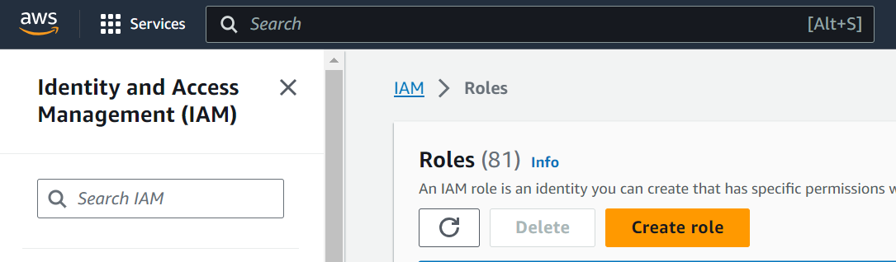
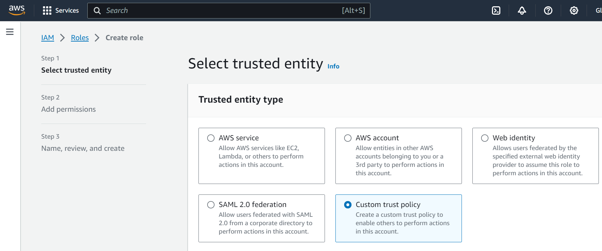
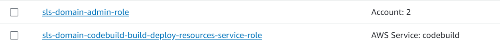
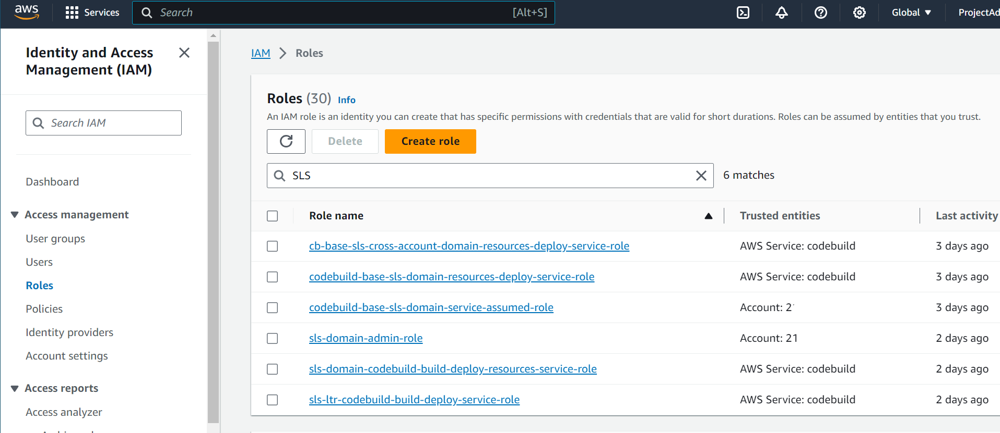
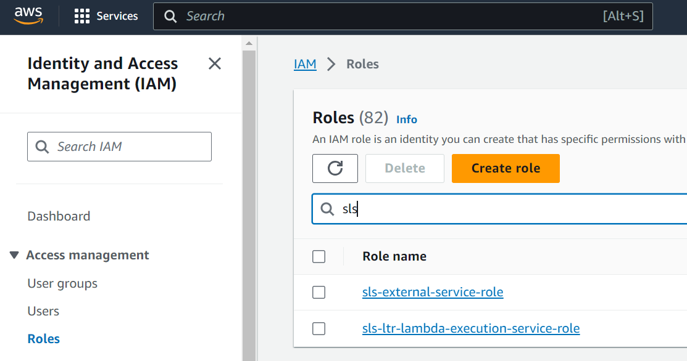
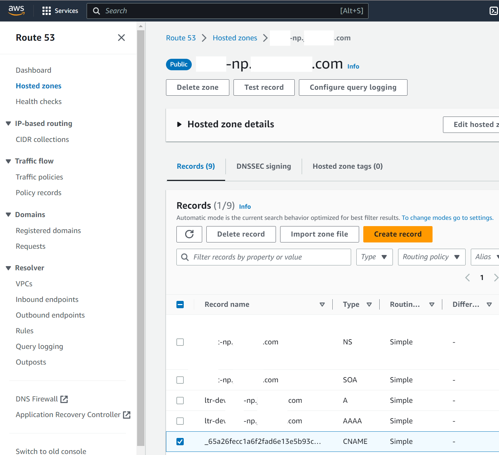

= How To: Cross-Account Deploy with Serverless
// Not sure how placement will affect publishing to Confluence
ifndef::confluence[]
:toc: left
endif::[]
// Renders correctly in AsciiDoc Deployment
ifdef::confluence[]
:toc:

include::{includedir}/version-control-warning.adoc[]
endif::[]

This page is to describe how to accomplish a cross account deploy using Serverless, multiple AWS accounts, CodeBuild, and CodePipeline.

[WARNING]
This is somewhat challenging to ensure everything is setup correctly

[TIP]
All cross account build spec files contain cross account in the name ex. `buildspec-cross-account-build-deploy.yml`

// Renders correctly in IDE
ifndef::deploy[]

This follows the same general flow of deployments within the same account (described
link:../../../engineering/ops/infrastructure-as-code/serverless.adoc[here],
link:../../../engineering/ops/infrastructure-as-code/serverless/sls-step-1-domain-deploy.adoc[Step 1],
link:../../../engineering/ops/infrastructure-as-code/serverless/sls-step-2-app-resource-deploy.adoc[Step 2],
link:../../../engineering/ops/infrastructure-as-code/serverless/sls-step-3-application-deploy.adoc[Step 3]) but there are some differences.

endif::[]
// Renders correctly in AsciiDoc Deployment
ifdef::deploy[]

This follows the same general flow of deployments within the same account (described
{sl-ops-link-003-004}[here],
{sl-ops-link-003-004-009}[Step 1],
{sl-ops-link-003-004-010}[Step 2],
{sl-ops-link-003-004-011}[Step 3]) but there are some differences.

endif::[]

== External Account Configuration

[WARNING]
This is a manual step and *CAN NOT* be automated. The implementer *IS RESPONSIBLE* for ensuring this step has occurred.
(If Terraform is used this step _CAN_ be automated)

To start, the external account which resources are being deployed to MUST have a manually created role that will be assumed during the deployment to facilitate the cross account interaction.

* Navigate to IAM → Roles
* Create role

* Select "Custom trust policy"

* Provide the following trust policy in the editable section

[source, json]
----
{
    "Version": "2012-10-17",
    "Statement": [
        {
            "Effect": "Allow",
            "Principal": {
                "AWS": "arn:aws:iam::xxxxxx:role/sls-domain-admin-role"
            },
            "Action": "sts:AssumeRole"
        }
    ]
}
----

* Click next
* Do not add any policies
* Click next
* Provide the following name "sls-external-service-role"
* Create role
* Add a policy

[WARNING]
Currently, a `AdministratorAccess` policy is also applied as there were issues getting this to work right, this should be slimmed down

[source, json]
----
{
    "Version": "2012-10-17",
    "Statement": [
        {
            "Sid": "Statement1",
            "Effect": "Allow",
            "Action": [
                "acm:DescribeCertificate",
                "acm:DeleteCertificate",
                "acm:ListCertificates",
                "acm:GetCertificate",
                "acm:ListTagsForCertificate",
                "acm:GetAccountConfiguration",
                "acm:RequestCertificate",
                "route53:ListHostedZones",
                "route53:ChangeResourceRecordSets",
                "route53:ListResourceRecordSets",
                "apigateway:GET",
                "apigateway:POST",
                "apigateway:PUT",
                "apigateway:DELETE",
                "cloudformation:DescribeStacks",
                "s3:GetObject",
                "s3:PutObject",
                "s3:PutObjectAcl"
            ],
            "Resource": "*"
        }
    ]
}
----

[WARNING]
I can not state this loudly enough *IF DOMAIN LEVEL ROLES ARE DELETED IE ...*
`sls-domain-admin-role`,
`sls-domain-codebuild-build-deploy-resources-service-role`
THIS **WILL** HAPPEN IF SOMEONE RUNS THE - `sls-cross-account-domain-resources-remove` job (same applies to the sls-domain-resources-remove job)
THIS WILL SCRAMBLE THE TRUST POLICY ON THE REMOTE ROLE!!!
A correctly configured trust policy should look like the following ...

[source, json]
----
{
    "Version": "2012-10-17",
    "Statement": [
        {
            "Effect": "Allow",
            "Principal": {
                "AWS": "arn:aws:iam::accountNumber:role/sls-domain-admin-role"
            },
            "Action": "sts:AssumeRole"
        }
    ]
}
----

A scrambled policy will look like this

[source, json]
----
{
    "Version": "2012-10-17",
    "Statement": [
        {
            "Effect": "Allow",
            "Principal": {
                "AWS": "ASJDHFISDFHUIUIUSDNFIUSD7868SD"
            },
            "Action": "sts:AssumeRole"
        }
    ]
}
----

== Domain Deployment

// Renders correctly in IDE
ifndef::deploy[]

This does everything exactly the same as the same account deploy described
link:../../../engineering/ops/infrastructure-as-code/serverless/sls-step-1-domain-deploy.adoc[here], EXCEPT that it also applies a bucket
policy to allow the account that is being deployed to, to reach back to the deploying (ci/cd) account.

endif::[]
// Renders correctly in AsciiDoc Deployment
ifdef::deploy[]

This does everything exactly the same as the same account deploy described
{sl-ops-link-003-004-009}[here], EXCEPT that it also applies a bucket
policy to allow the account that is being deployed to, to reach back to the deploying (ci/cd) account.

endif::[]

=== Execution

To execute the domain level deployment run the `sls-cross-account-domain-resources-deploy` job. This will create the two
required base roles, the base deployment bucket and the base deployment bucket policy which will allow the account that
is being deployed to, to reach back and communicate with the deployment scripts.

[TIP]
Reminder, this should only be executed ONCE when configuring a new region/account as these resources will be used/shared
by all applications leveraging serverless.

==== Verification

[WARNING]
As stated in the previous step *DO NOT* execute `sls-cross-account-domain-resources-remove` unless you are highly confident
you understand the ramifications. Running `sls-cross-account-domain-resources-deploy` a second or nth time "should" apply
any new changes (Note: not 100% sure about update changes")

=== S3 Bucket policy that is created

This provisions access to both non-prod and prod accounts

[source, json]
----
{
    "Version": "2008-10-17",
    "Statement": [
        {
            "Effect": "Allow",
            "Principal": {
                "AWS": [
                    "arn:aws:iam::paccount:role/sls-external-service-role",
                    "arn:aws:iam::npaccount:role/sls-external-service-role"
                ]
            },
            "Action": [
                "s3:GetLifecycleConfiguration",
                "s3:ListBucket",
                "s3:Get*",
                "s3:PutObject",
                "s3:DeleteObject"
            ],
            "Resource": [
                "arn:aws:s3:::sls-cross-account-shared-services-domain-deploy",
                "arn:aws:s3:::sls-cross-account-shared-services-domain-deploy/*"
            ]
        }
    ]
}
----

To see how the above policy is created navigate to the serverless-resource-templates repository, specifically the
`serverless-domain-with-external-resources.yml` file. This will create the exact same two base roles that the
`serverless-domain-resources.yml` file does but with the addition of connecting and creating the bucket policy.

[source, yaml]
----
custom:
    ...
 bucketName: sls-cross-account-shared-services-domain-deploy

provider:
    ...
  s3:
    slsDeploymentBucket:
      name: ${self:custom.bucketName}

resources:
    ...
    slsDeploymentBucketPolicy:                          # Resource name
      Type: AWS::S3::BucketPolicy                       # Resource type
      Properties:
        Bucket: ${self:custom.bucketName}
        PolicyDocument:
          Statement:
            - Action:
                - s3:GetLifecycleConfiguration
                - s3:ListBucket
                - s3:Get*                               # This could maybe be tightened up a bit more was causing grief
                - s3:PutObject
                - s3:DeleteObject
              Resource:
                - arn:aws:s3:::${self:custom.bucketName}
                - arn:aws:s3:::${self:custom.bucketName}/*
              Effect: Allow
              Principal:
                AWS: arn:aws:iam::npAccountNum:role/sls-external-service-role
----

=== All Jobs

* `sls-cross-account-domain-resources-deploy`
* `sls-cross-account-domain-resources-remove` -  *DO NOT UNDER ANY CIRCUMSTANCE RUN THIS JOB UNLESS YOU ABSOLUTLY UNDERSTAND WHAT THIS WILL DO*
* `sls-domain-resources-deploy` - This is the same as the above but for local account deployment only.
* `sls-domain-resources-remove` -  *DO NOT UNDER ANY CIRCUMSTANCE RUN THIS JOB UNLESS YOU ABSOLUTLY UNDERSTAND WHAT THIS WILL DO.*
This is the same as the above but for local account deployment only.

== Application Resource Deployment

// Renders correctly in IDE
ifndef::deploy[]

While similar to same account application resources deploy described
link:../../../engineering/ops/infrastructure-as-code/serverless/sls-step-2-app-resource-deploy.adoc[here], this step is broken up somewhat differently.
The same as before this will create the `codebuildApplicationServiceRole` for the application deploy in the next step
using the `serverless-cross-account-resources.yml` file (similar to the `serverless-local-resources.yml`) but it no
longer creates the lambda execution role. That will now be created as part of the `serverless-cross-account-external-resources.yml`
as the execution role must be created in the environment that will be executing the actual code. Additionally, this
will also configure the first steps for
link:../../../engineering/training/how-to/aws-create-a-custom-domain.adoc[creating a custom domain] for the running lambda.

endif::[]
// Renders correctly in AsciiDoc Deployment
ifdef::deploy[]

While similar to same account application resources deploy described
{sl-ops-link-003-004-010}[here], this step is broken up somewhat differently.
The same as before this will create the `codebuildApplicationServiceRole` for the application deploy in the next step
using the `serverless-cross-account-resources.yml` file (similar to the `serverless-local-resources.yml`) but it no
longer creates the lambda execution role. That will now be created as part of the `serverless-cross-account-external-resources.yml`
as the execution role must be created in the environment that will be executing the actual code. Additionally, this
will also configure the first steps for
{tl-how-to-link-011}[creating a custom domain] for the running lambda.

endif::[]

=== Execution

To execute the application resource deployment run `ltr-cross-account-resources-deploy-main`. This will create a single
additional role in the local account for execution of the following build job and will create a lambda execution role in
the environment being deployed to as well as create a certificate for a custom domain name and update the Route53 DNS.

=== Verification

Local Account Roles (sls-ltr-codebuild-build-deploy-service-role)

Remote Account Roles (sls-ltr-lambda-execution-service-role)

Route 53 DNS (CNAME)

=== serverless-cross-account-external-resources.yml

[source, yaml]
----
custom:
    ...
  domains: # For each deployment stage
    dev: # dev stage
      domainName: ${self:custom.appShortName}-${self:provider.stage}.br-np.benrhine.com
      certificateName: ${self:custom.appShortName}-${self:provider.stage}.br-np.benrhine.com
    test: # test stage
      domainName: ${self:custom.appShortName}-${self:provider.stage}.br-np.benrhine.com
      certificateName: ${self:custom.appShortName}-${self:provider.stage}.br-np.benrhine.com
    rgrs: # regression (rgrs) stage
      domainName: ${self:custom.appShortName}-${self:provider.stage}.br-np.benrhine.com
      certificateName: ${self:custom.appShortName}-${self:provider.stage}.br-np.benrhine.com
    uat: # uat stage
      domainName: ${self:custom.appShortName}-${self:provider.stage}.br-np.benrhine.com
      certificateName: ${self:custom.appShortName}-${self:provider.stage}.br-np.benrhine.com
    stage: # stage stage
      domainName: ${self:custom.appShortName}-${self:provider.stage}.br-np.benrhine.com
      certificateName: ${self:custom.appShortName}-${self:provider.stage}.br-np.benrhine.com
    prod: # token-req.br-np.benrhine.com
      domainName: ${self:custom.appShortName}.br-np.benrhine.com
      certificateName: ${self:custom.appShortName}.br-np.benrhine.com
  customCertificate: # Create cert required to link custom domain with generated url
    hostedZoneNames: "br-np.benrhine.com."            # Route 53 Hosted Zone name, don't forget the dot on the end!
    # Here we get our certificate name inside custom.domain.STAGE.certificateName
    # STAGE will be automatically filled with the value from "provider > stage"
    certificateName: ${self:custom.domains.${self:provider.stage}.certificateName}
    region: ${self:provider.region}                     # Must set region for cert to be created in

plugins:
  - serverless-certificate-creator
----

=== Build Job

This runs the following steps

* assumes the `sls-domain-admin-role`
* creates the next codebuild execution role
* assumes the external role
* creates all listed certificates for custom domains
* creates external lambda execution role

[source, yaml]
----
phases:
  install:
    # Currently both java 17 and  node come installed in the image
    commands:
      - echo "------------------------------------------------- Phase -------------------------------------------------"
      - BUILD_START_TIME=$(($(date +%s%N)/1000000))
      - |
        if [ $CODEBUILD_BUILD_NUMBER ]; then
          echo "Install Phase - CI Build $CODEBUILD_BUILD_NUMBER"
          IS_CI_BUILD=true
        else
          echo "Install Phase - CI Build number is not set, something may be wrong"
        fi
      - echo "Setting up Serverless Framework"
      - npm install -g serverless
      - echo "Installing Serverless plugins"
      - npm install serverless-certificate-creator
      - echo "--------------------------------------------- Build Details ---------------------------------------------"
      - echo "Current directory -" `pwd`
      - echo "Current Java Version -" `java --version`
      - echo "Current AWS Cli Version -" `aws --version`
      - AWS_ACCOUNT_ID=$(aws sts get-caller-identity --query "Account" --output text)
      - echo "Current AWS Account - $AWS_ACCOUNT_ID"
      - echo "Current AWS Region - $AWS_REGION"
      - echo "----------------------------------------------- Complete ------------------------------------------------"
      - EXTERNAL_ROLE_ARN="arn:aws:iam::$AWS_ACCOUNT_ID:role/$LOCAL_EXTERNAL_ROLE_NAME"
      - echo "--------------------------- Generate Credentials for $EXTERNAL_ROLE_ARN ---------------------------------"
      - CREDENTIALS=$(aws sts assume-role --role-arn $EXTERNAL_ROLE_ARN --role-session-name codebuild-deploy-br-tools --duration-seconds 3600)
      - export AWS_ACCESS_KEY_ID="$(echo ${CREDENTIALS} | jq -r '.Credentials.AccessKeyId')"
      - export AWS_SECRET_ACCESS_KEY="$(echo ${CREDENTIALS} | jq -r '.Credentials.SecretAccessKey')"
      - export AWS_SESSION_TOKEN="$(echo ${CREDENTIALS} | jq -r '.Credentials.SessionToken')"
      - export AWS_EXPIRATION=$(echo ${CREDENTIALS} | jq -r '.Credentials.Expiration')
      - echo "----------------------------------------------- Complete ------------------------------------------------"
  pre_build:
    commands:
      - serverless deploy --config serverless-cross-account-resources.yml --verbose
  build:
    commands:
      # When creating a new application deployment, create a cert for each environment since resources are normally / should
      # only be run once (or as needed). These are created in order to configure custom domain names for the deployed
      # application
      - echo "Assuming remote role in account $REMOTE_EXTERNAL_ACCOUNT ..."
      - EXTERNAL_ROLE_ARN="arn:aws:iam::$REMOTE_EXTERNAL_ACCOUNT:role/$REMOTE_EXTERNAL_ROLE_NAME"
      - echo "--------------------------- Generate Credentials for $EXTERNAL_ROLE_ARN ---------------------------------"
      - CREDENTIALS=$(aws sts assume-role --role-arn $EXTERNAL_ROLE_ARN --role-session-name codebuild-deploy-br-np --duration-seconds 3600)
      - export AWS_ACCESS_KEY_ID="$(echo ${CREDENTIALS} | jq -r '.Credentials.AccessKeyId')"
      - export AWS_SECRET_ACCESS_KEY="$(echo ${CREDENTIALS} | jq -r '.Credentials.SecretAccessKey')"
      - export AWS_SESSION_TOKEN="$(echo ${CREDENTIALS} | jq -r '.Credentials.SessionToken')"
      - export AWS_EXPIRATION=$(echo ${CREDENTIALS} | jq -r '.Credentials.Expiration')
      - echo "----------------------------------------------- Complete ------------------------------------------------"
      - serverless create-cert --config serverless-cross-account-external-resources.yml --stage dev --verbose
      - serverless create-cert --config serverless-cross-account-external-resources.yml --stage test --verbose
#      - serverless create-cert --config serverless-local-resources.yml --stage rgrs --verbose
#      - serverless create-cert --config serverless-local-resources.yml --stage uat --verbose
#      - serverless create-cert --config serverless-local-resources.yml --stage stage --verbose
#      - serverless create-cert --config serverless-local-resources.yml --stage prod --verbose
      - serverless deploy --config serverless-cross-account-external-resources.yml --verbose
  post_build:
    commands:
      - BUILD_END_TIME=$(($(date +%s%N)/1000000))
      - echo "Resources deploy complete ... | Runtime - $((BUILD_END_TIME-BUILD_START_TIME)) ms"
----

=== All Jobs

* `ltr-resources-deploy-main` - For same account deploys only
* `ltr-resources-remove-main` - For same account deploys only | WARNING!!! This will remove expected resources
* `ltr-cross-account-resources-deploy-main` -  WARNING!!! This will remove expected resources
* `ltr-cross-account-resources-remove-main`

== Application Deployment

// Renders correctly in IDE
ifndef::deploy[]

Like the steps above this is similar to the same account step described
link:../../../engineering/ops/infrastructure-as-code/serverless/sls-step-3-application-deploy.adoc[here] but has been modified to add in a custom
domain name and must assume an external role in order to complete cross account deployment.

=== Modified serverless.yml

Updates for applying a link:aws-create-a-custom-domain.adoc[custom domain].

endif::[]
// Renders correctly in AsciiDoc Deployment
ifdef::deploy[]

Like the steps above this is similar to the same account step described
{sl-ops-link-003-004-011}[here] but has been modified to add in a custom
domain name and must assume an external role in order to complete cross account deployment.

=== Modified serverless.yml

Updates for applying a {tl-how-to-link-011}[custom domain].

endif::[]

[source, yaml]
----
custom:
    ...

  domains:                                              # For each deployment stage
    local:                                              # DO NOT USE - HERE FOR COMPLETENESS
      domainName: n/a
      certificateName: n/a
    dev:                                                # dev stage
      domainName: ${self:custom.appShortName}-${self:provider.stage}.br-np.benrhine.com
      certificateName: ${self:custom.appShortName}-${self:provider.stage}.br-np.benrhine.com
    test:                                               # test stage
      domainName: ${self:custom.appShortName}-${self:provider.stage}.br-np.benrhine.com
      certificateName: ${self:custom.appShortName}-${self:provider.stage}.br-np.benrhine.com
    rgrs:                                               # regression (rgrs) stage
      domainName: ${self:custom.appShortName}-${self:provider.stage}.br-np.benrhine.com
      certificateName: ${self:custom.appShortName}-${self:provider.stage}.br-np.benrhine.com
    uat:                                                # uat stage
      domainName: ${self:custom.appShortName}-${self:provider.stage}.br-np.benrhine.com
      certificateName: ${self:custom.appShortName}-${self:provider.stage}.br-np.benrhine.com
    stage:                                              # stage stage
      domainName: ${self:custom.appShortName}-${self:provider.stage}.br-np.benrhine.com
      certificateName: ${self:custom.appShortName}-${self:provider.stage}.br-np.benrhine.com
    prod: # token-req.br-np.benrhine.com
      domainName: ${self:custom.appShortName}.br-np.benrhine.com
      certificateName: ${self:custom.appShortName}.br-np.benrhine.com
  customDomain: # Get value from "domains" section using stage that is being deployed to create url in Rout 53
    domainName: ${self:custom.domains.${self:provider.stage}.domainName}
    endpointType: REGIONAL                              # Must be set or will fail to find cert
    apiType: http                                       # Must be set otherwise defaults to REST
    certificateName: ${self:custom.domains.${self:provider.stage}.certificateName}
    # Enable plugin to create an A Alias and AAAA Alias records in Route53
    # mapping the domainName to the generated distribution domain name.
    createRoute53Record: true
    # Enable plugin to autorun create_domain/delete_domain as part of sls deploy/remove
    autoDomain: true

plugins:
  - serverless-domain-manager

provider:                           # MAKE SURE LAYERS ARE POINTED BACK AT ORIGINATING ACCOUNT WHERE THEY ARE DEPLOYED!!!
    ...
  layers:                           # Layers can be set here for all functions or individually at the function level
    - !Sub arn:aws:lambda:${AWS::Region}:accountNumber:layer:powertools:2
    - !Sub arn:aws:lambda:${AWS::Region}:accountNumber:layer:aws-s3-sm-sdk:2
    - !Sub arn:aws:lambda:${AWS::Region}:accountNumber:layer:ltr-dependencies:2
----

=== Build Job

A artifact that could use some improvement is currently this build job assumes a two different roles to execute. This is an artifact of the role permissions not being exactly quite right and is an item that should be improved.

=== All Jobs

ltr-cross-account-build-deploy-main
ltr-cross-account-remove-deploy-main - This will remove the deployed application
ltr-build-deploy-with-layers-main - Local account ONLY
ltr-remove-deploy-main - This will remove the deployed application (Local account ONLY)

== Logs

If you need to review build logs these will be available in the same account where the code is hosted (ie the br-tools account). If you need to review application logs for debugging purposes those will be available where the deployed artifact is running (ie br-np, or br-p).

== Reference

- https://aws.amazon.com/blogs/architecture/simplifying-multi-account-ci-cd-deployments-using-aws-proton/
- https://aws.amazon.com/blogs/devops/building-a-ci-cd-pipeline-for-cross-account-deployment-of-an-aws-lambda-api-with-the-serverless-framework/
- https://forum.serverless.com/t/sample-serverless-yml-for-multiple-aws-accounts-needed/1528/7
- https://www.serverless.com/framework/docs/providers/aws/guide/credentials
- https://seed.run/blog/how-to-deploy-your-serverless-app-into-multiple-aws-accounts.html
- https://seed.run/docs/serverless-errors/the-serverless-deployment-bucket-does-not-exist.html

// Renders correctly in IDE
ifndef::deploy[]
include::../../../_includes/training-how-to-nwywlf.adoc[]
endif::[]
// Renders correctly in AsciiDoc Deployment
ifdef::deploy[]
include::{includedir}/training-how-to-nwywlf.adoc[]
endif::[]

