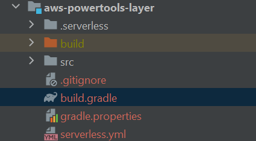

= How To: Lambda Layers
// Not sure how placement will affect publishing to Confluence
ifndef::confluence[]
:toc: left
endif::[]
// Renders correctly in AsciiDoc Deployment
ifdef::confluence[]
:toc:
endif::[]

Using Lambda Layers with serverless is exceptionally easy and is a great way to increase the lambda deployment speed and
improve control over dependency versions

== Using a Lambda Layer

See serverless documentation https://www.serverless.com/framework/docs/providers/aws/guide/layers[here].

[WARNING]
Be aware that using layers changes how the lambda needs to be built. If using a layer a shadow jar (shaded jar) is no
longer required and the project will be built using the standard gradle build command to create a zip file.

In order to tell serverless application to use a pre-deployed lambda layer add the following to your `serverless.yml`

[source, yaml]
----
provider:
  name: aws                                             # Selected cloud provider
  runtime: java17                                       # Selected runtime
  stage: ${opt:stage, 'dev'}                            # Uses user specified stage (--stage VALUE) or defaults to dev
  region: ${opt:region, 'us-west-2'}                    # Uses user specified region (--region VALUE) or defaults to `us-west-2`
  ...
  deploymentBucket:                                     # Collect all serverless deployment files in a single bucket
    name: ${self:custom.serverlessPrefix}-regional-domain-deploy         # Specify bucket name
    serverSideEncryption: AES256                        # Specify bucket encryption
    maxPreviousDeploymentArtifacts: 10                  # Max number of old builds to keep
  layers:                           # Layers can be set here for all functions or individually at the function level
    - arn:aws:lambda:us-west-2:npAccountNum:layer:ltr-dependencies:2
----

This tells lambda what layer to use and where to go get the pre-built dependency package. This will go get the zip from S3 and extract the dependencies to the runtime environment

== Creating a Lambda Layer using Java

See serverless tutorial https://www.serverless.com/blog/publish-aws-lambda-layers-serverless-framework/[here].

=== Local to your project

[NOTE]
This way is *NOT* suggested as the layers are not the most reusable when created in this fasion.

Essentially all that needs to be done to do this within the local project is add the following to your `build.gradle`

[source, groovy]
----
task buildLayer(type: Copy) {
    into "$buildDir/layer/java/lib"
    from configurations.runtimeClasspath
}

// AWS suggested way - this will build all the dependencies as a zip ready for manual
// upload to lambda BUT it can not be referenced by serverless.
task buildZip(type: Zip) {
    into('lib') {
        from(jar)
        from(configurations.runtimeClasspath)
    }
}

build.dependsOn buildZip, buildLayer
----

This will copy all the libraries to the build directory and then package them together into a zip file.

For further details, see https://medium.com/consulner/speedup-aws-lambda-deployments-with-layers-12f8f24c7d0[this post].

=== Separate Project

In order to ensure the highest level or reusability and to practice DRY principles it is suggested that any layers be
built as part of a separate repository. This allows the ability to intentionally design a given layer to be reusable by
other lambda functions and to have the ability to update and publish it independently of any given lambda function.
In order to create a new layer add a module to the layers repo and that module should contain the following

]

The `build.gradle`  file will contain the dependencies you are wishing to pre-build and

[source, groovy]
----
task buildLayer(type: Copy) {
    into "$buildDir/layer/java/lib"
    from configurations.runtimeClasspath
}

build.dependsOn buildLayer
----

Next the `serverless.yml`

[source, yaml]
----
  frameworkVersion: "3"
service: aws-powertools-layer

custom:                                                # Set custom options / variables for serverless
  serverlessPrefix: 'sls'                              # Short name for serverless

provider:
  name: aws                                             # Selected cloud provider
  runtime: java17                                       # Selected runtime
  stage: ${opt:stage, 'dev'}                            # Uses user specified stage (--stage VALUE) or defaults to dev
  region: ${opt:region, 'us-west-2'}                    # Uses user specified region (--region VALUE) or defaults to `us-west-2`
  deploymentBucket: # Collect all serverless deployment files in a single bucket
    name: ${self:custom.serverlessPrefix}-regional-domain-deploy         # Specify bucket name
    serverSideEncryption: AES256                        # Specify bucket encryption
    maxPreviousDeploymentArtifacts: 10                  # Max number of old builds to keep

layers:
  powertools:
    path: build/layer
----

== Retain your layers

It is more than likely that you will want to keep, i.e. retain previous versions of your published layers as this allows
layers to be shared but does not force any specific application to upgarde to the latest and greatest until they are ready.
In order to retain your layers add the following ...

[source, yaml]
----
layers:
  powertools:
    path: build/layer
    name: powertools
    description: "Contains Powertools Dependencies"
    retain: false                     # This option does not work correctly but must be set false to enable the resource policy
    allowedAccounts:                  # Add any accounts allowed to use this layer here
      - "1xxxxxxxxxxx"                # brr-np
      - "2xxxxxxxxxxx"                # brr-p
      - "3xxxxxxxxxxx"                # brr-tools

resources:
  Resources:
    PowertoolsLambdaLayer:            # Must be named the layer name starting with a capital plus LambdaLayer
      UpdateReplacePolicy: Retain     # Correctly set the layer to be retained
----

== How to build and deploy a layer

=== Manually
Execute ...

[source, shell]
----
./gradlew clean build
----

Then deploy (use your aws profile)

[source, shell]
----
sls deploy --aws-profile default --verbose
----

This should result in output similar to the following

[source, shell]
----
? Service deployed to stack aws-powertools-layer-dev (45s)

layers:
    powertools: arn:aws:lambda:us-west-2:npAccountNum:layer:powertools:6

Stack Outputs:
    PowertoolsLambdaLayerHash: 090d54502781c2b7882a315e3267ef9e7381aca5
    PowertoolsLambdaLayerS3Key: serverless/aws-powertools-layer/dev/1689611224638-2023-07-17T16:27:04.638Z/powertools.zip
    ServerlessDeploymentBucketName: sls-regional-domain-deploy
    PowertoolsLambdaLayerQualifiedArn: arn:aws:lambda:us-west-2:npAccountNum:layer:powertools:6
----

The published layer will be stored in the specified bucket from the `serverless.yml` file.

[NOTE]
So long as you are deploying over top of a previous deploy the layers will be versioned. I.e. if two
apps are using the same layer one can remain using version 2 while the other uses version 3. Additionally,
layer deploys are idempotent so if no changes have been made to the layer then it is smart enough to know this
and will no arbitrarily deploy a new version

[WARNING]
If you remove a layer instead of deploy on top of YOU WILL LOOSE THE VERSIONS OF THE LAYER and may cause issues for other
applications

=== Automatically (CI/CD)

Layer deployment can also be hooked up in your build system like any other project.

[WARNING]
It is recommended to NOT configure remove jobs for layers so as to not make it overly easy to remove a given layer.
Leave that to someone with command line access. If you really want to configure remove jobs in CI/CD remove buildspec
files are already written and part of the lambda layers repository.

== Using a layer Cross Account

It is absolutely possible to use layers cross account within the same region with minimal changes. A great reference
article about layer permissions and sharing can be found https://zaccharles.medium.com/sharing-lambda-layers-and-restricting-your-own-usage-f1413b974f44[here].
In order to specify which accounts may use a layer is is
a very simple update, just add the following to the layer `serverless.yml` file. This will generate the correct access.

[source, yaml]
----
layers:
    ltr-dependencies:
        path: build/layer
        allowedAccounts:        # Add any accounts allowed to use this layer here
            - "5307XXXXXXXX"    # np
            - "7676XXXXXXXX"    # -p
            - "2174XXXXXXXX"    # tools
----

== Automations

Is is recognized that while lambdas and layers are generally small that many pieces are being stitched together and it is our
goal go make this as seamless as possible. One such way this is being achieved is that the most current layer version can be retrieved
and stored into an environment variable in the `buildspec.yml` files for use within the `serverless.yml` file. This way layer
versions can update automatically on each deployment to improve developer speed. So what does this look like?

.buildspec.yml
[source, yaml]
----
      # Assume the admin role that is created by the domain deploy. This allows us to vastly simplify the required trust
      # relationship on external systems
      - echo "------------------------------ Assume local role with elevated privileges --------------------------------"
      - EXTERNAL_ROLE_ARN="arn:aws:iam::$AWS_ACCOUNT_ID:role/$LOCAL_EXTERNAL_ROLE_NAME"
      - echo "--------------------------- Generate Credentials for $EXTERNAL_ROLE_ARN ---------------------------------"
      - CREDENTIALS=$(aws sts assume-role --role-arn $EXTERNAL_ROLE_ARN --role-session-name codebuild-deploy-brr-tools --duration-seconds 3600)
      - export AWS_ACCESS_KEY_ID="$(echo ${CREDENTIALS} | jq -r '.Credentials.AccessKeyId')"
      - export AWS_SECRET_ACCESS_KEY="$(echo ${CREDENTIALS} | jq -r '.Credentials.SecretAccessKey')"
      - export AWS_SESSION_TOKEN="$(echo ${CREDENTIALS} | jq -r '.Credentials.SessionToken')"
      - export AWS_EXPIRATION=$(echo ${CREDENTIALS} | jq -r '.Credentials.Expiration')
      - echo "----------------------------------------------- Complete ------------------------------------------------"
      - echo "------------------------------ Generate Code Artifact Authentication ------------------------------------"
      - export CODEARTIFACT_AUTH_TOKEN=`aws codeartifact get-authorization-token --domain $CODE_ARTIFACT_DOMAIN --domain-owner $AWS_ACCOUNT_ID --region $AWS_REGION --query authorizationToken --output text`
      - echo "----------------------------------------------- Complete ------------------------------------------------"
      # Retrieve the most current version of a given layer to allow for automatic layer updates in the serverless.yml
      - echo "---------------------------------- Retrieve Current Version of Layers -----------------------------------"
      - export CERT_LAYER_VERSION=`aws lambda list-layer-versions --layer-name benrhine-root-cert --region $AWS_REGION --query "LayerVersions[0].Version"`
      - export POWERTOOLS_LAYER_VERSION=`aws lambda list-layer-versions --layer-name powertools --region $AWS_REGION --query "LayerVersions[0].Version"`
      - export LPSC_LAYER_VERSION=`aws lambda list-layer-versions --layer-name lpsc-dependencies --region $AWS_REGION --query "LayerVersions[0].Version"`
      - export LAMBDA_UTILITIES_LAYER_VERSION=`aws lambda list-layer-versions --layer-name lambda-utilities --region $AWS_REGION --query "LayerVersions[0].Version"`
      - echo "Current Certificate Layer Version - $CERT_LAYER_VERSION"
      - echo "Current Powertools Layer Version - $POWERTOOLS_LAYER_VERSION"
      - echo "Current LPSC Layer Version - $LPSC_LAYER_VERSION"
      - echo "Current Lambda Utilities Layer Version - $LAMBDA_UTILITIES_LAYER_VERSION"
      - echo "----------------------------------------------- Complete ------------------------------------------------"

----

then in the `serverless.yml`

[source, yaml]
----
custom:
     POWERTOOLS_LAYER_VERSION:
      local:  ${env:POWERTOOLS_LAYER_VERSION}
      dev:    ${env:POWERTOOLS_LAYER_VERSION}
      test:   ${env:POWERTOOLS_LAYER_VERSION}
      rgrs:   ${env:POWERTOOLS_LAYER_VERSION}
      uat:    ${env:POWERTOOLS_LAYER_VERSION}
      stage:  ${env:POWERTOOLS_LAYER_VERSION}
      prod:   4
----

[source, yaml]
----
  layers:                                                             # Layers can be set here for all functions or individually at the function level
    # THESE VERSIONS ARE SET PROGRAMMATICALLY FROM THE buildspec.yml AND DECLARED ABOVE IN THE CUSTOM SECTION PER ENV
    - !Sub arn:aws:lambda:${AWS::Region}:${self:custom.layerAccount}:layer:benrhine-root-cert:${self:custom.envVar.CERT_LAYER_VERSION.${self:custom.stage}}
    - !Sub arn:aws:lambda:${AWS::Region}:${self:custom.layerAccount}:layer:powertools:${self:custom.envVar.POWERTOOLS_LAYER_VERSION.${self:custom.stage}}
    - !Sub arn:aws:lambda:${AWS::Region}:${self:custom.layerAccount}:layer:lpsc-dependencies:${self:custom.envVar.LPSC_LAYER_VERSION.${self:custom.stage}}
    - !Sub arn:aws:lambda:${AWS::Region}:${self:custom.layerAccount}:layer:lambda-utilities:${self:custom.envVar.LAMBDA_UTILITIES_LAYER_VERSION.${self:custom.stage}}
----

[WARNING]
It is highly suggested that the version for prod is hard coded and not automated to ensure no unplanned changes go into prod.
these should be manually reviewed prior to final deployment.

If you need to perform any of these actions using the CLI ...

=== List available layers

* `aws lambda list-layers`

=== View specific layer policy

* `aws lambda get-layer-version-policy --layer-name YOUR-LAYER-NAME--version-number 1`

=== Add policy to specific layer

* `aws lambda add-layer-version-permission --layer-name YOUR-LAYER-NAME--version-number 1 --statement-id allAccountsExample --principal "*" --action lambda:GetLayerVersion`

=== Add policy to specific layer for specific account

* `aws lambda add-layer-version-permission --layer-name YOUR-LAYER-NAME--version-number 1 --statement-id allAccountsExample --principal "XXXXXX" --action lambda:GetLayerVersion`

=== Remove policy from specific layer

* `aws lambda remove-layer-version-permission --layer-name YOUR-LAYER-NAME--version-number 1 --statement-id allAccountsExample`

== Reference

- https://www.serverless.com/framework/docs/providers/aws/guide/layers
- https://www.rajanpanchal.net/lamda-layers-using-java-runtime/
- https://github.com/aws-samples/aws-lambda-layers-aws-sam-examples/blob/master/aws-sdk-layer/template.yaml
- https://levelup.gitconnected.com/serverless-lambda-layers-d8f8374404e3
- https://zaccharles.medium.com/sharing-lambda-layers-and-restricting-your-own-usage-f1413b974f44
- https://github.com/leegilmorecode/serverless-lambda-layers/blob/main/serverless.yml
- https://medium.com/consulner/speedup-aws-lambda-deployments-with-layers-12f8f24c7d0
- https://rieckpil.de/aws-lambda-with-serverless-java-and-maven-thumbnail-generator/
- https://github.com/makhijanaresh/aws-integration-with-spring-boot/tree/main/LambdaLayerExample/LambdaLayerUser
- https://github.com/shelfio/java-lambda-layer
- https://github.com/roamingthings/java-lambda-deps-layer/tree/main
- https://serverlessland.com/repos/java-lambda-functions-lambda-layer
- https://medium.com/analytics-vidhya/aws-lambda-layer-in-java-ad67ce5d94b4
- https://github.com/serverless/examples/blob/v3/aws-ffmpeg-layer/serverless.yml
- https://github.com/serverless/examples/tree/v3/aws-multiple-runtime
- https://github.com/serverless/examples/tree/v3/aws-java-simple-http-endpoint
- https://aws.amazon.com/blogs/compute/deploying-aws-lambda-layers-automatically-across-multiple-regions/#:~:text=Many%20customers%20build%20Lambda%20layers,AWS%20accounts%20or%20shared%20publicly
- https://zaccharles.medium.com/sharing-lambda-layers-and-restricting-your-own-usage-f1413b974f44
- https://medium.com/@bhanukabandara97/getting-started-with-aws-lambda-layers-with-serverless-framework-c08f1cb20712
- https://medium.com/@bhanukabandara97/getting-started-with-aws-lambda-layers-with-serverless-framework-c08f1cb20712
-https://github.com/awsdocs/aws-lambda-developer-guide/blob/main/sample-apps/s3-java/build.gradle

include::../../../_includes/training-how-to-nwywlf.adoc[]

