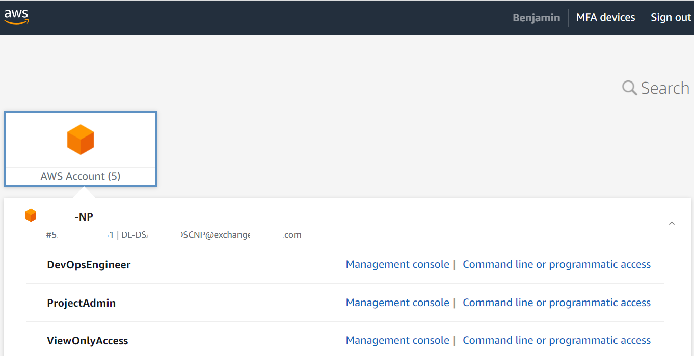
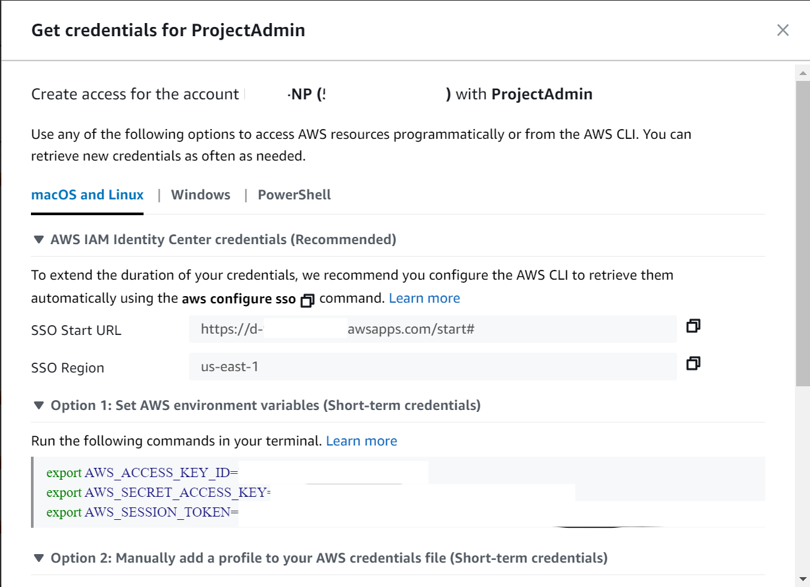
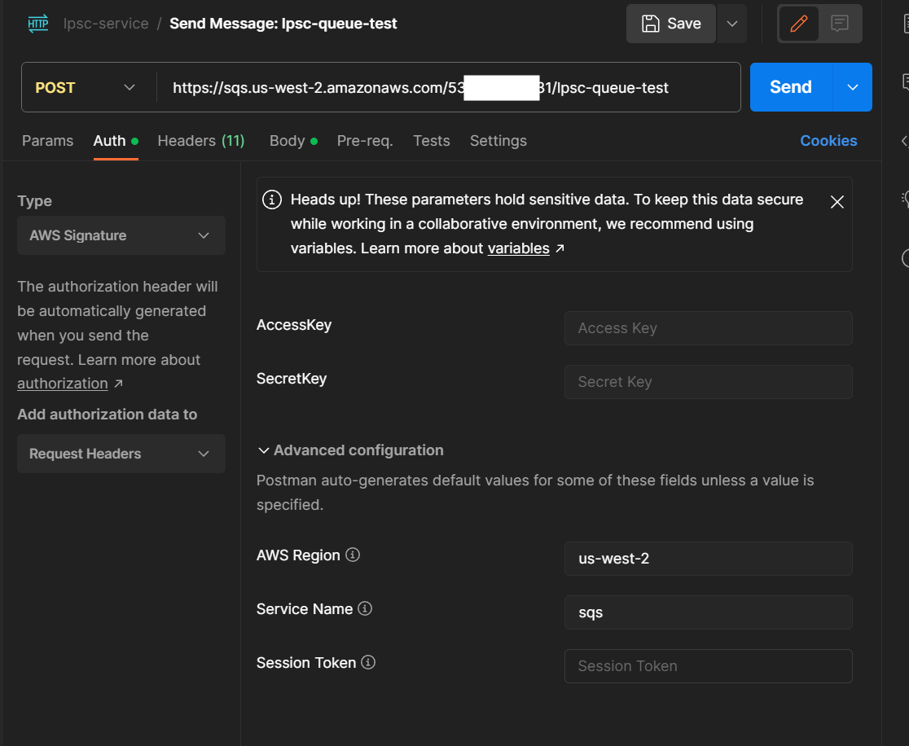
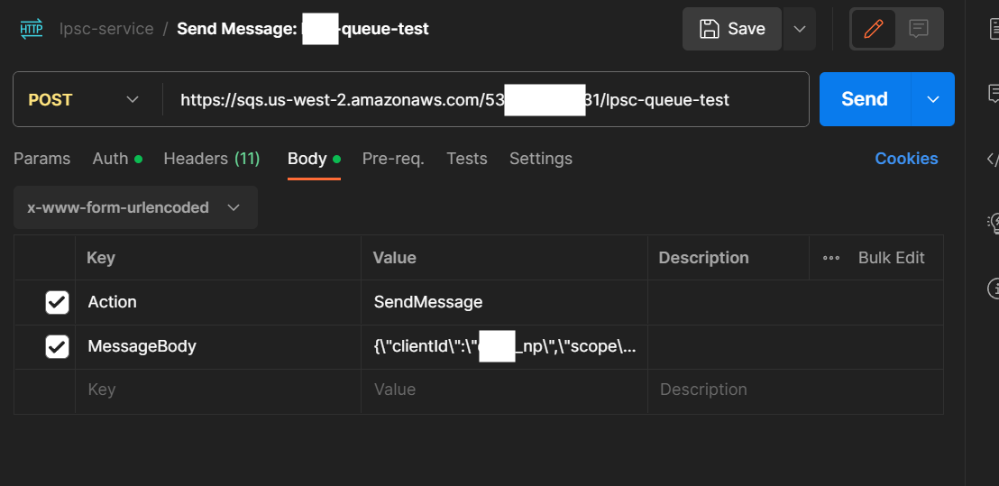

= How To: Send SQS Message Using Postman
// Not sure how placement will affect publishing to Confluence
ifndef::confluence[]
:toc: left
endif::[]
// Renders correctly in AsciiDoc Deployment
ifdef::confluence[]
:toc:
endif::[]

This is to describe how to send an SQS message with postman in the event you do not want to or do not have the Aws CLI configured.

== Aws Signing / Get Credentials

* Easiest way to get credentials is to open Command line or programmatic access

* Where you will see the access key, secret key, and session id

OR you can use the Aws CLI

First make sure you are set up to be able to use Aws SSO as described
link:../engineering/onboarding/configure-aws-cli-quick-start.adoc[here]. Next sign in ...

[source, shell]
----
aws sso login
----

or

[source, shell]
----
aws sso login --profile YOUR-CONFIGURED-PROFILE-NAME
----

== Special Configuration

Aws sso has semi-recently changed how it stores credentials on your local machine. The easiest way to install `aws-sso-creds-helper`

* `npm install -g aws-sso-creds-helper`

== Copy Current/Active Credentials

* `ssocreds -p YOUR-PROFILE`

This will extract your current aws credentials from the aws sso temp file to your `YOUR-PROFILE/.aws/credentials`

== Configure Postman

* Create a new POST request in Postman
* Supply the url of the SQS queue
* From the YOUR-PROFILE/.aws/credentials supply the following
** AccessKey - available in credentials file
** SecretKey - available in credentials file
** YOUR-REGION
** The service name
** Session Token - available in credentials file

* under body supply
** Action - SendMessage
** MessageBody - YOUR MESSAGE
* SEND
* Now watching CloudWatch you should see the application pick up the message that has been sent.

== Reference

- https://documenter.getpostman.com/view/2631434/SWLh56pX#bc7c4c99-d538-490d-b6b2-11792b93be22

include::../../../_includes/training-how-to-nwywlf.adoc[]

