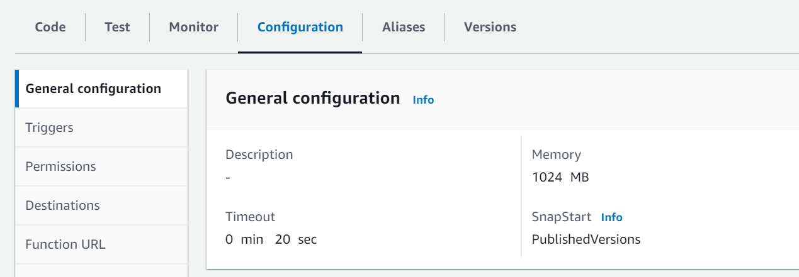
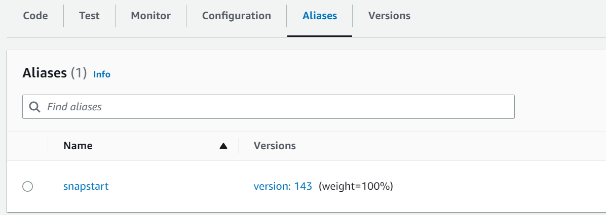

= How To: SnapStart for Java
// Not sure how placement will affect publishing to Confluence
ifndef::confluence[]
:toc: left
endif::[]
// Renders correctly in AsciiDoc Deployment
ifdef::confluence[]
:toc:

include::{includedir}/version-control-warning.adoc[]
endif::[]

One of the biggest concerns with using Java in a lambda is the cold start problem. While you can easily find many
articles on the cold start issue to summarize since java has been around a long time and it was not necessarily designed
for all our modern use cases it takes longer to initialize and start up than some competing languages. While in many
cases this is not a huge deal and much has been done in recent years to significantly improve start time when it comes
to lambda start time can be very important. Enter one of those recent improvements provided by Aws themselves with
https://docs.aws.amazon.com/lambda/latest/api/API_SnapStart.html[SnapStart]. Aws claims that SnapStart can
https://docs.aws.amazon.com/lambda/latest/dg/snapstart.html[improve performance up to 10x at no additional cost].

[NOTE]
SnapStart is specifically geared to Java 11 and 17 at this current time and is not available in all regions.

It took a minute to find the most efficient way to enable SnapStart (hence the number of reference links) but eventually
determined that Serverless already had a super easy solution for this.

== Enable SnapStart using Serverless

In your `serverless.yml` just add `snapStart: true` under the function name that you want to apply SnapStart to

[source, yaml]
----
functions:
  yourFunctionName:
    handler: package.Class::handleRequest
    snapStart: true
    ...
----

=== Configuration

Having redeployed your application with the above option enabled when you go view the lambda configuration you will see
that "SnapStart" is now set to "PublishedVersions" (default is none)

=== Aliases

Next, checking the "Aliases" tab shows that a "snapstart" alias has been created and what deployment version is currently
available to the user.

== Performance Improvements

Without SnapStart (~7.77s)

With SnapStart (~2.96s)

== Reference

If you are reviewing the references below you may find that there are some further additional tricks that may further
increase performance with mixed results and are more challenging to setup.

- https://docs.aws.amazon.com/lambda/latest/dg/snapstart-activate.html
- https://stackoverflow.com/questions/65033849/lambda-function-aliases-with-the-serverless-framework
- https://mydeveloperplanet.com/2022/01/11/aws-lambda-versions-and-aliases-explained-by-example/
- https://github.com/digio/serverless-simple-alias
- https://github.com/serverless/serverless/discussions/11570
- https://dev.to/aws-builders/deploying-a-spring-boot-api-to-aws-with-serverless-and-lambda-snapstart-439p
- https://medium.com/ownbackup/aws-re-invent-2022-use-snapstart-to-effectively-use-java-in-serverless-52efd497d8ce
- https://www.serverless.com/framework/docs/providers/aws/guide/serverless.yml#functions

// Renders correctly in IDE
ifndef::deploy[]
include::../../../_includes/training-how-to-nwywlf.adoc[]
endif::[]
// Renders correctly in AsciiDoc Deployment
ifdef::deploy[]
include::{includedir}/training-how-to-nwywlf.adoc[]
endif::[]
