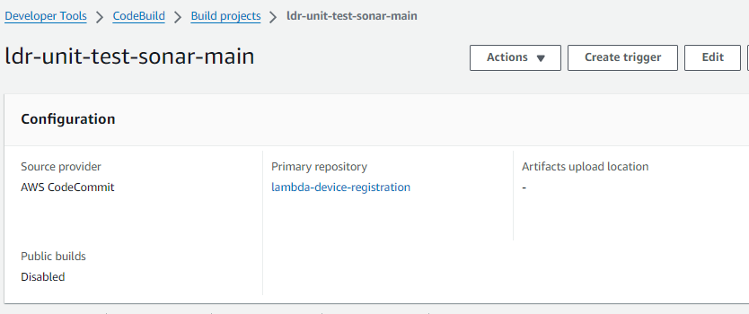
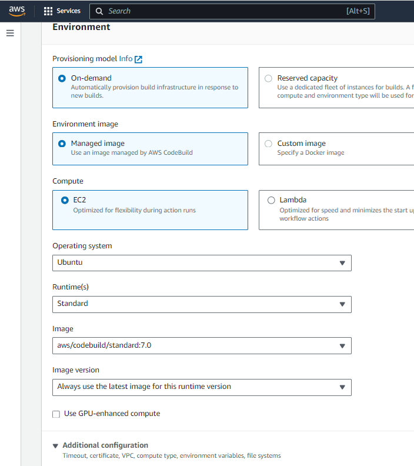
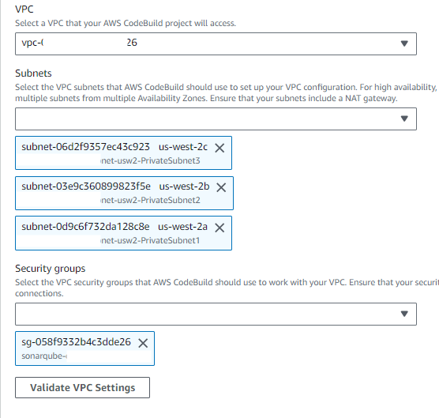
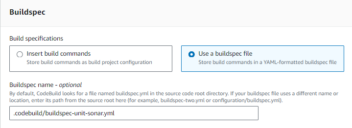
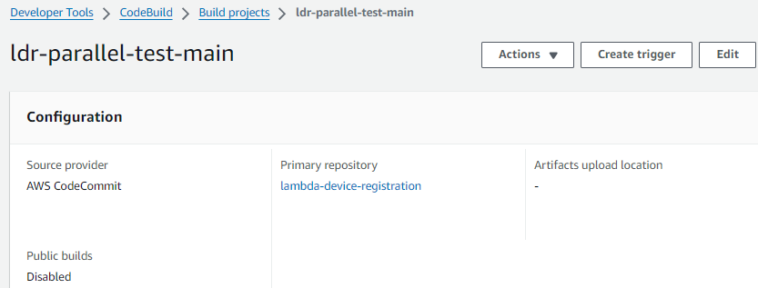

= How To: Connect Unit Test Execution to Sonar in CI
ifndef::confluence[]
:toc: left
endif::[]
// Renders correctly in AsciiDoc Deployment
ifdef::confluence[]
:toc:
endif::[]

Adding unit tests and sonar directly to an application is a relatively simple process but unfortunately getting it to
successfully execute as part of the CI process requires a bit more work.

// Renders correctly in IDE
ifndef::deploy[]

== Unit Tests

As a quick refresher, execute unit tests with the following ./gradlew clean test for more details on unit testing please
see link:../../../engineering/development/testing/testing-unit.adoc[here].

=== Sonar

As a quick refresher, execute sonar with the following ./gradlew clean sonar for more details on sonar please see
link:../../../engineering/tooling/tooling-sonar.adoc[here].

=== Executing Sonar in CI

In order to be able to run sonar during CI we may need to connect the build to a VPC that has access to sonar AND a
ServiceNow ticket requesting the ips from the Aws account be whitelisted with sonar may be necessary.

[NOTE]
It is assumed the CodeBuild job for sonar is already created and configured, if not please see link:../../../engineering/tooling/tooling-sonar.adoc[here]

endif::[]
// Renders correctly in AsciiDoc Deployment
ifdef::deploy[]

== Unit Tests

As a quick refresher, execute unit tests with the following ./gradlew clean test for more details on unit testing please
see {sl-development-testing-link-009}[here].

=== Sonar

As a quick refresher, execute sonar with the following ./gradlew clean sonar for more details on sonar please see
{tl-tooling-link-15}[here].

=== Executing Sonar in CI

In order to be able to run sonar during CI we may need to connect the build to a VPC that has access to sonar AND a
ServiceNow ticket requesting the ips from the Aws account be whitelisted with sonar may be necessary.

[NOTE]
It is assumed the CodeBuild job for sonar is already created and configured, if not please see {tl-tooling-link-15}[here]

endif::[]

=== Configure CodeBuild Sonar Job

- edit `APP-SHORT-NAME-unit-test-sonar-main

- Navigate to the bottom of the "Environment" section and expand "Additional configuration"

- Scroll to "VPC"

- Verify the build spec is `.codebuild/buildspec-unit-sonar.yml`

[NOTE]
Please note settings shown are valid values to connect any sonar job in XXXX-tools to sonar

- Verify the build spec is `.codebuild/buildspec-unit-sonar.yml`

=== Jobs in Parallel

If the job running sonar is being executed in parallel then the VPC configuration but be applied to the parallel job configuration as well.

- edit `APP-SHORT-NAME-parallel-test-main

- Navigate to the bottom of the "Environment" section and expand "Additional configuration"

- Scroll to "VPC"

With the above configuration sonar can now be reached from the parallel job execution and during the pipeline phase.
Info to include in Service Now Ticket

TODO

include::../../../_includes/training-how-to-nwywlf.adoc[]

