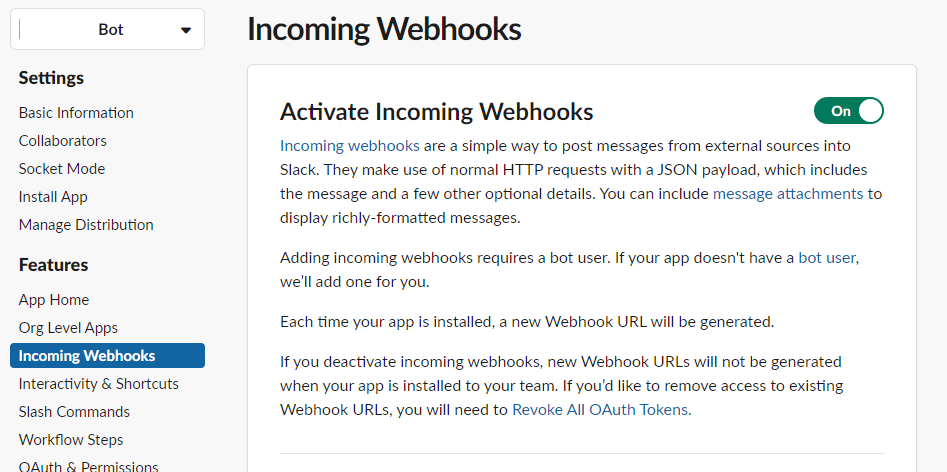

= How To: Create a custom Slack Bot
ifndef::confluence[]
:toc: left
endif::[]
// Renders correctly in AsciiDoc Deployment
ifdef::confluence[]
:toc:
endif::[]

Why would you want to create a custom Slack Bot? For several reasons ...

- Gives you intimate control of what the bot does
- Allow's you to configure operations specific to your team
- Supports better alerting / logging

While there are several ways to create a custom Slack Bot the easiest is to use a App Manifest yml file.

Here is the App Manifest used to create the XXXX Bot ...

----
display_information:
  name: XXXX Bot
  description: Simple Bot to allow messaging and uploading of files to slack from
    a build process.
  background_color: "#0000AA"
  long_description: Simple Bot to allow messaging and uploading of files to slack
    from a build process. Also, this will be used to demonstrate authenticated
    message sends from a given build enviornment for test projects.
features:
  app_home:
    home_tab_enabled: true
    messages_tab_enabled: true
    messages_tab_read_only_enabled: false
  bot_user:
    display_name: XXXX Bot
    always_online: true
  slash_commands:
    - command: /powerlevel
      url: https://i1.sndcdn.com/artworks-000240692276-lq1vai-t500x500.jpg
      description: What is the apps power level.
      usage_hint: /powerlevel
      should_escape: false
oauth_config:
  scopes:
    bot:
      - commands
      - chat:write
      - chat:write.public
      - files:write
      - incoming-webhook
settings:
  org_deploy_enabled: false
  socket_mode_enabled: false
  token_rotation_enabled: false
----

Having this bot installed allows for the gradle build to send build alerts at specific points to inform how the process is going

== Enable Webhooks

- In the left hand menu select Incoming Webhooks
- Make sure it is turned on

- To add a new webhook click "Add New Webhook to Workspace"
- Select slack channel to generate hook for

== Reference

- https://docs.aws.amazon.com/chatbot/latest/adminguide/chatbot-cli-commands.html
- https://docs.aws.amazon.com/chatbot/latest/adminguide/slack-setup.html#cfn-slack

