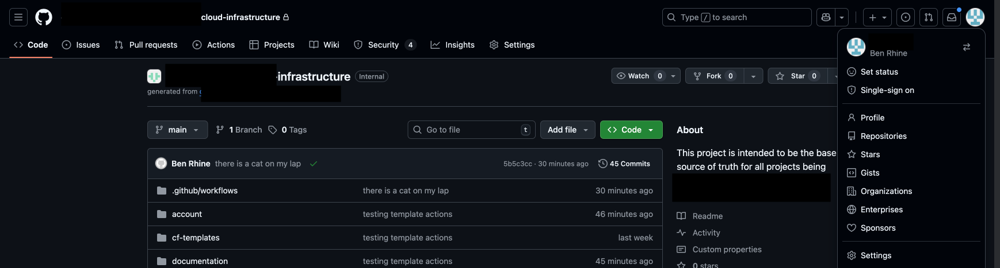
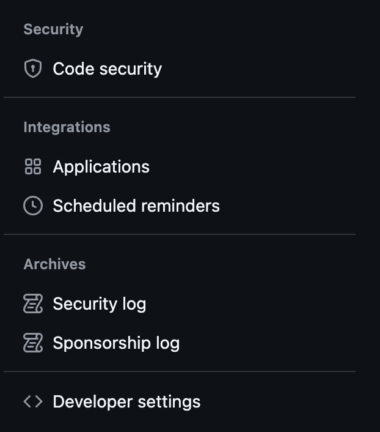
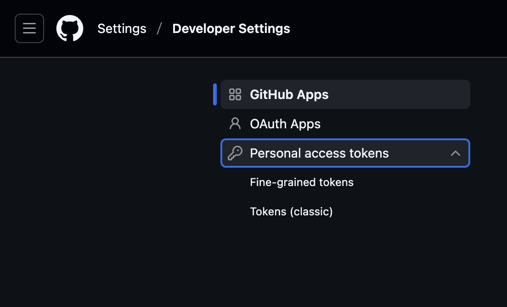
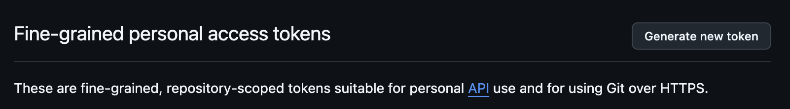
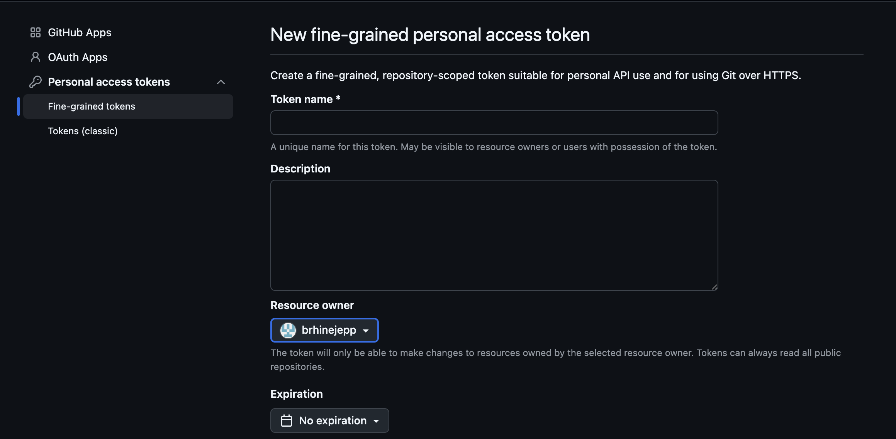
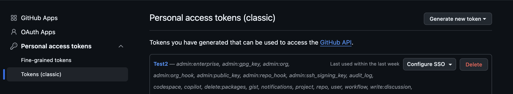
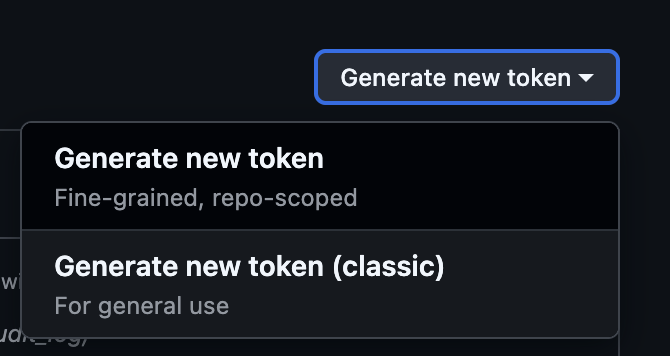
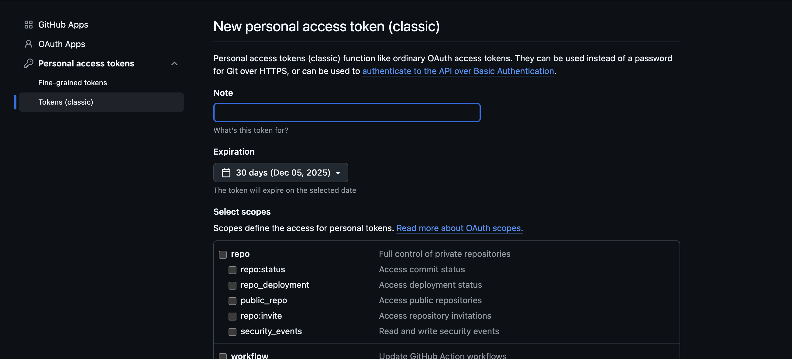
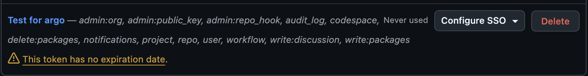
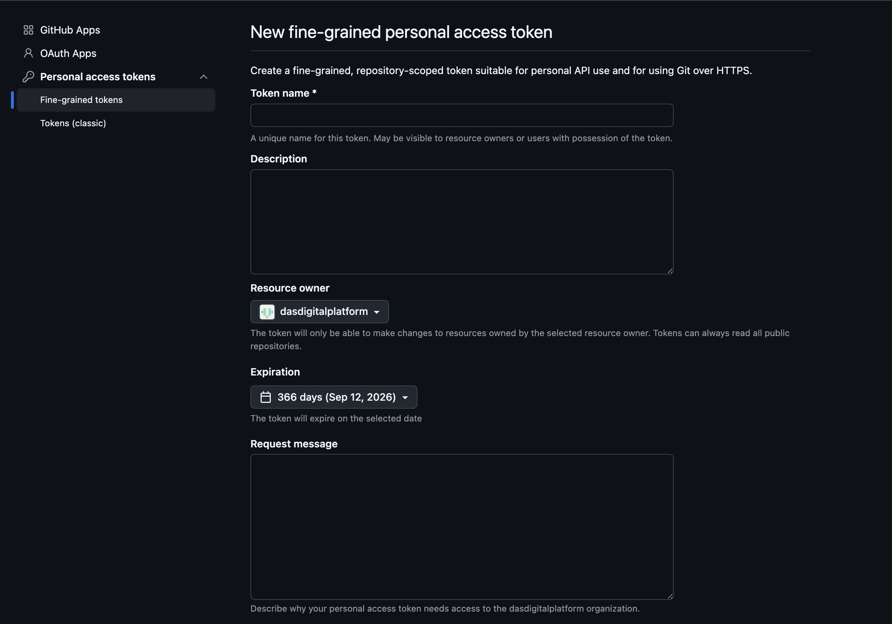

= How To: Configure Git personal access token (PAT)
// Creates the table of contents - this value could be removed and passed in as an attribute from the build task BUT
// having the :toc: value in the adoc files is required for publishToConfluence to work correctly
// Not sure how placement will affect publishing to Confluence
ifndef::confluence[]
:toc: left
endif::[]
// Renders correctly in AsciiDoc Deployment
ifdef::confluence[]
:toc:

include::{includedir}/version-control-warning.adoc[]
endif::[]

:keywords: engineering, training, how, to, git, pat, personal, access, token

// Renders correctly in IDE
ifndef::deploy[]
include::../../../_includes/generic-information.adoc[]
endif::[]
// Renders correctly in AsciiDoc Deployment
ifdef::deploy[]
include::{includedir}/generic-information.adoc[]
endif::[]

== GitHub

To configure personal access tokens for GitHub see the following variations ...

=== Personal Token (Fine-Grain)

.Select Settings from the upper right hand menu

.Scroll down the left side menu and select "Developer Settings" at the bottom

.Expand "Personal access tokens"

.Click "Generate new token"

.Give the token a name and description

Select which repos the token should apply to ...

Click "Generate Token"

Make sure you write down the token as it will only be available *ONCE* after clicking "Generate Token"

=== Personal Token (Classic)

.Select Settings from the upper right hand menu

.Scroll down the left side menu and select "Developer Settings" at the bottom

.Expand "Personal access tokens"

.Select Tokens (classic)

.Select classic

.Set token duration and permission

Click "Generate Token"

Make sure you write down the token as it will only be available *ONCE* after clicking "Generate Token"

Now, with the PAT saved somewhere secure authorize the token for SSO for your organization

=== Organizational Token

[WARNING]
Organizational tokens are limited to a lifetime of 1 year and require approval on *ANY* permission change from an org admin.

.Select Settings from the upper right hand menu

.Scroll down the left side menu and select "Developer Settings" at the bottom

.Expand "Personal access tokens"

.Click "Generate new token"

.Give the token a name and description

Select which repos the token should apply to ...

Click "Generate Token"

== GitLab

_TODO_

== Other

_TODO_

// Renders correctly in IDE
ifndef::deploy[]
include::../../../_includes/training-how-to-nwywlf.adoc[]
endif::[]
// Renders correctly in AsciiDoc Deployment
ifdef::deploy[]
include::{includedir}/training-how-to-nwywlf.adoc[]
endif::[]

