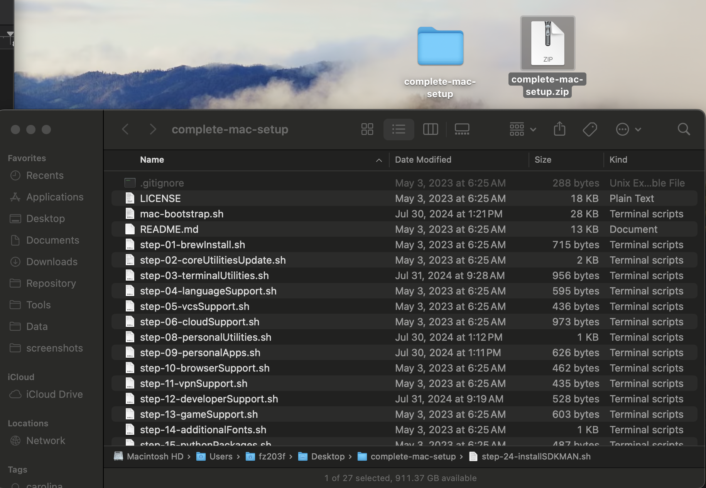
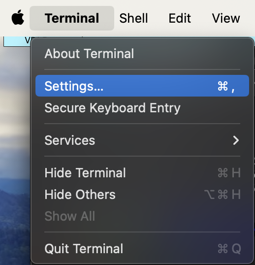
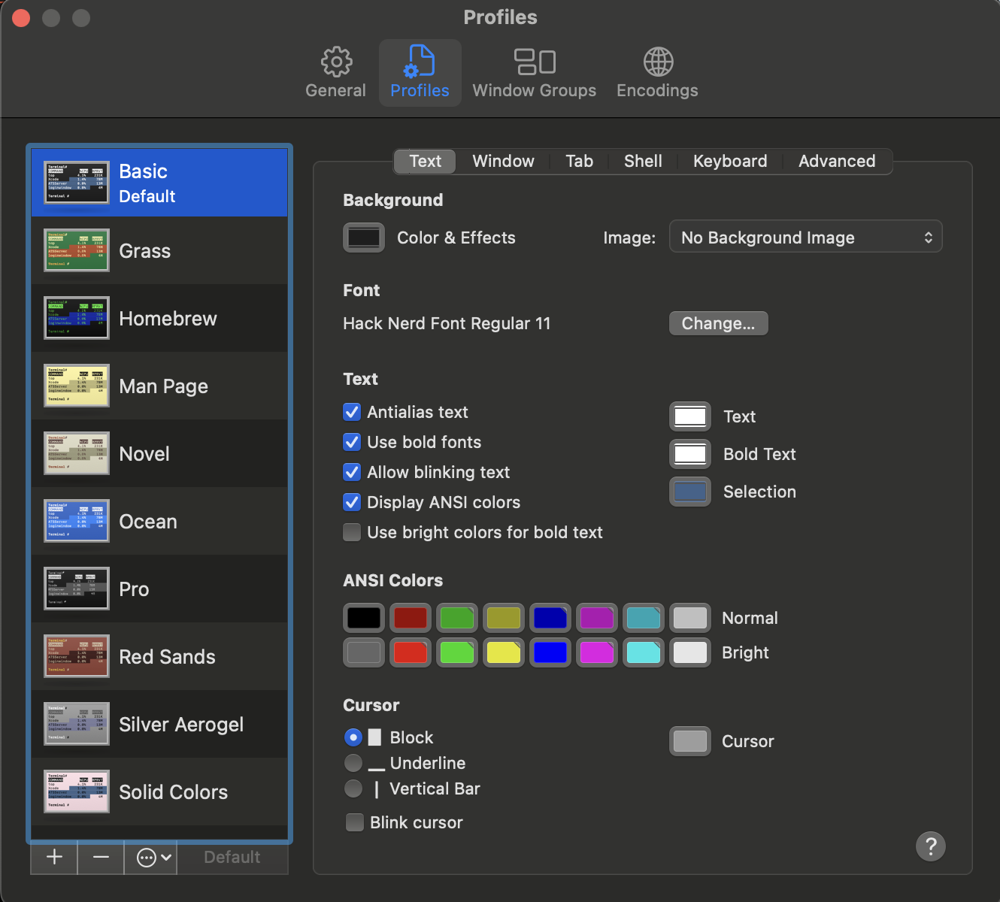
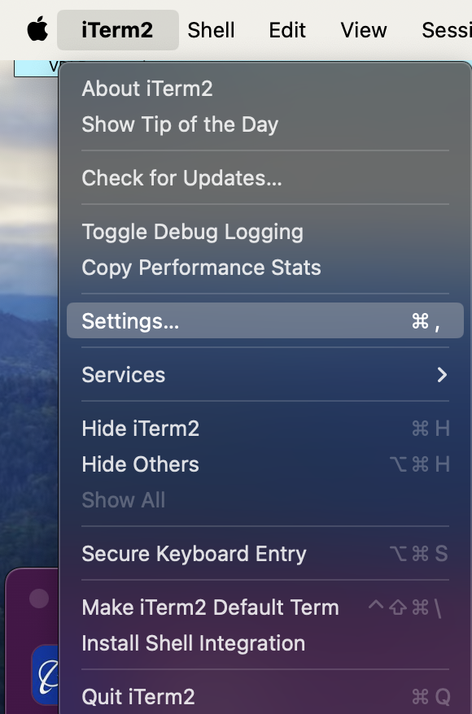
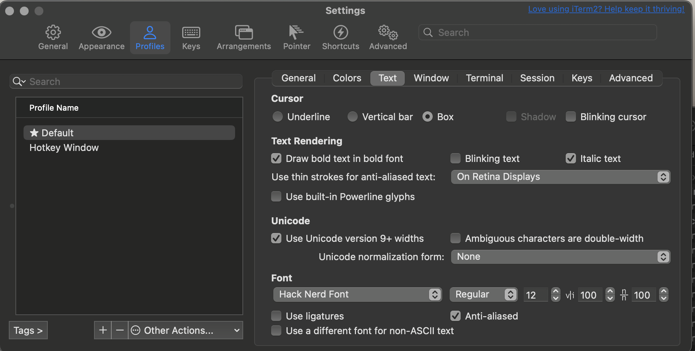
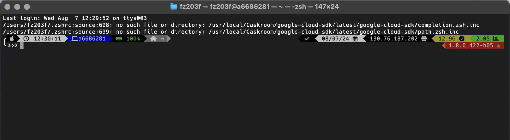
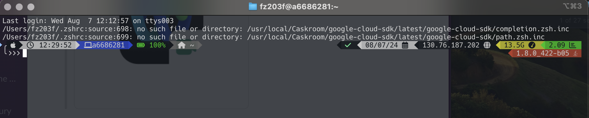
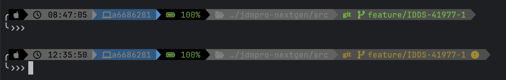

= How To: Setup MacOS
// Creates the table of contents - this value could be removed and passed in as an attribute from the build task BUT
// having the :toc: value in the adoc files is required for publishToConfluence to work correctly
// Not sure how placement will affect publishing to Confluence
ifndef::confluence[]
:toc: left
endif::[]
// Renders correctly in AsciiDoc Deployment
ifdef::confluence[]
:toc:
endif::[]

:keywords: engineering, training, how, to, mac

// Renders correctly in IDE for testing purposes
// ifndef::confluence[]
// include::../_includes/version-control-warning.adoc[]
// endif::[]
// Renders correctly in AsciiDoc Deployment
ifdef::confluence[]
include::{includedir}/version-control-warning.adoc[]
endif::[]

// Renders correctly in IDE
ifndef::deploy[]
include::../../../_includes/generic-information.adoc[]
endif::[]
// Renders correctly in AsciiDoc Deployment
ifdef::deploy[]
include::{includedir}/generic-information.adoc[]
endif::[]

The initial MacOS setup has been greatly simplified by creating a custom script that takes care of installing most items and theming changes that a developer would want.  Even with a simplified install process available there are still several steps that are required.

[NOTE]
Please assume that moving forward that steps are written in the intended execution order. In example please do one thing at a time moving from top to bottom in any of the following sections.

== Logging into a new Mac

TODO PER COMPANY

== Admin Rights

TODO PER COMPANY

== VPN Configuration

TODO PER COMPANY

== Bookmarks (Highly Recommended)
Please see {tl-how-to-link-040}[Configure Bookmarks]

== Interlude
At this point you have completed all the basic manual steps that are required and are ready to super charge your setup by moving to a pre-configured script. This script will install many terminal tools, various browsers, and development tools. Additionally, it will configure many visual elements of the mac such as displaying hidden files and finder options.

== Using the script

[NOTE]
*Script Modifications*
As this script was originally for a personal machine some slight modifications have been made to this script to support work machines (i.e. some items will not be installed). This modified script is available in the zip file on the right. This script is idempotent and can be executed multiple times without causing issues in the event something failed due to a network issue on first run.

[CAUTION]
*Release Statement*
This script is being donated free to the team for use and modification by Benjamin Rhine from his personal repository https://github.com/benrhine/complete-mac-setup (original). This script also leverages this custom .zshrc https://github.com/benrhine/zshenvWithGit with added functionality. Both of these scripts are donated free to the team for use and modification in perpetuity and are will remain freely available to the public at the original repository locations.

If custom usage of the script is required please consult the https://github.com/benrhine/complete-mac-setup/blob/main/README.md[README.md] otherwise do the following.

=== Step 1:
* Unzip the file to the Mac Desktop
* Make sure the script folder and files have the execute permission
* chmod 775 -R complete-mac-setup
* Reference https://stackoverflow.com/questions/3740152/how-do-i-change-permissions-for-a-folder-and-its-subfolders-files[stackoverflow]

[WARNING]
Absolutely must be on the "Desktop" or the script will not run unless you want to modify the script.

=== Step 2:
* Open terminal ("cmd space" search "terminal")
* Once terminal is open → $ cd ~/Desktop/complete-mac-setup/
* Execute: ./mac-bootstrap.sh

[CAUTION]
You will be asked to enter your MacOs password that you set during the initial login process 4 or 5 times during the script execution to grant it the appropriate privileges. If you are not paying attention it will just sit there and wait.

=== Step 3:
* Wait till completion. You may see 2 or 3 errors during install due to items that are locked down but these are not believed to be issues
* When install is complete proceed
* If you are experiencing issues please contact Benjamin Rhine

.Shouldn't see - fixed in script Expand source
[%collapsible]
====
[source,shell]
----
Installing additional fonts...
Error: homebrew/cask-fonts was deprecated. This tap is now empty and all its contents were either deleted or migrated.
==> Downloading https://github.com/ryanoasis/nerd-fonts/releases/download/v3.2.1/Hack.zip
----
====

.Shouldn't see - fixed in script Expand source
[%collapsible]
====
[source,shell]
----
==> Installing Cask macvim
==> Moving App 'MacVim.app' to '/Applications/MacVim.app'
==> Linking Binary 'mvim' to '/opt/homebrew/bin/gview'
==> Linking Binary 'mvim' to '/opt/homebrew/bin/gvim'
==> Linking Binary 'mvim' to '/opt/homebrew/bin/gvimdiff'
==> Linking Binary 'mvim' to '/opt/homebrew/bin/gvimex'
==> Linking Binary 'mvim' to '/opt/homebrew/bin/mview'
==> Linking Binary 'mvim' to '/opt/homebrew/bin/mvim'
==> Unlinking Binary '/opt/homebrew/bin/mvim'
==> Unlinking Binary '/opt/homebrew/bin/mview'
==> Unlinking Binary '/opt/homebrew/bin/gvimex'
==> Unlinking Binary '/opt/homebrew/bin/gvimdiff'
==> Unlinking Binary '/opt/homebrew/bin/gvim'
==> Unlinking Binary '/opt/homebrew/bin/gview'
==> Backing App 'MacVim.app' up to '/opt/homebrew/Caskroom/macvim/179/MacVim.app'
==> Removing App '/Applications/MacVim.app'
==> Purging files for version 179 of Cask macvim
Error: It seems there is already a Binary at '/opt/homebrew/bin/view'.
macvim: Failed to install ...
----
====

.Will See Expand source
[%collapsible]
====
[source,shell]
----
[notice] A new release of pip is available: 24.0 -> 24.2
[notice] To update, run: python3.12 -m pip install --upgrade pip
virtualenv: Failed to install ...

WARNING: The directory '/Users/fz203f/Library/Caches/pip' or its parent directory is not owned or is not writable by the current user. The cache has been disabled. Check the permissions and owner of that directory. If executing pip with sudo, you should use sudo's -H flag.
error: externally-managed-environment

× This environment is externally managed
╰─> To install Python packages system-wide, try brew install
    xyz, where xyz is the package you are trying to
    install.

    If you wish to install a Python library that isn't in Homebrew,
    use a virtual environment:

    python3 -m venv path/to/venv
    source path/to/venv/bin/activate
    python3 -m pip install xyz

    If you wish to install a Python application that isn't in Homebrew,
    it may be easiest to use 'pipx install xyz', which will manage a
    virtual environment for you. You can install pipx with

    brew install pipx

    You may restore the old behavior of pip by passing
    the '--break-system-packages' flag to pip, or by adding
    'break-system-packages = true' to your pip.conf file. The latter
    will permanently disable this error.
    If you disable this error, we STRONGLY recommend that you additionally
    pass the '--user' flag to pip, or set 'user = true' in your pip.conf
    file. Failure to do this can result in a broken Homebrew installation.
    Read more about this behavior here: <https://peps.python.org/pep-0668/>
----
====

=== Step 4:
* Open Terminal
* Open Terminal Settings

* Select text
* Under Font → Change → Select "Hack Nerd Font Regular"

=== Step 5:
* Open iTerm
* Open iTerm Settings

* Select Profiles → Text → Font → Select "Hack Nerd Font"

=== Results of Step 4 and 5
Selecting the font above is important to ensure the icons show up correctly in the terminal (it will also display like this within the IntelliJ terminal). The resulting terminal will tell you things in the following order ...

Time / Machine Name (matches asset tag) / Battery Level / Directory (with icons if available) / Check mark or X on if the last command was successful / Date / External IP / Memory Used / Process Load / Current Java version

|===
|  | 
|===

If you are in a git directory you will also have the following ...

* Branch name and which VCS is being used
* Green means branch is current and there is nothing to commit
* Yellow means branch has changes

=== Script Results
* Updated terminal tools
* Cloud CLIs installed
* Basic dev tools installed
* Themed terminal with useful information always present
* auto complete in terminal
* a screenshots folder added to the left side finder menu where all screenshots are configured to be saved
* For more details see https://github.com/benrhine/complete-mac-setup/blob/main/README.md[README.md]

== Configure Git

Please see {tl-how-to-link-042}[Configure Git (Quick Start)]

[CAUTION]
Git was installed as part of the setup script

== Configure Maven

Please see {tl-how-to-link-044}[Configure Maven (Quick Start)]

== Configure Aws CLI

Please see {tl-how-to-link-039}[Configure Aws CLI (Quick Start)]

[CAUTION]
Aws CLI was installed as part of the setup script

include::../../../_includes/training-how-to-nwywlf.adoc[]

