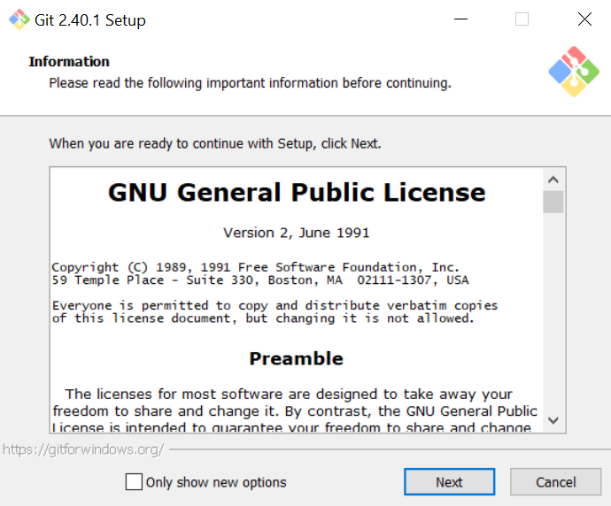
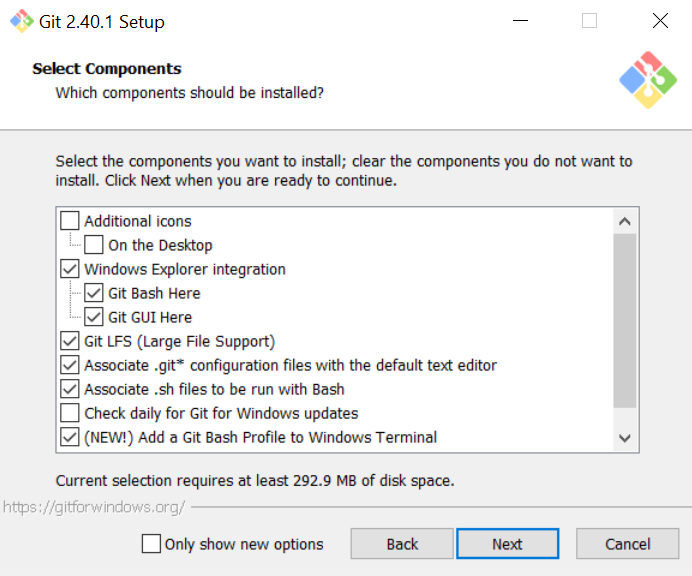
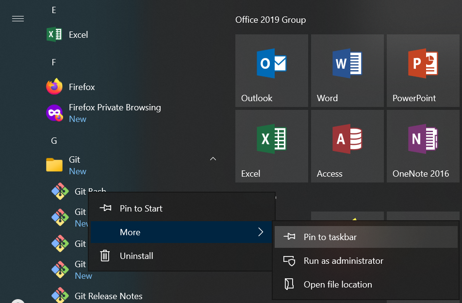
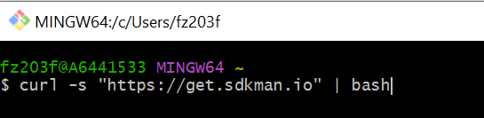
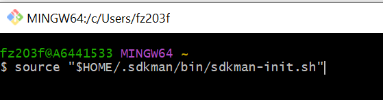
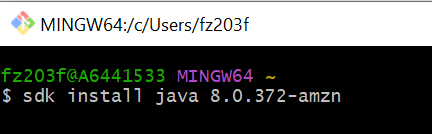
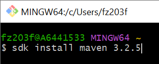
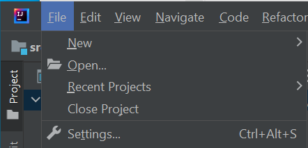
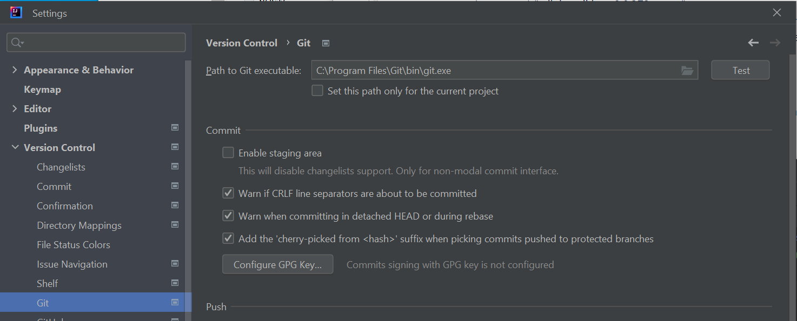
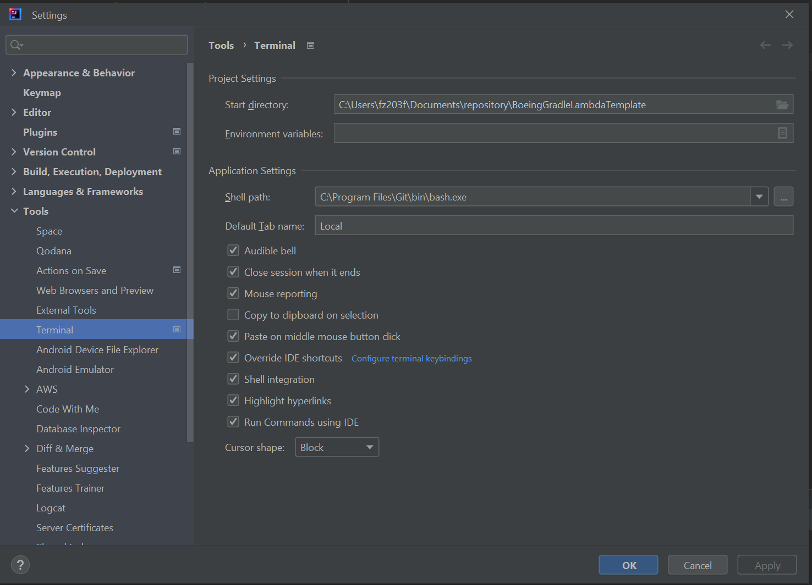

= How To: Setup Windows
// Creates the table of contents - this value could be removed and passed in as an attribute from the build task BUT
// having the :toc: value in the adoc files is required for publishToConfluence to work correctly
// Not sure how placement will affect publishing to Confluence
ifndef::confluence[]
:toc: left
endif::[]
// Renders correctly in AsciiDoc Deployment
ifdef::confluence[]
:toc:
endif::[]

:keywords: engineering, training, how, to, windows

// Renders correctly in IDE for testing purposes
// ifndef::confluence[]
// include::../_includes/version-control-warning.adoc[]
// endif::[]
// Renders correctly in AsciiDoc Deployment
ifdef::confluence[]
include::{includedir}/version-control-warning.adoc[]
endif::[]

// Renders correctly in IDE
ifndef::deploy[]
include::../../../_includes/generic-information.adoc[]
endif::[]
// Renders correctly in AsciiDoc Deployment
ifdef::deploy[]
include::{includedir}/generic-information.adoc[]
endif::[]

This page is intended to provide detailed instructions on how to fully setup your new Windows system

[NOTE]
Please assume that moving forward that steps are written in the intended execution order. In example please do one thing at a time moving from top to bottom in any of the following sections.

== Standard Setup

The standard setup is the simplest available setup to get up and functioning. While this may not be the most optimum or cross compatible setup it is the easiest to achieve. Please execute the following on a fresh windows machine ...

* Download https://git-scm.com/downloads/win[Git-SCM] and install

* Make sure Git Bash is checked

* Choose the defaults for all the following screens and install

* Once installed pin Git Bash to your task bar as you will use it frequently
* Now we need to install zip and unzip in order so support our follow up installs
* Next open this sourceforge https://sourceforge.net/projects/gnuwin32/files/zip/3.0/[link]
* Download zip-3.0-bin.zip
* In the zipped file, in the bin folder, find the file zip.exe
* Extract the file zip.exe to your mingw64 bin folder (for me: C:\Program Files\Git\mingw64\bin)
** Note this is in the Git install that was installed in the previous step
* Next open this sourceforge https://sourceforge.net/projects/gnuwin32/files/bzip2/1.0.5/[link]
* Download bzip2-1.0.5-bin.zip
* In the zipped file, in the bin folder, find the file bzip2.dll
* Extract bzip2.dll to your mingw64\bin folder (same folder as above: C:\Program Files\Git\mingw64\bin)
* Open Git Bash and install https://sdkman.io/[SDKman]
** WARNING!!! This will fail if you did not install zip in the previous steps

** run (no quotes) "curl -s "https://get.sdkman.io" | bash"

* At this point Git/Bash/SDKman should all be installed successfully on the machine
* Now install Java and Maven using https://sdkman.io/[SDKman]
** (Soon to be deprecated) It is hoped maven install will not be required soon in favor of the maven wrapper but this work is not completed yet as of 20230526

** run  (no quotes) "sdk install java 8.0.372-amzn"

*** Technically we use Oracle JVM in prod and we should strive for consistency but unfortunately the lowest supported version of Oracle JVM in SDKman is Java 17, thus we choose to use a different version locally
** run  (no quotes) "sdk install maven 3.2.5"
*** Again we are a hoping to deprecate this soon in favor of the maven wrapper
** These should be installed in your user home .sdkman directory
*** ex. C:\Users\YOUR-USER\.sdkman\
*** The active installs will be in the candidates directory
*** ex. C:\Users\YOUR-USER\.sdkman\candidates
* Install the following software
** https://www.firefox.com/en-US/?redirect_source=mozilla-org[Firefox]
** https://www.google.com/chrome/[Chrome]
** https://www.jetbrains.com/idea/download/?section=windows#section=windows[IntelliJ Community Edition]
** https://www.sublimetext.com/3[Sublime Text]
** https://www.postman.com/downloads/[Postman]
** https://slack.com/downloads/windows[Slack]
* Once everything above is installed verify that IntelliJ is looking at the correct installs

** Go to File → Settings

** Select Version Control → Git
** Make sure that Git executable is pointing to the Windows Git installation. In theory it should pick this up by default but it should be verified.

** Additionally, make sure to point the IntelliJ terminal to the git bash executable
*** This will ensure you have a standard terminal experience across the team
* Verify Windows environment variables
** If your machine comes with Java preinstalled your "$JAVA_HOME" may already exist, if it does not you will need to add the "JAVA_HOME" variable.
** Update JAVA_HOME  to C:\Users\YOUR-USER\.sdkman\candidates\java\current
** Pointing JAVA_HOME to the current  directory means your system will auto update to whatever version is specified through SDKman
* At this point please proceed to the [Git Setup]
* At this point please proceed to the [Node Setup]
* At this point please proceed to the [AWS Cli Setup]
* At this point please proceed to the [Aws CodeCommit Setup]

[CAUTION]
Please be aware if any of the tools are open you may need to close them and re-open them in order for them to pick up the environment variable changes.

[NOTE]
If wanting to attempt WSL setup see {}[here]. This documentation is being moved [here] but the move is not complete yet.

== WSL Setup

[WARNING]
The following documentation is not fully complete and DOES NOT work correctly, use this as a guideline starting point.

If you require Windows WSL please see {tl-how-to-link-049}[here]

== Related Links

include::../../../_includes/training-how-to-nwywlf.adoc[]

