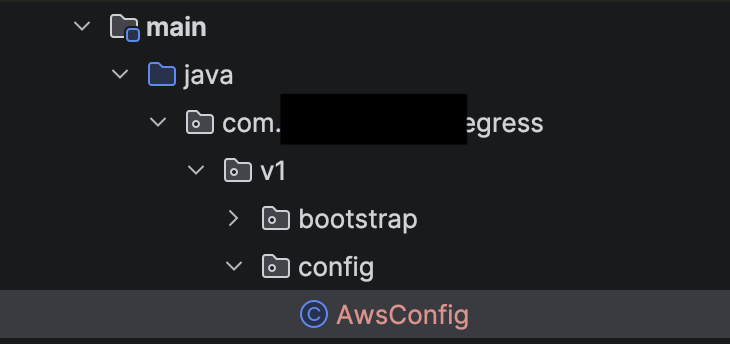

= How To - Spring Boot with Aws SSO Authentication
// Creates the table of contents - this value could be removed and passed in as an attribute from the build task BUT
// having the :toc: value in the adoc files is required for publishToConfluence to work correctly
ifndef::confluence[]
:toc: left
endif::[]
// Renders correctly in AsciiDoc Deployment
ifdef::confluence[]
:toc:

include::{includedir}/version-control-warning.adoc[]
endif::[]

// Tags created on pages with keywords relevant to content - default values are present and can be overridden by passed in attribute (and should be). Additionally, when using the publishToConfluence plugin it is more difficult to pass in the keywords so the defaults are preferred.
:keywords: how, to, tutorial, documenation, configuration, help, spring, boot, authentication, sso, aws

One of the more challenging parts of working with cloud infrastructure is correctly authenticating against it while you are building your application. This How To describes how to ensure your application is using your local SSO authentication automatically so you do not have to manually copy authentication keys from your cloud providers sign in page.

== Prerequisites

Please make sure you have already went through {tl-tooling-link-022-029}[Tooling: Aws Setup CLI]. This ensures you are ready to proceed. If you need additional helps with verifying if the CLI is setup correctly please try some of the commands located {tl-tooling-link-022-004}[here].

== Step 1

Add a new spring configuration file

== Step 2

Make sure the new config has the correct annotations present

[source, java]
----
@Configuration
@Slf4j
public class AwsConfig {

    @Value("${aws.region:us-west-2}")
    private String awsRegion;

    // TODO

}
----

== Step 3

The following is demonstrating using Aws SSO credentials from the local machine to a dev and test Aws instance as well as dev deployment within Aws.

[NOTE]
This is using older IRSA style authentication. There is a updated authentication style called EKS Pod Identity that you can read about https://aws.amazon.com/blogs/containers/amazon-eks-pod-identity-a-new-way-for-applications-on-eks-to-obtain-iam-credentials/[here] and [here]

[source, java]
----
@Bean
    @Profile({"local-dev", "dev"})
    public DynamoDbClient devDynamoDbClient() {
        log.info("\n");
        log.info("╔════════════════════════════════════════════════╗");
        log.info("║  {} DEV: Using DefaultCredentialsProvider       ║", Environment.DEV.getIcon());

        return this.localAwsAuthentication();
    }

    @Bean
    @Profile("local-test")
    public DynamoDbClient localTestDynamoDbClient() {
        log.info("\n");
        log.info("╔════════════════════════════════════════════════╗");
        log.info("║  {} TEST: Using DefaultCredentialsProvider      ║", Environment.TEST.getIcon());

        return this.localAwsAuthentication();
    }

    private DynamoDbClient localAwsAuthentication() {
        // Check what credentials will be used
        final String webIdentityToken = System.getenv("AWS_WEB_IDENTITY_TOKEN_FILE");
        final String roleArn = System.getenv("AWS_ROLE_ARN");
        final String roleSessionName = System.getenv("AWS_ROLE_SESSION_NAME");

        log.info("║  📋 Environment Variables:                      ║");
        log.info("║     AWS_WEB_IDENTITY_TOKEN_FILE: {}", webIdentityToken);
        log.info("║     AWS_ROLE_ARN: {}", roleArn);
        log.info("║     AWS_ROLE_SESSION_NAME: {}", roleSessionName);
        log.info("║     AWS_REGION: {}", awsRegion);
        log.info("╚════════════════════════════════════════════════╝\n");
        log.info("╔════════════════════════════════════════════════╗");

        // Try to read the token file to verify it exists and is readable
        if (webIdentityToken != null) {
            try {
                Path tokenPath = Paths.get(webIdentityToken);
                if (Files.exists(tokenPath)) {
                    final String token = Files.readString(tokenPath);
                    log.info("║  ✅ Token file exists and is readable ({} bytes)", token.length());

                    // Decode JWT to see claims (helps debug trust policy issues)
                    final String[] parts = token.split("\\.");
                    if (parts.length >= 2) {
                        final String payload = new String(Base64.getUrlDecoder().decode(parts[1]), UTF_8);
                        log.info("║  🔍 Token claims: {}", payload);
                    }
                } else {
                    log.error("║  ❌ Token file does not exist: {}", webIdentityToken);
                }
            } catch (final Exception e) {
                log.error("║  ❌ Failed to read token file: {}", e.getMessage());
            }
        } else {
            log.error("║  ❌ Token file does not exist: {}", webIdentityToken);
        }

        // This automatically works with IRSA, instance profiles, env vars, etc.
        final AwsCredentialsProvider credentialsProvider = DefaultCredentialsProvider.create();

        // Verify we can get credentials
        try {
            log.info("║  🔄 Attempting to resolve credentials...");
            final AwsCredentials creds = credentialsProvider.resolveCredentials();
            log.info("║  ✅ Successfully loaded credentials");
            log.info("║     Access Key: {}...", creds.accessKeyId().substring(0, 10));
        } catch (final Exception e) {
            log.error("║  ❌ Failed to load credentials");
            log.error("║     Error: {}", e.getMessage());
            log.error("║     Class: {}", e.getClass().getName());

            // Log the full stack trace for debugging
            log.error("Full error:", e);

            throw new RuntimeException("No AWS credentials available", e);
        }
        log.info("╚════════════════════════════════════════════════╝\n");

        return DynamoDbClient.builder()
                .region(Region.of(awsRegion))
                .credentialsProvider(credentialsProvider)
                .build();
    }
----

// Renders correctly in IDE
ifndef::deploy[]
include::../../../_includes/training-how-to-nwywlf.adoc[]
endif::[]
// Renders correctly in AsciiDoc Deployment
ifdef::deploy[]
include::{includedir}/training-how-to-nwywlf.adoc[]
endif::[]

