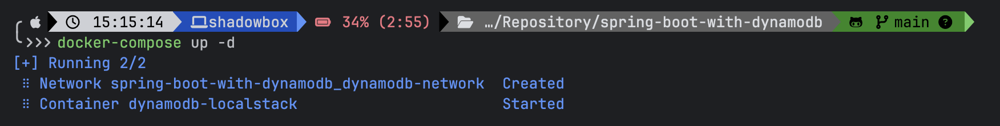
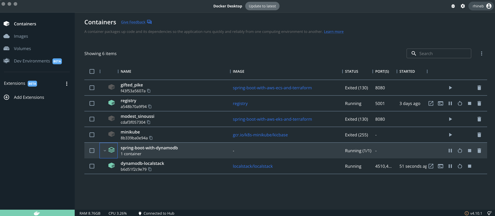
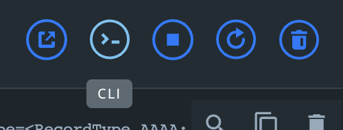
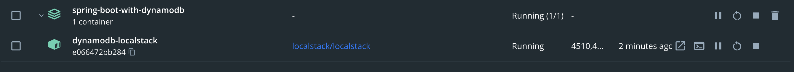
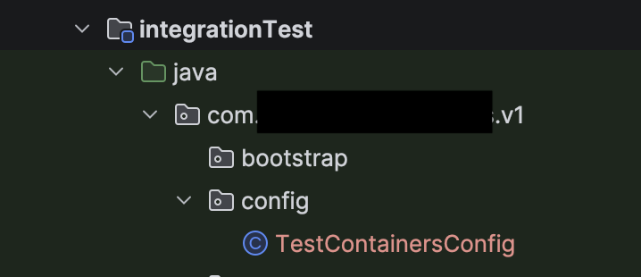

= How To - Spring profiles with Localstack
// Creates the table of contents - this value could be removed and passed in as an attribute from the build task BUT
// having the :toc: value in the adoc files is required for publishToConfluence to work correctly
ifndef::confluence[]
:toc: left
endif::[]
// Renders correctly in AsciiDoc Deployment
ifdef::confluence[]
:toc:

include::{includedir}/version-control-warning.adoc[]
endif::[]

// Tags created on pages with keywords relevant to content - default values are present and can be overridden by passed in attribute (and should be). Additionally, when using the publishToConfluence plugin it is more difficult to pass in the keywords so the defaults are preferred.
:keywords: how, to, tutorial, documenation, spring, kubernetes, docker, configuration, help, profile

This tutorial will explain what https://www.localstack.cloud[localstack] is and what it does and why you may want to use it.

[TIP]
To view the actual GitHub project see https://github.com/localstack/localstack[here].

== What is localstack?

https://www.localstack.cloud[Localstack] is an emulation layer for Aws and Snowflake that allows you to perform testing locally without cost in a simulated environment. In localstack's own words ... _"LocalStack replicates fully functional cloud applications on local infrastructure so you can build freely without the complexity and delays of traditional cloud development."_

== Why would you want to use localstack?

So why would you want to use localstack or who is this for? Below is a list or reasons you may want to add localstack to your repertoire ...

* Fully emulated cloud environment on a local machine
** No cost
** Easy to tear down and start over
** Learning with no risks
* Allows for better testing
** Allows you to test your services end-to-end prior to deploying them in a real environment
* Integrates well with tools you already use.

== When would you use localstack?

The three most common scenarios for running localstack are as follows ...

* Executing integration tests
* Executing smoke/API Tests
* Running the application locally with all services available

== How to do it

=== Prerequisites

The system that execution is occurring on should already have docker installed. If for some reason docker is not installed please review {sl-tooling-docker-link}[Tooling: Docker].

[TIP]
If you are on MacOS with brew installed then execute the following `brew install docker`

=== Step 1: Add a docker compose file to your application repo

[source, yaml]
----
services:
  localstack:
    image: localstack/localstack:latest
    container_name: dynamodb-localstack
    hostname: localstack
    ports:
      - "4566:4566"
      - "4510-4559:4510-4559"
    environment:
      - SERVICES=dynamodb
      - DEBUG=1
      - DATA_DIR=/Users/fz203f/Repository/jepp-ff/dpd/localstack/data
      - DOCKER_HOST=unix:///var/run/docker.sock
      - DYNAMODB_SHARE_DB=1
      - DYNAMODB_REMOVE_EXPIRED_ITEMS=1 # try to get it to delete items in the db
    volumes:
      - "./localstack-data:/Users/fz203f/Repository/jepp-ff/dpd/localstack"
      - "/var/run/docker.sock:/var/run/docker.sock"
    healthcheck:
      test: [ "CMD", "curl", "-f", "http://localhost:4566/_localstack/health" ]
      interval: 5s
      timeout: 3s
      retries: 10
      start_period: 5s
    labels:
      - "org.springframework.boot.readiness-check.tcp.disable=true"  # Disable Spring Boot TCP check
    networks:
      - dynamodb-network

networks:
  dynamodb-network:
    driver: bridge
----

The above example is specifically adding the DynamoDB service to localstack and the application.

[WARNING]
I had issues with the default `DATA_DIR` location where it said the default was not writable. I was not able to solve this and ended up setting it as part of the repo which works fine.

=== Step 2: Running localstack

It should now be possible to execute the following from your project directory ...

[source, shell]
----
docker-compose up
----

Which you can stop by hitting `ctrl-c`

or

[source, shell]
----
docker-compose up -d
----

Which you can stop by executing ...

[source, shell]
----
docker-compose down
----

=== Step 3: Verify localstack is running

Once `docker-compose up` has been executed it should now be possible to verify that the containers have started up in https://www.docker.com/products/docker-desktop/[Docker Desktop]. In the terminal you should see ...

and in Docker Desktop you should see ...

=== Step 3.1: Accessing Localstack interface

To access localstack interface you need to open the container terminal ...

or

=== Step 3.2: Interacting with localstack

Once the container terminal is open you can execute standard aws cli commands against localstack. Below are some examples ...

* `awslocal dynamodb list-tables`
* `awslocal dynamodb scan --table-name YourTableName`
* `awslocal dynamodb get-item --table-name YourTableName --key '{"YourPartitionKeyName": {"S": "YourPartitionKeyValue"}}'`
* `awslocal dynamodb delete-table --table-name <your-table-name>`

=== Step 4: Run as a single command (Optional)

While personally I prefer running applications with the previously mentioned setup as it allows the services to stay running in the background and shortens start up time for the actual application under development. There may be times that it is preferable to start everything with a single command or in the case you regularly forget to run the `docker-compose` command. If you prefer a single command to run everything configure the following in your Spring Boot profiles (and/or `application.yml`)

.application-XprofileX.yml
[source, yaml]
----
spring:
  config:
    activate:
      on-profile: local
  docker:
    compose:
      enabled: true
      file: docker-compose.yml
      lifecycle-management: start_and_stop  # This will stop containers on shutdown
      startup:
        timeout: 30s
      readiness:
        tcp:
          connect-timeout: 3s
          read-timeout: 3s
      wait:
        timeout: 30s
      stop:
        command: down  # Use 'down' to remove containers, or 'stop' to just stop them
        timeout: 10s
      skip:
        in-tests: true
        if-running: true  # Skip startup if containers are already running
----

The previous yaml connects sprint to docker and tells it to execute the `docker-compose.yml` file that was created in Step 1. Additionally, and most importantly the `lifecycle-management` is set to `start_and_stop` which is instructing the application to start with the application and stop with the application.

In this specific case if you were to execute `./gradlew bootRunLocal` the application would run the docker compose followed by executing the application.

Finally, make sure the application dependencies include the following ...

[source, groovy]
----
developmentOnly 'org.springframework.boot:spring-boot-docker-compose'
----

=== Step 5: Using localstack with integration testing

At this point localstack has been configured for use on the local system and in general for execution with the application. However, it has not yet been configured to work with integration testing.

To use localstack with testing ensure your test dependencies include the following ...

[source, groovy]
----
implementation "org.testcontainers:testcontainers:1.21.3"
                implementation "org.testcontainers:junit-jupiter:1.21.3"
                implementation "org.testcontainers:localstack:1.21.3"
                implementation 'io.rest-assured:rest-assured:5.5.0'
----

Then where your integration tests are configured

[TIP]
To see how `integrationTest` is configured look in the gradle `test-config.gradle` file.

add a file named `TestContainersConfig`

[source, java]
----
package com.benrhine.egress.v1.config;

import static org.testcontainers.containers.localstack.LocalStackContainer.Service.DYNAMODB;

import org.springframework.boot.test.context.TestConfiguration;
import org.springframework.context.annotation.Bean;
import org.testcontainers.containers.localstack.LocalStackContainer;
import org.testcontainers.utility.DockerImageName;

/** Testcontainers configuration for integration tests */
@TestConfiguration(proxyBeanMethods = false)
public class TestContainersConfig {

    private static final DockerImageName LOCALSTACK_IMAGE =
            DockerImageName.parse("localstack/localstack:latest");

    @Bean
    public LocalStackContainer localStackContainer() {
        LocalStackContainer localStack =
                new LocalStackContainer(LOCALSTACK_IMAGE)
                        .withServices(DYNAMODB)
                        .withEnv("DYNAMODB_SHARE_DB", "1")
                        .withReuse(true);

        localStack.start();

        // Set system properties for AWS SDK
        System.setProperty("aws.region", localStack.getRegion());
        System.setProperty("aws.accessKeyId", localStack.getAccessKey());
        System.setProperty("aws.secretAccessKey", localStack.getSecretKey());
        System.setProperty(
                "aws.dynamodb.endpoint", localStack.getEndpointOverride(DYNAMODB).toString());

        return localStack;
    }
}
----

This configuration instructs the tests how to communicate with the configured docker containers.

== Reference

* https://docs.localstack.cloud/aws/services/dynamodb/
* https://useme-alehosaini.medium.com/dynamodb-management-using-aws-cli-with-localstack-bf56771a2ea4
* https://dynobase.dev/code-examples/dynamodb-delete-all-items-java/

// Renders correctly in IDE
ifndef::deploy[]
include::../../../_includes/training-how-to-nwywlf.adoc[]
endif::[]
// Renders correctly in AsciiDoc Deployment
ifdef::deploy[]
include::{includedir}/training-how-to-nwywlf.adoc[]
endif::[]

