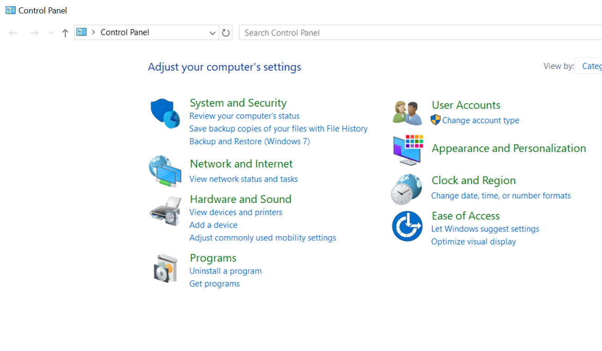
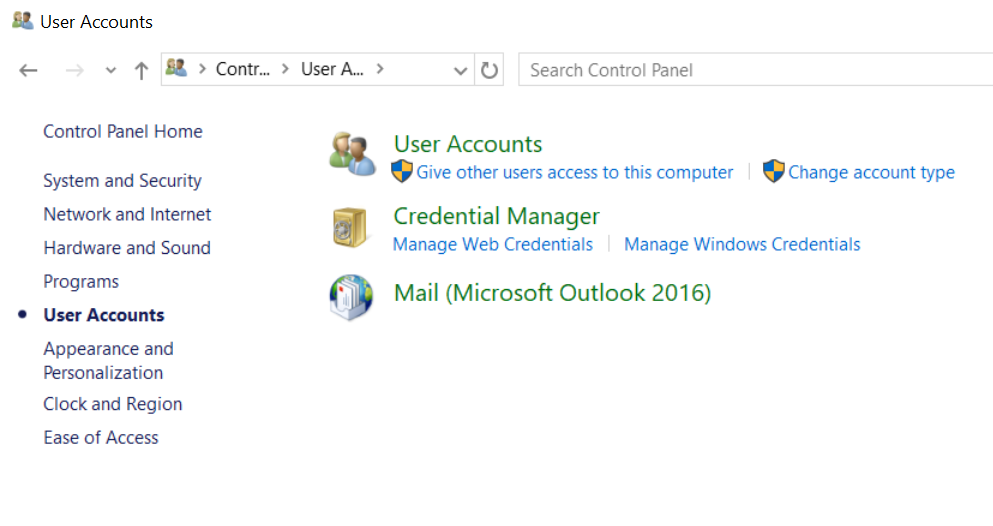
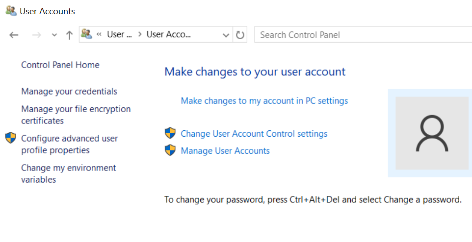
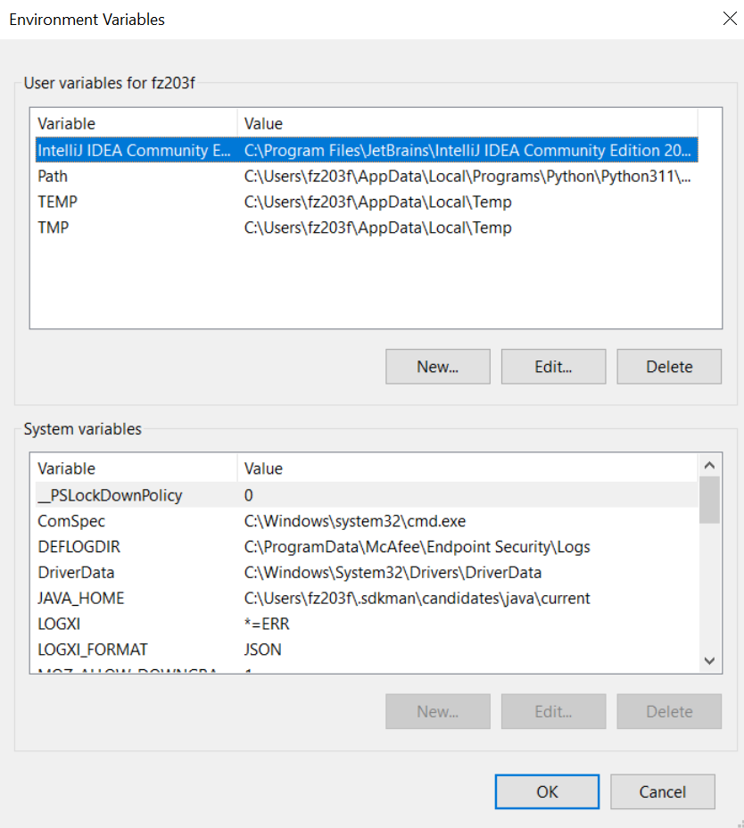

= How To: Local Deploy
// Not sure how placement will affect publishing to Confluence
ifndef::confluence[]
:toc: left
endif::[]
// Renders correctly in AsciiDoc Deployment
ifdef::confluence[]
:toc:
endif::[]

The intent of this page is to describe how to perform a deploy from a local developers machine for all new lambdas that
leverage the Serverless Framework. Much work and thought has gone into attempting to simplify and automate this process
as much as possible to eliminate mistakes and ease the learning curve for those new to Serverless and Gradle.

[TIP]
Gradle is the orchestration framework of choice as it allows you to execute, Bash, Java, Node, Npm, Serverless, and
others all using the same syntax once it is configured.
All tasks listed below are idempotent and can be run overtop of themselves (ie if you run the deploy once you can just
run it again and it should redeploy over top of the previous deployment).

== Why would we want the ability to perform local deployments?

There are numerous reasons that having this ability is a good idea.

- Shortens development time as direct deploys outside of the CI/CD process can be performed (ie faster)
- Allows branch builds to be deployed without interfering with any of the standard environments
- Supports trunk based development
- Allows each branch to be deployed to a fully custom Aws environment with fully unique resources
- Supports multiple developers developing in parallel in complete sandbox's

== Simplifications / Automation

There is a lot of complexity in fully understanding how a complete stack works, so in order to simplify terminal, bash, java, gradle, serverless, and all of the aws service interaction an effort has been made to automate and simplify this process into four succinct abstracted gradle commands.

- deployLocalResources
- removeLocalResources
- deployLocal
- removeLocal

Additionally, in an attempt to provide as much automation as possible several additional tasks have been provided to further combine the above listed tasks and the steps in this How To.

* deployLocalAll
** deploys resources, builds artifact, deploys application
* removeLocalAll
** removes resources and application

Each of these tasks have been written to be OS agnostic and should automatically make the adjustments necessary to execute successfully regardless of if being run on Linux, Mac, or Windows. If at any point execution of one of these tasks fails it will attempt to un-deploy to leave you in a clean state.

[TIP]
It is encouraged that you go read the gradle tasks in step-15... for reference. Please note the linked file and tasks should be in every new repo, not just the linked resource.

== Step 0: Prerequisites

[TIP]
Everything in this section in theory should already be available and configured on a dev system by virtue of having the tools installed

The local user should have the following tools installed and set on their OS Path

- Java - should automatically be in path after install
- Node - should automatically be in path after install
- Npm - should be in path as a derivative of node
- Aws CLI
- Serverless
- ssocreds
- Sdkman (optional)

[CAUTION]
If these tools are not on your path (ie running `java -versions, node -v, or npm -v fail to execute) then this guide will not work. Please make sure these commands work prior to following this How To.

=== Updating $PATH

In the event you need to add any values to your $PATH manually ...

=== Windows

If you are on Windows and do not have Admin access this may be a bit challenging but manageable.

- Open Control Panel

- Click on User Accounts

- Click on User Accounts again

- Select Change my environment variables on the left
- If you do not have Admin permissions you will only have access to add or edit to the top section
- Select "Path" and edit

=== MacOS / Linux

[source, shell]
----
export PATH=$PATH:/c/Users/fz203f/.nvm/versions/node/v20.2.0/bin
----

=== Serverless

Serverless must be installed on your local system and on your path. To simplify the installation a custom Gradle task
has been added to the project. If you do not have Serverless installed please run the following ...

[source, shell]
----
./gradlew installServerless
----

[TIP]
If you wish to manually install this package instead of using the preconfigured Gradle task you can do so by
running `npm install -g serverless`

[NOTE]
This task is platform agnostic and checks weather it should use the windows or unix version of npm prior to execution

=== ssocreds
When working with local deployments Serverless does not play nice with the updated Aws SSO as when logging in with Aws
SSO no longer creates the `.aws/credentials` file which Serverless currently depends on. To work around this limitation
we will use ssocreds to copy the SSO creds into the `.aws/credentials` file.  Similar to the previous section in order to
simplify the installation a custom Gradle task has been added to the project. If you do not have ssocreds installed please run the following ...

[source, shell]
----
./gradlew installSsocreds
----

[TIP]
If you wish to manually install this package instead of using the preconfigured Gradle task you can do so by
running `npm install -g aws-sso-creds-helper`

[NOTE]
This task is platform agnostic and checks weather it should use the windows or unix version of npm prior to execution

== Step 1: Authentication

You must be authenticated to Aws for any of the following to work without error. This can be achieved by executing
`aws sso login` from the Aws CLI which should be installed in your local terminal. Unfortunately, when working with
local deployments the Serverless Framework does not play nice with the updated Aws SSO. Logging in with Aws SSO no l
onger creates the `.aws/credentials` file which Serverless currently depends on. To work around this limitation we will
use `ssocreds` to copy the SSO creds into the `.aws/credentials` file. To perform this copy execute `ssocreds -p default`
or `ssocreds -p YOUR-DESIRED-PROFILE`. This will result in a message similar to the following ...

[source, shell]
----
$ ssocreds -p default
[aws-sso-creds-helper]: Notice: This package is no longer actively maintained.
[aws-sso-creds-helper]: This functionality is now supported by the AWS CLI. Please update to the latest version and run "aws sso login --profile <profile_name>" to see if it works for your use case.
[aws-sso-creds-helper]: See https://docs.aws.amazon.com/cli/latest/userguide/sso-using-profile.html for additional details.
[aws-sso-creds-helper]: AWS SSO Creds Helper v1.12.0
[aws-sso-creds-helper]: Getting SSO credentials for profile default
(node:41308) NOTE: We are formalizing our plans to enter AWS SDK for JavaScript (v2) into maintenance mode in 2023.

Please migrate your code to use AWS SDK for JavaScript (v3).
For more information, check the migration guide at https://a.co/7PzMCcy
(Use `node --trace-warnings ...` to show where the warning was created)
[aws-sso-creds-helper]: Successfully loaded SSO credentials for profile default
----
You are now ready to execute the custom Gradle deployment tasks

== Step 2: Local Resource Deploy

[WARNING]
All local deployments will be executed against the XXXX-Tools account. This executes a standard serverless application
deploy NOT a cross account deploy.

[NOTE]
It is assumed that the non prod resource deploy(s) have previously been executed and the necessary roles are already
available in a given environment.

As stated in the note above it is expected that the general resource deployment for the application has previously been
run, if it has not, it is quite possible that unexpected errors will occur as resources and roles may not be available.
However, it is assumed this has been executed and the resources required should be available. Making this assumption it
_should_ be possible to execute the following ...

[source, shell]
----
./gradlew deployLocalResources
----

This will run the deploy for `serverless-cross-account-resources.yml` and will deploy a set of resources specific to the
application when the conditional IsCustom  is true and will create resources with the value of custom  in place of the
standard env value (ie instead of dev, test, ect ...). After the job has completed successfully please verify your
resource creation in the associated XXXX-Tools account.

[WARNING]
Please be aware if two people are trying to do this at the same time anything that would have the label custom  will
need to be copied and pasted and given a unique identifier. If this is not done you will have two devs who end up
overwriting each others changes as serverless will see the `custom` keys from each developer as identical and will overwrite
them instead of creating unique instances.

[NOTE]
Please remember these tasks have been created to lower the learning curve by only asking you primarily learn one new
technology in this case Gradle until you are ready to continue exploring the full stack.

== Step 3: Deploy Local

This task has some magic in it as it is more than just a deploy or remove. This task is dependent on the `./gradlew build`
task, what that means is executing the following will build the required artifact for deployment. After building the
artifact the task will determine the current build version and will supply that to the gradle task environment variables
which will be made available to the `serverless.yml` file to ensure it picks up and deploys the correct artifact.

[source, shell]
----
./gradlew deployLocal
----

or execute the following to guarantee the artifact is rebuilt

[source, shell]
----
./gradlew clean deployLocal
----

[NOTE]
Please remember these tasks have been created to lower the learning curve by only asking you primarily learn one new technology in this case Gradle until you are ready to continue exploring the full stack.

== Step 4: Remove Local

Each job has an opposite to ensure full lifecycle support. In this case execution of

[source, shell]
----
./gradlew removeLocal
----

This task is fairly self explanatory, as it will remove the deployed artifact from Aws. Behind the scenes it is executing the following serverless command

[source, shell]
----
serverless remove --stage custom --verbose
----

This job is idempotent and will execute successfully even when no artifact has been deployed. In the event this job has already been run it can be run again and will complete successfully but will essentially have no effect since the artifact has already been removed.

[NOTE]
Please remember these tasks have been created to lower the learning curve by only asking you primarily learn one new technology in this case Gradle until you are ready to continue exploring the full stack.

== Step 5: Remove Local Resources

Each job has an opposite to ensure full lifecycle support. In this case execution of

[source, shell]
----
./gradlew removeLocalResources
----

Will remove any resources that were specifically deployed as part of deployLocalResources . This has been tested to ensure that it will only remove resources when IsCustom is true to ensure that it does not accidentally remove resources that are associated with any of the standard deployment environments such as dev, test, ect ... After the job has completed successfully please verify your resource removal in the associated XXXX-Tools account.

[NOTE]
Please remember these tasks have been created to lower the learning curve by only asking you primarily learn one new technology in this case Gradle until you are ready to continue exploring the full stack.

== Additional Tasks

The following tasks provide additional automations to speed up the process

=== Deploy All

[source, shell]
----
./gradlew deployLocalAll
----

or execute the following to guarantee the artifact is rebuilt

[source, shell]
----
./gradlew clean deployLocalAll
----

Will execute all of the previously discussed steps as a single job; it will deploy the project resources, build the artifact, and deploy the artifact

=== Remove All

[source, shell]
----
./gradlew removeLocalAll
----

Similar to the deploy all this will execute all of the previously discussed remove steps as a single job; it will remove the deployed artifact followed by removing the deployed resources.

=== Experimental

Lastly there are two experimental tasks to push the automation even further which incorporate the required authentication

[source, shell]
----
./gradlew clean deployLocalAllWithAuth
----

and

[source, shell]
----
./gradlew removeLocalAllWithAuth
----

These two tasks just further build on the deploy and remove all tasks by automatically performing the signin to aws and
copying the credentials. However, when testing these it did not seem to always execute the auth task first meaning there
is potential for the task to fail. Furthermore, this does remove the ability to authenticate with custom profiles without
a code change as this would default to using the default  profile.

=== Special Considerations by Application

Sometimes special additional tasks may need to be performed during the flow depending on the application requirements.
Below are application specific notes.

If your application uses a custom domain that will need to be commented out during local deploys

== Serverless Changes

[source, yaml]
----
ARTIFACT_NAME:                                                    # Set ARTIFACT_NAME variations by environment
  custom: build/distributions/${self:service}-${env:RELEASE_ARTIFACT, ''}-SNAPSHOT.zip
----

== Tasks

[source, groovy]
----
/** --------------------------------------------------------------------------------------------------------------------
 * Easy Serverless Framework Install:
 * - How to execute: ./gradlew installServerless
 * ------------------------------------------------------------------------------------------------------------------ */
tasks.register('installServerless') {
    doLast {
        final stdout = new ByteArrayOutputStream()
        exec {
            OperatingSystem os = DefaultNativePlatform.currentOperatingSystem
            String npm = 'npm';
            if (os.isWindows()) {
                npm = 'npm.cmd'
            }
            commandLine npm, 'install', '-g', 'serverless'
            standardOutput = stdout
        }
    }
}

/** --------------------------------------------------------------------------------------------------------------------
 * Easy SSO Creds Install:
 * - How to execute: ./gradlew installSsocreds
 *
 * When logging in with 'aws sso login' the `.aws/credentials` file is no longer created. The credential file is required
 * for certain aspects of serverless and other plugins to work. By executing the credential helper with the following ...
 * `ssocreds -p default` this will copy your temporary access credentials the legacy `.aws/credentials` file.
 * ------------------------------------------------------------------------------------------------------------------ */
tasks.register('installSsocreds') {
    doLast {
        final stdout = new ByteArrayOutputStream()
        exec {
            OperatingSystem os = DefaultNativePlatform.currentOperatingSystem
            String npm = 'npm';
            if (os.isWindows()) {
                npm = 'npm.cmd'
            }
            commandLine npm, 'install', '-g', 'aws-sso-creds-helper'
            standardOutput = stdout
        }
    }
}

/** --------------------------------------------------------------------------------------------------------------------
 * Easy SSO Creds Copy:
 * - How to execute: ./gradlew ssocreds
 *
 * When logging in with 'aws sso login' the `.aws/credentials` file is no longer created. The credential file is required
 * for certain aspects of serverless and other plugins to work. By executing the credential helper with the following ...
 * `ssocreds -p default` this will copy your temporary access credentials the legacy `.aws/credentials` file.
 * ------------------------------------------------------------------------------------------------------------------ */
tasks.register('ssocreds') {
    doLast {
        final stdout = new ByteArrayOutputStream()
        exec {
            OperatingSystem os = DefaultNativePlatform.currentOperatingSystem
            String ssocreds = 'ssocreds';
            if (os.isWindows()) {
                ssocreds = 'ssocreds.cmd'
            }
            commandLine ssocreds, '-p', 'default'
            standardOutput = stdout
        }
    }
}

/** --------------------------------------------------------------------------------------------------------------------
 * Deploy work from local:
 * - How to execute:
 *      - ./gradlew deployLocalResources        # This will use the current branch name by default
 *      - ./gradlew deployLocalResources -Pargs="IDDS-XXXX"
 * ------------------------------------------------------------------------------------------------------------------ */
tasks.register('deployLocalResources') {
    description = 'Serverless resource deploy from local machine to cloud - BRR-TOOLS'
    group = 'Deploy'
    String serverless = 'serverless';
    doFirst {
        // Determine what OS this task is running on
        OperatingSystem os = DefaultNativePlatform.currentOperatingSystem

        if (os.isWindows()) {
            serverless = 'serverless.cmd'
        }
    }
    doLast {// If not wrapped in a doLast gradle will fail to build
        // Tell the task to write out to terminal
        final stdout = new ByteArrayOutputStream()
        // Get passed in argument(s) - SHOULD BE A SINGLE ARGUMENT
        def args = null
        if (project.hasProperty("args")) {
            args = project.getProperty("args")
        }
        try {
            // If an arg is present check that the correct number of args were passed in and check out the given tag
            if (args) {
                final splitSpace = args.split()
                final splitComma = args.split(",")
                if (splitSpace.size() == 1 && splitComma.size() == 1) {
                    // Make sure we have all the tags available
                    exec {
                        environment "BRANCH_NAME", args
                        commandLine serverless, 'deploy', '--stage', 'custom', '--config', 'serverless-cross-account-resources.yml', '--verbose'
                        standardOutput = stdout
                    }
                } else {
                    throw new RuntimeException("Wrong number of arguments passed in - REQUIRES A SINGLE ARGUMENT")
                }
            } else {
                exec {
                    environment "BRANCH_NAME", branch
                    commandLine serverless, 'deploy', '--stage', 'custom', '--config', 'serverless-cross-account-resources.yml', '--verbose'
                    standardOutput = stdout
                }
            }
        } catch (final Exception ignored) {
            println "An error occurred while attempting to deploy ... | Attempting to clean up ..."
            // If an arg is present check that the correct number of args were passed in and check out the given tag
            if (args) {
                final splitSpace = args.split()
                final splitComma = args.split(",")
                if (splitSpace.size() == 1 && splitComma.size() == 1) {
                    // Make sure we have all the tags available
                    exec {
                        environment "BRANCH_NAME", args
                        commandLine serverless, 'remove', '--stage', 'custom', '--config', 'serverless-cross-account-resources.yml', '--verbose'
                        standardOutput = stdout
                    }
                } else {
                    throw new RuntimeException("Wrong number of arguments passed in - REQUIRES A SINGLE ARGUMENT")
                }
            } else {
                // not sure this works correctly
                exec {
                    environment "BRANCH_NAME", branch
                    commandLine serverless, 'remove', '--stage', 'custom', '--config', 'serverless-cross-account-resources.yml', '--verbose'
                    standardOutput = stdout
                }
            }
        }
    }
}

/** --------------------------------------------------------------------------------------------------------------------
 * Remove local resources from cloud:
 * - How to execute:
 *      - ./gradlew removeLocalResources                # This defaults to the current branch name
 *      - ./gradlew removeLocalResources -Pargs="IDDS-XXXX"
 * ------------------------------------------------------------------------------------------------------------------ */
tasks.register('removeLocalResources') {
    description = 'Serverless resource remove deploy from cloud - BRR-TOOLS'
    group = 'Deploy'
    String serverless = 'serverless';
    doFirst {
        // Determine what OS this task is running on
        OperatingSystem os = DefaultNativePlatform.currentOperatingSystem

        if (os.isWindows()) {
            serverless = 'serverless.cmd'
        }
    }
    doLast {// If not wrapped in a doLast gradle will fail to build
        // Tell the task to write out to terminal
        final stdout = new ByteArrayOutputStream()
        // Get passed in argument(s) - SHOULD BE A SINGLE ARGUMENT
        def args = null
        if (project.hasProperty("args")) {
            args = project.getProperty("args")
        }
        // If an arg is present check that the correct number of args were passed in and check out the given tag
        if (args) {
            final splitSpace = args.split()
            final splitComma = args.split(",")
            if (splitSpace.size() == 1 && splitComma.size() == 1) {
                // Make sure we have all the tags available
                exec {
                    environment "BRANCH_NAME", args
                    commandLine serverless, 'remove', '--stage', 'custom', '--config', 'serverless-cross-account-resources.yml', '--verbose'
                    standardOutput = stdout
                }
            } else {
                throw new RuntimeException("Wrong number of arguments passed in - REQUIRES A SINGLE ARGUMENT")
            }
        } else {
            // not sure this works correctly
            exec {
                environment "BRANCH_NAME", branch
                commandLine serverless, 'remove', '--stage', 'custom', '--config', 'serverless-cross-account-resources.yml', '--verbose'
                standardOutput = stdout
            }
        }
    }
}

/** --------------------------------------------------------------------------------------------------------------------
 * Deploy local app to cloud:
 * - How to execute:
 *      - ./gradlew deployLocal                # This defaults to the current branch name
 *      - ./gradlew deployLocal -Pargs="IDDS-XXXX"
 * ------------------------------------------------------------------------------------------------------------------ */
tasks.register('deployLocal') {
    description = 'Serverless app deploy to cloud - BRR-TOOLS'
    group = 'Deploy'
    dependsOn build                                                             // Automatically build artifact
    // Tell the task to write out to terminal
    final stdout = new ByteArrayOutputStream()
    String serverless = 'serverless';
    String artifactVersion = ''
    doFirst {                                                                   // Determine what OS this task is running on
        OperatingSystem os = DefaultNativePlatform.currentOperatingSystem

        if (os.isWindows()) {
            serverless = 'serverless.cmd'
        }

        exec {                                                                  // Get the version of the locally
            commandLine 'ls', 'build/distributions'                             // built artifact
            standardOutput = stdout
        }
        artifactVersion = stdout.toString().split('-')[2]
        println "Locally build artifact version: $artifactVersion"
    }
    doLast {                                                                    // If not wrapped in a doLast gradle will fail to build
        // Get passed in argument(s) - SHOULD BE A SINGLE ARGUMENT
        def args = null
        if (project.hasProperty("args")) {
            args = project.getProperty("args")
        }
        try {
            // If an arg is present check that the correct number of args were passed in and check out the given tag
            if (args) {
                final splitSpace = args.split()
                final splitComma = args.split(",")
                if (splitSpace.size() == 1 && splitComma.size() == 1) {
                    // Make sure we have all the tags available
                    exec {
                        environment "BRANCH_NAME", args
                        environment "RELEASE_ARTIFACT", artifactVersion         // Set ENV for serverless.yml use for ARTIFACT_NAME
                        commandLine serverless, 'deploy', '--stage', 'custom', '--verbose'
                        standardOutput = stdout
                    }
                } else {
                    throw new RuntimeException("Wrong number of arguments passed in - REQUIRES A SINGLE ARGUMENT")
                }
            } else {
                exec {
                    environment "RELEASE_ARTIFACT", artifactVersion             // Set ENV for serverless.yml use for ARTIFACT_NAME
                    commandLine serverless, 'deploy', '--stage', 'custom', '--verbose'
                    standardOutput = stdout
                }
            }
        } catch (final Exception ignored) {
            println "An error occurred while attempting to deploy ... | Attempting to clean up ..."
            // If an arg is present check that the correct number of args were passed in and check out the given tag
            if (args) {
                final splitSpace = args.split()
                final splitComma = args.split(",")
                if (splitSpace.size() == 1 && splitComma.size() == 1) {
                    // Make sure we have all the tags available
                    exec {
                        environment "BRANCH_NAME", args
                        commandLine serverless, 'remove', '--stage', 'custom', '--verbose'
                        standardOutput = stdout
                    }
                } else {
                    throw new RuntimeException("Wrong number of arguments passed in - REQUIRES A SINGLE ARGUMENT")
                }
            } else {
                exec {
                    environment "BRANCH_NAME", branch
                    commandLine serverless, 'remove', '--stage', 'custom', '--verbose'
                    standardOutput = stdout
                }
            }
        }
    }
}

/** --------------------------------------------------------------------------------------------------------------------
 * Remove local app from cloud:
 * - How to execute:
 *      - ./gradlew removeLocalResources                # This defaults to the current branch name
 *      - ./gradlew removeLocalResources -Pargs="IDDS-XXXX"
 * ------------------------------------------------------------------------------------------------------------------ */
tasks.register('removeLocal') {
    description = 'Serverless remove deploy from cloud - BRR-TOOLS'
    group = 'Deploy'
    String serverless = 'serverless';
    doFirst {
        // Determine what OS this task is running on
        OperatingSystem os = DefaultNativePlatform.currentOperatingSystem

        if (os.isWindows()) {
            serverless = 'serverless.cmd'
        }
    }
    doLast {// If not wrapped in a doLast gradle will fail to build
        // Tell the task to write out to terminal
        final stdout = new ByteArrayOutputStream()
        // Get passed in argument(s) - SHOULD BE A SINGLE ARGUMENT
        def args = null
        if (project.hasProperty("args")) {
            args = project.getProperty("args")
        }
        // If an arg is present check that the correct number of args were passed in and check out the given tag
        if (args) {
            final splitSpace = args.split()
            final splitComma = args.split(",")
            if (splitSpace.size() == 1 && splitComma.size() == 1) {
                // Make sure we have all the tags available
                exec {
                    environment "BRANCH_NAME", args
                    commandLine serverless, 'remove', '--stage', 'custom', '--verbose'
                    standardOutput = stdout
                }
            } else {
                throw new RuntimeException("Wrong number of arguments passed in - REQUIRES A SINGLE ARGUMENT")
            }
        } else {
            exec {
                environment "BRANCH_NAME", branch
                commandLine serverless, 'remove', '--stage', 'custom', '--verbose'
                standardOutput = stdout
            }
        }
    }
}

/** --------------------------------------------------------------------------------------------------------------------
 * Deploy local app including resources to cloud:
 * - How to execute:
 *      - ./gradlew deployLocalAll                # This defaults to the current branch name
 *      - ./gradlew deployLocalAll -Pargs="IDDS-XXXX"
 * ------------------------------------------------------------------------------------------------------------------ */
tasks.register('deployLocalAll') {
    description = 'Serverless app deploy (including resources) to cloud - BRR-TOOLS'
    group = 'Deploy'
    dependsOn deployLocalResources, build, deployLocal   // Tasks will execute in the order specified

}

/** --------------------------------------------------------------------------------------------------------------------
 * Remove local app including resources from cloud:
 * - How to execute:
 *      - ./gradlew removeLocalAll                # This defaults to the current branch name
 *      - ./gradlew removeLocalAll -Pargs="IDDS-XXXX"
 * ------------------------------------------------------------------------------------------------------------------ */
tasks.register('removeLocalAll') {
    description = 'Serverless remove deploy (including resources) from cloud - BRR-TOOLS'
    group = 'Deploy'
    dependsOn removeLocalResources, removeLocal   // Tasks will execute in the order specified
}

/** --------------------------------------------------------------------------------------------------------------------
 * Deploy local app including resources to cloud:
 * - How to execute:
 *      - ./gradlew deployLocalAllWithAuth                # This defaults to the current branch name
 *      - ./gradlew deployLocalAllWithAuth -Pargs="IDDS-XXXX"
 * ------------------------------------------------------------------------------------------------------------------ */
tasks.register('deployLocalAllWithAuth') {
    description = 'Serverless app deploy (including resources) to cloud - BRR-TOOLS'
    group = 'Deploy'
    // Tell the task to write out to terminal
    final stdout = new ByteArrayOutputStream()
    dependsOn ssocreds, deployLocalResources, build, deployLocal   // Tasks will execute in the order specified

}

/** --------------------------------------------------------------------------------------------------------------------
 * Remove local app including resources from cloud:
 * - How to execute:
 *      - ./gradlew removeLocalAllWithAuth                # This defaults to the current branch name
 *      - ./gradlew removeLocalAllWithAuth -Pargs="IDDS-XXXX"
 * ------------------------------------------------------------------------------------------------------------------ */
tasks.register('removeLocalAllWithAuth') {
    description = 'Serverless remove deploy (including resources) from cloud - BRR-TOOLS'
    group = 'Deploy'
    dependsOn ssocreds, removeLocalResources, removeLocal   // Tasks will execute in the order specified
}
----

test comment

