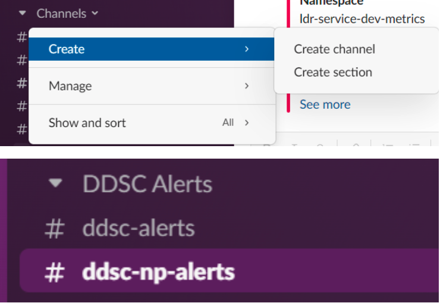
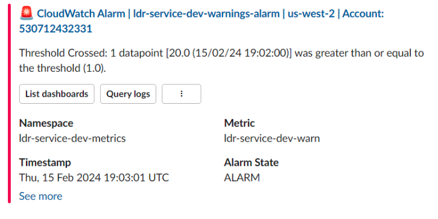
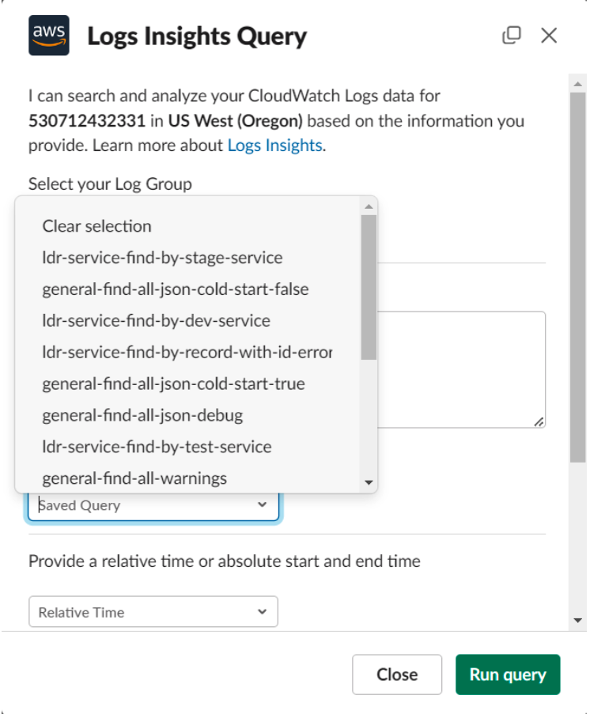
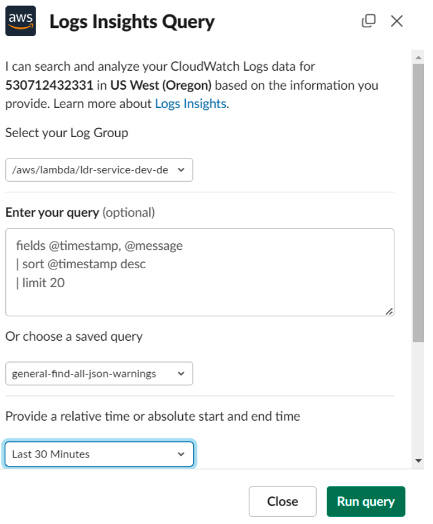
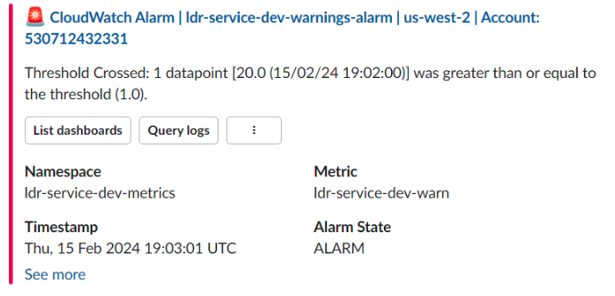

= Tutorial: Setting up Slack alerts from Aws CloudWatch and DLQs
// Creates the table of contents - this value could be removed and passed in as an attribute from the build task BUT
// having the :toc: value in the adoc files is required for publishToConfluence to work correctly
ifndef::confluence[]
:toc: left
endif::[]
// Renders correctly in AsciiDoc Deployment
ifdef::confluence[]
:toc:

include::{includedir}/version-control-warning.adoc[]
endif::[]

== Step 1: Configure Slack

* To begin first thing to do is create new channel in slack
* Create a channel
** I created the channel `brr-np-alerts`

== Step 2: Configure the Aws Slack Chatbot

// Renders correctly in IDE
ifndef::deploy[]
* Configure the Aws Slack Chatbot as described link:../../../engineering/training/how-to/aws-configure-chatbot.adoc[here]
endif::[]
// Renders correctly in AsciiDoc Deployment
ifdef::deploy[]
* Configure the Aws Slack Chatbot as described {tl-how-to-link-005}[here]
endif::[]

[NOTE]
It is important to not that alerts through the Aws Chatbot will allow you to query logs directly from the alert. This significantly improves timely access to the CloudWatch logs when an alert occurs.

== Step 3

* Both of the following can be done at the same time

=== Step 3.1: Configure Log Insights Query Definitions

// Renders correctly in IDE
ifndef::deploy[]
* Predefine any queries that you desire to be built at deployment time (see link:../../../engineering/ops/infrastructure-as-code/aws/aws-cf-create-cloudwatch-insight-query.adoc[here])
endif::[]
// Renders correctly in AsciiDoc Deployment
ifdef::deploy[]
* Predefine any queries that you desire to be built at deployment time (see {sl-ops-link-003-001-003}[here])
endif::[]

[NOTE]
It is advantageous to pre-define some of these queries as it allows for quick selection for log review when an alert occurs

=== Step 3.2: Configure Metrics Filters

// Renders correctly in IDE
ifndef::deploy[]
* Predefine any metric filters to be built at deployment time (see link:../../../engineering/training/how-to/aws-configure-metric-filters.adoc[here])
endif::[]
// Renders correctly in AsciiDoc Deployment
ifdef::deploy[]
* Predefine any metric filters to be built at deployment time (see {tl-how-to-link-008}[here])
endif::[]

[NOTE]
Defining metric filters are required in order to be able to setup programmatic alerts based on events in CloudWatch

=== Step 3.3: Configure SNS

In order to be able to send alerts you must have a SNS Topic configured. If you have previously completed {tl-how-to-link-007}[How To: Configure DLQ Alarm] or configured a DLQ then you may very well already have the required SNS alert topic configured. If not makes sure you configure an SNS alert topic as part of your Serverless/CloudFormation resources deploy as follows ...

[CAUTION]
this is also covered here {tl-how-to-link-009}[How To: Configure Metrics Filter Alarm]

[source, yaml]
----
resources:
        ...
        Resources:
                ...
             receivingDevAlertTopic:
                      Type: AWS::SNS::Topic
                      Condition: CreateQueueNpResources
                      Properties:
                        TopicName: ${self:custom.appShortName}-topic-dev-alert
----

=== Step 3.4: Configure Alert

* Create your alert by attaching your metric filter to your SNS alert topic (see {tl-how-to-link-009}[here])

=== Step 3.5: Subscribe Alert to Slack

* Ensure alert has been subscribed to Slack

== Step 4: Wait for alerts to be triggered

With everything now in place when a metric filter records an event and an alert threshold is reached an alarm should be received in the configured slack channel.

at this point all subscribers to the channel have been alerted that a predefined metric that the team cares about has been triggered and should prompt investigation. This investigation can start by clicking the "Query Logs" button in the alert message, selecting the relevant application logs, a predefined query, and a timeframe to quickly see what has happened and to begin the debugging process.

// Renders correctly in IDE
ifndef::deploy[]
include::../../../_includes/training-tutorial-nwywlf.adoc[]
endif::[]
// Renders correctly in AsciiDoc Deployment
ifdef::deploy[]
include::{includedir}/training-tutorial-nwywlf.adoc[]
endif::[]