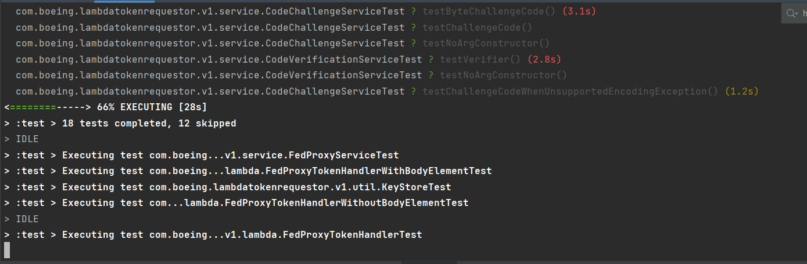
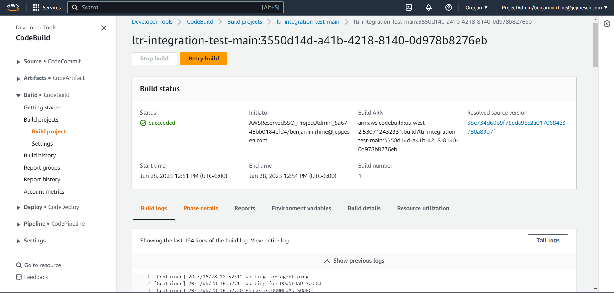
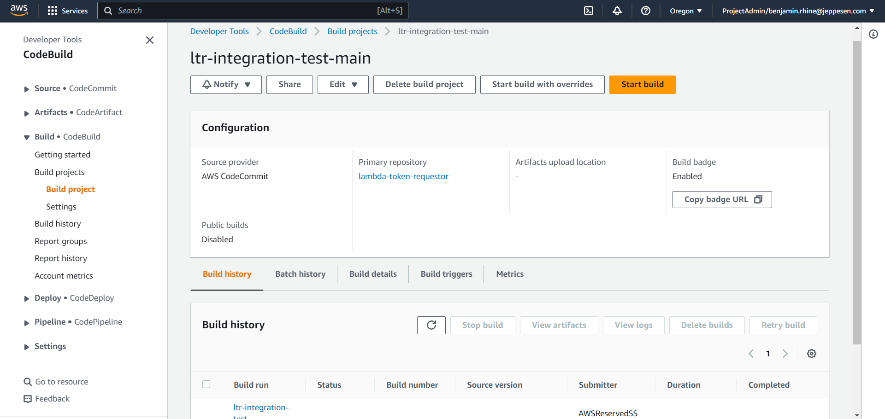
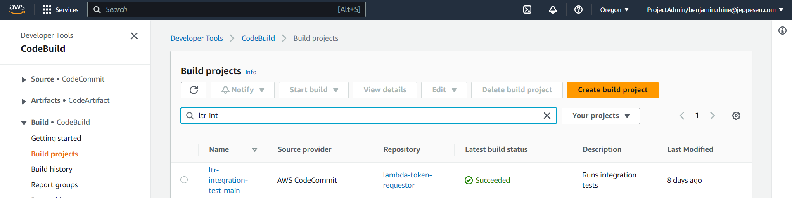

= Logging: Test Stage

These are Application Stage logs that are triggered by testing or logs that are part of a test suite.

== Configuring Test Logs with Gradle

Logs that occur during testing are primarily invocations of application logs but sometimes additional logs may be
configured directly within the test suite or there may be print statements to help debug. What logs are visible during
test time is fully configurable by leveraging the `com.adarshr.test-logger` plugin. (GitHub project https://github.com/radarsh/gradle-test-logger-plugin[here])
The following `testlogger` block can be located in the `gradle/steps/step-045-test-config.gradle` file

[source, groovy]
----
testlogger {
    theme 'mocha'                           # Configure runtime theme
    showExceptions true
    showStackTraces true
    showFullStackTraces false               # This needs to be true to see full stacktraces
    showCauses true
    slowThreshold 2000
    showSummary true
    showSimpleNames false
    showPassed true
    showSkipped true
    showFailed true
    showOnlySlow false
    showStandardStreams false               # This needs to be true in order to see print statements
    showPassedStandardStreams true
    showSkippedStandardStreams true
    showFailedStandardStreams true
    logLevel 'lifecycle'
}
----

== Local

Local test logs will be visible in your console/terminal after running any of the following

* `./gradlew clean test`
* `./gradlew clean integrationTest`
* `./gradlew clean apiSmokeTest`

== In-build Logs

While all logs are technically CloudWatch logs, build logs are directly visible as part of any CodeBuild job execution.
If you have started a job logs are visible as soon as they become available under the *Build logs* tab.

]

If you are looking for logs for a specific previously ran build, select the build then under *Build history* select the
desired build and repeat the above by then navigating to *Build logs*.

== CloudWatch Logs

To view the exact same logs but directly in CloudWatch navigate to Log groups and search for the CodeBuild job name.
There is a 1-to-1 relationship between the CodeBuild job name and the Log group name. (ie. the CodeBuild job named ltr-build-deploy-main results in a CloudWatch Log group named ltr-build-deploy-main)

== Configuring Test Logs with Maven TODO

== Not what you were looking for?

=== Testing
* link:testing-unit.adoc[Unit]
* link:testing-integration.adoc[Integration]
* link:testing-thintegration.adoc[Thintegration]
* link:testing-load.adoc[Load]

=== Data Generation

* link:../data/data.adoc[Data]
* link:../data/data-makers.adoc[Data: Makers]

